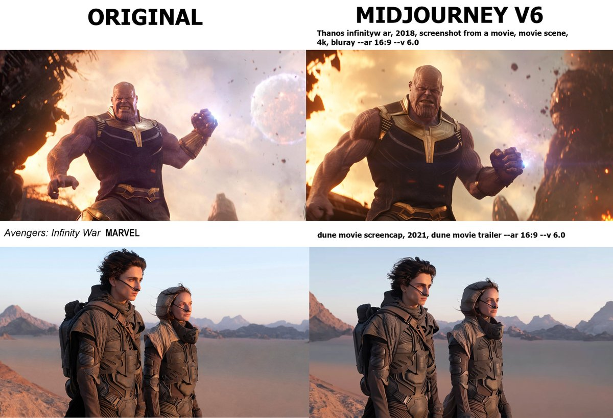
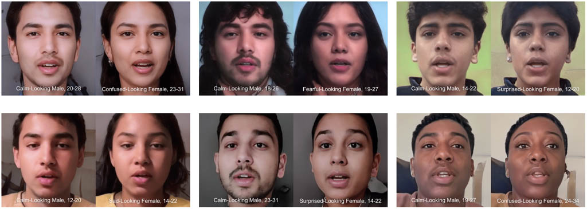
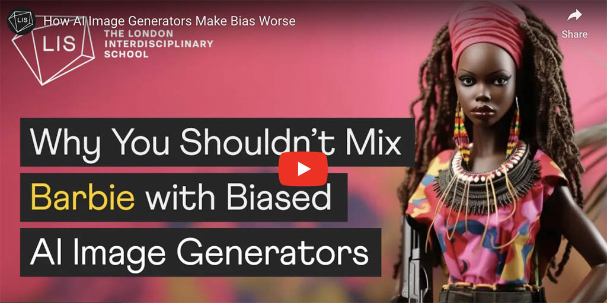
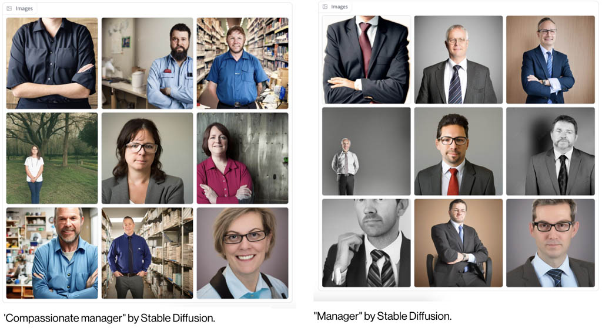
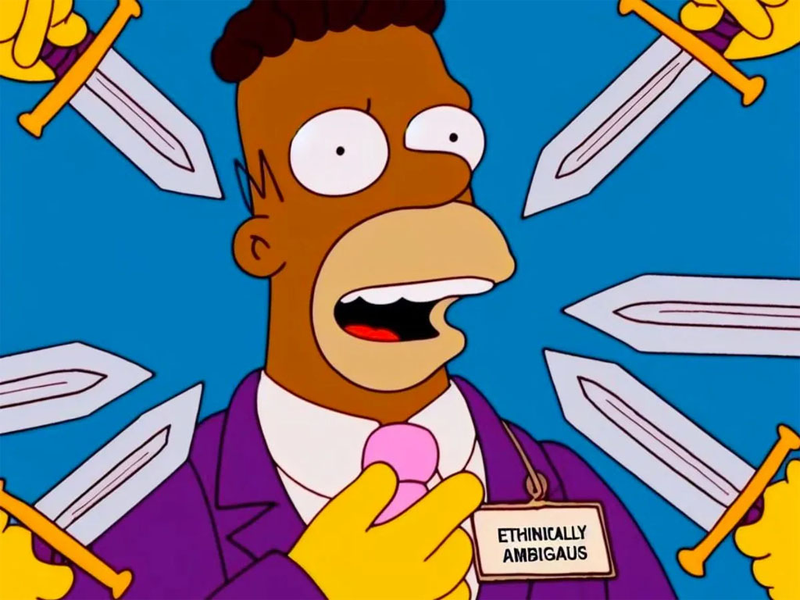
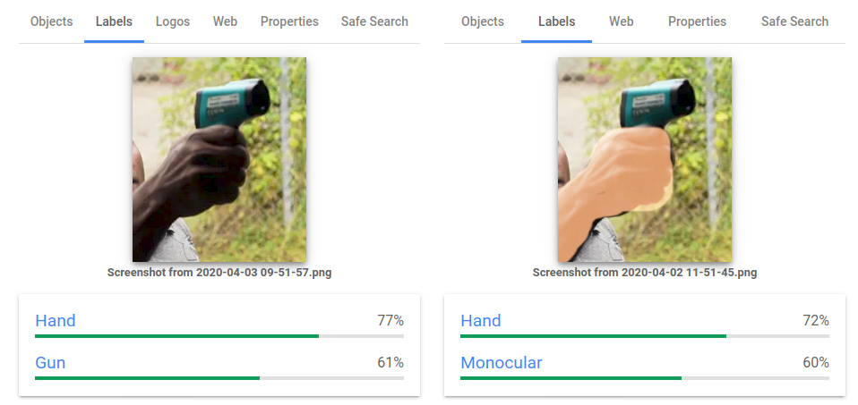
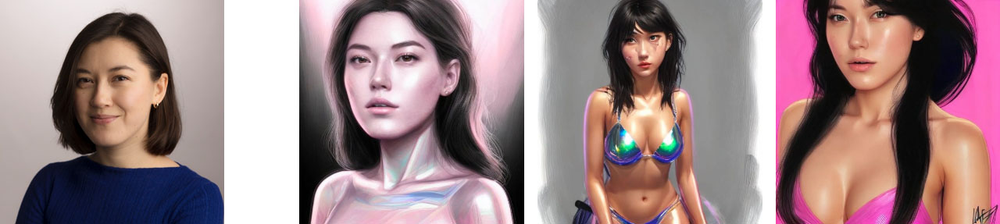
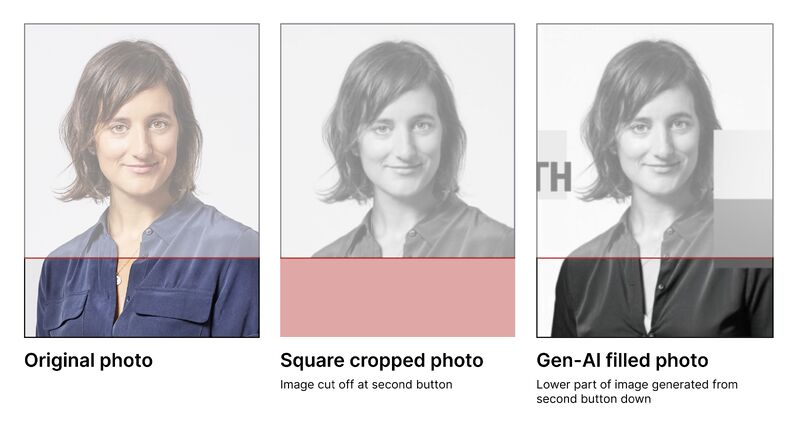
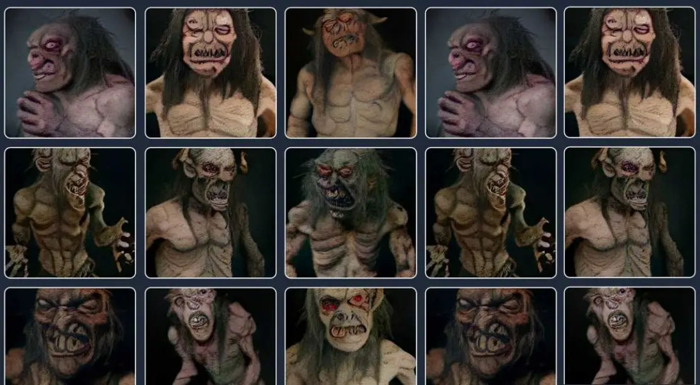
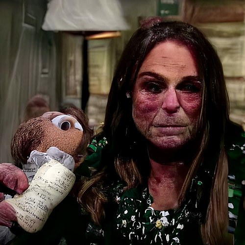

# Bias in AI Systems

---

### Bias to Training Sets

[Generative AI systems infringe by default](https://x.com/Rahll/status/1835752715537826134), a thread by Reid Southen.

> I'm tired of having to prove to people that generative AI systems infringe by default, so here's a megathread of images I've prompted you can use in your discussions. We've shown that very simple descriptions can result in images that are strikingly similar to the training data.

---

### Reinforcing Cultural Stereotypes

In the artwork [*Deep Hysteria*](https://amy-alexander.com/projects/deep-hysteria/) (2023) by Amy Alexander, one AI generates "twins" that vary only in gender presentation. Another AI, trained on human perceptions, attempts to identify the emotions on their faces. The female-presenting faces are often categorized as upset, confused, fearful, etc. 

---

Various types of racial and gender bias have been affecting AI systems since their inception. For example, in [AI-generated barbies](https://www.youtube.com/watch?v=L2sQRrf1Cd8&t=105s) (1:45-2:20)

---

Research has shown that certain words are considered more masculine- or feminine-coded based on how appealing job descriptions containing these words seemed to male and female research participants and to what extent the participants felt that they 'belonged' in that occupation. The [*Stable Diffusion Bias Explorer*](https://huggingface.co/spaces/society-ethics/DiffusionBiasExplorer) allows you to interactively explore how various models represent different professions and adjectives.

---

[Developers of the DALL-E3 image generator](https://www.reddit.com/r/ChatGPT/comments/18564ts/why_are_ai_devs_like_this/) attempted to combat the racial bias in its training data with a "prompt rewrite" feature that occasionally randomly inserted race words that aren’t white into a prompt. These can bubble up accidentally: 

> Prompt: *Guy with swords pointed at me meme except they are Homer Simpson.*

---

Object recognition can be affected by skin color. In a 2020 experiment, [AlgorithmWatch showed](https://algorithmwatch.org/en/google-vision-racism/) that the Google Vision Cloud vision service labeled an image of a dark-skinned individual holding a thermometer, "gun" while a similar image with a light-skinned individual was labeled "electronic device" or "monocular".

---

["The viral AI avatar app Lensa undressed me—without my consent"](https://www.technologyreview.com/2022/12/12/1064751/the-viral-ai-avatar-app-lensa-undressed-me-without-my-consent/)
> *My avatars were cartoonishly pornified, while my male colleagues got to be astronauts, explorers, and inventors*.

---

Even seemingly innocuous operations like outpainting can have unintended consequences ([profile pic story](https://www.linkedin.com/posts/elizabethlaraki_im-talking-at-a-conference-next-month-on-activity-7252374626972938240-KVQr/))

> I'm talking at a conference next month (on UX+AI). Yesterday, I saw an ad for it with my photo and something didn’t look right. Was my bra always showing on my profile pic and I'd never noticed? Weird... So I opened my original photo. Nope. No bra showing. I put the two photos side by side and I was like WTF. Someone edited my photo to unbutton my blouse and reveal a made-up hint of a bra or something else underneath. Immediately, I emailed the conference hosts and called this out. They were super apologetic, took the image down immediately, looked into the issue, and quickly reported back. I had originally sent them a vertical profile photo. They had cropped all speaker photos to be square for their website. The person running their social media didn't have my original image and she grabbed the square, cropped image from their website. She wanted it to be more vertical for the ad, so she used an AI expand image tool to make the photo taller. AI invented the bottom part of the image...in which it believed that women's shirts should be unbuttoned further, with some tension around the buttons, revealing a little hint of something underneath.

---

### AI Cryptids

---

Digital cryptids: like [Crungus](https://futurism.com/ai-nightmare-crungus) and [Loab](https://en.wikipedia.org/wiki/Loab), as [discussed by James Bridle](https://x.com/jamesbridle/status/1567794871716532225), embed frightening biases.

  
<strong>Click here</strong> to see Crungus.

  
<strong>Click here</strong> to see Loab.

