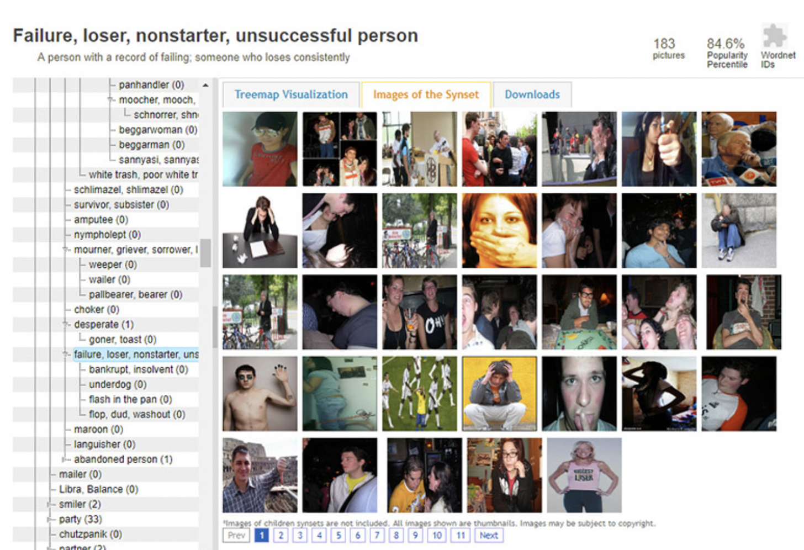

# How GenAI Works (for Image Synthesis)

---

1. Many images on the Internet have "alt" text (or alternative text): a written description of an image posted online. Let's all [inspect some alt text](https://accessibility.huit.harvard.edu/describe-content-images). 
2. Since 2008, [CommonCrawl.org](https://commoncrawl.org) has maintained a free, open repository of web crawl data that can be used by anyone. It is downloadable in [big files](https://commoncrawl.org/get-started).
3. CLIP is a neural network trained on image-text pairs. CLIP is trained on Imagenet, a dataset of more than 14 million images scraped from the Internet, labelled by Amazon Mechanical Turk crowdworkers and organised into 21,000 categories. The categories of ImageNet were created making use of WordNet, a lexical dataset of English nouns, verbs, adjectives and adverbs grouped into sets expressing distinct concepts."
  * [**View Wordnet**](https://en-word.net/lemma/cat)
  * [**View ImageNet**](https://navigu.net/)
  * [**Excavating AI**](https://excavating.ai/) by Kate Crawford and Trevor Paglen is an essay and project about the bias of Imagenet & Wordnet.  See also [ball-buster.jpg](img/ball-buster.jpg).
4. [LAION-5B](https://laion.ai/blog/laion-5b/) is an open source dataset of over 5 billion CLIP-filtered image-text pairs. You can explore an 8-million image subset of LAION-5B [here](https://app.labelbox.com/catalog/dataset/clb6w5dql0v0r081h2583fhre?public=true&search.query=NobwRALgngDgpmAXGAdgGwPoGc4EMBOAxgBZgA0YAZgJZoRz4CSAJkmAFYAsnARgI7kwhAPYp6YtgGFcEQXAC2POM2bUUAcykAZRgAUAagCZBWEfgSJw8tUgAMAOgCsFebgAeSAIwBfbwF0gA&search.sorting=NobwRAZglgpgNgEzALnNeTlgM4GMD2ATjGADRgBuMhARvtjAHICGAtiVgMpStRzOEoAFwCeAAk4FiYAL7kEUYriFR8AOxRgAIgFFOAYTJh2Q5gmanJACxitmASUxqArnDgyAukA). <!-- You can see whether your images have been incorporated into LAION-5B using tools like [https://haveibeentrained.com/](https://haveibeentrained.com/). *(currently down)* -->
6. LAION-5B was used to train *Stable Diffusion*, the open-source version of the text-to-image generator that underlies tools like MidJourney. Ollin Boer Bohan has made a [nice visual explanation](https://madebyoll.in/posts/dino_diffusion/) of how Stable Diffusion works, and an [interactive demo](https://madebyoll.in/posts/dino_diffusion/demo/)
7. At the end of all this is *bias*. See for yourself in the [DiffusionBiasExplorer](https://huggingface.co/spaces/society-ethics/DiffusionBiasExplorer) to explore how the text-to-image models represent different professions and adjectives.

---

