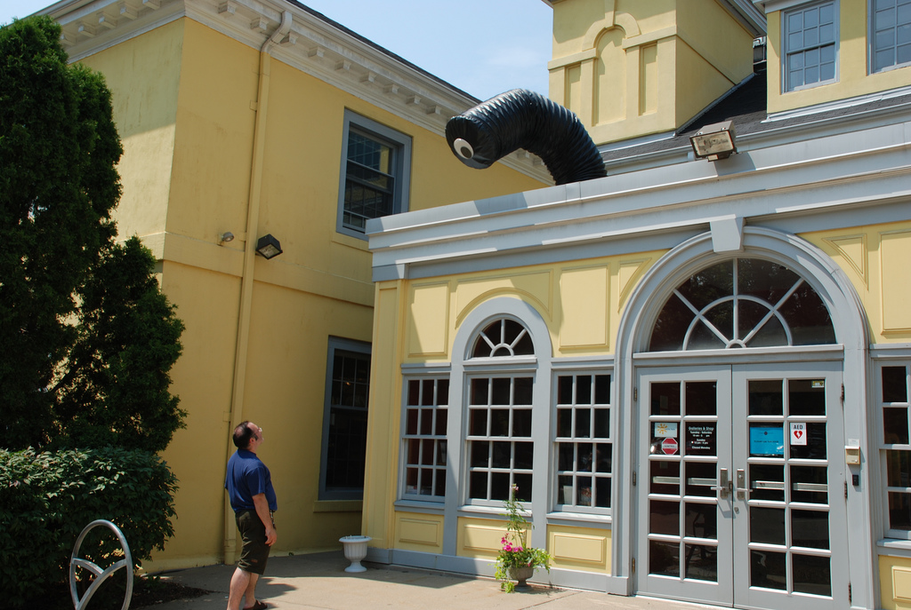
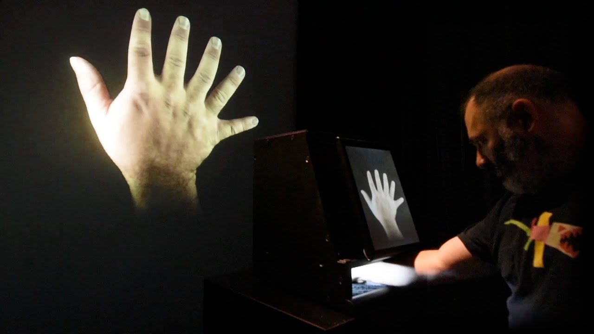
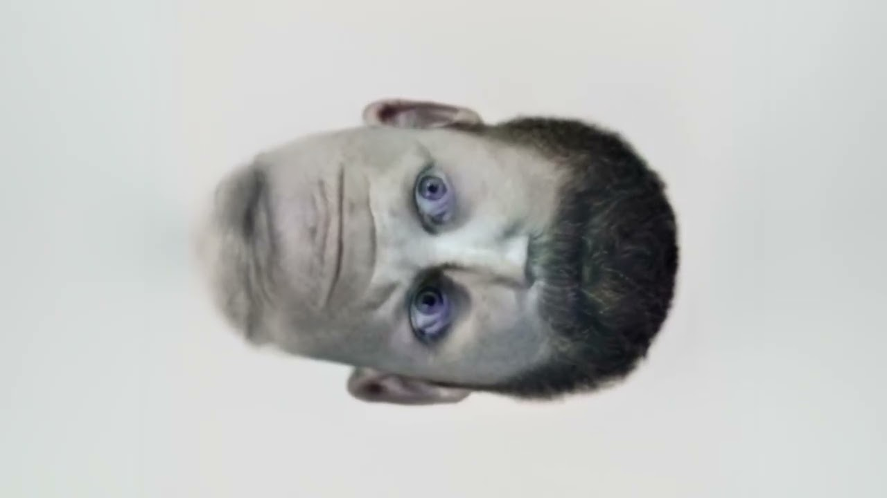
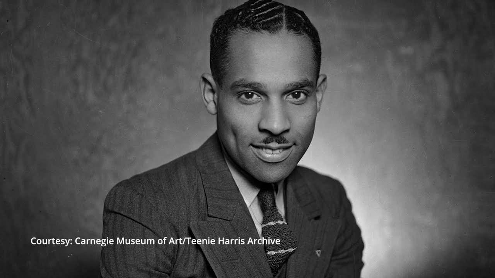

# Selected Projects by Golan Levin et al.

*Some projects that "use AI".*

---

### [Double-Taker (Snout)](https://www.youtube.com/watch?v=OjUwH9tOdus), 2008

*(By Golan Levin with Lawrence Hayhurst, Steven Benders and Fannie White.)* An interactive installation, consisting of a costumed industrial robot arm, which orients a supersized googly-eye towards passers-by. The sculpture appears to be continually surprised by the presence of its own viewers, wordlessly communicating that there is something uniquely surprising about each of us.

---

### [Augmented Hand Series](https://www.youtube.com/watch?v=BducsMORr9U), 2014

*(y Golan Levin, Chris Sugrue, and Kyle McDonald.)* The "Augmented Hand Series" is a real-time interactive software system that presents playful, dreamlike, and uncanny transformations of its visitors’ hands.

---

### [Ambigrammatic Figures](https://www.youtube.com/watch?v=TvDTSRAeZXs&t=6s), 2020 ([landscape](https://www.youtube.com/watch?v=_GyY_DaOZLw))

*(By Golan Levin with Lingdong Huang.)* A system was developed to generate a series of “ambigrams”: images, in this case of faces, that are legible both upside-down and right-side up.

---

### [Teenie Harris Investigation](https://www.youtube.com/watch?v=cWUjC8DfXVU), 2017

*(By Golan Levin, Zaria Howard, Lingdong Huang et al.)* Charles “Teenie” Harris was a photographer for one of the most influential Black newspapers of the 20th century, the Pittsburgh Courier. For over 40 years, he captured the major events and everyday experiences of Black life in Pittsburgh. His archive of 80,000 photographs was acquired by the Carnegie Museum of Art in 2001. The Frank-Ratchye STUDIO for Creative Inquiry developed a four-year collaboration with the Museum of Art to supplement the Museum’s efforts to identify, annotate, and organize the Teenie Harris Archive. The outcome was an interactive installation which organizes the total archive of images by multiple themes and allows users to dig through this overwhelmingly rich resource at a human scale.

