# Some AI Art & Artists

---

Trisha Code: 

* [*YouTube channel (441 daily videos)*](https://www.youtube.com/@TrishaCode/videos)
* [Dirty spaceship](https://www.youtube.com/watch?v=yEq6EaHtiIo)
* [As muppets](https://www.youtube.com/watch?v=_nRwC5IzMY8)
* [5 Things](https://www.youtube.com/watch?v=33MoV981eG0)

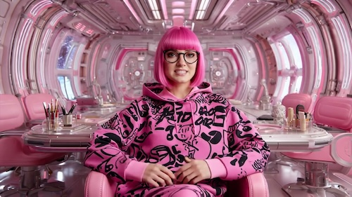

---

[@niceaunties](https://www.youtube.com/watch?v=aNldH5IIn3g)

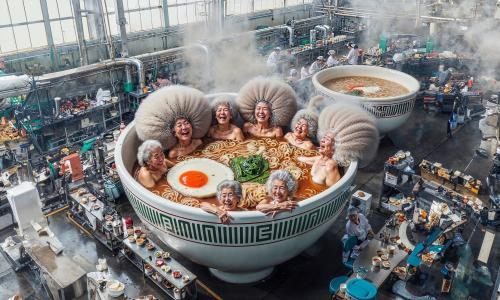

---

[Jess MacCormack](https://jessmaccormack.com/artwork/ai/): 

* [portraits](https://x.com/musicalnetta/status/1871606217027801598)
* [fleshy](https://x.com/ClownVamp/status/1873416162350092616) (CW)

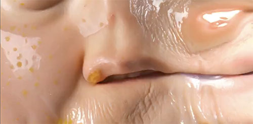

---

[Sofia Crespo](https://sofiacrespo.com/)

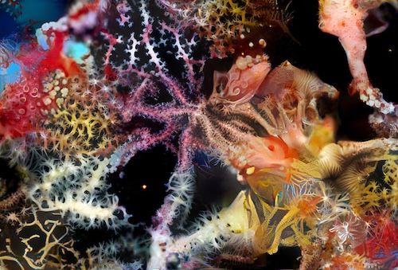

---

[Elsa Carvalho](https://x.com/town_in_new)

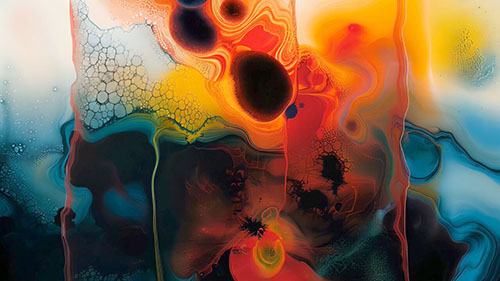

---

AndrewJumpen: [animals eating noodles](https://x.com/_akhaliq/status/1812573686152450397); [hotdog eating Chinese food](https://x.com/_akhaliq/status/1811864979710107843)

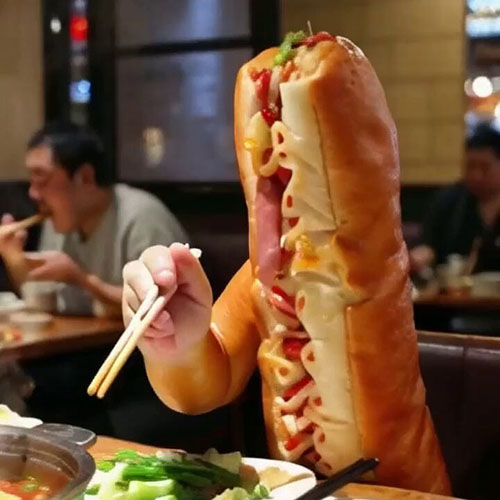

---

Ainterestingaf: [Sawdust store](https://www.instagram.com/ainterestingaf/p/CrtBRWSowIJ/?img_index=1)

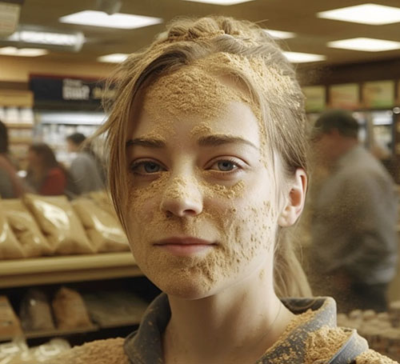

---

Scott Eaton, [Entangled II](https://vimeo.com/345875600)

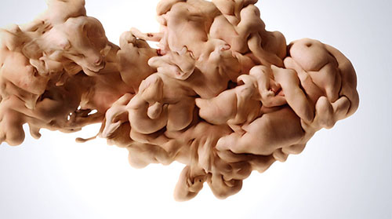

---

Media artist David Szauder (b. 1976 in Hungary) has been teaching ‘AI’ courses at Moholy-Nagy University of Art and Design in Budapest. He has created an [Instagram full of imaginary characters](https://www.instagram.com/davidszauder/):

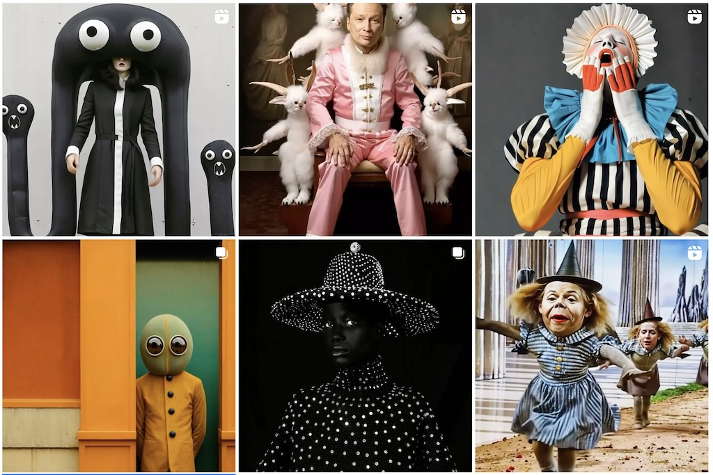

And then there's whatever is going on in [this Instagram channel by @billyfromthevoid](https://www.instagram.com/billyfromthevoid):

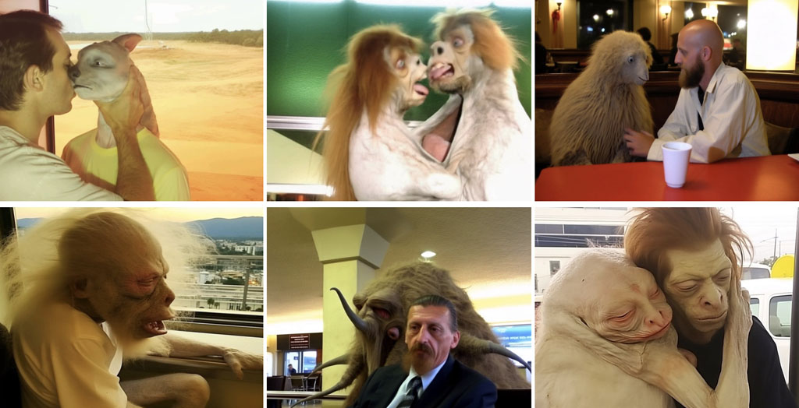

Finally, there is "[Fighting Windmills](https://verse.works/series/fighting-windmills-by-addie-wagenknecht)" by Addie Wagenknecht (2023). The artist as a deepfake confronts a deepfaked doppelgänger in a boxing ring, symbolizing the internal battle against self-sabotage and the weight of imposed standards.

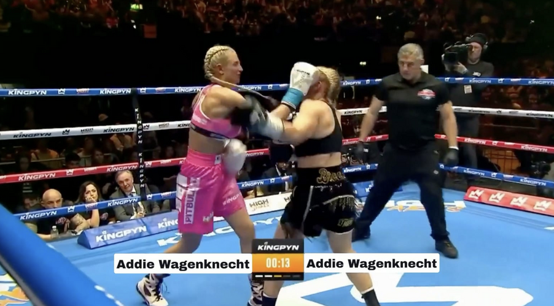

---

## Reconstruction of Memory

### Reconstruction: Gaudí

[Kevin Slavin (2022) used MidJourney](https://twitter.com/golan/status/1544329926198939648) to visualize "real things that existed, or real events that happened, that have no visual record" — such as (architect) Antoni Gaudí's cardboard maquettes for the [Sagrada Familia](https://livingchurch.org/covenant/the-christmas-story-in-stone-the-nativity-facade-of-the-sagrada-familia/) cathedral, which were lost to fire.

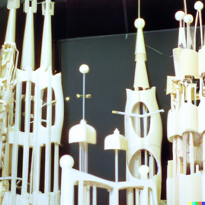

### Reconstruction: The Pigeon Heist

> [This is a 100% true story. Retold with 100% AI.](https://x.com/umpherj/status/2100939627217478044) For everyone I've told it to before, I hope it lives up to whatever madness you had playing in your head.

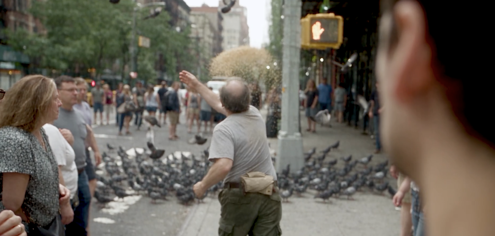

---
