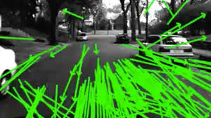
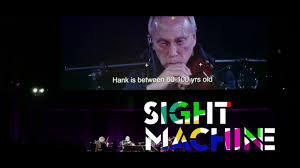
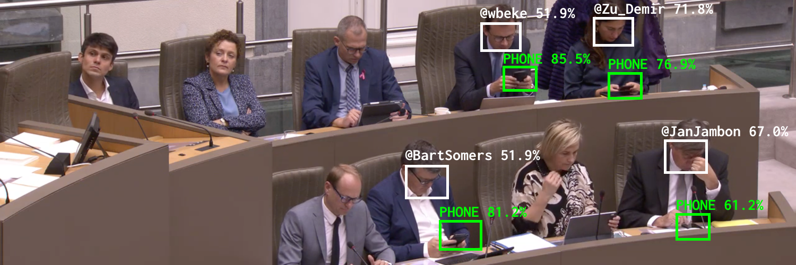
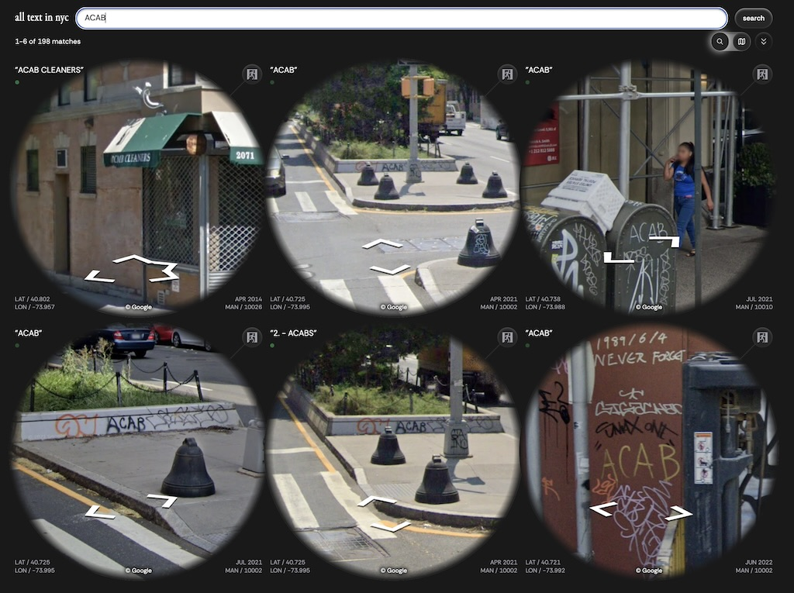
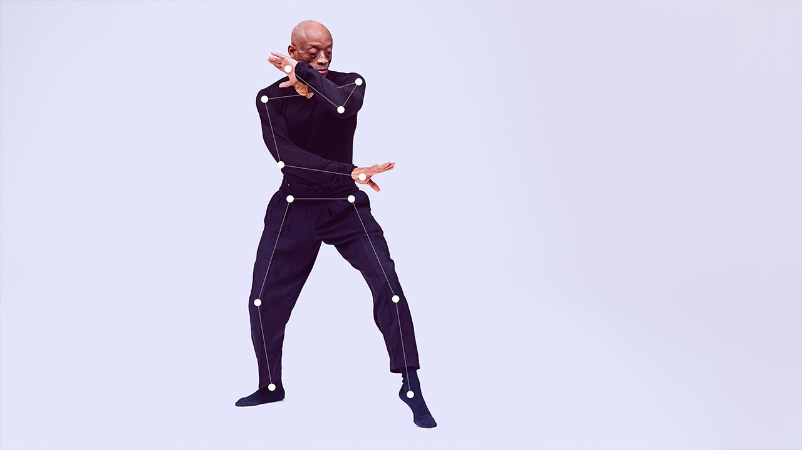
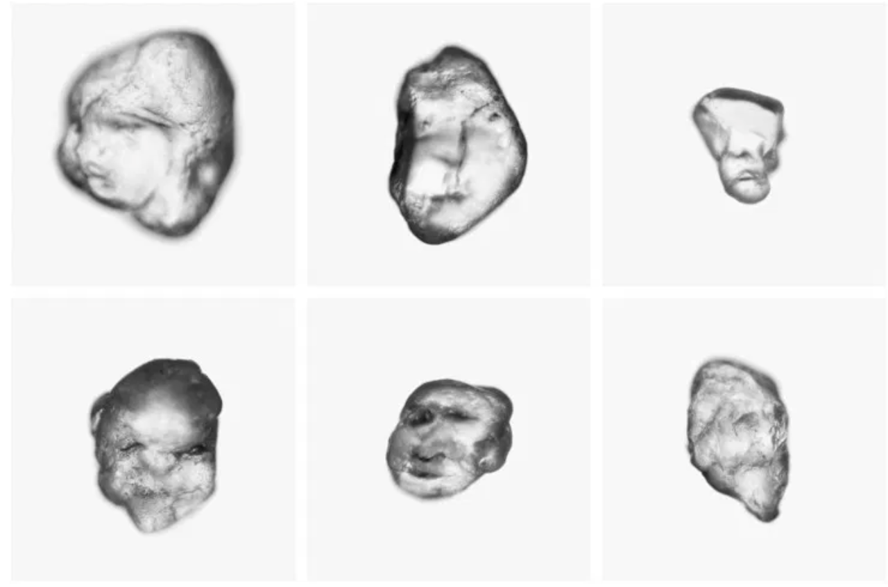
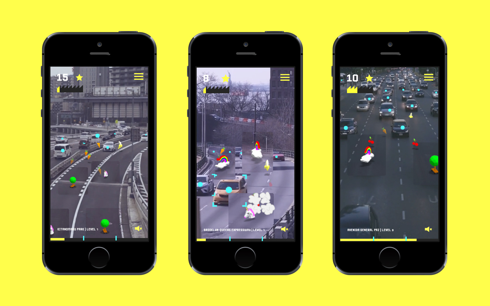

# Seeing Like a Computer

### Art Using AI-based image detection, tracking and recognition

*A collection by Golan Levin. Portions of this page are by Paolo Pedercini.*

Detecting, recognizing, and tracking objects in digital images, in particular bodies and faces, is one of the most common applications of ML. Why is that? How are these projects approaching this problematic technology?

---

### [Timo Arnall, *Robot Readable World*](https://vimeo.com/36239715)

A short film which is made entirely of poetically repurposed demonstration videos from computer-vision research laboratories.

---

### [Trevor Paglen & Kronos Quartet, *Sight Machine*](https://www.youtube.com/watch?v=5mg3MXETfj4)

In related work, artist Trevor Paglen collaborated with the Kronos Quartet on Sight Machine (2018; video), a performance in which the musicians were analyzed by (projected) computer vision systems. “Sight Machine’s premise is simple and strange.  The Kronos Quartet performs on stage, and Paglen runs a series of computer vision algorithms on the live video of this performance; behind the musicians, he then projects a video that these algorithms generate.  Paglen is an artist best known for his photography of spy satellites, military drones, and secret intelligence facilities, and in the past couple of years, he has begun exploring the social ramifications of artificial intelligence.” [Video 1](https://www.youtube.com/watch?v=5mg3MXETfj4) • [Video 2](https://vimeo.com/205149078)

---

### [Dries Depoorter, *The Flemish Scrollers,*](https://driesdepoorter.be/theflemishscrollers/)

(2021-2025) Automatically tagging Belgian politician when they use their phone on the daily livestreams. With the help of AI. How does it work? Every meeting of the Flemish government in Belgium is live streamed on a youtube channel. When a livestream starts the software is searching for phones and tries to identify a distracted politician. This is done with the help of AI and face recognition. The video of the distracted politician are then posted to a Twitter and Instagram account with the politician tagged.

### [Dries Depoorter, *The Follower*](https://driesdepoorter.be/thefollower/)

Using open cameras and AI to find how an Instagram photo is taken (2023-2025). Recorded a selection of open cameras for weeks. Scraped all Instagram photos tagged with the locations of the open cameras.Software compares the Instagram with the recorded footage.

### [Dries Depoorter, *Recharge*](https://x.com/driesdepoorter/status/1816408598391496869)

An art installation where your phone charges only when your eyes are closed.

---

### [Yufeng Zhao, *all text in nyc*](https://alltext.nyc/search?q=ACAB)

"all text in nyc" (2024) is a search engine that finds text in New York City's Google Street View images. Search for any word or phrase to see where it appears across the city—in shop signs, graffiti, advertisements, and protest signs. Using optical character recognition (OCR), the project turns Street View documentation into an exploration tool. Each search creates an unplanned route through the city, revealing patterns in how text shapes our urban environment. Drawing from Street View imagery between 2007 and 2024, "all text in nyc" covers all five boroughs, with most searchable text in English or other Latin-alphabet languages.

---

### [Body, Movement, Language: AI Sketches With Bill T. Jones](https://experiments.withgoogle.com/billtjonesai), Bill T. Jones & Google Creative Lab, 2019

---

### [*Pareidolia*](https://notnot.home.xs4all.nl/pareidolia/pareidolia.html), Erwin Driessens & Maria Verstappen, 2019. 

In the artwork Pareidolia* facial detection is applied to grains of sand. A fully automated robot search engine examines the grains of sand in situ. When the machine finds a face in one of the grains, the portrait is photographed and displayed on a large screen.

---

### Move Lab, [*Beat the Traffic*](https://www.move-lab.com/project/beatthetraffic/newyork/level/1/) • [(video)](https://vimeo.com/263125712)

In this mini-game by Benedikt Groß et al., AIs are used to detect vehicles. 

