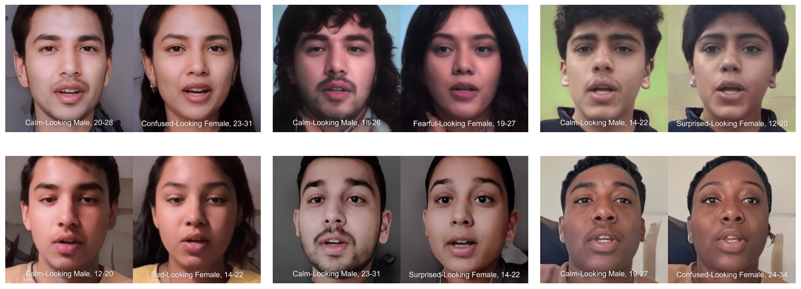
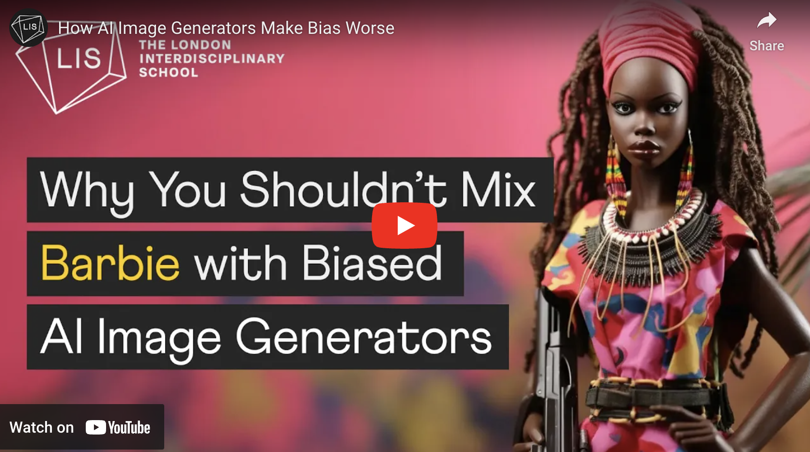
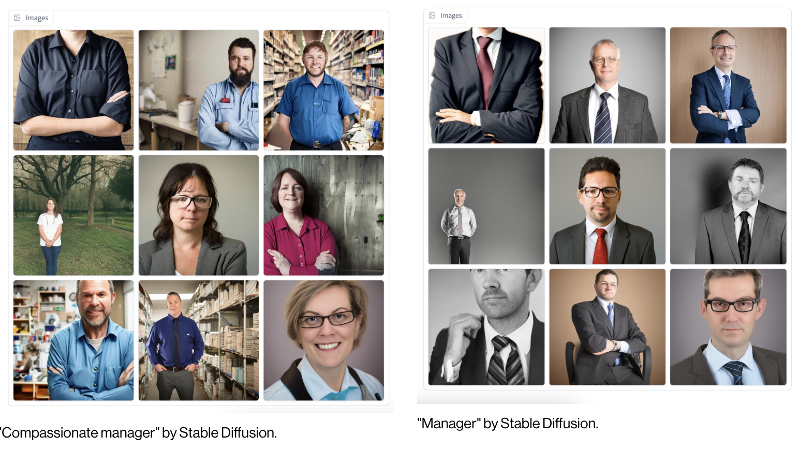
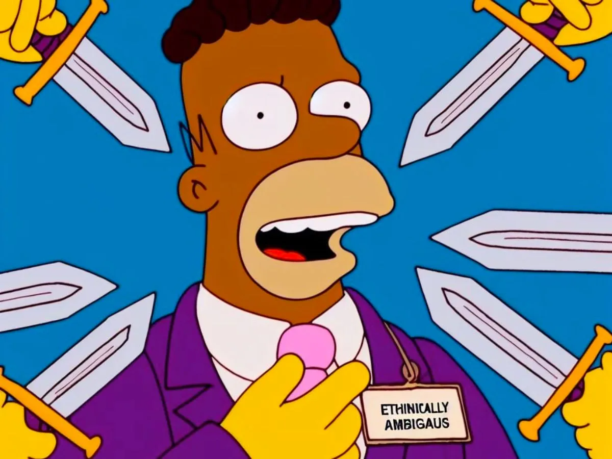
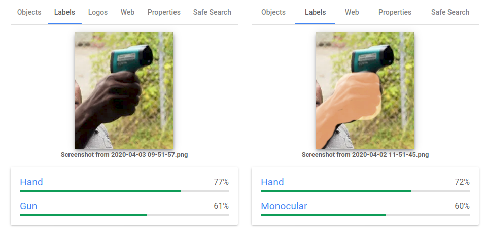

# AI and Dataset Bias

*(These lecture materials are by Paolo Pedercini!)*

---

imagenet.png

[Excavating AI by Kate Crawford and Trevor Paglen](https://www.youtube.com/watch?v=P4JpD1PWBDI)

---

[Deep Hysteria by Amy Alexander](https://amy-alexander.com/projects/deep-hysteria/)

One AI generates "twins" that vary only in gender presentation. Another "AI", trained on human perceptions, attempts to identify the emotion on their faces. The female-presenting faces are often categorized as upset, confused, etc. 

---

Various types of racial and gender bias have been affecting AI systems since their inception. For example, in [AI-generated barbies](https://www.youtube.com/watch?v=L2sQRrf1Cd8&t=105s)

---

Also see the [Stable Diffusion Bias Explorer](https://huggingface.co/spaces/society-ethics/DiffusionBiasExplorer)

---

DALL-E3 attempts to combat the racial bias in its training data by occasionally randomly inserting race words that aren’t white into a prompt. These can bubble up accidentally: 

> Prompt: *Guy with swords pointed at me meme except they are Homer Simpson.*

---

Object recognition can be affected by skin color.

---

["The viral AI avatar app Lensa undressed me—without my consent"](https://www.technologyreview.com/2022/12/12/1064751/the-viral-ai-avatar-app-lensa-undressed-me-without-my-consent/)
> *My avatars were cartoonishly pornified, while my male colleagues got to be astronauts, explorers, and inventors*.

---

### Additional References: 

*Beyond media representation, why does this matter?*

* [Flawed facial recognition system sent a man to jail](https://www.wired.com/story/flawed-facial-recognition-system-sent-man-jail/?ref=dl-staging-website.ghost.io)
* [Predictive policing](https://www.technologyreview.com/2021/02/05/1017560/predictive-policing-racist-algorithmic-bias-data-crime-predpol/)
* [AI used to deny health insurance](https://www.cbsnews.com/news/unitedhealth-lawsuit-ai-deny-claims-medicare-advantage-health-insurance-denials/) and to [appeal such denials](https://qz.com/fight-health-insurance-denials-appeals-ai-1851733712)
* [AI tool used to predict the need of extra medical care is biased against Black patients](https://www.technologyreview.com/2019/10/25/132184/a-biased-medical-algorithm-favored-white-people-for-healthcare-programs/)
* [AI-powered recruiting tool is biased against women](https://www.reuters.com/article/us-amazon-com-jobs-automation-insight-idUSKCN1MK08G/) (luckily scrapped by Amazon)
* [AI tools are used to grade student essays](https://www.vice.com/en/article/flawed-algorithms-are-grading-millions-of-students-essays/)
* [AI tools are used to review college admissions](https://www.thenation.com/article/society/artificial-intelligence-chatgpt-college-applications/)