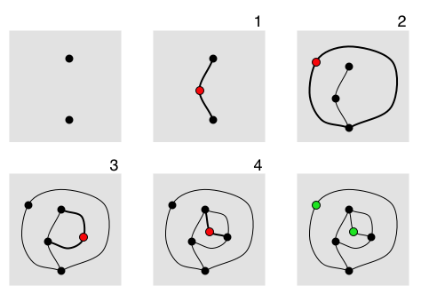

# A Workshop in Unplugged Computing

### Algorithmic Art Unplugged: Creative Computing Exercises with Procedural Games for Pencils-and-Paper, Body Movement, and Spoken Words

By Golan Levin, February 2023

*In this two-hour workshop, we will explore creative coding "unplugged" — experimenting with principles of algorithmic art and computational thinking off the computer, IRL. These exercises in collaborative drawing, human flocking, and rule-based wordplay make for a great icebreaker.*

*この 2 時間のワークショップでは、「プラグを抜いた」クリエイティブなコーディングを探求します。つまり、アルゴリズム アートの原理と、コンピューターから離れた計算思考 (IRL) を試します。 共同描画、人間の群れ、ルールベースの言葉遊びのこれらの演習は、優れた砕氷船になります。*

#### Necessary Materials

* Large timer, such as [https://vclock.com/timer/#countdown=00:01:00](https://vclock.com/timer/#countdown=00:01:00)
* Large adhesive post-it notes (4x6" or 6x8"), in 3 different colors
* Sharpie markers
* Large paper pads (18x24")
* Whiteboards and whiteboard markers
* Flashlight or bicycle light
* Tables which can sit 4-6 people

---

## Part 1. Algorithmic Body Movement Games

This section presents exercises in "human flocking", inspired by the dance/engineering performance *Flock Logic* (2010) by Naomi Leonard and Susan Marshall. It is also inspired by the landmark "Steering Behaviors" research by Craig Reynolds, and p5.js versions of that work in Dan Shiffman's [*Nature of Code*](https://thecodingtrain.com/tracks/the-nature-of-code-2/noc/5-autonomous-agents/1-steering-agents) project. 

**Demonstration:**

* [*Coding Train p5.js Flocking Simulation*, with Sliders](https://editor.p5js.org/codingtrain/sketches/ry4XZ8OkN)

**Setup:** 

* Each person wears a large colored post-it on their shirt. Each post-it has a unique number written on it. For each game, the timer is set for two minutes. 

**Rules:**

1. *Alignment:* Avoid moving backwards. (It's not safe!)
2. *Repulsion:* Move away from anyone who is closer than arm’s length.
3. *Cohesion:* Always seek to keep ***N*** neighbors at arm's length. (N=2 works well.)

**(Japanese)**

1. 位置合わせ: 後方に移動しないようにします。 （安全ではありません！）
2. 反発: 腕の長さよりも近くにいる人から離れます。
3. 凝集：常に「N」人の隣人を腕の長さで保ちます。 (N=2 はうまくいきます。)

**Variations:**

* Change the value of N; try N=1, N=3.
* With N=1, try to always keep a neighbor on your *right side*, but not one person for too long.
* Maintain Rules 1,2, and 3. One or two special participants are given a flashing light. The group is instructed that those participants are now "predators". Participants should *evade* (keep a safe distance, like 2-3 meters from) the predators. The predators should experiment with applying pressure on the group, trapping and shaping the flock.
* Maintain Rules 1 and 2. Each participant should *avoid* the person whose number is one lower, and *seek* the person whose number is one higher. (Wrap the numbers around cyclically.)
* Maintain Rules 1 and 2. Suppose each participant has a number **X** on their post-it. Each participant should try to position themselves *halfway between* person **Y** and person **Z** (where Y=X+5 and Z=X+10).
* Maintain Rules 1 and 2. Each participant should look at the colors of post-its on other participants' shirts. Now: Red *avoids* Green, *seeks* Yellow; Green *avoids* Yellow, *seeks* Red; Yellow *avoids* Red, *seeks* Green.
* Maintain Rules 1, 2, and 3. Unbeknownst to the others, the organizer should give a small secret instruction paper to two special participants. The secret instruction should tell the special participants to to head for one corner of the room, or out a door, or to head to opposite corners of the room.

**Soundtracks for the Games:**

* Penguin Cafe Orchestra (1974): [*More Milk*](https://www.youtube.com/watch?v=ucYJMT65iSQ); [*Prelude and Yodel*](https://www.youtube.com/watch?v=vX_VktuqQOU), from 2:18+; [White Mischief](https://www.youtube.com/watch?v=rWVuJOjej9Q); [Isle of View](https://www.youtube.com/watch?v=RDqDFZHBbVA).
* Federico Albanese, [By the Deep Sea](https://www.youtube.com/watch?v=E0tiGN4pVXs)

**References:** 

* "'*Flock Logic*' unites science and dance" [https://www.youtube.com/watch?v=3n7atKkg2Cg](https://www.youtube.com/watch?v=3n7atKkg2Cg) *(Watch from 1'00")*
* Naomi Leonard, Susan Marshall et al. "In the Dance Studio: An Art and Engineering Exploration of Human Flocking". [https://arxiv.org/pdf/1808.07842.pdf](https://arxiv.org/pdf/1808.07842.pdf)
* Leonard, N. E., Marshall, S.: *Flock Logic*. (2010) [Online]. Available:
[https://naomi.princeton.edu/flock-logic/](https://naomi.princeton.edu/flock-logic/)
* Dan Shiffman, [*Nature of Code: Steering Agents*]([*Nature of Code*](https://thecodingtrain.com/tracks/the-nature-of-code-2/noc/5-autonomous-agents/1-steering-agents))
* Dan Shiffman, [*Coding Train p5.js Flocking Simulation*, with Sliders](https://editor.p5js.org/codingtrain/sketches/ry4XZ8OkN)

---
## Part 2. Collaborative Algorithmic Drawing

### Exercise 1: *Blind Drawing*

There are two drawings made by the Professor, [**Drawing-A**](resources/drawing-a.pdf) and [**Drawing-B**](resources/drawing-b.pdf) (PDFs linked here). For 20 students, print 10 copies of Drawing-A and 10 copies of Drawing-B.

* Divide students into pairs. Call one person of each pair X, the other Y.
* X students get Drawing-A.
* Y students get Drawing-B.
* Distribute blank paper and pens if necessary.
* Pairs sit back to back without looking at the other’s drawing
* X student describes their drawing to Y; Y tries to draw it from X's instructions. Switch at a reasonable time.
* Y student describes their drawing to X; X tries to draw it from Y's instructions.
* Pin up the drawings at the end, so people can see. 
* Group by X/Y.
* Discuss the results.

### Exercise 2: *Conditional Design*

These exercises are by the [Conditional Design](https://conditionaldesign.org/) group. 

#### [*The Beach*](https://vimeo.com/5311402)

**Instructions** 
Each turn, find the most empty space on the paper and place a dot in the middle of it.

---

#### [*Knots*](https://vimeo.com/5559525)

**First Step:** 
The first player draws a line.
The other players draw a line that goes over and under the last drawn line.

**In Turns:** 
The player elongates his/her line on both ends. The elongations have to go over and under a line of another player and may not go over the line of the same color twice in a row.
When a line can no longer be elongated, it is considered dead for the rest of the game. When both ends of a line have died, the player may place a new line.

---

#### [*Kaleidoscope*](https://vimeo.com/4186304)

**Setup** 
Each player has one color pen.
The paper is divided into 4 imaginary segments, in which a player operates.
Each turn a player is either leader or follower.
The players decide which person may be the leader first.

**Play** 
Clockwise in turns a player is the leader, for approx. 30 sec. The other 3 people are the followers.
The leader draws freely in his segment using only straight lines.
The followers must mirror the drawing of the leader, synchronously while he/she is drawing.

**End** 
The ending of the game is decided by the player who proposed to play it.

---

### Exercise 3: *Sprouts*

This is [Sprouts](https://en.wikipedia.org/wiki/Sprouts_(game)) / Shoots / Chutes, a planar graph drawing game. It is demonstrated in [this video](https://www.youtube.com/watch?v=ZQY4v5GItes).

The game is played by two players, starting with a few spots drawn on a sheet of paper. Players take turns, where each turn consists of drawing a line between two spots (or from a spot to itself) and adding a new spot somewhere along the line. The players are constrained by the following rules:

* The line may be straight or curved, but must not touch or cross itself or any other line.
* The new spot cannot be placed on top of one of the endpoints of the new line. Thus the new spot splits the line into two shorter lines.
* No spot may have more than three lines attached to it. For the purposes of this rule, a line from the spot to itself counts as two attached lines and new spots are counted as having two lines already attached to them.

--- 

## Part 3. Rule-Based Wordplay

(*30 minutes*) We conclude our workshop with a few rounds of *Zoom Schwartz Profigliano* (ZSP). 

ZSP is a rule-based word game, ideally played by five people sitting in a circle. At any given time, two of the five players are in the "active conversation". Everyone at the table must keep track of which two players are currently having the active conversation. This feels a lot like tracing the state of a computer program! Various special words and actions change the set of players who are in the "active conversation". Sometimes ZSP is played as a drinking game — i.e., you take a drink when you make an error. 

ZSP はルールベースの単語ゲームで、理想的には 5 人が円になって座ってプレイします。 いつでも、5 人のプレイヤーのうち 2 人が「アクティブな会話」を行っています。 テーブルにいる全員が、現在アクティブな会話をしている 2 人のプレーヤーを追跡する必要があります。 これは、コンピューター プログラムの状態をトレースするのとよく似ています。 さまざまな特別な言葉や行動が、「アクティブな会話」に参加している人々のセットを変更します。 ZSP は飲酒ゲームとしてプレイされることもあります (つまり、エラーを犯したときに飲み物を飲む)。

### Vocabulary:

* **ZOOM** means "Let's talk!", or "Hello, I would like to begin a conversation with you". ZOOM *starts* a conversation with a new person. You can say ZOOM at any time, *except* that you cannot ZOOM someone you are *already* in conversation with.
* **SCHWARTZ** means "OK!", or "I acknowledge that we are in conversation, and I am replying to you". You must *already* be in conversation with someone you SCHWARTZ.
* **PROFIGLIANO** means "Look at them!" or "Hey, let's talk about that person." The PROFIGLIANO speaker must *look at* a third player who is *not* the one they're actively speaking to. PROFIGLIANO does not change the set of people who are in the current conversation.

**語彙：**

* **ZOOM**とは「お話ししましょう！」、「こんにちは、お話を始めたいと思います」という意味です。 ZOOMは新しい人との会話を開始します。 いつでも ZOOM と言うことができますが、既に会話をしている相手を ZOOM することはできません。
* **SCHWARTZ** は「OK!」または「私たちが会話中であることを認め、あなたに返信します」という意味です。 あなたはすでに誰かと会話をしているに違いありません。
* **PROFIGLIANO** は「見てください！」という意味です。 または「ねえ、その人について話しましょう。」 PROFIGLIANO のスピーカーは、積極的に話している相手ではない 第三者に 目を向ける必要があります。PROFIGLIANO は、現在の会話に参加している人々のセットを変更しません。

### Fouls (Errors):

* If you speak or reply when you are not a part of the active conversation
* If you ZOOM someone you are *already* in conversation with
* If you SCHWARTZ someone you are *not* already in conversation with
* If you PROFIGLIANO, but you look at someone you are *already* in conversation with 

**ファウル:**

* アクティブな会話に参加していないときに発言または返信した場合
* 既に会話をしている相手をZOOMする場合
* まだ会話をしていない人をシュワルツする場合
* あなたがPROFIGLIANOであるが、あなたがすでに会話をしている誰かを見ている場合

### Advanced Vocabulary:

* **BOINK**: Exactly like SCHWARTZ, but you must look down at your lap and blink.
* **BELVIDERE**: This is a ZOOM to the person on your left. You must raise your hands and exclaim BELVIDERE to the sky.
* **MEEP-MEEP** means "Goodbye". This allows you to leave the active conversation. The person you were speaking with is obliged to ZOOM (or BELVIDERE) someone else. 
* **QUAFFLE** means "What just happened?" It requires the quaffled player to repeat the word used immediately before the QUAFFLE. QUAFFLE has an "implied ZOOM function"; that is, the quaffled player (if not already in the active conversation) has also been effectively ZOOMed.
* *There are many more!*

**高度な語彙:**

* **BOINK**: SCHWARTZ とまったく同じですが、膝を見てまばたきをする必要があります。
* **BELVIDERE**: これはあなたの左側の人への ZOOM です。 両手を上げてベルヴィデレを空に向けて叫ばなければなりません。
* **MEEP-MEEP**は「さようなら」という意味です。 これにより、アクティブな会話から離れることができます。 あなたが話していた人は、別の誰かをZOOM（またはBELVIDERE）する義務があります。
* **QUAFFLE** は「今何が起こったの？」という意味です。 クワッフルされたプレーヤーは、クワッフルの直前に使用された単語を繰り返す必要があります。 QUAFFLE には「暗黙の ZOOM 機能」があります。 つまり、クワッフルされたプレイヤー (まだアクティブな会話に参加していない場合) も効果的にズームされています。
* *他にもたくさんあります！*

### References:

* The complete rules for ZSP are [in this PDF](resources/ZSP-Rules-2012.pdf).

