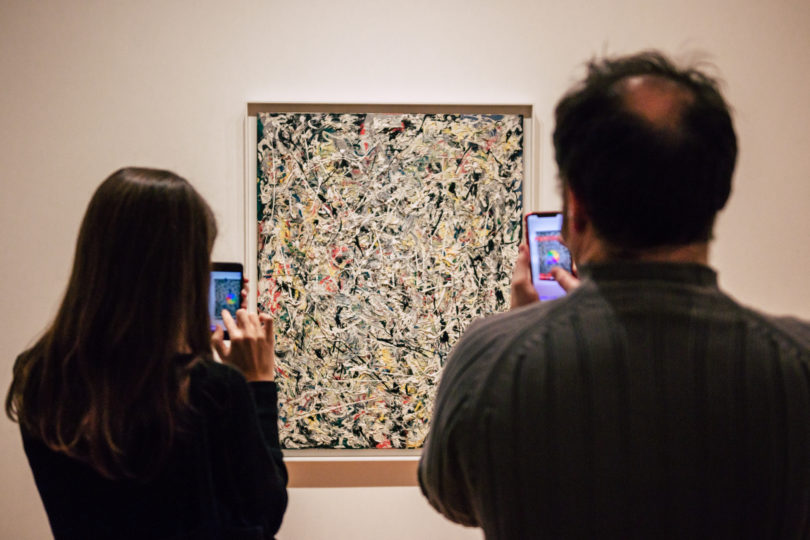

# Augmented Reality (AR)

---

#### AR: Preliminary Inspirations

* Keiichi Matsuda: [*Hyper Reality*](https://vimeo.com/166807261) (2016)
* Lily Allen: [*Fuck You*](https://www.youtube.com/watch?v=o8VZX4sHn-4) (2009)

---

#### AR & Art: A Partial Chronology and Individual Visions

* Jeffrey Shaw, [*Golden Calf*](https://www.youtube.com/watch?v=paaacEIF6wU) (1994)
* Golan Levin & Claire Hentschker, [*Golden Calf*](https://www.instagram.com/p/BYwp5EYBB_O/?taken-by=golanlevin) (iOS version, 2017)
* Scott Fisher, [*Environmental Field Guide*](https://www.youtube.com/watch?v=SMujvLQdKaE) (1999-2000)
* Julian Oliver, Damian Stewart, Arturo Castro: [*The Artvertiser*](https://theartvertiser.com/) (2008). 
* Camille Scherer, [*Le Monde des Montagnes*](https://chipchip.ch/mondedesmontagnes) (2008)
* [Mark Skwarek](http://www.markskwarek.com/): [*The Leak in Your Home Town*](https://theleakinyourhometown.wordpress.com/) (2010); [*Returning the Elgin Marbles*](https://markskwarek.blogspot.com/2012/06/returning-stolen-parthenon-elgin.html) (2012)
* Nathan Shafer, [*Exit Glacier AR Terminus Project*](https://www.kickstarter.com/projects/995145724/exit-glacier-ar-terminus-project), [video](https://www.youtube.com/watch?v=PQac4zosOVw) (2012)
* Jeremy Bailey, [*Nail Art Museum*](https://www.youtube.com/watch?v=40pSU5ZM784) (2014)
* Tamiko Thiel, [extensive works, 2010-2019](http://www.tamikothiel.com/projects.html), see [Lotus Meditation](http://www.tamikothiel.com/AR/lotus-meditation.html) 

* Carla Gannis. [*Selfie Drawings*](http://theselfiedrawings.com/) (2016)
* Google [AR Experiments overview](https://www.youtube.com/watch?v=y4bIcUv0lbU) (2017)
* Nicole He & Eran Hilleli: [*Garden Friends*](https://experiments.withgoogle.com/garden-friends) (2017)
* Roi Lev & Anastasis Germanidis: [*When Things Talk Back*](http://www.roilev.com/when-things-talk-back-an-ar-experience/) (2017)
* Damjan Pita and David Lobser. [*MoMAR*](http://momar.gallery/) (2018). The MoMAR Group Show, "Hello, We're From the Internet", is an intervention exhibition in the Jackson Pollock room at MoMA. The artist group developed an unauthorized AR app that lets you interact with (i.e. see overlays on) Jackson Pollock's paintings. 

* Anna Madeline Raupach, [*Sediments*](http://www.annamadeleine.com/sediments) (2018)
* Young & Rubicam, [*The Whole Story*](https://www.lbbonline.com/news/yr-nys-the-whole-story-project-uses-augmented-reality-to-educate-us-about-innovative-woman-in-history)
* Rosie Rios, Google Creative Lab, Nexus Studios: [*Notable Women*](https://experiments.withgoogle.com/notablewomen): historic American women on U.S. currency
* Vince McKelvie (sound on), 2014: [Insta](https://www.instagram.com/p/pwNc13kGiv/), [Insta](https://www.instagram.com/p/p6uwKRkGse/), [Insta](https://www.instagram.com/p/pjjefbkGgF/), [Insta](https://www.instagram.com/p/qM4BIQEGk_/)
* Kristyn Janae Solie / @kyttenjanae, 2016 (sound on): [Insta](https://www.instagram.com/p/Bbzy14ZHk4O/), [Insta](https://www.instagram.com/p/BZC4pe3nSw2/), [Insta](https://www.instagram.com/p/BbLWKpyHokU/), [Insta](https://www.instagram.com/p/BGSbEB6xQQu/)
* @algomystic, [Glitch the World](https://twitter.com/algomystic/status/1171419850356510720), [& more](https://twitter.com/algomystic/status/1166397065414553600)
* Zach Lieberman & Molmol Kuo: [Finger drawing](https://twitter.com/zachlieberman/status/1181321673947127808), [Face](https://www.instagram.com/p/BdJfpljAfQJ/?taken-by=zach.lieberman), [Sound](https://www.instagram.com/p/BYs0iI3g8kZ/?taken-by=zach.lieberman)

---

#### Extended Approaches 

* Janet Cardiff. [*Alter Bahnhof Video Walk*](https://vimeo.com/73251458) [YouTube](https://www.youtube.com/watch?v=sOkQE7m31Pw) (2012)
* Markus Kison, [Touched Echo](http://www.markuskison.de/touched_echo.html) [video](https://www.youtube.com/watch?v=AHLobipEwBI) (bone conduction audio overlay, 2007)
* Blast Theory, [Can You See Me Now?](https://www.youtube.com/watch?v=hX4kZvEllwY) (2010). A game that happens simultaneously online and on the streets. Players from anywhere in the world can play online in a virtual city against members of the Blast Theory collective. Tracked by satellites, Blast Theory's runners appear online next to your player on a map of the city. On the streets, handheld computers showing the positions of online players guide the runners in tracking you down.

---

#### Other Findings

**Tomfoolery** 

* [Augmented Reality Portal](https://www.youtube.com/watch?v=371ZQW_Yzck), 2017
* [Cleaning up my Desk](https://twitter.com/PauletaMlz/status/1053053218014539776)
* Hart Woolery: [Instasaber](https://www.youtube.com/watch?v=MWd7shj59PA), [YoPuppet](https://www.youtube.com/watch?v=zd-LKYu5QDQ)
* [Cat playing Flute](https://twitter.com/uxlinks/status/1148957799524835328)
* Bobby Carlton: [Tattoo](https://twitter.com/bcarlton727/status/1171085789532512256)
* [Nessly’s Antares Auto-Tune Arm Implant](https://www.youtube.com/watch?v=ZG5e8i5AugQ)
* [JAKE PAUL GETS A CAMERA IMPLANT](https://www.youtube.com/watch?v=cvpsdsBnUao)

**Studio & Corporate Visions**

* Lykke Studios: [Car Face Filter](https://twitter.com/bcarlton727/status/1089348566668267521)
* Universal Everything: [SuperYou](https://universaleverything.com/projects/super-you)
* [Location-Based Entertainment](https://twitter.com/Sanemavcil/status/1102362022401007616)
* [Solve Boggle](https://twitter.com/braddwyer/status/1181259739956678657)
* [Conference Keepsake](https://twitter.com/marc0matic/status/1180803834408361985)
* [The Future of Magazines](https://twitter.com/steube/status/1122491841176272897)
* [Virtual Try-On](https://twitter.com/WarbyParker/status/1092586639203938304)
* [Cockroach Meshing Demo](https://twitter.com/RoblemVR/status/1143978076503760899)
* [GiphyWorld](https://giphy.com/apps/giphyworld) Put GIFs on everything.
* [WordLens](https://www.youtube.com/watch?v=h2OfQdYrHRs)

---

#### Tools

* [Justaline]()
* [Doodlelens](https://twitter.com/Aidan_Wolf/status/1168518755648974849)
* Zach Lieberman and Molmol Kuo: [*Weird Type*](https://apps.apple.com/us/app/weird-type/id1352785248) (2018). [Video](https://youtu.be/UzNCGqE9MhE), [Examples](https://youtu.be/5hLiCTGsbeY)
* [SAN](http://web.san.lv/) - gps based augmented reality app. [Insta](https://www.instagram.com/san.app/)

