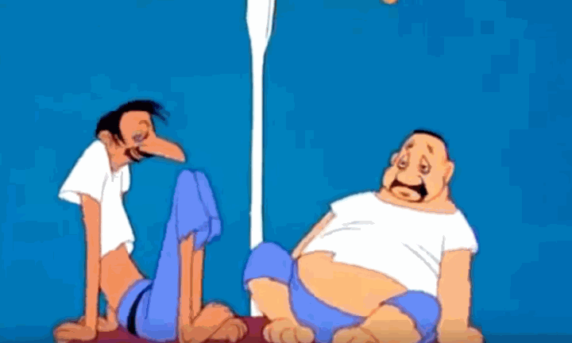
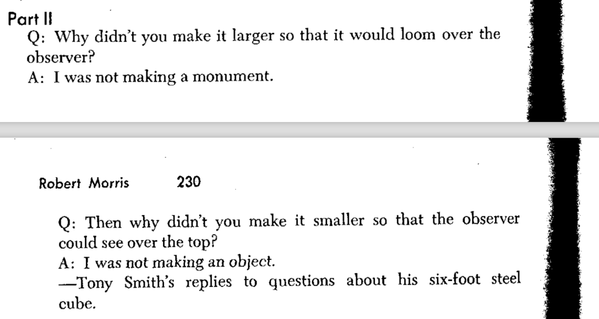
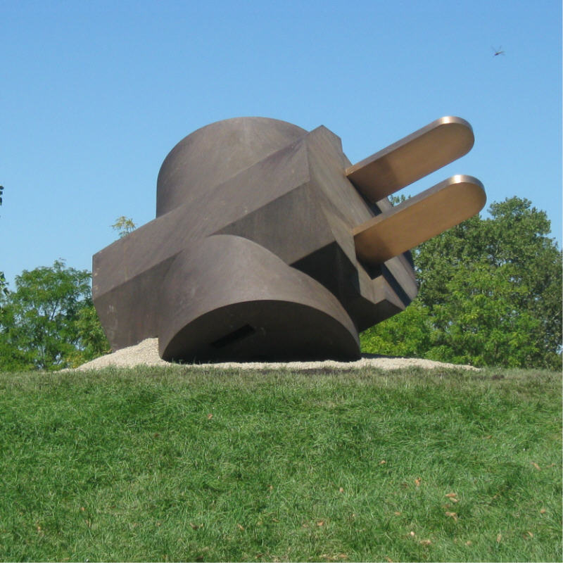
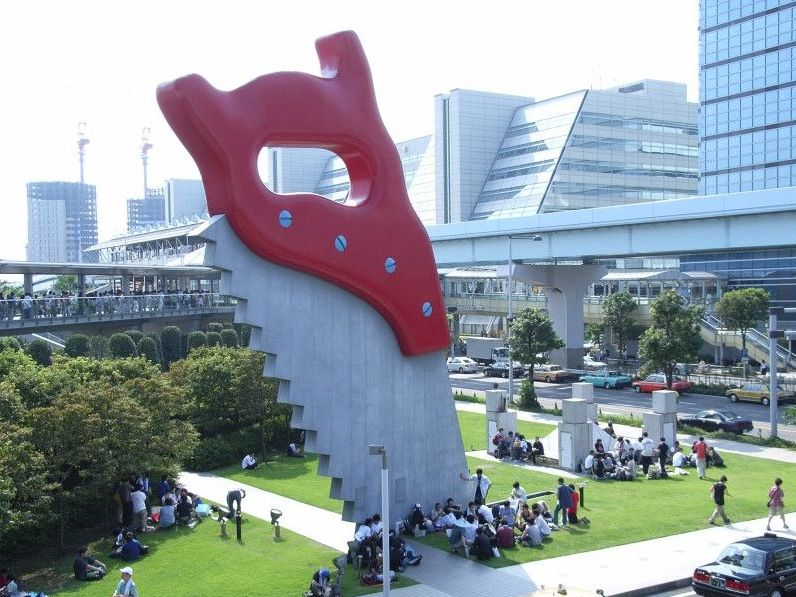
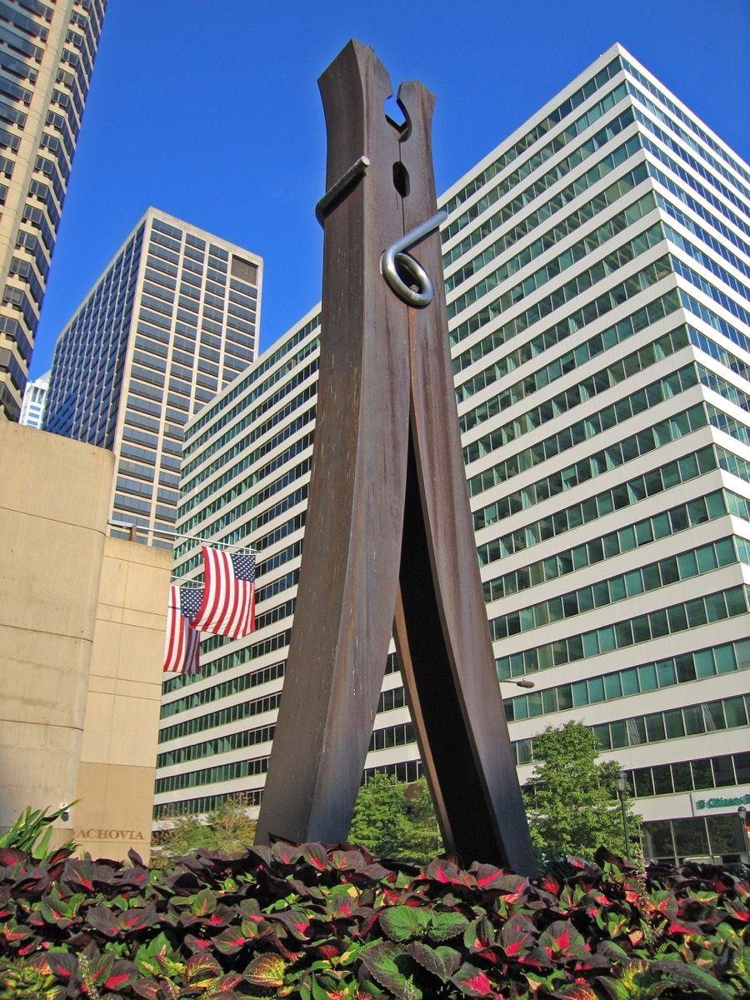

# AR: Some Considerations

---

### Hallucinations

*Wackiki Wabbit* (1943)

*The Hungry Wolf* (1941)

---

### Monuments

[Unusual Monuments](https://www.atlasobscura.com/categories/unusual-monuments)

#### Changes in Scale (Claes Oldenburg)

 