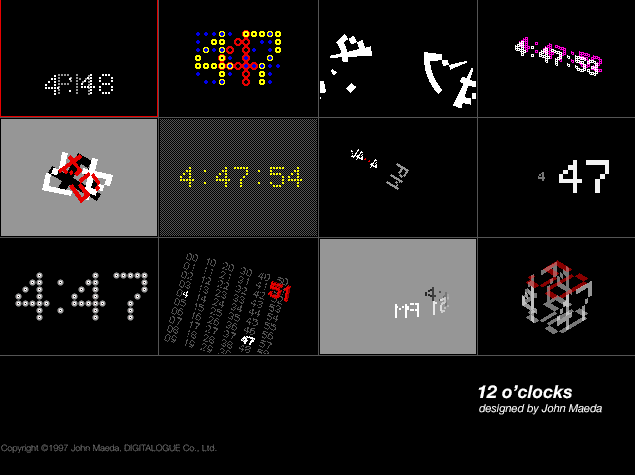
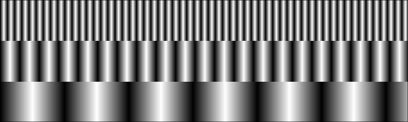
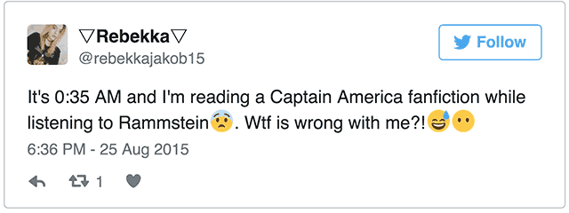
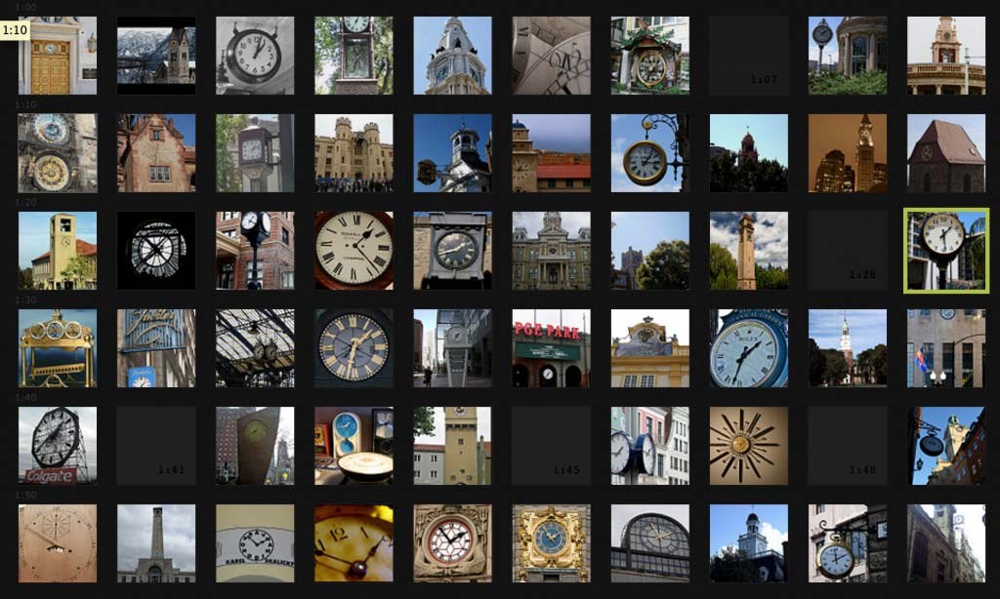

## Representing Time 

Created: 2 February 2018

### Deep History

*Question: Why does the circle have 360°?*

[A Brief History of the Calendar](https://www.youtube.com/watch?v=OaYMK2n9Aow) (up to 12:42)

[A History of Timekeeping in Six Minutes](https://www.youtube.com/watch?v=SsULOvIWSUo)

[A Minor History Of / Time without Clocks](http://www.cabinetmagazine.org/issues/29/foer.php) by Joshua Foer

Joshua Foer has done such an excellent job, it is best just to link to his [*A Minor History of Time Without Clocks*](http://www.cabinetmagazine.org/issues/29/foer.php). Here’s a [PDF backup](http://cmuems.com/2016/60212/resources/foer_time_without_clocks.pdf). Let’s pay special attention to the following:

* 1600’s Cannon Dial
* 1633 Kircher’s sunflower clock, set by the heliotropism of a flower
* 1728 Sawai Jai Singh’s 90-foot tall sundial, accurate to 2 seconds
* 1733 Moon dial, read by the shadow of the moon
* 1751 Linnaeus’s flower clock, read from the opening of flowers
* 1929 “aktograph”, or bean leaf movement clock

It’s worth remembering that the convention that we use 12 (or 24) hour time is *totally arbitrary* — an artifact of ancient Egyptian astronomy. Other systems have been used and proposed. For example, until quite recently, a six-hour day was used in Thailand. During the French Revolution, when the metric system was invented, people seriously proposed decimal time. Here’s a decimal clock from the late 1700s:

We see this again in the *10-Hour Flux Clock* by George Maciunas (1969): 

-- 
### Software Clocks (I)

Let’s start with something simple. [The Colour Clock](http://thecolourclock.co.uk/) displays the current time as a hexadecimal color. Hours = red, minutes = green, seconds = blue. There you go; glad that’s over with. In case you were wondering, more than several people have thought of this idea. Low hanging fruit.

Now let’s go back in history. Here are John Maeda’s [12 O’Clocks](http://www.maedastudio.com/2004/rbooks2k/twelve.html) from 1996. If the real apps (OS9) don’t work any longer, [here’s a video](https://www.youtube.com/watch?v=nA_UTUvC4h8) (jump to 4’00”).

[Maeda's 12 O'Clocks](http://cmuems.com/2016/60212/lectures/lecture-09-09b-clocks/maedas-clocks/)

*Live OS9 demo instructions for Golan:*
* Download artwork from http://www.maedastudio.com/2004/rbooks2k/twelve.html
* Unstuff twelve.sit and locate in /Users/Shared/MaedaClocks/12oclocks
* Launch the [SheepShaver OS9 emulator](http://sheepshaver.cebix.net/), /Users/golan/Desktop/PEDAGOGY/iacd/2015/clocks/COIV4.0.1+/Classic.app
* After OS9 launches, navigate to Unix/MaedaClocks/12oclocks in OS9; demo
* Force-quit SheepShaver to exit.

Clocks have been an idee fixe in new media. Here's the elegant video-slitscan-based [*Last Clock*](https://vimeo.com/27975734), (2002) by Jussi Angesleva & Ross Cooper:

[Here's a clock](https://www.openprocessing.org/sketch/503941) I produced as a student of John Maeda in 1999.

My student Greg Vassallo made this clock for my class in 2005:

--
### The Clock and Human Industry

*Real Time: Schiphol Clock* by Maarten Baas



*Sweeper Clock* by Maarten Baas 

*Standard Time* by Mark Formanek

*Industrious Clock* by Yugo Nakamura

*Book Clock* by Masaaki Hiromura

### Crowdsourced Clocks

The [Human Clock](http://www.humanclock.com/) is a clock made from crowdsourced photographs. The [Photo’Clock](http://mono-1.com/photoclock/) by Mono-1 is similar.

[*All the Minutes*](http://alltheminutes.com/) by Studio Moniker

*The World Clock Project* by Harvest


A well-known ‘crowdsourced’ clock (in a different sense) is Christian Marclay’s *Clock*, a 24-hour film made up of about seven thousand clips, each of which either says or displays the (actual) time of day, or which makes a cogent reference to time:

* [The Clock](https://www.youtube.com/watch?v=xp4EUryS6ac)
* [The Clock](https://www.youtube.com/watch?v=BXbQw0rE5UE)



--
### Physical Machines & Clock Typography

*Continue Time* by Sander Mulder

*3.16 Billion Cycles* by Che-Wei Wang & Taylor Lev

*Digital Sundial* by Mojoptix

Taiwanese designer Yen-Wen Tseng has designed a clock, [*Hand in Hand*](http://www.dezeen.com/2010/03/26/hand-in-hand-clock-yen-wen-tseng/), where the hands are linked by two pivoting arms:

*Water Clocks* by Bernard Gitton (*jump to 2:19*)

*Drop Clock* by Stasean

*Binary Clock*

*LEGO Mindstorms Digital Clock*

*Segmentus Clock* by Art Lebedev 

*Ferrolic* by Zelf Koelman

*A Million Times* by Humans Since 1982

*The Clock Clock* by Humans Since 1982

*A Study Of Time* by rAndom International

*Wordclock*

*Qlocktwo* by Biegert & Funk selectively illuminates parts of a text image:

*It's about time* by insightoutsight /  Laurence Willmott

*Four Letter Clock* by Skot Croshere (SKOT9000), 2011

-- 
### New Graphics; New Concepts

*Ink Calendar* by Oscar Diaz uses capillary action to display the time.

*A Dot for Every Second in the Day*

*Untitled (For The Sun)* by Jim Campbell 

*CRASHCLOCK* by Tha

*Horloge Tactile* by Eric Morzier

*Pong Clock*

*Center Clock* by Lee Byron

*QR Clock* by QRPlanet

*Time Machine* by Daniel Duarte

*L'Ora X Clock* by Bruno Munari (1945)

*Sonicode Clock* by Saqoosha

*Last Time* by Ali Miharbi (2009)

*Personal Timekeeper* by Taeyoon Choi & E Roon

*Ten Things I Can Count On* by Bruce Cannon

*Zero Noon* by Rafael Lozano-Hemmer


* [*The Rhythm Of Heart*]() - A metronomic archive of the artists’ heartbeats.
* [Untitled (Perfect Lovers)](https://collections.dma.org/artwork/5324909) - by Félix González-Torres. Two synchronized clocks embody the tension that comes from two people living side-by-side as life moves forward towards death.

In some situations, it may not be necessary for a clock to “work” mechanically in order for it to “operate” powerfully. Below are clocks which are frozen at 8:15am, the moment when the Hiroshima bomb detonated, when Kengo Nikawa’s pocketwatch stopped forever.

In another situation, a clock may simply be working so slowly that it never appears to be working in our lifetime. The Clock of the Long Now, designed to last 10,000 years, ticks once per year and chimes once per century. As such, it fosters long-term thinking and remains an important symbol of hope for the future.

*The Clock of the Long Now* (10,000 Year Clock)

