## Representing Time; Clocks, Reimagined

### Deep History

*(Question: Why does the circle have 360°?)*

[A Brief History of the Calendar and Timekeeping](https://www.youtube.com/watch?v=OaYMK2n9Aow&t=4s) (watch up to 12:42). Lecture by Dr. Donna Carroll, Lecturer of Physics, Maastricht University: [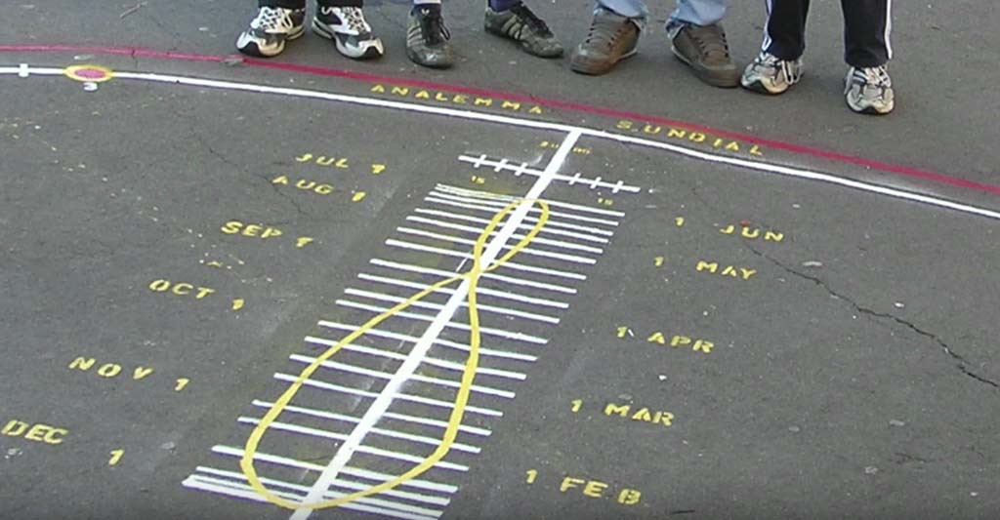](https://www.youtube.com/watch?v=OaYMK2n9Aow)

[A History of Timekeeping in Six Minutes](https://www.youtube.com/watch?v=SsULOvIWSUo). Contextualizes timekeeping in relation to military history. [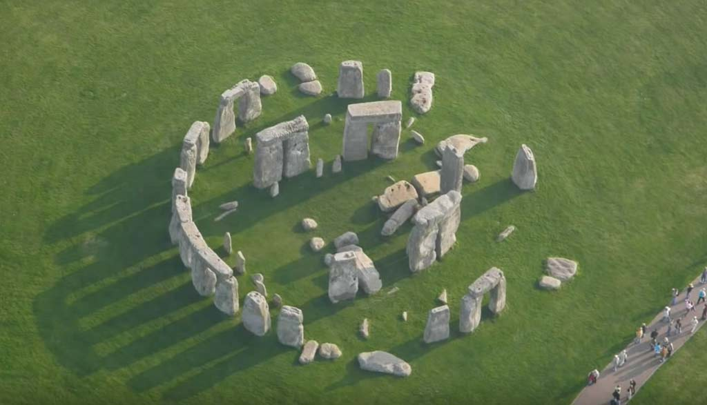](https://www.youtube.com/watch?v=SsULOvIWSUo)

[72 Micro-Seasons in Ancient Japan](https://www.youtube.com/watch?v=aScTn2A8hv8&t=46s) [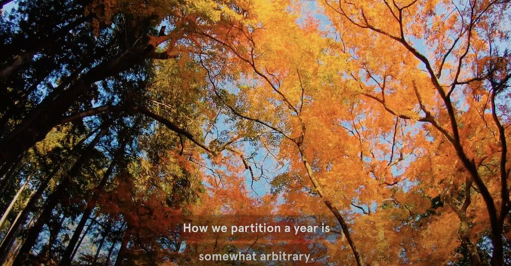](https://www.youtube.com/watch?v=aScTn2A8hv8&t=46s)

---

### Unusual Historical Clocks

(*These examples taken from: [A Minor History Of / Time without Clocks](http://www.cabinetmagazine.org/issues/29/foer.php) by Joshua Foer.*)
Joshua Foer has done such an excellent job, it is best just to link to his [*A Minor History of Time Without Clocks*](http://www.cabinetmagazine.org/issues/29/foer.php). Here’s a [PDF backup](http://cmuems.com/2016/60212/resources/foer_time_without_clocks.pdf). Let’s pay special attention to the following:

* 1600’s Cannon Alarm Clock. 
	* *"The cannon dial, also known as the noonday gun, is the first natural timekeeper with an alarm setting. It consists of a small cannon and a lens mounted on a horizontal dial. As the sun passes through high noon, its rays are concentrated through the precisely positioned magnifier, igniting a small amount of gunpowder and setting off the gun."*
   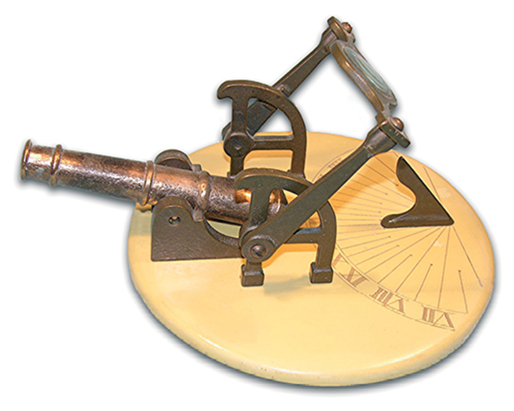
* 1728 Sawai Jai Singh’s 90-foot tall sundial, accurate to 2 seconds:
	* 
* 1733 Moon Dial at Cambridge University, read by the shadow of the moon:
	* *"In addition to the traditional solar hours, the timepiece has an accompanying table that can be used to read the shadow cast by the moon. Even with the table, however, a series of four mathematical calculations has to be carried out by anyone wishing to know the time."* 
	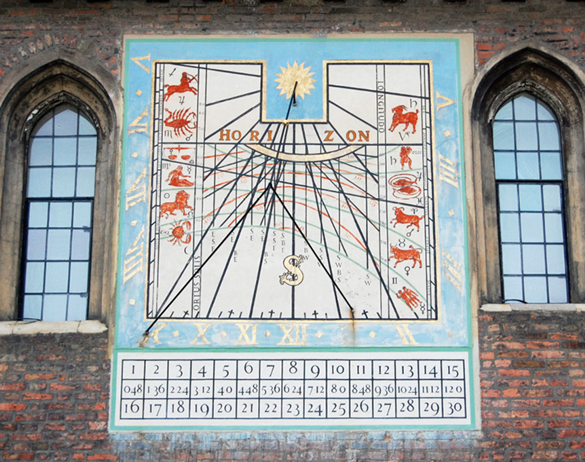
* 1751 Linnaeus’s flower clock, read from the opening of flowers. 
	* *"Linnaeus notes in his Philosophia Botanica that if one possessed a sufficiently large variety of aequinoctal species, it would be possible to tell time simply by observing the daily opening and closing of flowers."*
	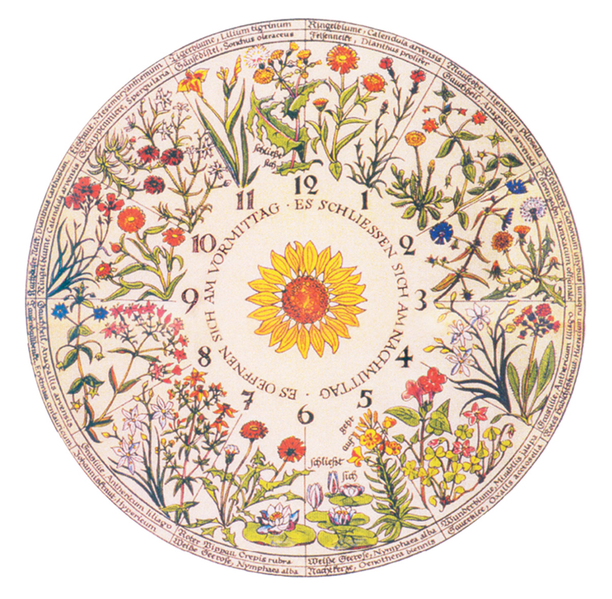
* 1929 Kleinhoonte's “aktograph”, or bean leaf movement clock:
	*  *"Dutch botanist Anthonia Kleinhoonte employs a measuring device known as the “aktograph” to precisely record the rhythms of a bean leaf’s movement throughout the day. A thin filament attached to the leaf is connected to a stylus, which draws on a revolving smoke drum. As the leaf rises in midday, so too does a line rise on the drum, only falling back as the leaf begins to slump in the evening. Her measurements demonstrate that the plant lives according to a strict daily rhythm".*
	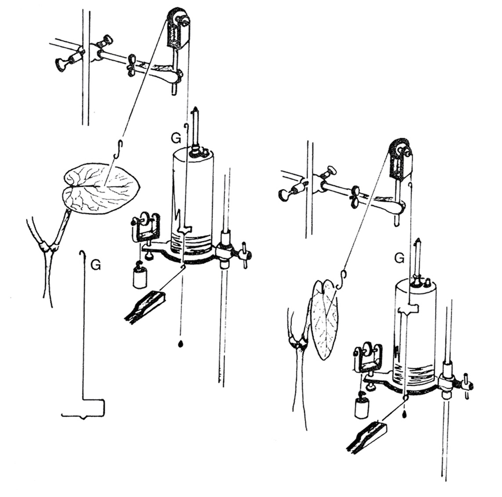

---

### 12 is Arbitrary!

It’s worth remembering that the convention that we use 12 (or 24) hour time is *totally arbitrary* — an artifact of ancient Egyptian astronomy. Other systems have been used and proposed. For example, until quite recently, a six-hour day was used in Thailand. During the French Revolution, when the metric system was invented, people seriously proposed decimal time. 

Here’s a decimal clock from the late 1700s: 
[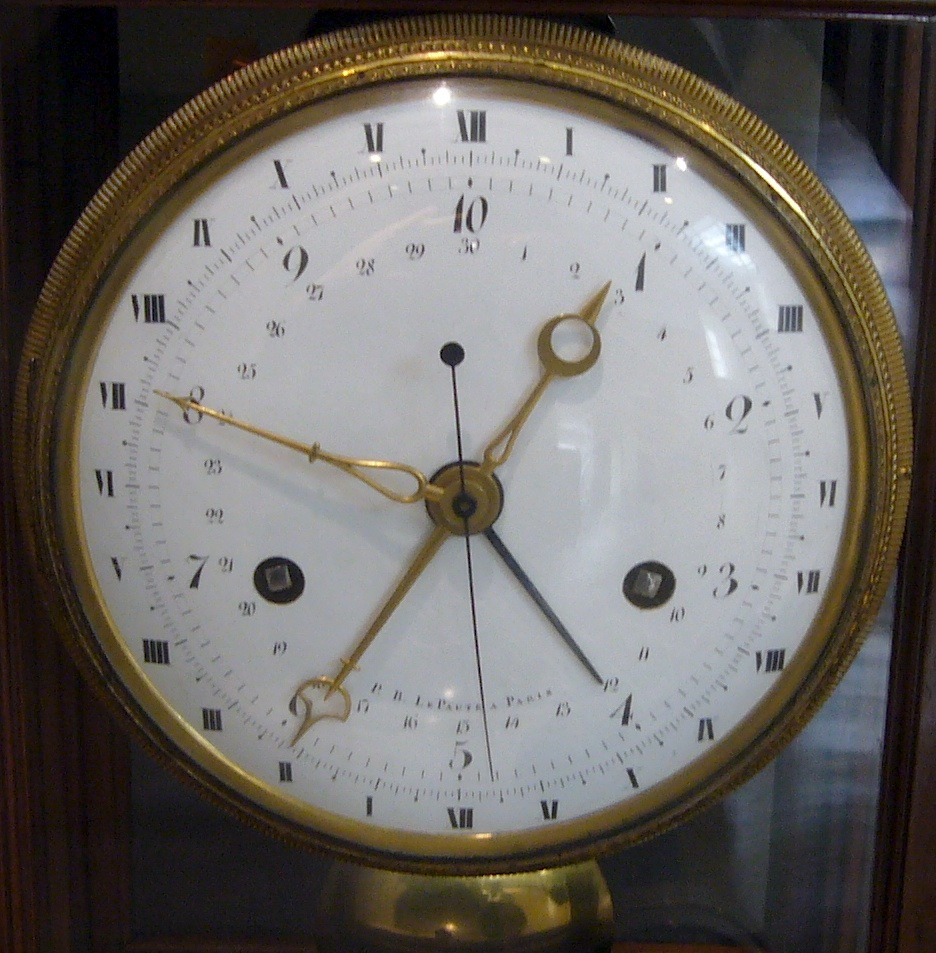]()

We see this again in the *10-Hour Flux Clock* by George Maciunas (1969): 
[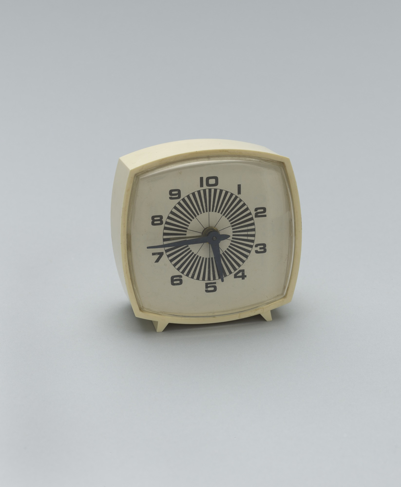](https://www.moma.org/collection/works/128651?locale=en)

---

### Software Clocks (I)

Let’s begin with something simple. The [Colour Clock](http://www.thecolourclock.com/) displays the current time as a hexadecimal color. Hours = red, minutes = green, seconds = blue. There you go. In case you were wondering, more than several people have thought of this idea. Low hanging fruit.

Here's another very simple clock, [*hms*](https://www.gysin-vanetti.com/hms/) by Andreas Gysin (2010), which maps the time to the dimensions (lwh) of a rectangular solid. The piece can be seen [live online here](https://www.gysin-vanetti.com/hms/) 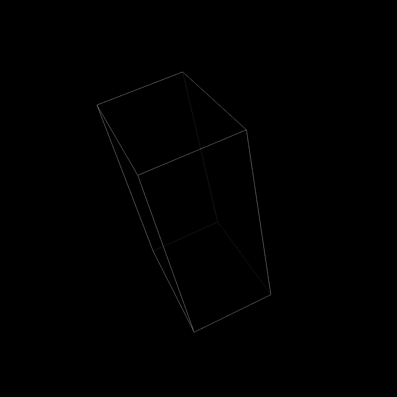

Much of this kind of investigation began with John Maeda’s highly influential [*12 O’Clocks*](http://www.maedastudio.com/2004/rbooks2k/twelve.html) software from 1996. [Here’s a video](https://www.youtube.com/watch?v=nA_UTUvC4h8&t=240s) (jump to 4’00”), and here are individual GIF recordings: [maeda-01](images/maeda/maeda-01.gif), [maeda-02](images/maeda/maeda-02.gif), [maeda-03](images/maeda/maeda-03.gif), [maeda-04](images/maeda/maeda-04.gif), [maeda-05](images/maeda/maeda-05.gif), [maeda-06](images/maeda/maeda-06.gif), [maeda-07](images/maeda/maeda-07.gif), [maeda-08](images/maeda/maeda-08.gif), [maeda-09](images/maeda/maeda-09.gif), [maeda-10](images/maeda/maeda-10.gif), [maeda-11](images/maeda/maeda-11.gif), [maeda-12](images/maeda/maeda-12.gif) 

<!--
#### *Live Mac OS9 demonstration instructions:*

* Download artwork from [http://www.maedastudio.com/2004/rbooks2k/twelve.html](http://www.maedastudio.com/2004/rbooks2k/twelve.html), [here (twelve.sit)](other/twelve.sit), or an unarchived version [here (12oclocks.app)](other/12oclocks.app)
* It may be necessary to install [Stuffit Expander](https://apps.apple.com/us/app/stuffit-expander-16/id919269455).
* Unstuff twelve.sit, and locate the unstuffed *12oclocks.app* in the directory /Users/Shared/MaedaClocks/12oclocks/
* Launch the [SheepShaver OS9 emulator](http://sheepshaver.cebix.net/), for which you can find downloads in this [forum](https://www.emaculation.com/forum/viewtopic.php?f=20&t=7360&sid=9f0939dd674fd526f11aa79efbb56c30) or [here (Version 2.5, 8/10/2020)](SheepShaver_notarized_20200810.zip). I'm using the instructions [here](https://emaculation.com/doku.php/sheepshaver_mac_os_x_setup) with the *New World PPC ROM*  and *Mac OS 9 Boot Image* from [here](https://www.redundantrobot.com/sheepshaver/)
* After OS9 launches, navigate to Unix/MaedaClocks/12oclocks in OS9; run demo
* You may need to force-quit SheepShaver to exit.
-->

Here is [*24 Times* by Andreas Gysin](https://24times.gysin-vanetti.com/). This is a collection of 24 typographic clocks: sequences of numbers, letters or punctuation marks animated in different ways to express the time. More can be [seen online](https://24times.gysin-vanetti.com) 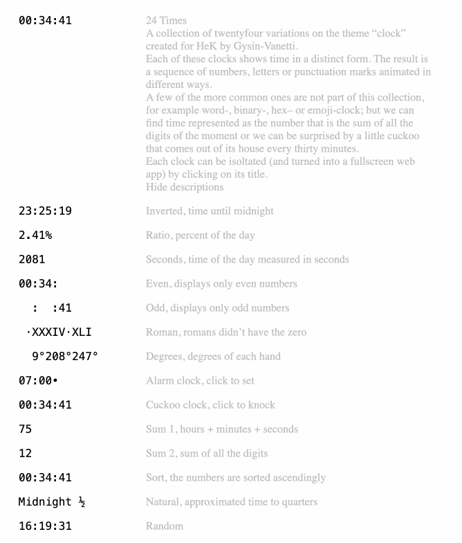

The duo CWANDT ([Che-Wei Wang and Taylor Levy](https://cwandt.com/pages/about)) have made [many unusual digital and mechatronic timepieces](https://cwandt.com/collections/time), including [*Superlocal*](https://cwandt.com/products/superlocal?variant=41099183128732): 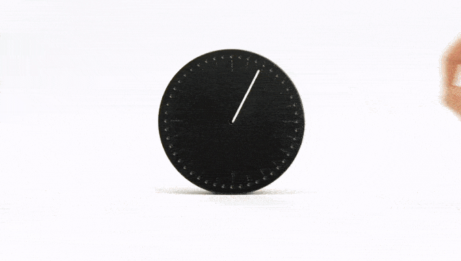

---

Clocks have been an *idee fixé* in new media. Here's the elegant video-slitscan-based [*Last Clock*](https://vimeo.com/27975734), (2002) by Jussi Angesleva & Ross Cooper: [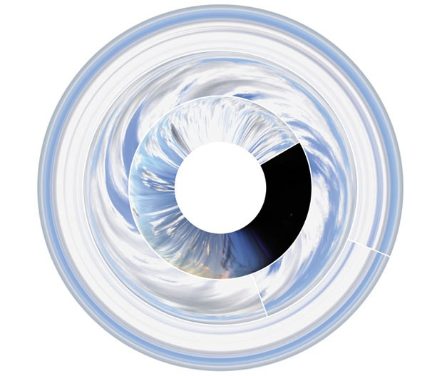](https://vimeo.com/27975734)

[Here's a clock](https://www.openprocessing.org/sketch/503941) I produced as a student of John Maeda in 1999. 

My student Greg Vassallo made this clock for my class in 2005: 
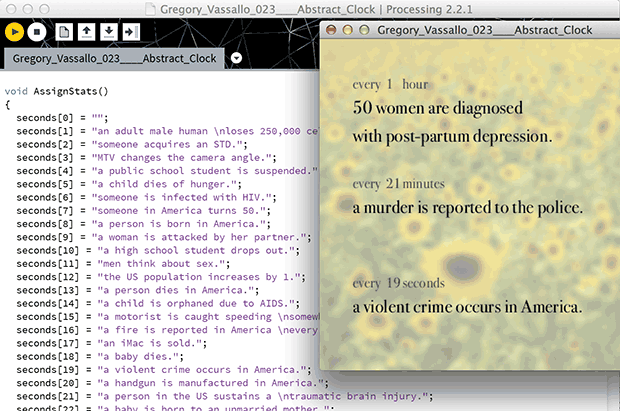
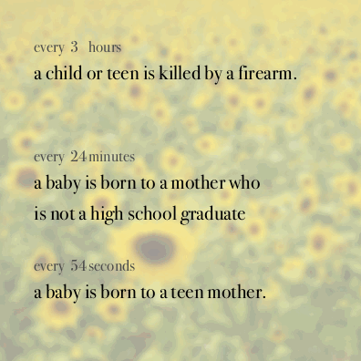

---

### Time, Labor and Human Industry

[*Real Time: Schiphol Clock*](https://vimeo.com/171408075) by Maarten Baas 
[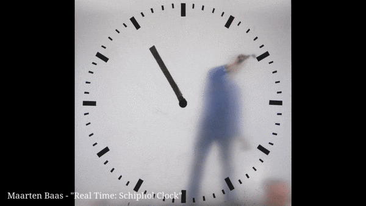](https://vimeo.com/171408075)
[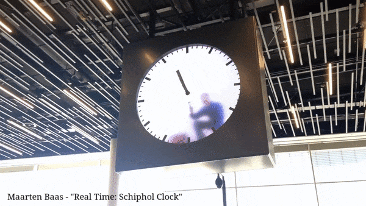](https://www.youtube.com/watch?v=EAax4BSKNQU&t=1m38s)
[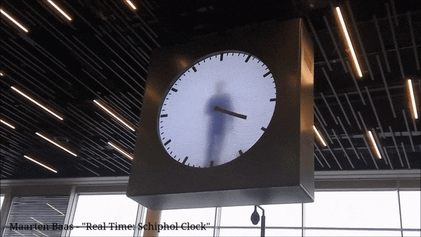](https://www.youtube.com/watch?v=Nt_g8TKihy0&t=0m51s)

[*Sweeper Clock*](https://vimeo.com/11164881) by Maarten Baas 
[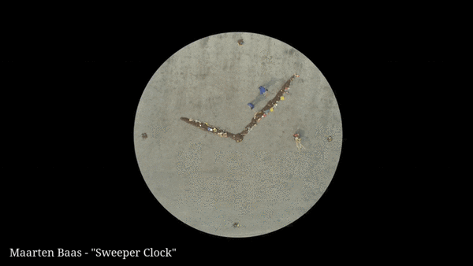](https://vimeo.com/11164881)

[*Standard Time*](https://www.youtube.com/watch?v=81Q3imVqBEk&t=0m12s) by Mark Formanek 
[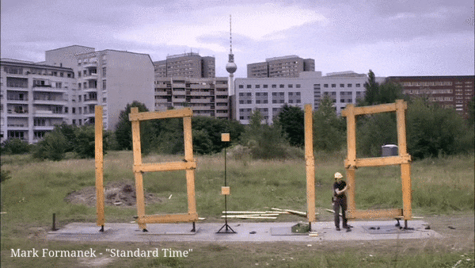](https://www.youtube.com/watch?v=81Q3imVqBEk&t=0m12s)

[*Industrious Clock*](https://www.youtube.com/watch?v=xkAfH11FJDk) by Yugo Nakamura 
[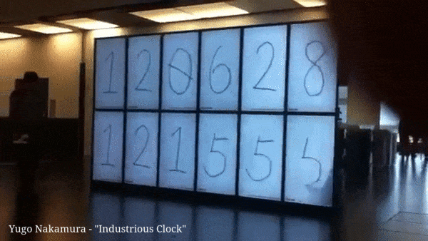](https://www.youtube.com/watch?v=xkAfH11FJDk)

[*Book Clock*](https://www.youtube.com/watch?v=A9M__aTuItY) by Masaaki Hiromura 
[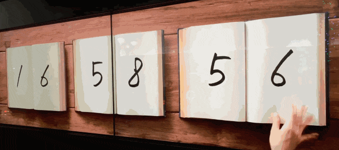](https://www.youtube.com/watch?v=A9M__aTuItY)

### Crowdsourced Clocks

[*All the Minutes*](http://alltheminutes.com/) by Studio Moniker, is a clock which cites tweets that mention the current time. 

The [Human Clock](http://www.humanclock.com/) is a clock made from crowdsourced photographs that feature the current time. 
[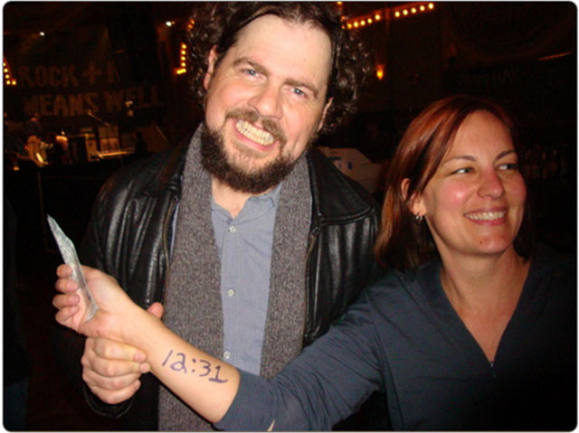](http://www.humanclock.com/)

A well-known ‘crowdsourced’ clock (in a different sense) is Christian Marclay’s [*Clock*](https://www.youtube.com/watch?v=0gSwtr3E4Fo), a 24-hour film made up of about seven thousand clips, each of which either says or displays the (actual) time of day, or which makes a cogent reference to time:

[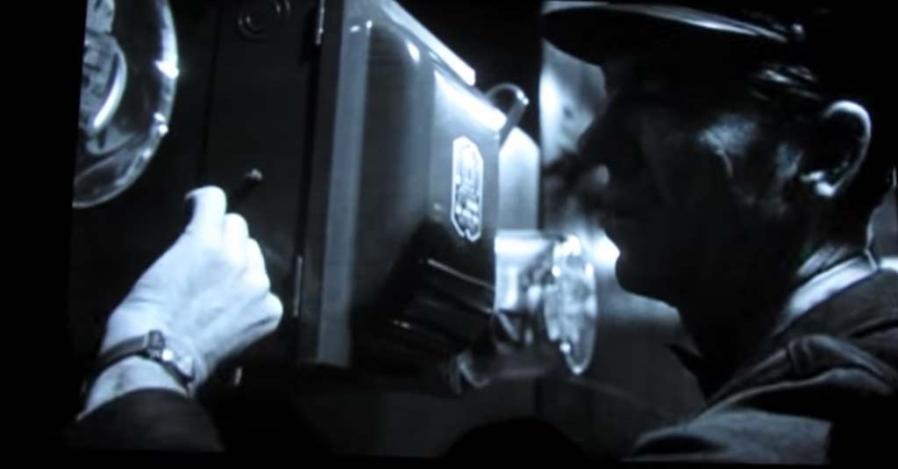](https://www.youtube.com/watch?v=0gSwtr3E4Fo)

---

### Physical Machines & Clock Typography

[*Continue Time*](https://vimeo.com/10800426) by Sander Mulder ([p5 version](https://editor.p5js.org/golan/sketches/xZ618XMCt)) 
[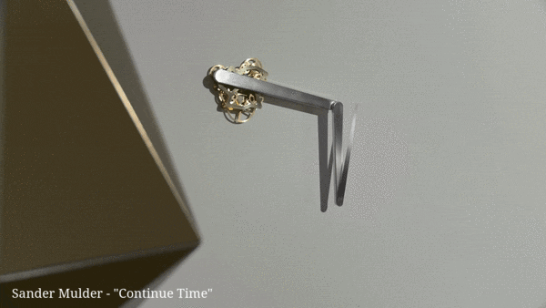](https://vimeo.com/10800426)

[*3.16 Billion Cycles*](https://cwandt.com/products/3-16-billion-cycles) by Che-Wei Wang & Taylor Lev 
[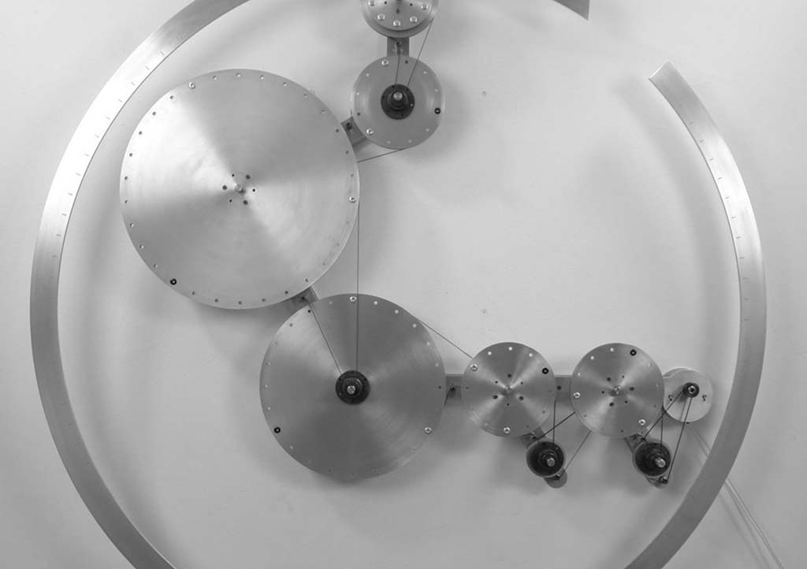](https://cwandt.com/products/3-16-billion-cycles)

[*Digital Sundial*](https://www.youtube.com/watch?time_continue=819&v=wrsje5It_UU) by Mojoptix 
[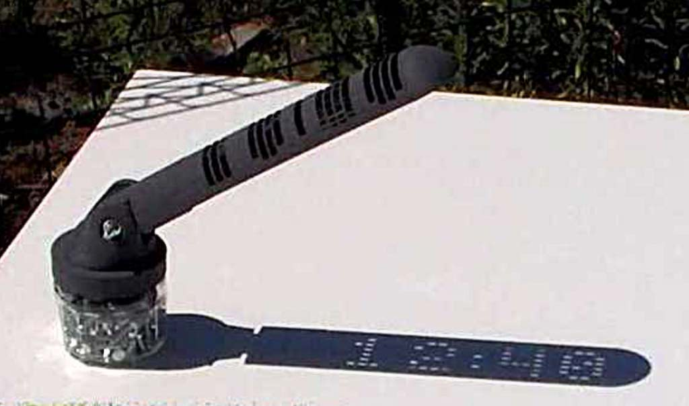](https://www.youtube.com/watch?time_continue=819&v=wrsje5It_UU)

Taiwanese designer Yen-Wen Tseng has designed a clock, [*Hand in Hand*](http://www.dezeen.com/2010/03/26/hand-in-hand-clock-yen-wen-tseng/), where the hands are linked by two pivoting arms: 
[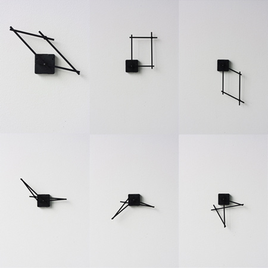](http://www.dezeen.com/2010/03/26/hand-in-hand-clock-yen-wen-tseng/)

[*Water Clocks*](https://vimeo.com/28461780#t=180) by Bernard Gitton (*jump to 3:00*) [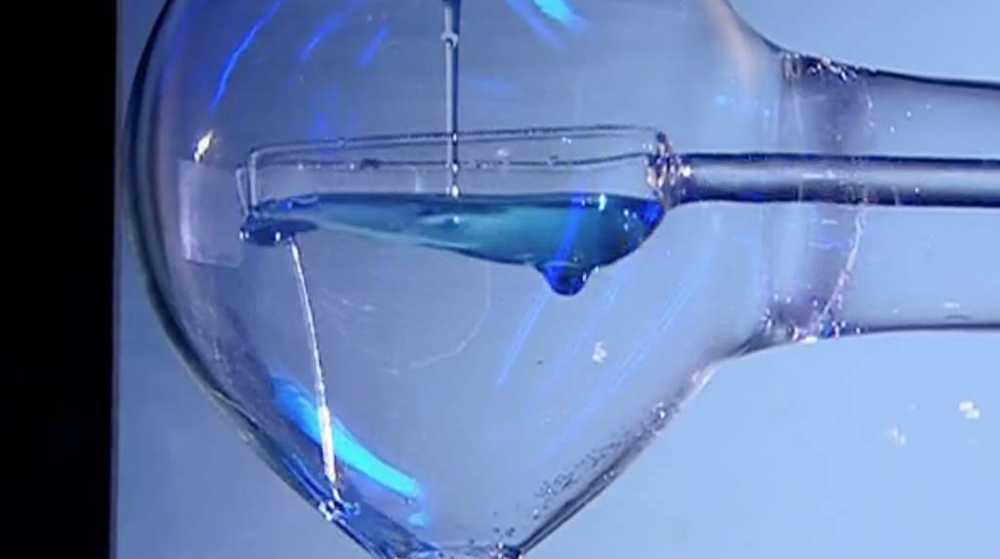](https://vimeo.com/28461780#t=180)

[*Drop Clock*](https://www.youtube.com/watch?v=I32NLiAl9PA&t=0m20s) by Stasean [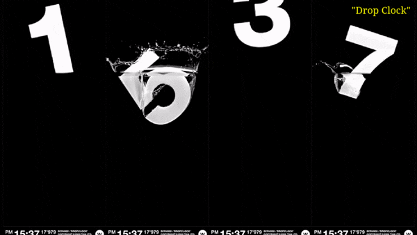](https://www.youtube.com/watch?v=I32NLiAl9PA&t=0m20s)

[*Binary Clock*](https://www.youtube.com/watch?v=-n-ZWACEtoM&t=1m18s) 
[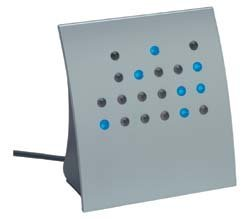](https://www.youtube.com/watch?v=-n-ZWACEtoM&t=1m18s)

[*LEGO Mindstorms Digital Clock*](https://www.youtube.com/watch?v=A_mA72r3ZiQ&t=0m7s) [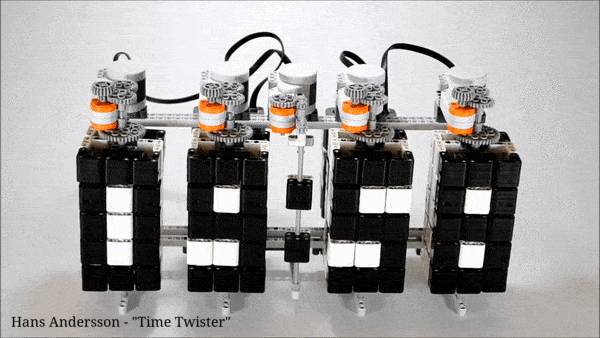](https://www.youtube.com/watch?v=A_mA72r3ZiQ&t=0m7s)

[*Segmentus Clock*](https://www.youtube.com/watch?v=yWma_3koR_M&t=0m17s) by Art Lebedev [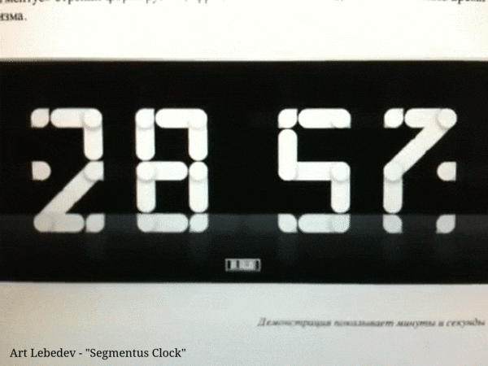](https://www.youtube.com/watch?v=yWma_3koR_M&t=0m17s)

[*Ferrolic*](https://vimeo.com/116510462) by Zelf Koelman 

[*A Million Times*](https://vimeo.com/60491636) by Humans Since 1982 
[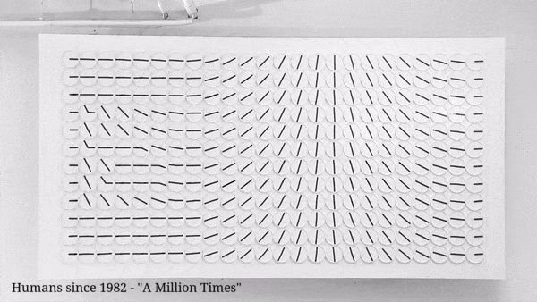](https://vimeo.com/60491636)

[*The Clock Clock*](https://vimeo.com/29319186) by Humans Since 1982 
[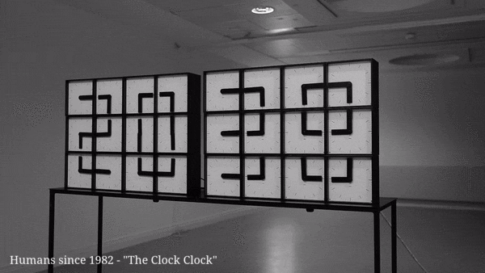](https://vimeo.com/29319186)

[*A Study Of Time*](https://vimeo.com/25087555) by rAndom International 
[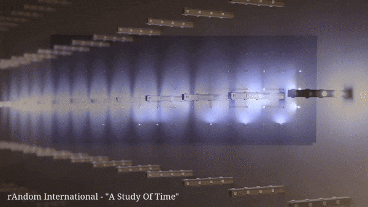](https://vimeo.com/25087555)

[*Wordclock*](https://www.youtube.com/watch?v=zwX95UaKCRg&t=0m46s) 
[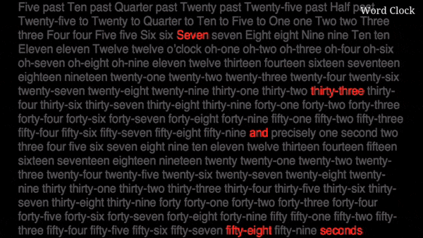](https://www.youtube.com/watch?v=zwX95UaKCRg&t=0m46s)

[*Qlocktwo*](http://www.qlocktwo.com/produktbilder_classic.php?lang=en) by Biegert & Funk selectively illuminates parts of a text image: 

[*It's about time*](https://makezine.com/2007/09/27/clock-tells-time-as-a-con/) by insightoutsight /  Laurence Willmott 
[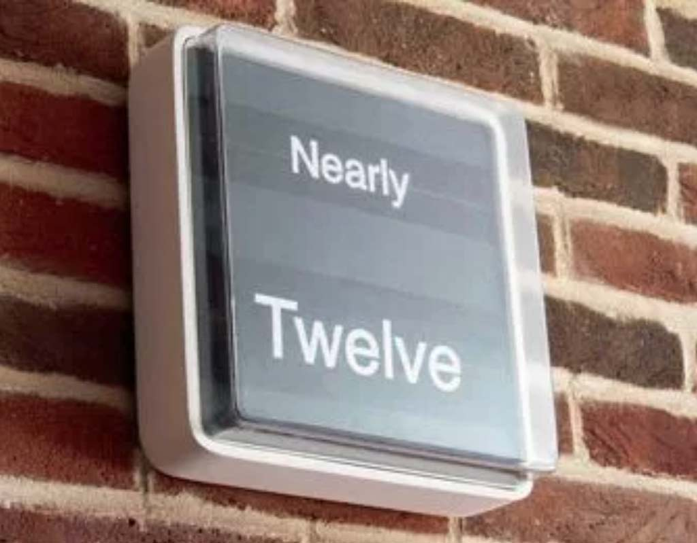](https://makezine.com/2007/09/27/clock-tells-time-as-a-con/)

[*Four Letter Clock*](http://www.skot9000.com/posts/2011/10/17/fourletter.html) by Skot Croshere (SKOT9000), 2011 
[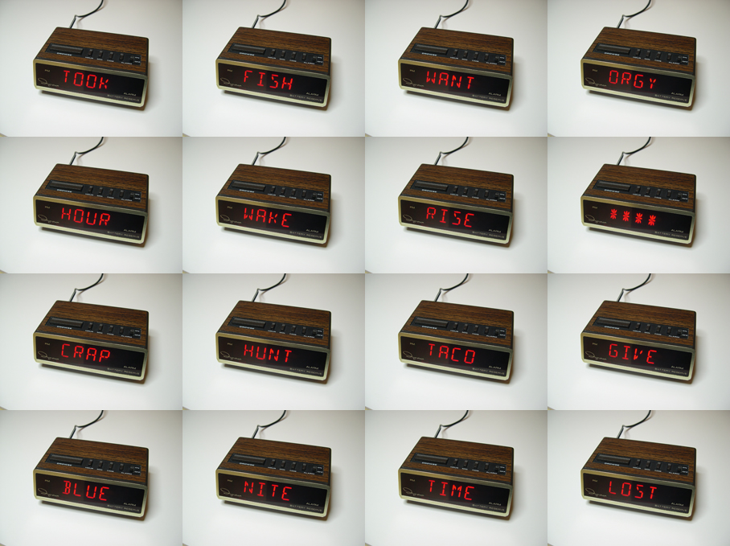](http://www.skot9000.com/posts/2011/10/17/fourletter.html)

---

### New Graphics; New Concepts

[*Ink Calendar*](http://www.oscar-diaz.net/work/ink-calendar) by Oscar Diaz uses capillary action to display the time. 
[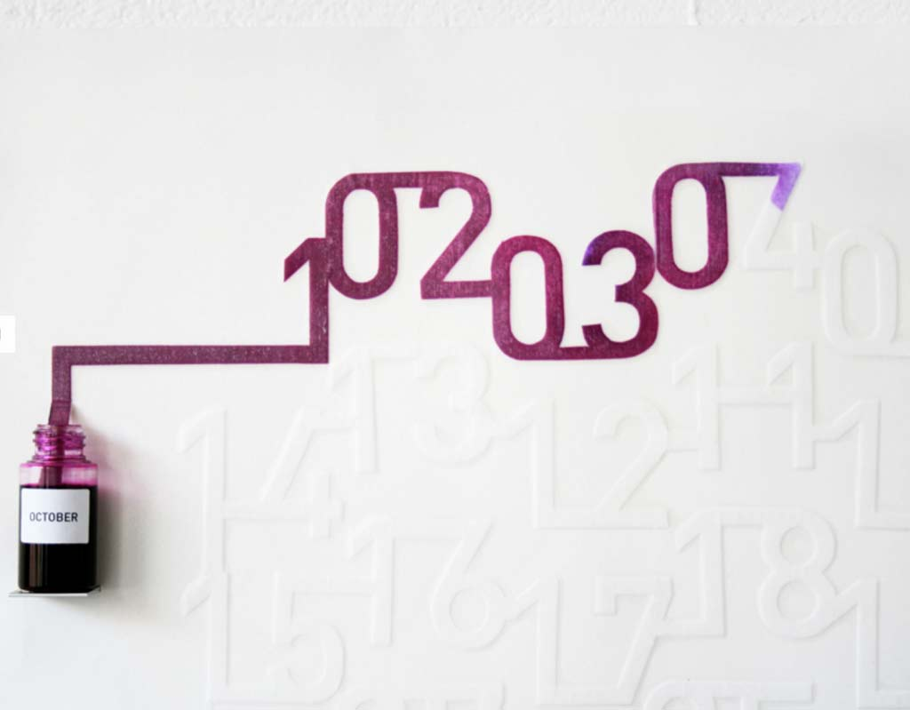](http://www.oscar-diaz.net/work/ink-calendar)

[*A Dot for Every Second in the Day*](http://www.clarifyscience.info/assets/day_of_dots_clock) 
[OpenProcessing Re-Code](https://openprocessing.org/sketch/2018170) 

[*Untitled (For The Sun)*](http://www.jimcampbell.tv/portfolio/objects/untitled_for_the_sun/) by Jim Campbell 
[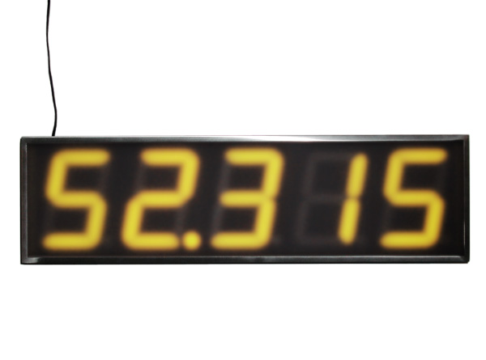](http://www.jimcampbell.tv/portfolio/objects/untitled_for_the_sun/)

[*CRASHCLOCK*](https://www.youtube.com/watch?v=-7YBu3cd9F0&t=0m48s) by Tha 
[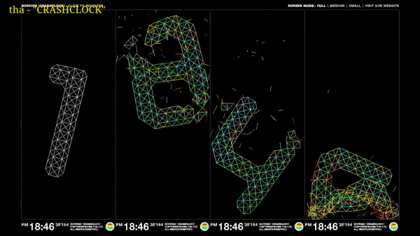](https://www.youtube.com/watch?v=-7YBu3cd9F0&t=0m48s)

[*Horloge Tactile*](https://vimeo.com/37522983) by Eric Morzier 
[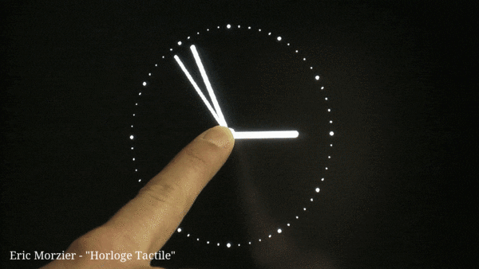](https://vimeo.com/37522983)

[*Pong Clock*](https://www.youtube.com/watch?v=3uQHWsUby04&t=0m18s) 
[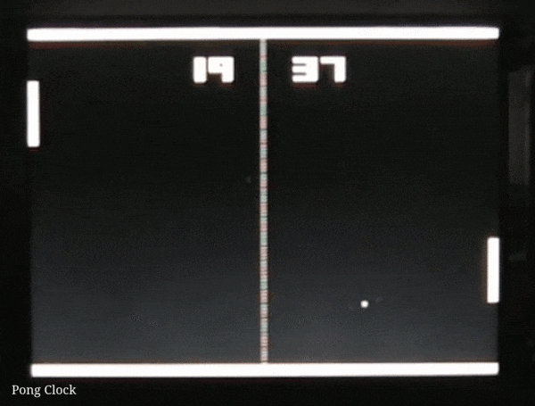](https://www.youtube.com/watch?v=3uQHWsUby04&t=0m18s)

[*Center Clock*](http://leebyron.com/centerclock/) by Lee Byron (2007) 
[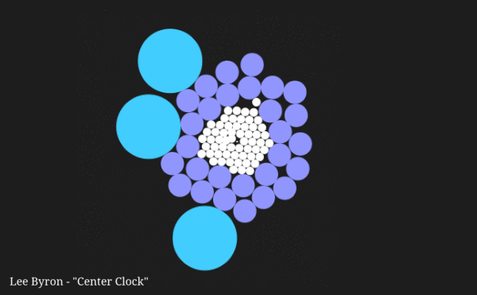](http://leebyron.com/centerclock/)

[*QR Clock*](https://qr-clock.glitch.me/) by QRPlanet 
[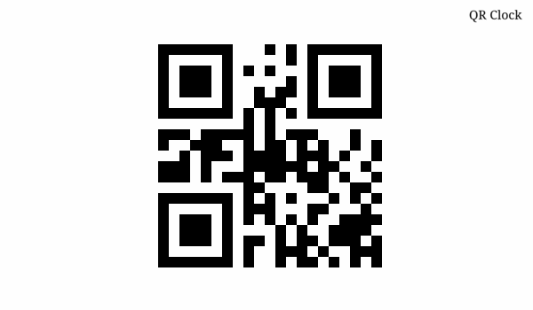](https://qr-clock.glitch.me/)

[*Time Machine*](http://www.todayandtomorrow.net/2013/06/14/time-machine/) by Daniel Duarte 
[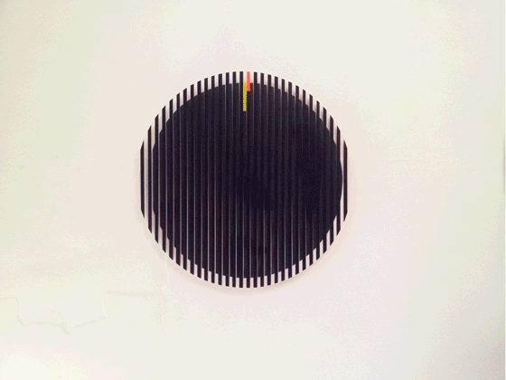](http://www.todayandtomorrow.net/2013/06/14/time-machine/)

[*L'Ora X Clock*](https://www.moma.org/collection/works/3696?locale=en) by Bruno Munari (1945) 

[*Sonicode Clock*](https://vimeo.com/1778777) by Saqoosha 
[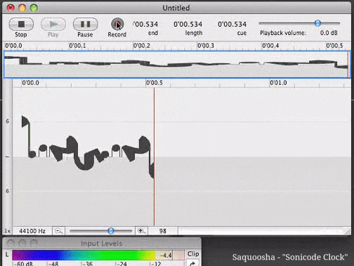](https://vimeo.com/1778777)

[*Last Time*](http://www.alimiharbi.com/work/last-time/) by Ali Miharbi (2009) 
[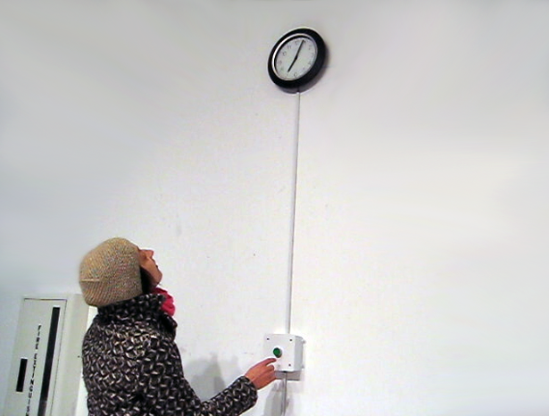](http://www.alimiharbi.com/work/last-time/)

[*Personal Timekeeper*](http://i-s-o-p-t.com/2015/07/21/CircleofMoment/) by Taeyoon Choi & E Roon 
[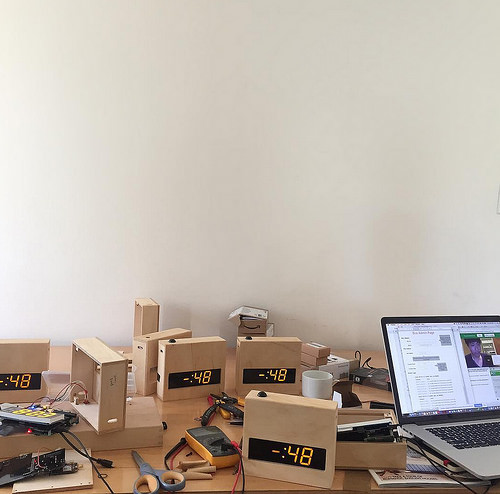](http://i-s-o-p-t.com/2015/07/21/CircleofMoment/)

[*Ten Things I Can Count On*](http://electronicsculpture.brucecannon.org/sculptures/ten_things/ten_things_i_can_count_on.htm) by Bruce Cannon 
[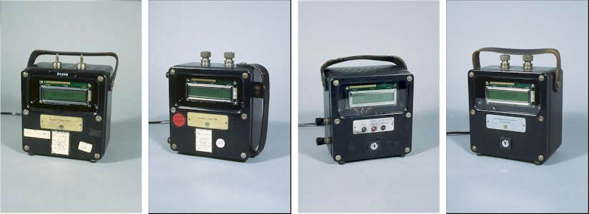](http://electronicsculpture.brucecannon.org/sculptures/ten_things/ten_things_i_can_count_on.htm)

[*Zero Noon*](http://lozano-hemmer.com/zero_noon.php) by Rafael Lozano-Hemmer 
[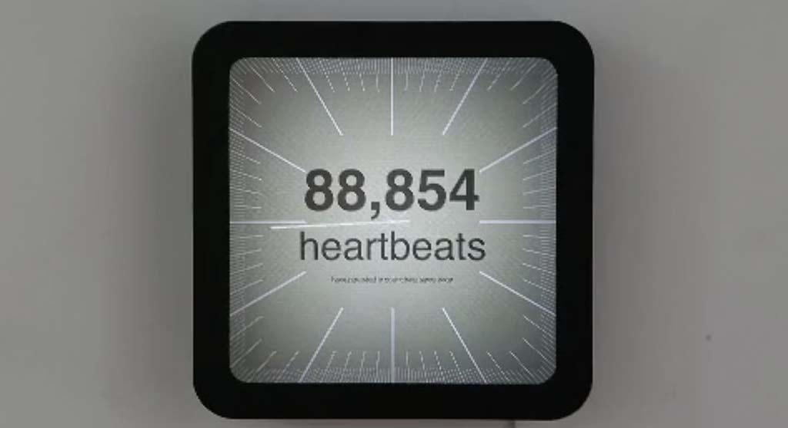](http://lozano-hemmer.com/zero_noon.php)

* [*The Rhythm Of Heart*]() - A metronomic archive of the artists’ heartbeats.
* [Untitled (Perfect Lovers)](https://collections.dma.org/artwork/5324909) - by Félix González-Torres. Two synchronized clocks embody the tension that comes from two people living side-by-side as life moves forward towards death.

In some situations, it may not be necessary for a clock to “work” mechanically in order for it to “operate” powerfully. Below are clocks which are frozen at 8:15am, the moment when the Hiroshima bomb detonated, when Kengo Nikawa’s pocketwatch stopped forever.
[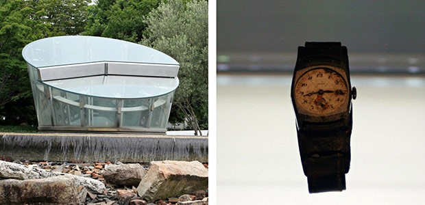]()

In another situation, a clock may simply be working so slowly that it never appears to be working in our lifetime. The *Clock of the Long Now*, designed to last 10,000 years, ticks once per year and chimes once per century. As such, it fosters long-term thinking and remains an important symbol of hope for the future.

[*The Clock of the Long Now*](https://www.youtube.com/watch?v=w9uM6BBKfO8) (10,000 Year Clock)
[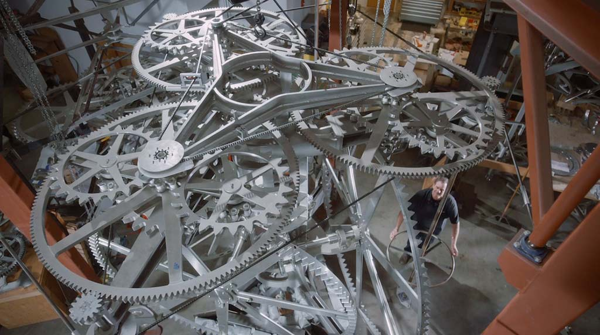](https://www.youtube.com/watch?v=w9uM6BBKfO8)

---

Additional References

* [*Calendar*](https://www.instagram.com/p/DEUzASIoFj-/), 1961-1975, by Walter De Maria (American, 1935 - 2013). Kröller-Müller Museum. 

---

### Landfill

* [Kinetic clock](https://www.instagram.com/reel/DLSIHbfIfGM/?utm_source=ig_web_copy_link)
* [Clocks by Space.Filler.Art](https://www.instagram.com/p/DKqpuZYO4mi/) (Alex Miller) and *[Strange Time](https://strange-time.com/)* exhibition
* [AI Poetry Clock](https://www.kickstarter.com/projects/genmon/poem-1-the-ai-poetry-clock)
* [Flood Fill Clock](https://vimeo.com/16216790), Jurg Lehni, 2008

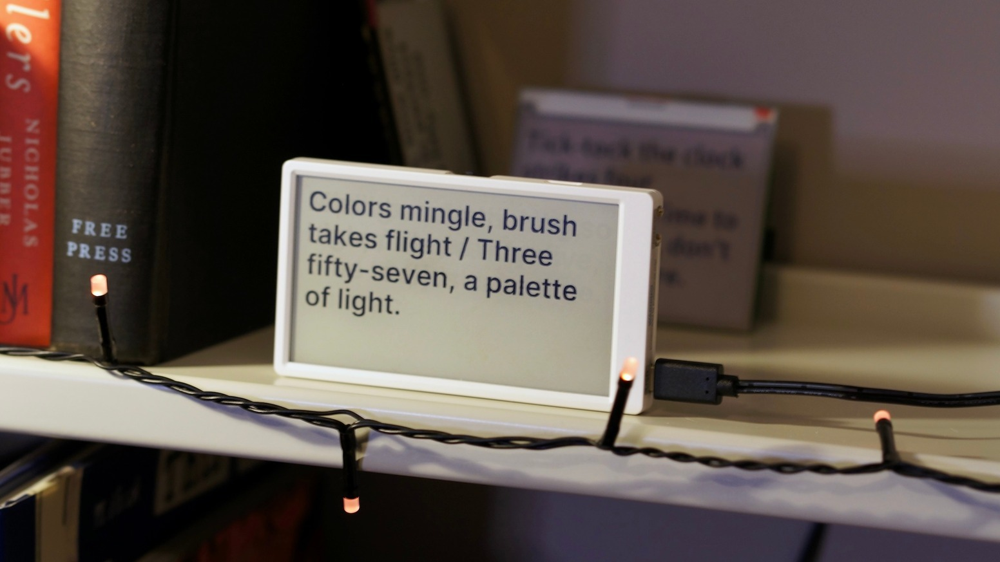

* [Alicja_Kwade-clock.gif](https://alicjakwade.com/exhibitions/against-the-run) - Against the Run and [Gegen den Lauf](https://alicjakwade.com/works/gegen_den_lauf) by Alicja Kwade

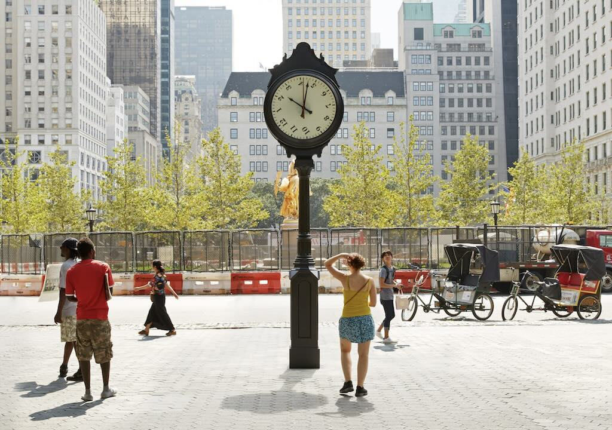

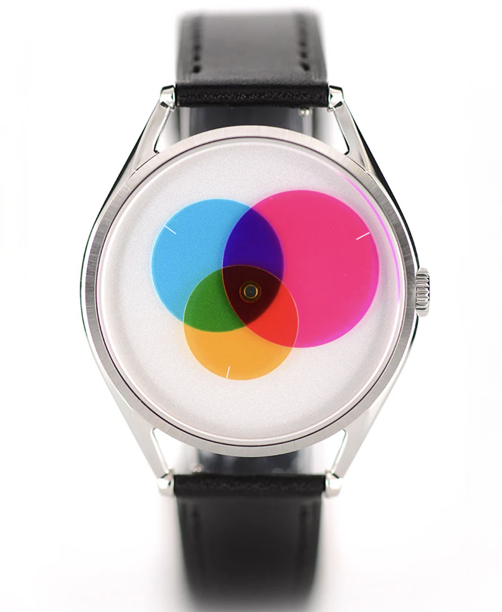

