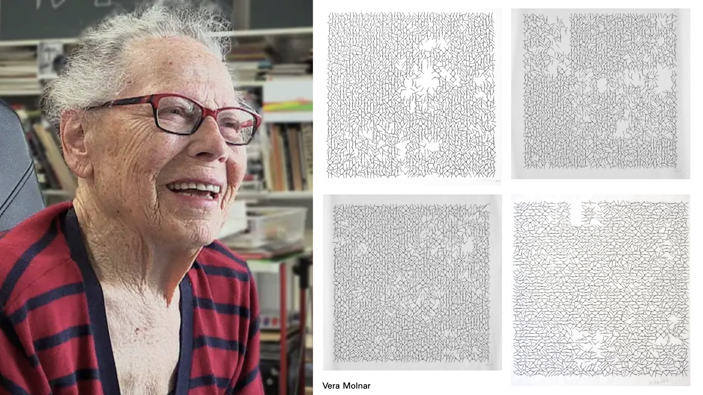
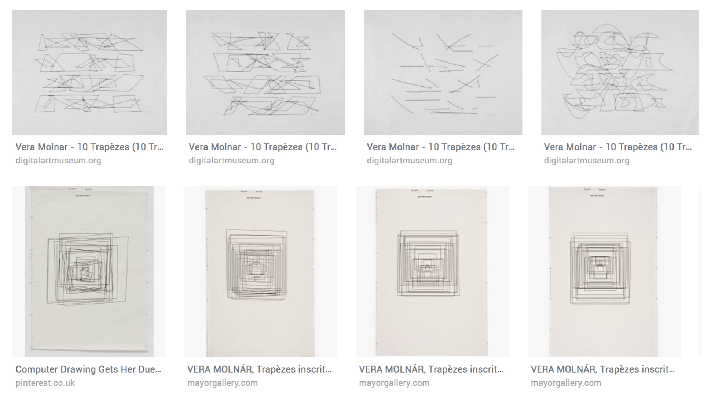
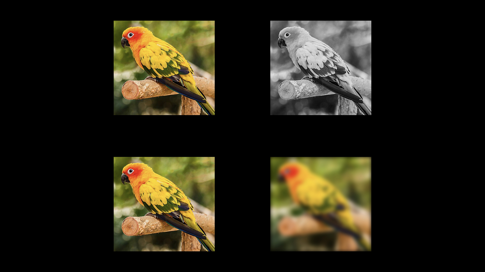
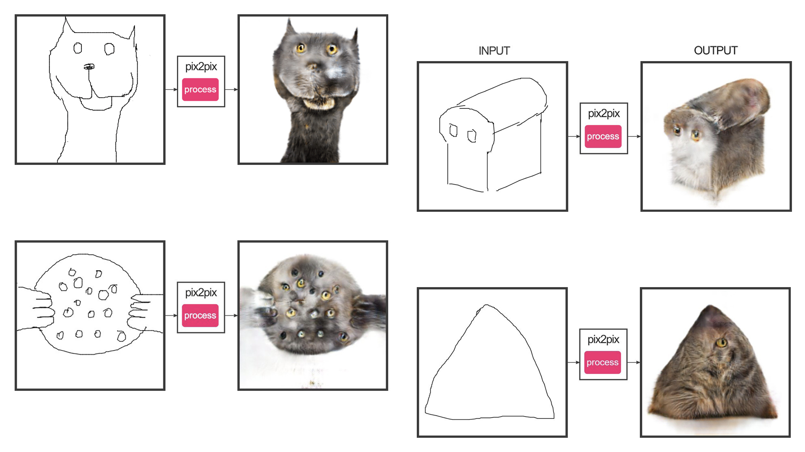
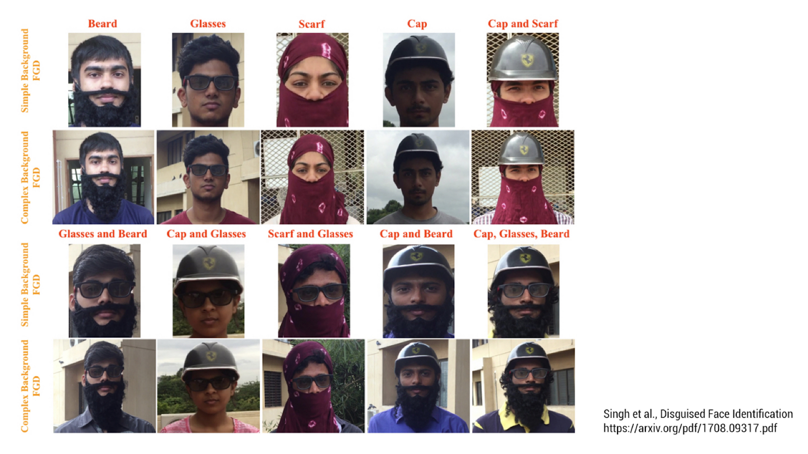
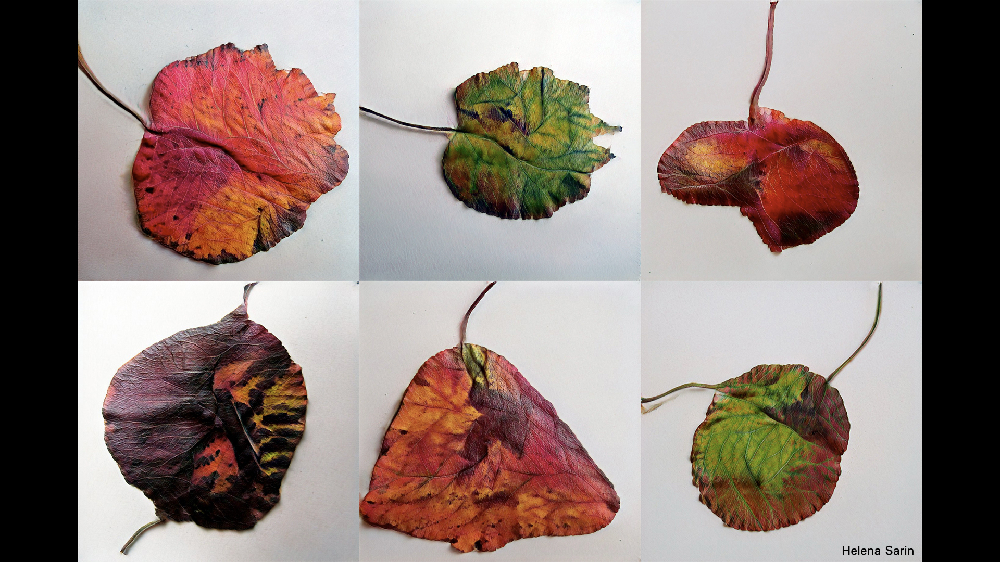
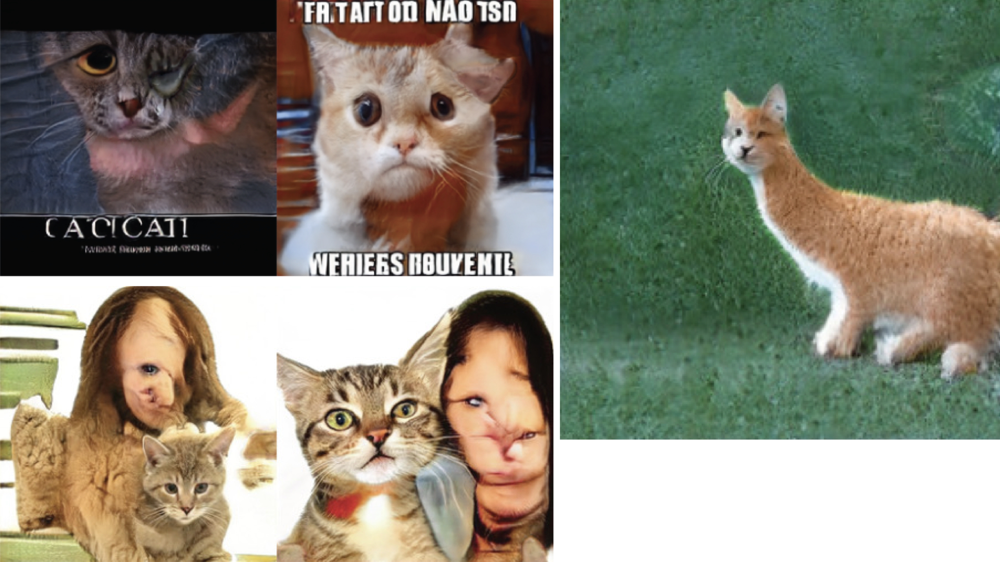
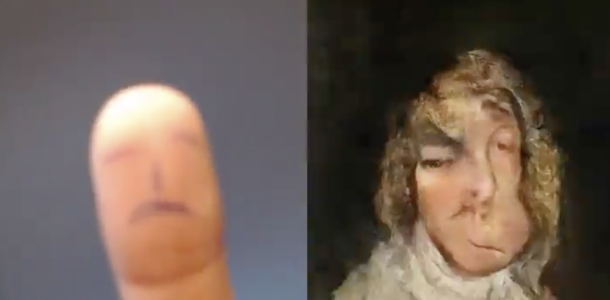

# More Like This, Please

---

Vera Molnár (1924-2024) was a Hungarian-French artist who was one of the first dozen people to make art with a computer. Here you can see four instances of *Interruptions*, one of her generative plotter works from 1968. 

And here’s more of her work, from 1974. Her work is a particularly good example of how generative computer artworks have been made for the past half-century. The artist writes a program that renders a form. This form is parameterized by variables — designed by the artist. Change the values of these variables, and the form changes. The artist may link these variables to randomness, as Molnar does, or perhaps to gestural inputs, or perhaps to a stream of data, so that the form visualizes that data. She has created an artwork (software) that makes artworks (plots). If she want “More like this, please”, she just runs the software again.

Now let's jump forward to how neural nets allow you to make "more like this, please". In one way of working, the artist working with neural networks does not specify the rules. Instead, she specifies inputs and outputs, and allows the network to learn the rules that characterize the transformation — whatever those rules may be. For example, a network might study the relationship between color and grayscale versions of an image, or sharp and blurry versions of an image. Then — because these systems create statistical rules describing the differences between such pairs — remarkably, these networks can run these rules *backwards*: They can (apparently) realistically colorize black-and-white images, or produce sharp, high-resolution images from low-resolution ones. When the algorithms need to invent information to do this, they do so using statistically-likely inferences (hallucinations) informed by thousands or millions of examples. 

I’d like to present you a good example of this, and something fun you can experiment with yourself at home. This is a program called Edges2Cats (in 2017; now reimplemented as [*Doodle to Pictures*](https://mitmedialab.github.io/GAN-play/)) by Christopher Hesse. In this project, Hesse took a large number of photographs of cats. He ran these through an edge-detector, which is a very standard image processing operation, to produce images of their outlines. He trained a network to understand the relationship between these image pairs. And then he created an interaction where you can run this relationship backwards: Draw an outline, and the program fills it in with a cat. You don’t even have to draw a cat shape! As an open-ended system this is a small masterpiece. The demo has moved [here](https://mitmedialab.github.io/GAN-play/).

Technically speaking, the computer is filling in the edges with colors that are statistically likely. Critically speaking, it's worth pointing out that the *likelihood* of these hallucinations is also what causes so much AI-generated art to be normative *slop*, since it only produces likely outcomes. It becomes a challenge to push these results towards the periphery. 

The evil twin of Edges2Cats is a defense-funded research project like this one, for occluded or disguised face recognition. These researchers have trained their network on pairs of images: your face, and your face with a disguise — in the hope of running that network backwards: See someone with a disguise, and guess who it is. I don’t want to dwell on the surveillance state right now, but like it or not, the funders of work like this are inadvertently making interesting art possible. In the words of Allison Parrish, "Art is the only ethical application of AI". 

In this piece from 2017, Helena Sarin has trained a neural network on about 1000 images of leaves from her backyard. Sarin used an older technique called a GAN, or generative adversarial network, in which two subsystems of software fight against each other, like a counterfeiter and a cop. Sarin's *generator* attempts to synthesize a leaf-like image; the *discriminator* then attempts to determine whether or not it is a real image of a leaf. Based on the discriminator's decisions, the generator improves its fakes, eventually creating such good leaves that the discriminator can't tell real from fake.

As with 'traditional' generative art, computational artists using machine learning continue to develop programs that render an infinite variety of forms, and these forms are still characterized (or parameterized) by variables. The difference is that the variables are no longer designed directly by the artist. Instead, the variables are now deduced indirectly and automatically from the training data that the artist provides. Thus machine learning is *programming with examples, not instructions*. What’s especially interesting is that these variables often control perceptually higher-order properties. The artist’s job becomes one of selecting, creating, and curating training sets.

It’s worth pointing out that when training sets are too small, the synthesized results can show **biases** that reveal the limits to the data on which it was trained. For example, here are results from a network, trained by artist-researcher Janelle Shane, that synthesizes realistic cats. But many of the cat images in the training dataset were from memes. And some cat images contain people… but not enough examples from which to realistically synthesize one. Janelle Shane points out that the shapes of cats, in particular, are also extremely variable. When the training sets can’t capture that variability, other misinterpretations show up as well.

 

Another way of thinking about such systems is that one image can be used to *guide* the synthesis of another. In [Learning to See](https://www.memo.tv/portfolio/learning-to-see/) (2017) • [(video)](https://vimeo.com/260612034), Memo Akten uses input from a webcam to *interactively* shape the response from a GAN, as it tries its hardest to replicate the camera view given what it has learned about images — in this case, a dataset of stormy ocean photos. 

A similar project is Mario Klingemann's interactive 
[Fingerplay](https://twitter.com/quasimondo/status/982711735001010176) (2018). The neural network has been trained exclusively on 18th-century European portraits.

---