# Creature / Automaton

---

For thousands of years, people have imagined creating life from non-life: golems, automatons, mechanical animals, and now digital organisms. These works reveal a recurring desire: to build entities that move, respond, adapt, and surprise us.

In this lecture, we’ll look at how artists, designers, and scientists have created computational creatures—systems that behave as if alive. Some works use mechanics, some use algorithms, and others use evolution, biofeedback, or interactivity. The common thread is not realism, but *behavior*: lifelike motion, reaction, intention, or autonomy emerging from rules and interactions.

Your challenge as creators will be to think like a world-builder and a biologist:

* Define a body (form, material, constraints)
* Define a mind (rules, sensors, reactions)
* Define an environment (inputs, pressures, social or physical context)

Then let go: allow *emergence*, not scripts.

What makes artificial life compelling is not how it looks, but how it *acts* and *responds*. We’re not animating puppets—we’re designing systems that produce their own behaviors. 

---

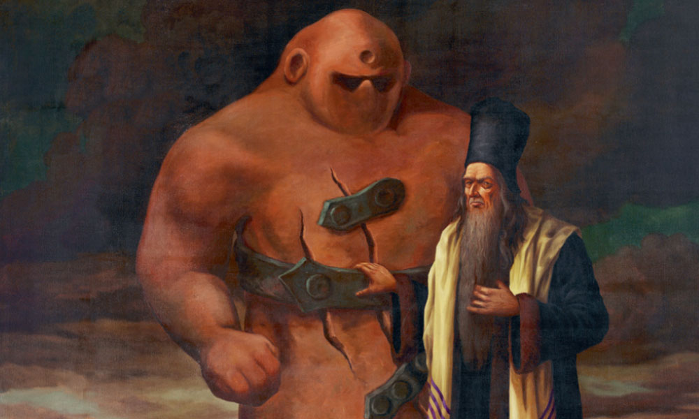

The original Frankenstein's monster: In medieval Jewish folklore, the golem is a powerful but erratic humanoid formed from from inanimate matter (usually clay or mud) and brought to life through Kabbalistic magic. While the golem is often created with good intentions, or even to save the Jews, ultimately it runs amok and must be destroyed.

---

[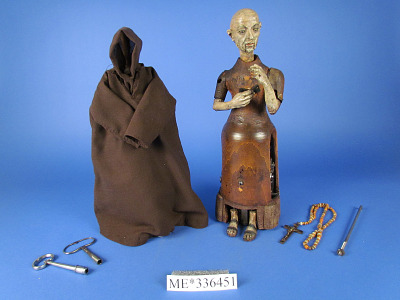](https://www.youtube.com/watch?v=kie96iRTq5M)

Radiolab, [A Clockwork Miracle](https://www.wnycstudios.org/podcasts/radiolab/articles/radiolab-clockwork-miracle) (2011)

[Automaton friar in action](https://www.youtube.com/watch?v=kie96iRTq5M) (YouTube)

This is an automaton made c.1560 in the figure of a friar. Fully operational, the figure walks in a trapezoidal pattern; moves both arms (right arm strikes chest in “mea culpa” and left arm raises rosary to lips); moves eyes side to side; opens and closes mouth; and turns head.

---

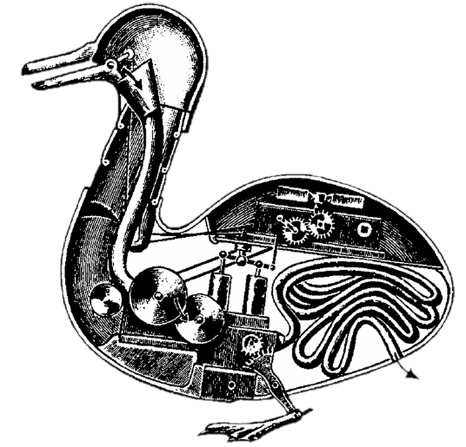

Vaucanson’s *Digesting Duck* (1739):

> “The Canard Digérateur, or Digesting Duck, was an automaton in the form of a duck, created by Jacques de Vaucanson and unveiled on May 30, 1739 in France. The mechanical duck appeared to have the ability to eat kernels of grain, and to metabolize and defecate them. While the duck did not actually have the ability to do this–the food was collected in one inner container, and the pre-stored feces were “produced” from a second, so that no actual digestion took place–Vaucanson hoped that a truly digesting automaton could one day be designed.”

---

[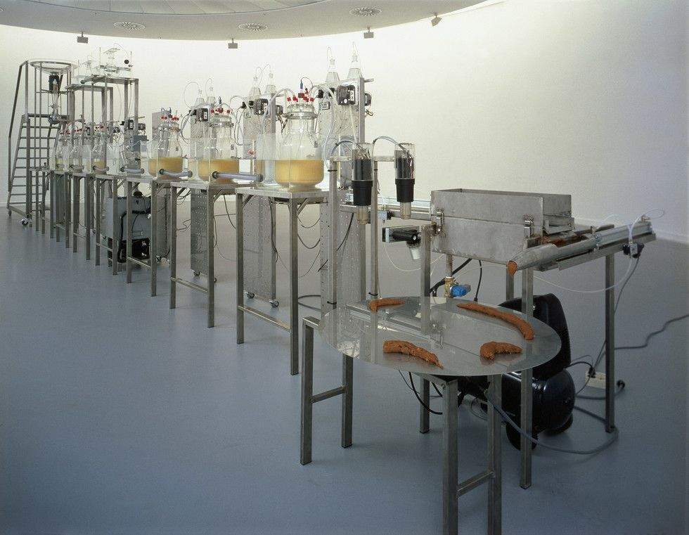](https://www.youtube.com/watch?v=VdlLBWymnUA)

Wim Delvoye's [*Cloaca*](https://www.youtube.com/watch?v=VdlLBWymnUA) (2000-2007) is a provocative bio-mechanical artwork that mimics the human digestive system. Using pumps, enzymes, and bacteria, it processes food into an output which is chemically indistinguishable from feces. Delvoye freeze-dries and sells the machine's output.

---

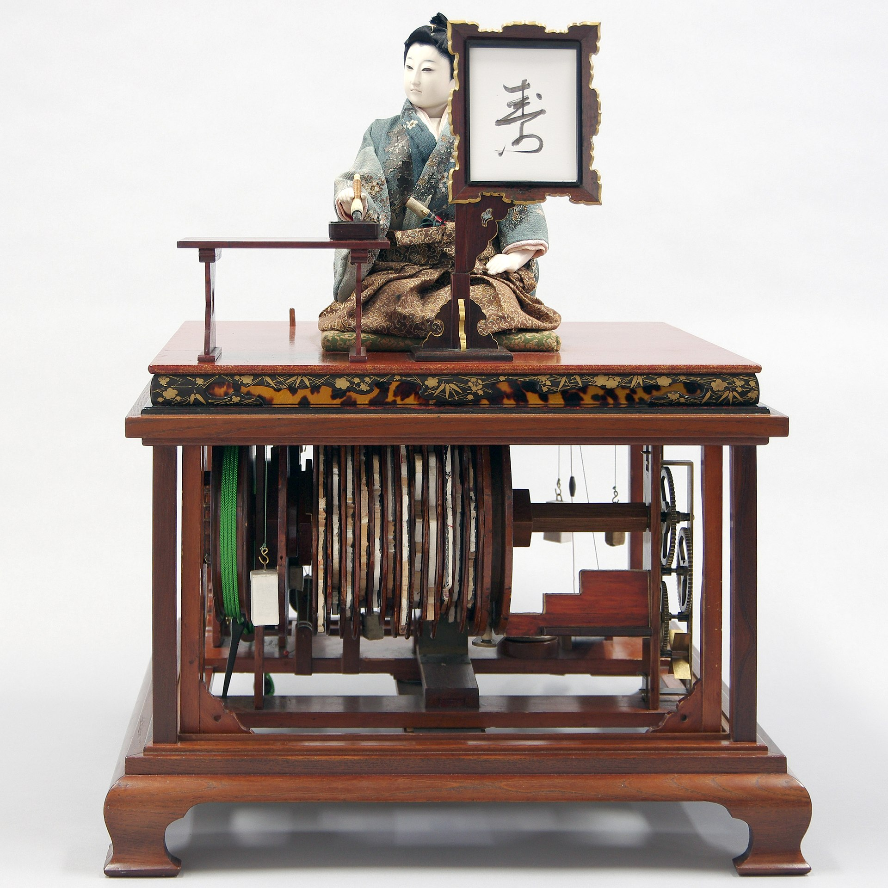

*Karakuri* puppets are traditional Japanese mechanized puppets or automata, made from the 17th century to the 19th century. Around 1875, Tanaka Hisashige, the founder of Toshiba, gained a reputation by making technically sophisticated karakuri puppets. Considered the “Japanese Edison”, one of his masterpieces is Moji-kaki doll (letter-writing doll), which dips a brush into ink and writes characters on paper.

---

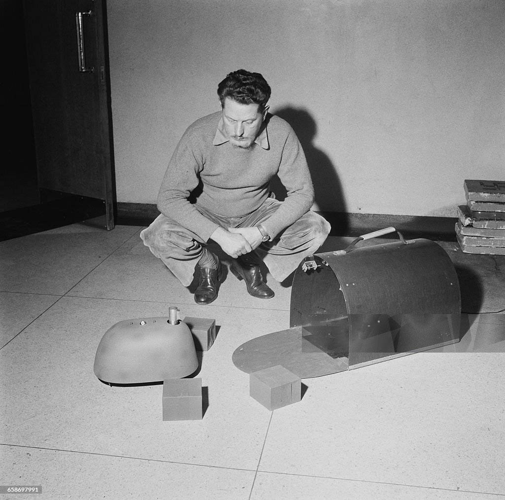

Neurophysiologist William Grey Walter’s “tortoises” of 1948–1949 were early electronic robots capable of phototaxis and object avoidance.

---

[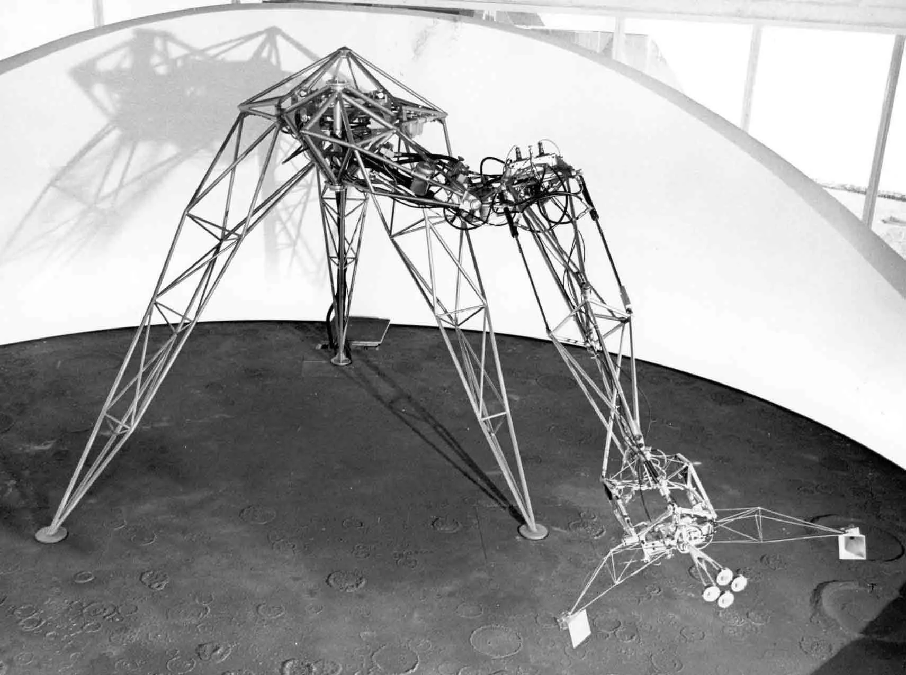](https://www.youtube.com/watch?v=wY85GrYGnyw)

Edward Ihnatowicz's [*Senster*](https://www.youtube.com/watch?v=wY85GrYGnyw) (1970) was a pioneering interactive robotic sculpture that reacted to sound and motion using microphones, hydraulics, and computer control. This large, animal-like structure gently moved toward calm voices and recoiled from loud noise. More information: 

* [More information](http://www.senster.com/ihnatowicz/senster/index.htm.)
* [Another YouTube video](https://www.youtube.com/watch?v=hoZb5MTKzQc)
* [Article](https://www.katevassgalerie.com/blog/the-senster-by-edward-ihnatowicz)

---

John Conway’s *Game of Life* (1970) is a famous cellular automaton played on an infinite grid of square cells that are either “alive” or “dead.” Each turn, cells live, die, or are born based on simple rules about their neighbors. Although the rules are minimal, the system produces surprisingly complex, emergent patterns—some stable, some chaotic, and some that move or replicate. The rules per generation are:

* **Survival**: A live cell stays alive with 2 or 3 live neighbors.
* **Birth**: A dead cell becomes alive with exactly 3 live neighbors.
* **Death**: Otherwise, a live cell dies (from loneliness or overcrowding).

---

Valentino Braitenberg’s *Vehicles* (1984) is a thought experiment in which simple imaginary robots, equipped with only basic sensors and motors, appear to exhibit complex behaviors like fear, aggression, or love. Braitenberg shows how rich, lifelike behavior can emerge from minimal rules, influencing ideas in robotics, neuroscience, and artificial life.

---

[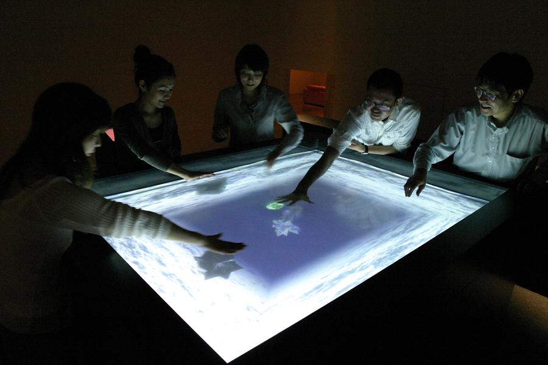](https://www.youtube.com/watch?v=0WG45k93pCA)

Christa Sommerer & Laurent Mignonneau, [*A-Volve*](https://www.youtube.com/watch?v=0WG45k93pCA) (1994)
lets people draw a creature on a touch screen and watch it come to life in a pool of virtual water. The creature swims, competes, and “evolves” with others based on its shape and behavior, showing a simple, interactive version of digital evolution.

---

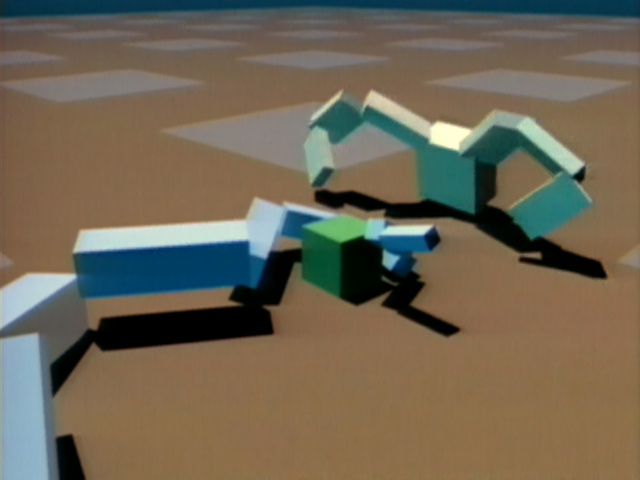

Karl Sims' [*Evolved Virtual Creatures*](https://www.youtube.com/watch?v=RZtZia4ZkX8) (1994) used evolutionary algorithms to grow digital organisms with bodies and behaviors shaped by natural selection. Competing in tasks like swimming or jumping, the creatures developed surprising locomotion strategies. The project demonstrated how evolution and simulation can generate inventive forms and motions beyond human design.

---

[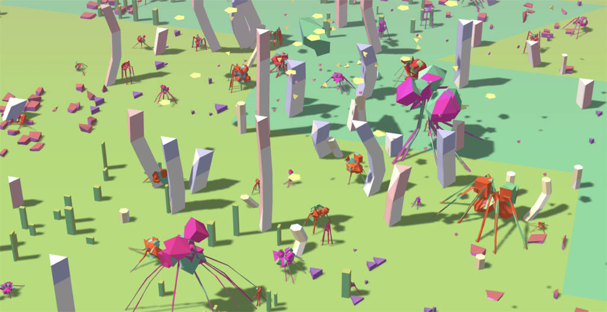](https://demo.marpi.pl/ocean_desert/)

Marpi Studio's [*Terrarium*](https://demo.marpi.pl/ocean_desert/) is an interactive 3D ecosystem that runs in the browser. Users introduce plants and creatures into stylized environments, then watch them move, grow, and react over time. The piece combines WebGL graphics, procedural animation, and simple ecological rules to create a living digital world that invites open-ended play and observation.

---

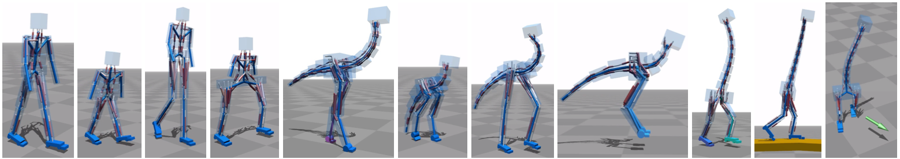

Thomas Geijtenbeek, [*Simulated Bipedal Locomotion*](https://www.youtube.com/watch?v=GqVuV7Khiag) (2013)

---

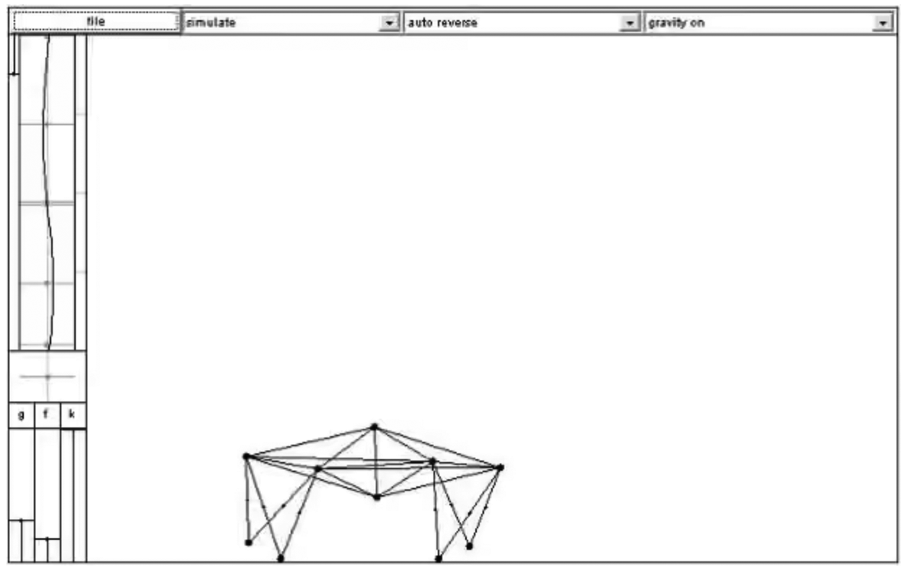

Ed Burton's [SODA Constructor](http://panoramx.ift.uni.wroc.pl/~maq/lovesoda/0.36beta.html) (1998) was a browser-based toy for building creatures from masses and springs. Users assembled simple stick-like bodies, adjusted spring rhythms as “muscles,” and then watched their inventions walk, wobble, or collapse under physics simulation. It introduced many people to playful, hands-on experimentation with dynamics and locomotion.

---

Ulrike Gabriel, [*Terrain 01*](https://vimeo.com/52840915) (1994)

---

[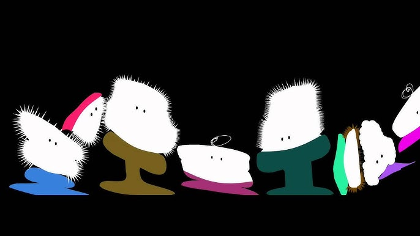](https://www.youtube.com/watch?v=g20QOQP6kSU)

Karsten Schmidt & Matt Pyke, [*Nokia Friends*](https://www.youtube.com/watch?v=g20QOQP6kSU) (2008) created a series of lively, generative “creatures” used in a Nokia campaign.

---

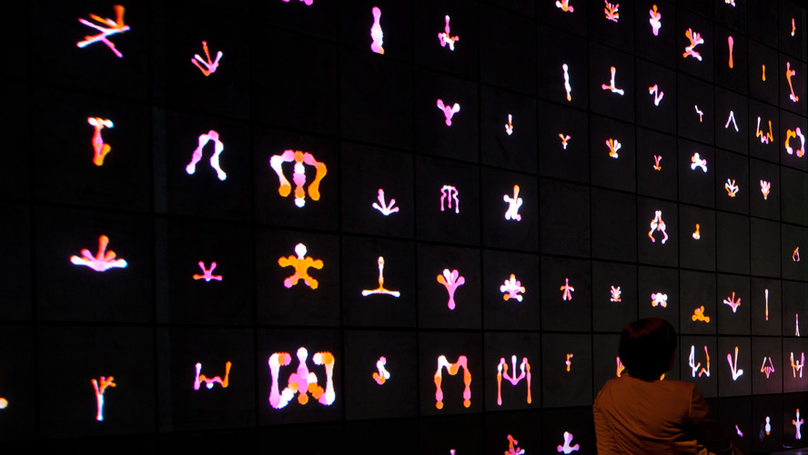

Field.IO (Vera-Maria Glahn & Marcus Wendt), [*Communion*](https://vimeo.com/28227109) (2011) is a generative audiovisual installation based on swarm algorithms. Thousands of particles follow simple behavioral rules, producing computational group motions. [More](https://field.io/work/communion)

---

[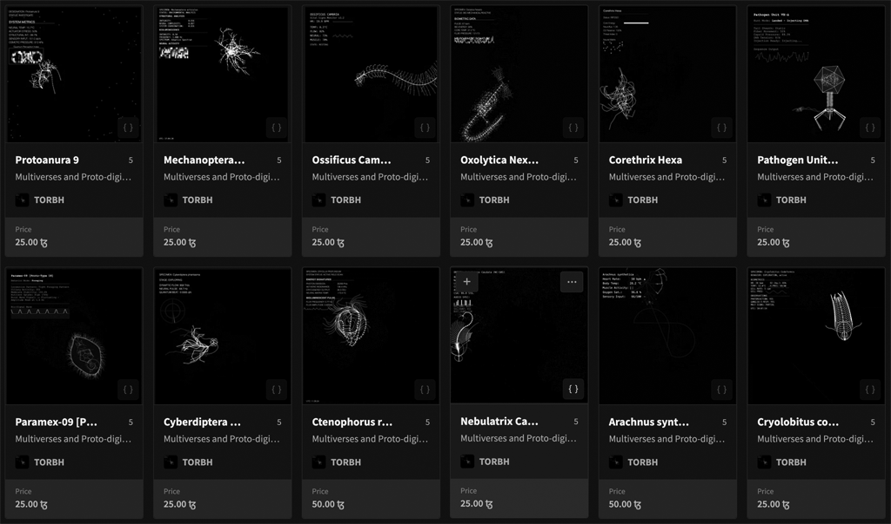](https://objkt.com/collections/KT1UjfWkQWZGBwEp1A9hPyGgpa9JbJ2hvxsP)

[Multiverses and Proto-Digital Entities](https://objkt.com/collections/KT1UjfWkQWZGBwEp1A9hPyGgpa9JbJ2hvxsP) by TORBH, 2025.

---

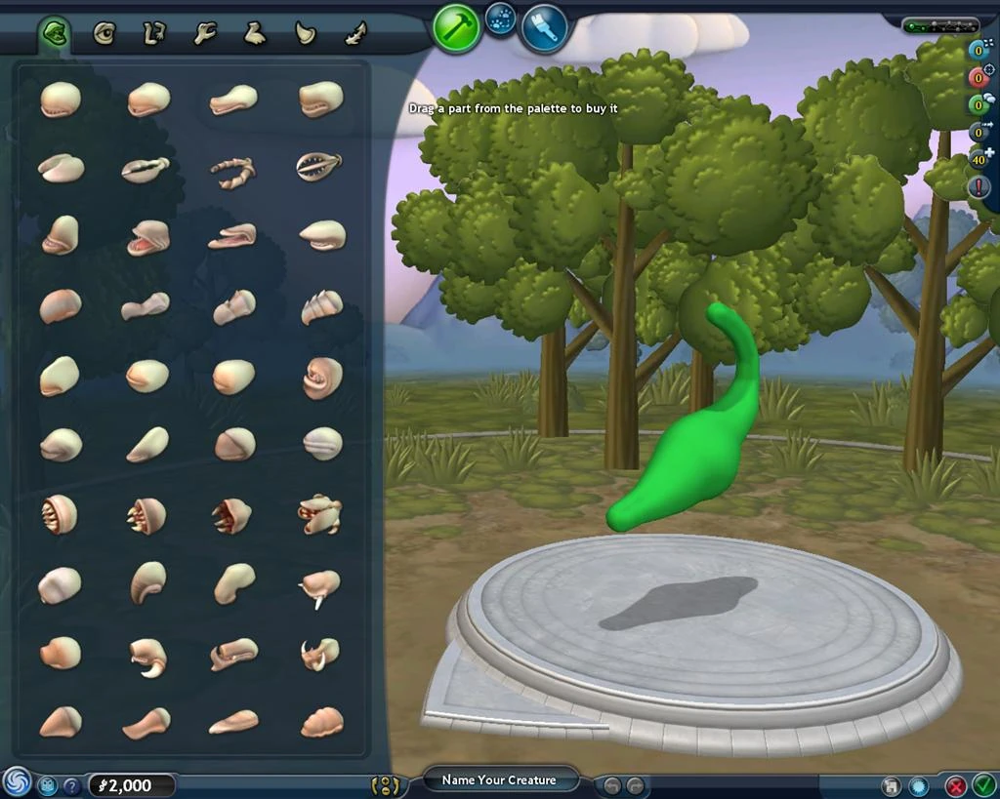

Will Wright & Chaim Gingold, [*Spore Creature Creator*](https://www.youtube.com/watch?v=8PXiNNXUUF8&t=22s) (2006) is a 3D editor that lets players design creatures by assembling modular body parts. The system automatically rigs and animates the results, allowing any shape to walk, emote, and behave, demonstrating procedural animation and user-driven character creation.

---

[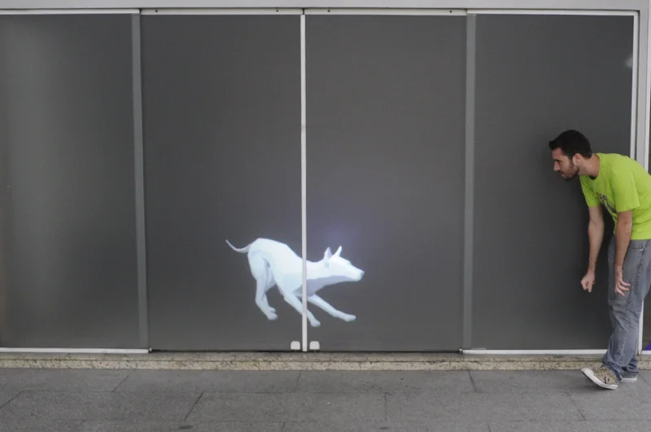](https://vimeo.com/13791894)

Karolina Sobecka's [*Sniff*](https://vimeo.com/13791894) (2013) is an interactive projection in a storefront window. As viewers walks by the projection a dog follows them, dynamically responds to their gestures and changes his behavior based on the state of engagement with the viewers.

---

[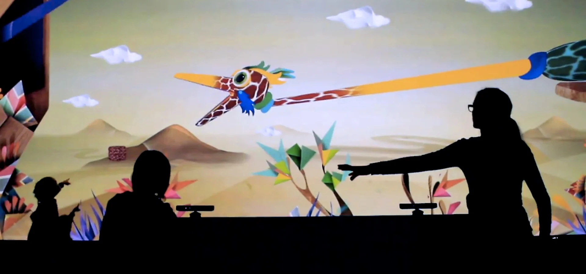](https://vimeo.com/34824490)

Design-IO (Emily Gobeille & Theo Watson)'s [*Puppet Parade*](https://vimeo.com/34824490) (2012) was an interactive installation that allows children to use their arms to puppeteer larger than life projected creatures. [More](https://www.design-io.com/projects/puppetparade)

---

[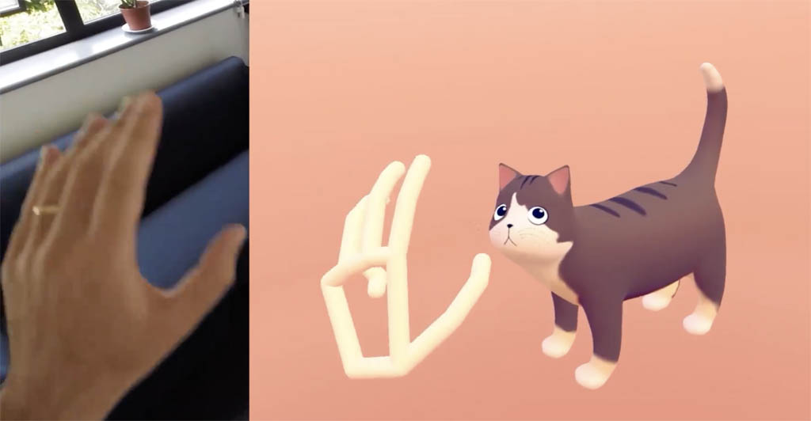](https://www.youtube.com/watch?v=9KCA44GZRQg)

LeapMotion *Cat Explorer* (2018)

---

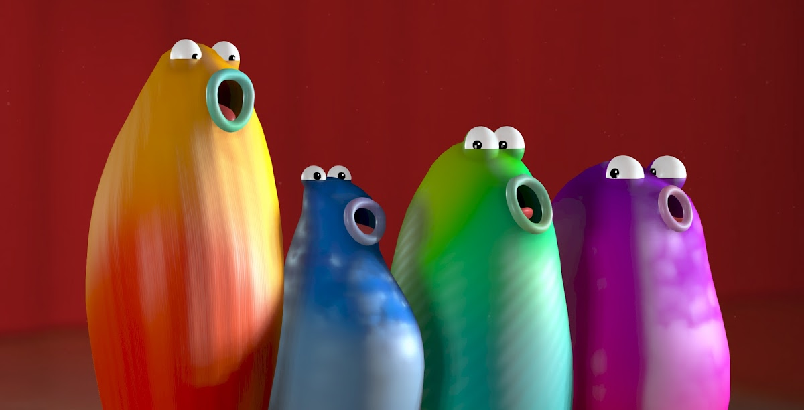

David Li's [*Blob Opera*](https://artsandculture.google.com/experiment/blob-opera/AAHWrq360NcGbw?cp=e30.) (2020) is a playful Google experiment where users drag four singing “blob” characters to control pitch and vowel sounds. A machine-learning model, trained on opera voices, handles harmony and expression, letting anyone create musical performances without musical training.

---

[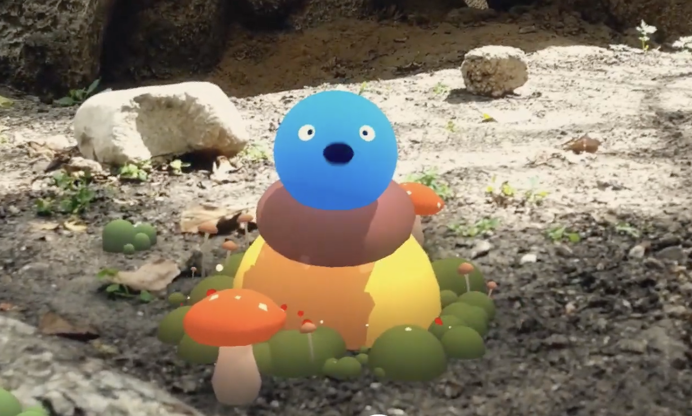](https://youtu.be/d90F-61T6KQ)

Nicole He & Eran Hilleli's [*Garden Friends*](https://youtu.be/d90F-61T6KQ) (2018): Garden Friends is an experiment in which you help grow personalized trees and flowers through a conversation with a quirky character. 

---

[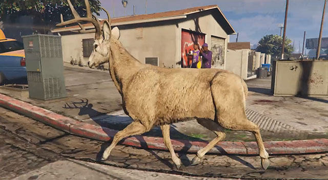](https://bwatanabe.com/GTA_V_WanderingDeer.html)

Brent Watanabe's [*San Andreas Deer Cam*]() (2019) was a modification of Grand Theft Auto that creates and follows a deer wandering through the fictional state of San Andreas. The deer character is autonomous and will wander and respond to its surroundings, interacting with the existing GTA V artificial intelligence. The piece was presented as a live stream on sanandreasanimalcams.com.

---

[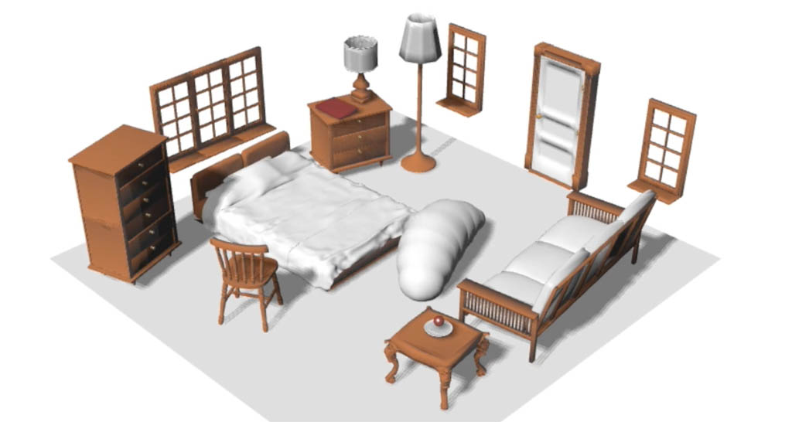](https://vimeo.com/159092637)

Zach Rispoli, [*C. Elegans Destroys its Bedroom*](https://vimeo.com/159092637) (2015): Caenorhabditis elegans is one of the simplest organisms with a nervous system: a worm with a brain containing only 302 neurons. As of 2012, it was the only organism to have its connectome (neuronal “wiring diagram”) completely simulated in code, in the OpenWorm project. In 2016, School of Art BFA student Zach Rispoli used the OpenWorm brain code to create *C. Elegans Destroys Its Own Bedroom*.

<!--
Originally from
https://courses.ideate.cmu.edu/60-212/s2022/index.html%3Fp=966.html

Lars Berg, LaserBagPipe
Variable, UCC Organism (writeup here)
Kate Compton, Puppets
Marpi Studio, Terrarium
Zach Rispoli, C. Elegans Destroys its Bedroom (2015): [Caenorhabditis elegans is one of the simplest organisms with a nervous system: a worm with a brain containing only 302 neurons. As of 2012, it was the only organism to have its connectome (neuronal “wiring diagram”) completely simulated in code, in the OpenWorm project. In 2016, School of Art BFA student Zach Rispoli used the OpenWorm brain code to create C. Elegans Destroys Its Own Bedroom (class project).

Flocking (e.g. Shiffman)
Vojir, Lukas. Processing Monsters. 2008–2010. Online bestiary. https://github.com/dglunz/processing-monsters. (Run locally)
George Always, Staggering Beauty (Note: flash warning)

<li>Flocking (<em><a href="https://editor.p5js.org/golan/sketches/uiuvKNohe">e.g. Shiffman</a></em>)</li>
<li>Ed Burton &amp; SODA.co.uk, <a href="http://panoramx.ift.uni.wroc.pl/~maq/lovesoda/0.36beta.html"><em>Constructor</em></a> (1999)</li>
<li>Vojir, Lukas. <em>Processing Monsters</em>. 2008–2010. Online bestiary. <a href="https://github.com/dglunz/processing-monsters">https://github.com/dglunz/processing-monsters</a>. (Run locally)</li>
<li>George Always, <a href="http://www.staggeringbeauty.com/"><em>Staggering Beauty</em></a> (Note: flash warning)</li>
<li>Lars Berg, <a href="https://larsberg.github.io/_lsr/2018/1014_laserBagPipe/index.html"><em>LaserBagPipe</em></a></li>
<li>Variable, <em><a href="https://variable.io/ucc-organism/demo/">UCC Organism</a></em> (writeup <a href="https://variable.io/ucc-organism/">here</a>)</li>
<li>Kate Compton, <a href="http://www.galaxykate.com/apps/unpublic/puppet/index.html"><em>Puppets</em></a></li>
<li>Marpi Studio, <a href="https://demo.marpi.pl/ocean_desert/"><em>Terrarium</em></a></li>
<li>Zach Rispoli, <a href="https://vimeo.com/159092637"><em>C. Elegans Destroys its Bedroom</em></a> (2015): [<a href="https://en.wikipedia.org/wiki/Caenorhabditis_elegans" rel="nofollow"><em>Caenorhabditis elegans</em></a> <em>is one of the simplest organisms with a nervous system: a worm with a brain containing only 302 neurons. As of 2012, it was the only organism to have its connectome (neuronal “wiring diagram”) completely simulated in code, in the <a href="http://openworm.org/">OpenWorm</a> project. In 2016, School of Art BFA student Zach Rispoli used the OpenWorm brain code to create C. Elegans Destroys Its Own Bedroom (<a href="http://golancourses.net/2016/zrispo/04/29/c-elegans-destroys-own-bedroom/">class project</a>).</em>]</li>
<li>David Li, <a href="https://artsandculture.google.com/experiment/blob-opera/AAHWrq360NcGbw"><em>Blob Opera</em></a> (2020)</li>
<li>Banksy&#8217;s <em>Village Petstore and Charcoal Grille</em> (2010):</li>
</ul>

-->
