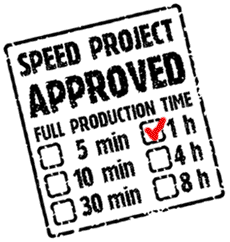
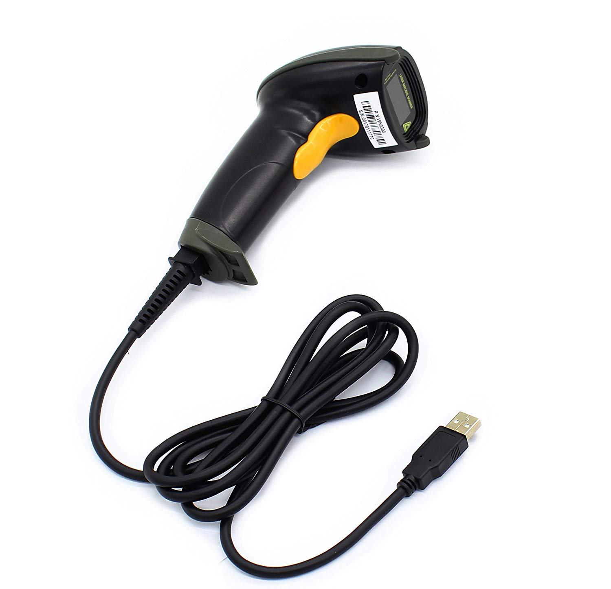
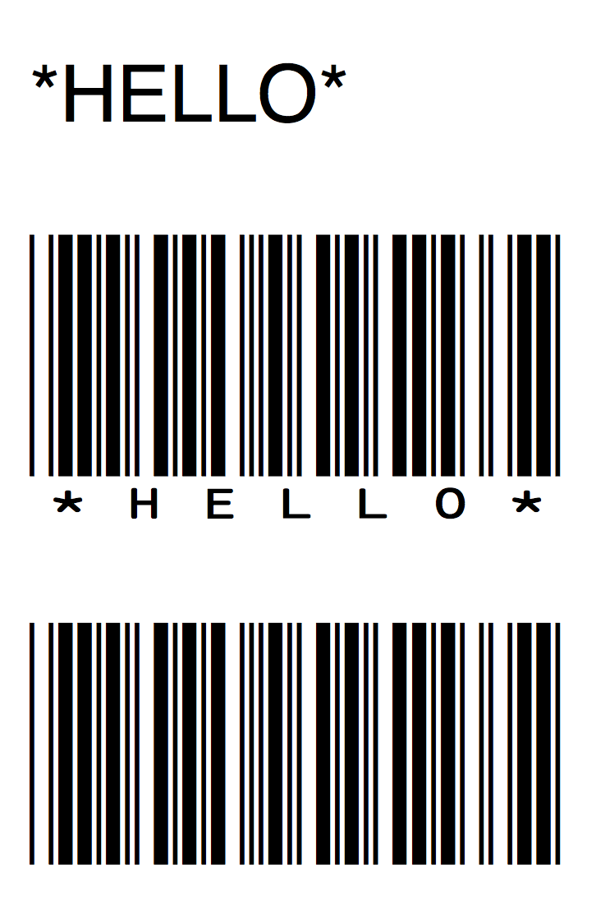

# Barcode Scanner Speed Project



---

### Overview

We're doing a [speed project](http://fffff.at/speed-project/) with barcode scanners. Our purpose is to loosen up, have some fun, and think in some new ways.

* Organize yourselves into two-person teams. 
* Each team will receive a barcode scanner. 
* You're also provided with barcode fonts, and some self-adhesive label paper. Feel free to use these, or any objects at your disposal that have barcodes on them. 
* Using any programming environment you prefer, create an interesting interaction with barcodes. Whimsical is good. Go for it. 
* You have until the end of class to complete this. If your idea outstrips your time or resources, make a speculative mockup. Emphasis is on concept.
* Document your speed project in time for our next class session, and move on to other things. 

Viewing: [*Barcode DJs*](https://www.youtube.com/watch?v=n610IKQM4IA) (Jakub Pišek, Beata Kolbašovská, Erik Bartoš, 2017)

---

### Barcode Scanners

Your team will be provided with a [WoneNice USB Laser Barcode Scanner (Wired)](https://www.amazon.com/WoneNice-Barcode-Scanner-Handheld-Reader/dp/B00LE5VV1C/). 



Interestingly, barcode scanners are simply *keyboard emulators*. When you scan a barcode, the barcode image is translated into a sequence of letters and numbers, which your computer then receives as a sequence of (virtual) keypresses.

Barcode scanners are so ubiquitous that they are quite inexpensive. Most cost under $100, and ours costs $19.99. 

---

### Barcode Fonts

Here are some barcode fonts. Your mileage may vary: 

* [IDAutomationCode39.zip](barcode/IDAutomationCode39.zip) (*recommended*)
* [emwedo_bar-code-39.zip](barcode/emwedo_bar-code-39.zip)
* [azalea-software-inc_code39azalea.zip](barcode/azalea-software-inc_code39azalea.zip)

Feel free to use 'found' barcodes, too. 

---

### Properly Formed Barcodes

We are using [Code39 Barcodes](https://en.wikipedia.org/wiki/Code_39), an older format with wide compatibility. It represents 43 characters: all uppercase letters, numbers, and some special characters: 
```
ABCDEFGHIJKLMNOPQRSTUVW 1234567890 $% / + .- 
```

In plain text, barcodes must begin and end with an asterisk (*), as in: 

```
*HELLO*
```

Different barcode "fonts" may include (or not) a human-readable version of the encoded string. The image below shows the word `*HELLO*` encoded in three fonts. (*The 'H' in IDAutomationHC39M stands for 'Human Readable'.*)

* Helvetica
* IDAutomationHC39M
* IDAutomationSC39M_Demo




---

### Additional Items

Some things you may need:
* Laptop computer (any OS)
* USB extension cord (see the professor)
* Adhesive label sheets for laser printers
* Printer paper, scissors, scotch tape
* Things with barcodes on them.

### Connecting to the STUDIO printer

First download the installer for your particular OS. If you’re not sure what OS you have, click on the Apple in the top left corner of your screen and select “About This Mac”. The next screen will tell you your OS version (10.x.x). Download the driver for the copier here:

[http://support.ricoh.com/bb/html/dr_ut_e/ra/model/mpc300/mpc300en.htm](http://support.ricoh.com/bb/html/dr_ut_e/ra/model/mpc300/mpc300en.htm)

Clicking on your OS will take you further down the page. The actual download is all the way on the right side under “Download” – it is a button with an arrow faced downward. Click that and the download will begin. It will default save to your Downloads folder or wherever you’ve specified that you want your downloads. 

Next, find where you saved the installer and double-click it. It will open another screen with a package looking icon. Double click that and the installer will start. Click Continue, Continue, Agree, Install. There are no other options to be selected. After clicking Install you will be prompted for your Mac OS X password or “login” password. Type that and then click “Install Software”. Once it finishes, hit close.

Now open System Preferences either from your Dock or from the Apple in the top left of the screen. Find and click on Printers & Scanners. Click the “+” sign underneath the left column of printers. On the next screen, click the “IP” tab. 

Under Address type: 128.2.103.210

Under Name type: STUDIO Copier (or whatever you’d like the name of the copier to be in your queue

Under Use, if the Ricoh Aficio MP C3002 PS driver is not already selected, click on the drop own, choose “Select Software…” and then in the Filter/search type Ricoh 3002. Select the option that appears and click OK. Then click Add to install the printer.

That should be it, but if given another set of properties to select, choose Option Tray à Lower Paper Tray and Finisher: Finisher SR3070 (see attached picture).

