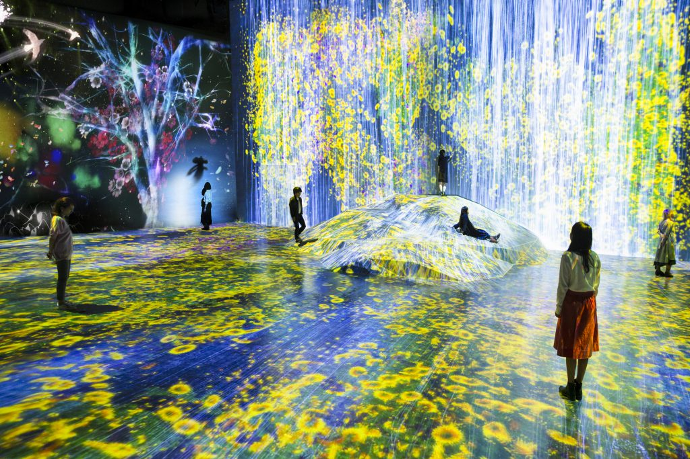
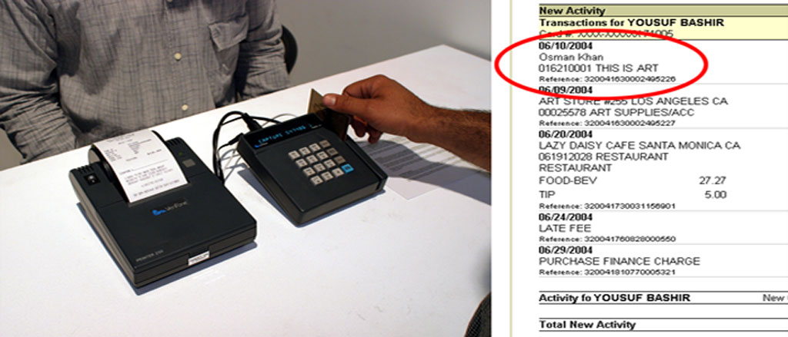
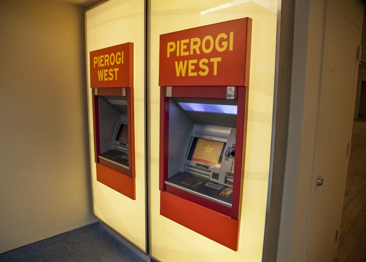

# The Critical Interactive Readymade

On the spectrum of interactive art, work at one extreme often looks something like this: 

Such work is expensive, immersive, and oriented to spectacle. The work communicates that it values large scale, fast frame rates, high resolution, low latency, and illusion. It is commissioned by patrons. It has broad appeal as entertainment, and straddles the line between kitsch and sublime. 

***What is its opposite?***

In this lecture we discuss works which are modest, conceptual, and above all, provocative. By adopting the user interface vocabulary of everyday commerce as a readymade, these projects employ interactivity to critically examine the dynamics of power and defamiliarize our relationship to late capitalism.

Below are some examples of work at this "other end" of the spectrum.  

---

### Caleb Larsen

**[$10,000 Sculpture (In Progress)](https://web.archive.org/web/20120410011543/http://www.caleblarsen.com/projects/10000-sculpture-in-progress/)**, 2009

*"The $10,000 Sculpture (in progress) visually consists of a standard dollar bill acceptor found in soda and candy vending machines. This device has become a symbol of self-serve retail transactions. In this instance, it is installed seamlessly into a plain white wall with no clues to inform the viewer as to the nature of the piece. Nor does it suggest what might happen if they were to insert a dollar bill. [...] The work exists primarily at the moment of contribution by the viewer. It is a continual charity, or more cynically, a form of panhandling. It asks for money, and offers nothing (by way of direct response) in return."*

Other notable work by Caleb Larsen: 
* [A Tool to Deceive and Slaughter](images/A_Tool_to_Deceive_and_Slaughter.pdf), 2009

---

### Kim Beck & Osman Khan

**[When Laughter Trips at the Threshold of the Divine](http://www.idealcities.com/when-laughter-trips-at-the-threshold-of-the-divine/)**, 2008

*"With equal nods to Minimalism's aesthetics and consumerism's supermarket maximalism, the project places a fully functioning automatic sliding door in the middle of a public park, offering the everyday as a folly for play, re-experience and reflection on neutered thresholds."*

---

### Osman Khan 

[**Khan Artist**](http://www.osmankhan.com/works.asp?name=Khan%20Artist), 2004

*"In Khan Artist, the artist directly appropriates the act and very systems of credit consumption. Registering as a validated merchant with a fully operational credit processing machine and account, the Artist (or through a sales rep proxy) asks the visitor to make a purchase - though no product or service is returned in kind at the time of transaction. The visitor's purchase card will be charged an amount of money (a minimum of $1.00 is required, though the visitor can willingly offer a higher amount). The Artist's name will show up on the itemized list of the visitor's monthly statement.*

*"What is bought and what is sold? Is the piece become more precious if a larger amount is charged? Does the statement become an art object simply because the artist's name appears on it or acknowledgment of art and artist as commodity and product. Consumption of art or consumption as art?"*

---

### Andrew Ohanesian

**[Pierogi West ATM Vestibule](https://www.pierogi2000.com/pierogi-west-atm-vestibule/)**, 2011-2016

*"A fully functioning ATM built by the artist charged the user the hefty fee of $4.99, but after completing a transaction, the user received a receipt with a title and an edition number on it… basically, a purchased work of art."*

---

### Bjørn Karmann & Tore Knudsen

**[Project Alias](http://bjoernkarmann.dk/project_alias)**, 2018

*"Alias is a teachable 'parasite' that is designed to give users more control over their smart assistants, both when it comes to customisation and privacy. Through a simple app the user can train Alias to react on a custom wake-word/sound, and once trained, Alias can take control over your home assistant by activating it for you. When you don't use it, Alias will make sure the assistant is paralysed and unable to listen by interrupting its microphones.*

*Alias acts as a middle-man device that is designed to appropriate any voice activated device. Equipped with speakers and a microphone, Alias is able to communicate and manipulate the home assistant when placed on top of it. The speakers of Alias are used to interrupt the assistance with a constant low noise/sound that feeds directly into the microphone of the assistant. First when Alias recognises the user created wake-word, it stops the noise and quietly activates the assistant with a sound recording of the original wake-word. From here the assistant can be used as normally."*

---

### Ivan Cash

**[IRL Glasses](https://www.kickstarter.com/projects/ivancash/irl-glasses-glasses-that-block-screens)**, 2018

A product-as-provocation. *"The design for IRL Glasses is inspired by the 1988 cult classic film, 'THEY LIVE,' where a magical pair of glasses blocks ads."*

---

### !Mediengruppe Bitnik (Carmen Weisskopf + Domagoj Smoljo)

**[Postal Machine Decision](https://www.instagram.com/p/BrfjYK-FaQt/)**, 2018 

*"Each parcel carries two addresses, one on front, one on back, each with a unique barcode waiting to be scanned. Postal machines decide which direction the parcel takes, depending on which side is "up". Some parcels bounce around the postal system for weeks, traveling back and forth between Berlin, Leipzig, Halle, Cologne and Brussels. Some take a more direct route."*

Other notable work by !Mediengruppe Bitnik:
* [Random Darknet Shopper](https://wwwwwwwwwwwwwwwwwwwwww.bitnik.org/r/), 2014

---

### Julijonas Urbonas

**[Euthanasia Coaster](http://julijonasurbonas.lt/euthanasia-coaster/)**, 2010

*The Euthanasia Coaster is an art concept for a steel roller coaster designed to kill its passengers. In 2010, it was designed and made into a scale model by Julijonas Urbonas, a PhD candidate at the Royal College of Art in London. Urbonas, who has worked at an amusement park, stated that the goal of his concept roller coaster is to take lives "with elegance and euphoria". It is a ride to the death. The seven loops or inversions put the human body under such stress that it causes the brain to be starved of oxygen, as the heart simply cannot push blood against the enormous g-forces. John Allen, who served as president of the Philadelphia Toboggan Company, inspired Urbonas with his description of the "ultimate" roller coaster as one that "sends out 24 people and they all come back dead".* 

*“Euthanasia Coaster” is nothing but a falling trajectory, curved and tangled in such a way that would leave nobody apathetic, neither the passenger, nor the spectator. It is a prop for non-existent horror movie, a real fiction, a black humour scenography, social sci-fi design, the world's most extreme ride, a mourning sculpture, a monument for the end of the carousel evolution, a gravitational weapon, the very last trip...*

The Euthanasia Coaster would kill its passengers through prolonged cerebral hypoxia, or insufficient supply of oxygen to the brain. The ride's seven inversions would inflict 10g on its passengers for 60 seconds – causing g-force related symptoms starting with gray-out through tunnel-vision to black-out and eventually g-LOC (g-force induced loss of consciousness).

Other projects by Urbonas: 
* [Objects for Arithmomaniacs](http://julijonasurbonas.lt/objects-for-arithmomaniacs/), 2008
* [Talking Doors](http://julijonasurbonas.lt/talking-doors/), 2009

