# Drawing Machines, Visual Instruments

---

Augmentation by History, Filtering, Physics, AI, 
Animation recorder

### Mark-Making is Intuitive

> Today's particular focus: Not drawings *of* things, but drawing as an exhilarating act.

[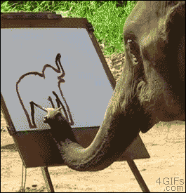](https://www.youtube.com/watch?v=foahTqz7On4) 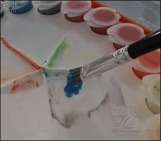

---

### The Mark, Expanded by the Machine

Pablo Garcia, [Drawing Machines](https://drawingmachines.org/) 

Ivan Sutherland, [*Sketchpad*](https://www.youtube.com/watch?v=6orsmFndx_o&t=5m) (1963) 
[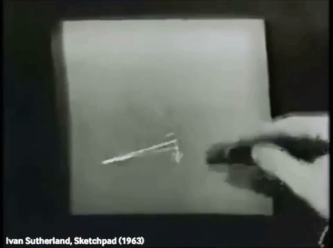](https://www.youtube.com/watch?v=6orsmFndx_o&t=5m)

Myron Krueger, [*Videoplace*](https://www.youtube.com/watch?time_continue=134&v=dmmxVA5xhuo) (1974-1990) 
[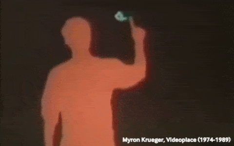](https://www.youtube.com/watch?time_continue=134&v=dmmxVA5xhuo) 
[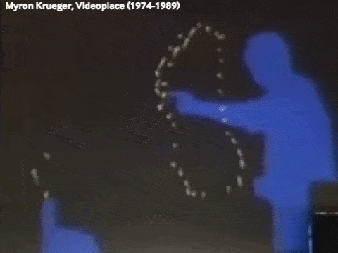](https://www.youtube.com/watch?time_continue=134&v=dmmxVA5xhuo) 

Scott Snibbe, [*Motion Phone*](https://www.youtube.com/watch?v=7XrtctSP26k) (1995-2012) 
 
[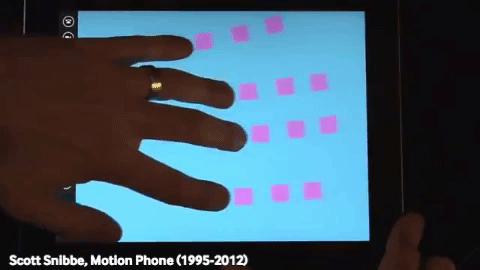](https://www.youtube.com/watch?v=m2OVn4fUHPs)

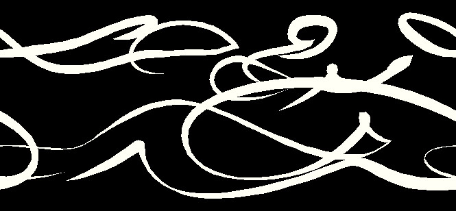

Golan Levin: 

* [*Yellowtail*](https://editor.p5js.org/golan/sketches/3_V73feC_) (1998)
* [*Bluetail*](https://editor.p5js.org/golan/sketches/vOXGkr6S-) (1998)

Ben Fry, [Fugpaint](https://www.benfry.com/fugpaint/), 1998

Zach Lieberman, [Unwinder](https://editor.p5js.org/lingdong/sketches/3HHajrXDW) (2001)

JT Nimoy's [*Scribble Variations*](https://github.com/jtnimoy/scribble-variations) (2000) 
[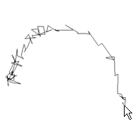](https://github.com/jtnimoy/scribble-variations)

### Augmentation with Physics: 

Paul Haeberli: [*Dynadraw*](http://www.graficaobscura.com/dyna/) (1989) • [interactive](https://editor.p5js.org/golan/sketches/cZPRgx6q9) 

[*LineRider*](https://www.linerider.com/) poetic amusement: 
[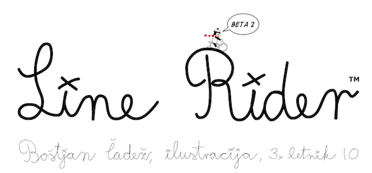](https://www.linerider.com/) *See also [Space Painter](https://twitter.com/Gaziter/status/1132007797485395969): A painting app, but you are a frog in space.*

[*Crayon Physics*](https://www.youtube.com/watch?v=QsTqspnvAaI&t=16s) 
[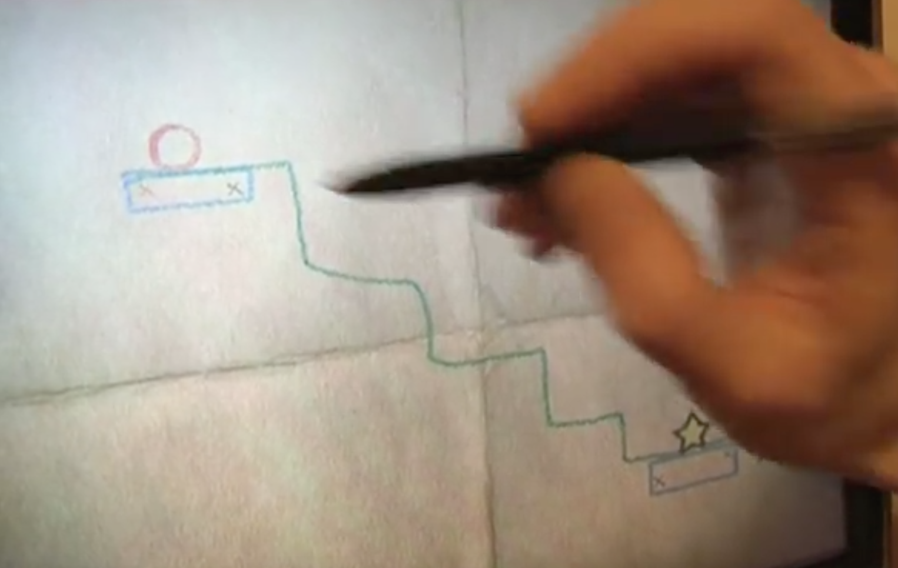](https://www.youtube.com/watch?v=QsTqspnvAaI&t=16s)

For more games, see also:

* [*Draw a Stickman*](https://www.youtube.com/watch?v=GzyWXOOrICM) – Draw and create your own character; draw your way out of dangerous situations.
* [*Magical Pencil*](https://vimeo.com/337309331) by Yang, ITP student thesis: draw the things you need to play the game.*
* [*Sloppy Forgeries*](https://www.youtube.com/watch?v=2pOLb9iczQU) by Jonah Warren
* [*Can You Draw a Perfect Circle?*](https://neal.fun/perfect-circle/)
* [*The Bézier Game*](https://bezier.method.ac/)
* [*90 Second Portraits*](https://tangramgames.dk/games/90secondportraits/)
* [*Action Painting Pro*](https://www.youtube.com/watch?v=yeoA2iJ58U8)

### Augmentation with Mathy Algorithms

[*Recursive Drawing*](http://recursivedrawing.com/) (2011) by Toby Schachman. 
[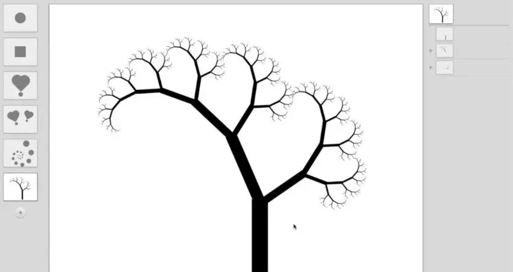](https://vimeo.com/41822151)

Scott Snibbe, [*Bubble Harp*](https://www.youtube.com/watch?v=wkLB9ODb3Gc&t=90s) (1998-2012)

---

### Performed Imagery

The performance of live imagery has a long history. VJing!

[Mary Hallock-Greenwalt](http://amy-alexander.com/projects/online-communities/the-mary-hallock-greenewalt-visibility-project.html) (1871 – 1950) *"was an artist/inventor who was active during the first half of the 20th century. After beginning her career as a concert pianist, she became interested in the performance of light and color in addition to music. She went on to design and perform custom electric visual instruments that displayed colored light."* She called her instrument the *Sarabet*, and she called the medium of temporal light, "Nourathar". In the course of making her instruments she invented and patented the rheostat (dimmer) and the mercury tilt-switch. 
 
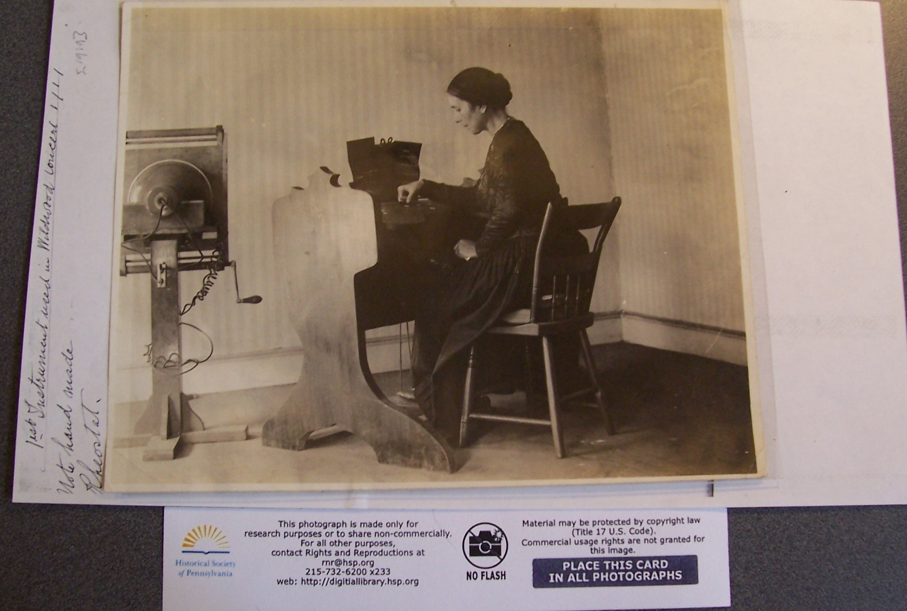

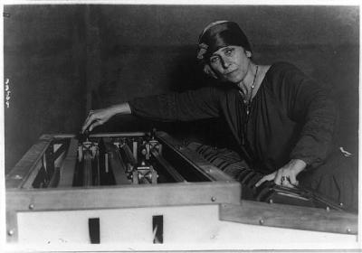

A clavilux recital by Thomas Wilfred in Seattle, 1924.
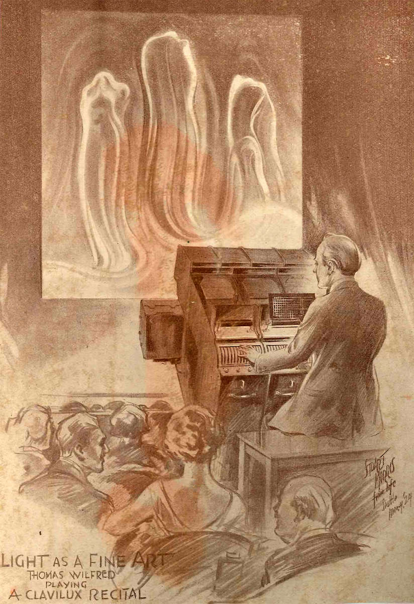

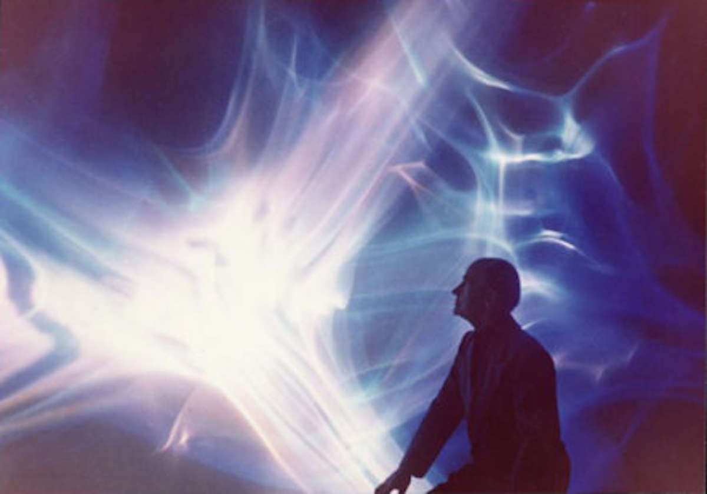

[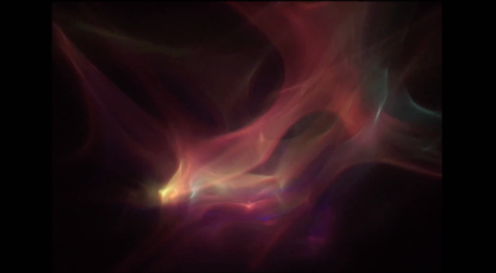](https://www.youtube.com/watch?v=h4PxDv_CFS4) 
*Yale University Art Gallery’s video documentation of Wilfred’s Lumia Suite, Opus 158. Museum of Modern Art, New York, Department of Painting and Sculpture, Museum Collection Files.*

Julien Maire, [*Digit*](https://www.youtube.com/watch?v=IzDtVR0-0Es) (2008, 2015) 
 
*"Digit" is a live performance that is also conceived to be presented as a piece of living art. A writer sits at a table writing a text. Simply by sliding his finger over a blank piece of paper, printed text appears under his finger. The spectators can come very close to the 'writer' and read the text following the movement of the finger.*

Christine Sugrue & Damian Stewart, [*A Cable Plays*](http://csugrue.com/acableplays/) (2008) 

Sougwen Chung, [*Drawing Operations*](http://sougwen.com/project/drawing-operations) (2015) 
[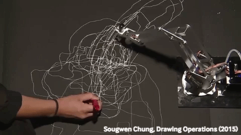](https://www.youtube.com/watch?v=yGQIh_g6WLM&t=0m54s) 
*In this project, the robotic arm mimics the artist’s gesture by seeing through an overhead camera, and analyzing the movement through computer vision software. The result is a synchronicity of movement between artist and machine, captured as a drawing artifact.*

---

### Drawings Are Traces in Space

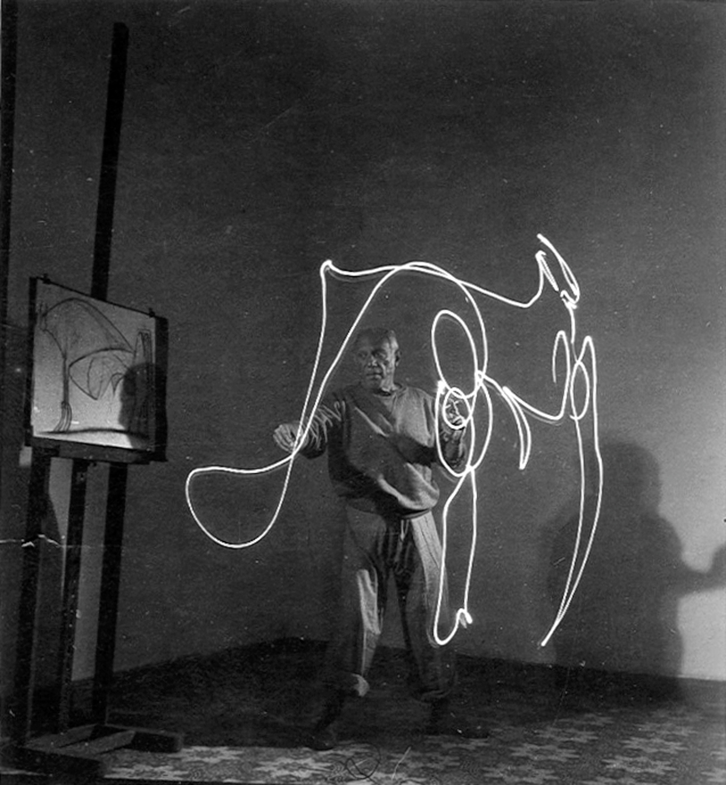

Front Design, [*Sketch Furniture*](https://www.youtube.com/watch?v=8zP1em1dg5k0) (2007) 
[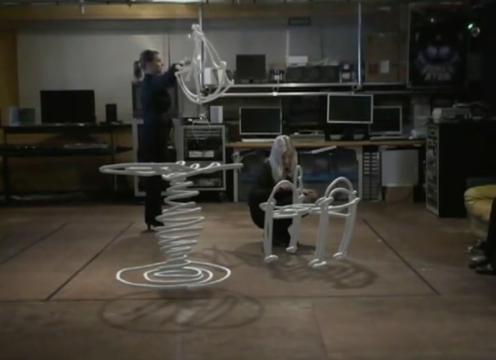](https://www.youtube.com/watch?v=8zP1em1dg5k0)

Google [*TiltBrush*](https://www.youtube.com/watch?v=TckqNdrdbgk) 
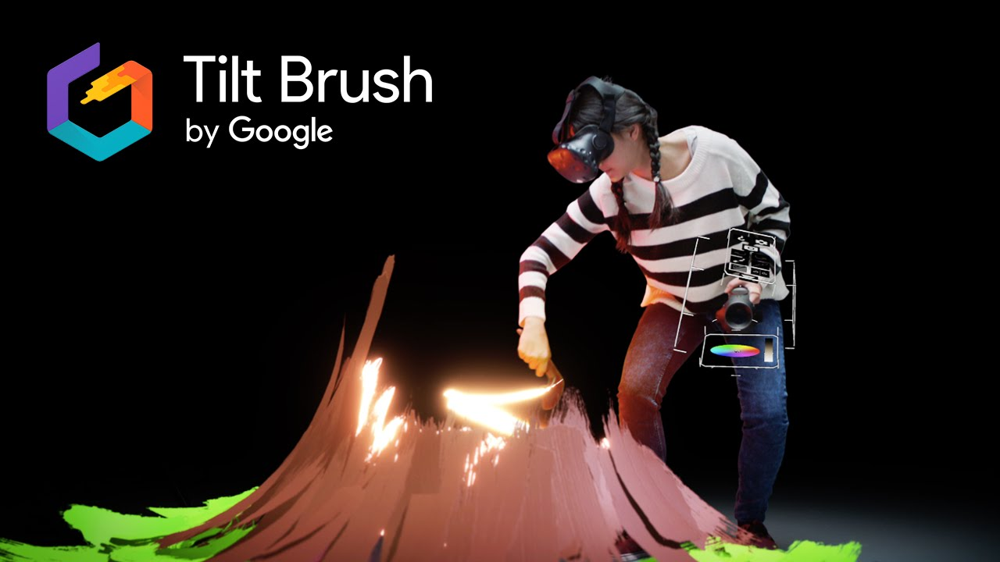

Scott Snibbe, [*You Are Here*](https://www.snibbe.com/ent/youarehere) (2004) 
[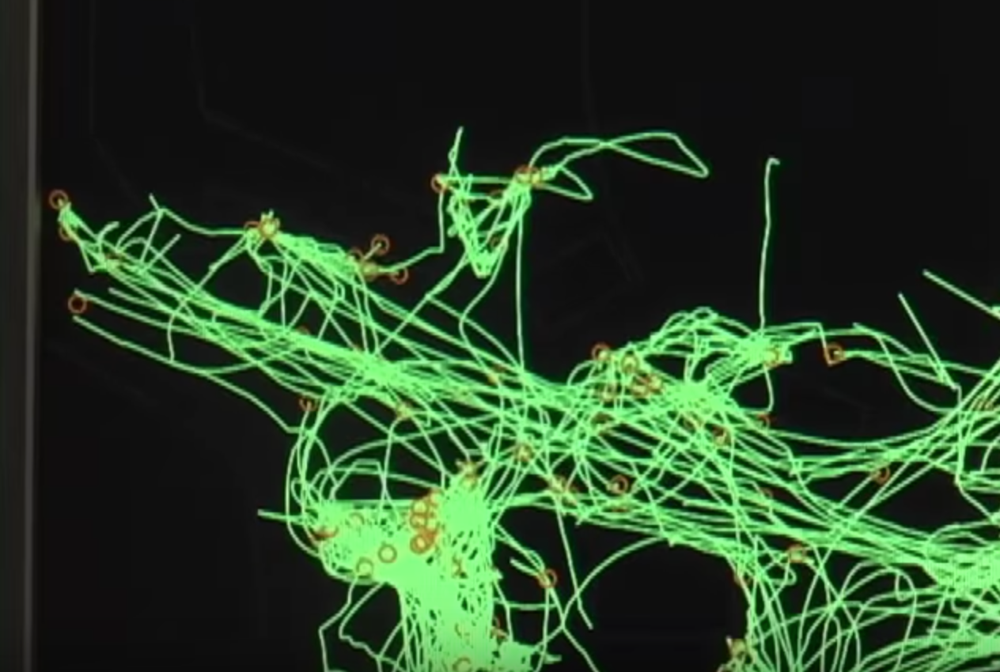](https://www.youtube.com/watch?v=GudD9FNmy4U) 
*You Are Here* tracks and displays the paths of people traveling through a large public space. The system displays the aggregate paths of the last few hundred visitors overlaid with blobs representing the people currently being tracked. A viewer may scroll backwards in time, revealing where she came from and how her path intersected with others.

Various, [*GPS drawings*](http://www.gpsdrawing.com/gallery.html) 
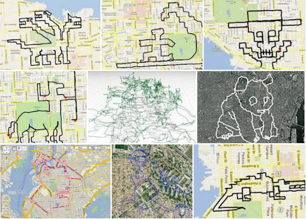

---

### Graffiti Technologies

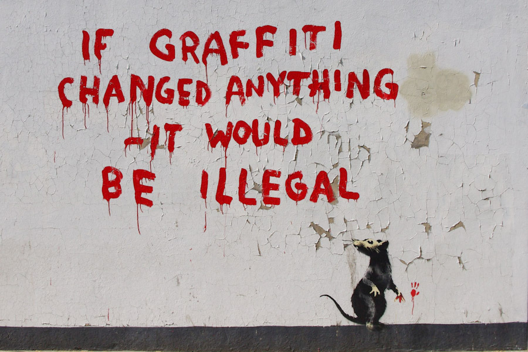

Technologies which enable artists to deploy drawings at new scales, in difficult-to-access locations, beyond the limits of their bodies.

Graffiti Research Lab / Theo Watson, [*Laser Tag*](https://www.youtube.com/watch?v=DKbtTPYZEig) (2007) 

GRL, OF, TEG, FAT Lab & TEMPT One, [*Eyewriter*](https://www.youtube.com/watch?v=84H-xLrLvvk) (2009-2011) 
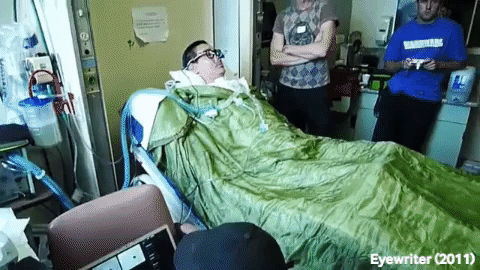 
*"The EyeWriter is a low-cost, open-source eye-tracking apparatus & custom software that allows graffiti writers and artists with paralysis resulting from Amyotrophic lateral sclerosis to draw using only their eyes."*

Katsu, [*Graffiti Drone*](https://www.youtube.com/watch?v=We12p6yvNW0) (2015) 
[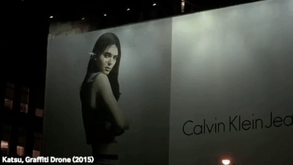](https://www.youtube.com/watch?v=We12p6yvNW0)

So Kanno & Takahiro Yamaguchi, [*Senseless Drawing Bot*](https://vimeo.com/30780208) (2012)  
[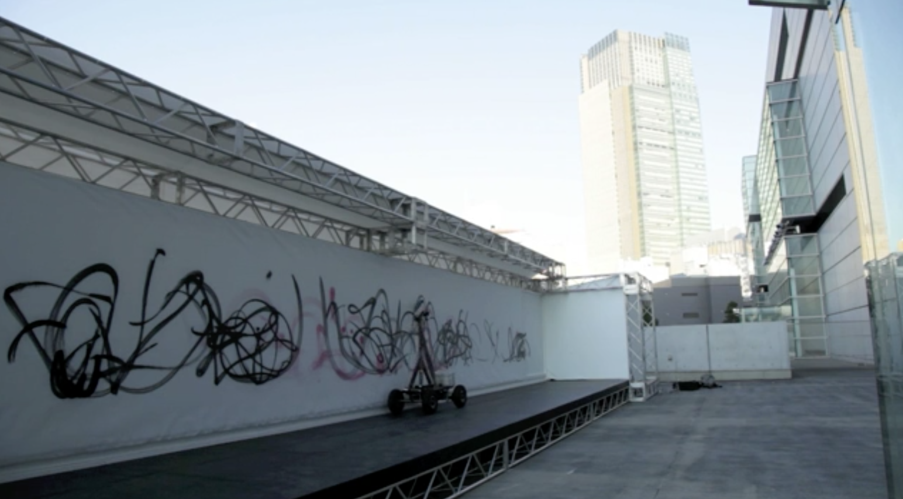](https://vimeo.com/30780208)

CROMATICS, [*Graffiti Rainbow Bike*](https://vimeo.com/47245840) (2012)
[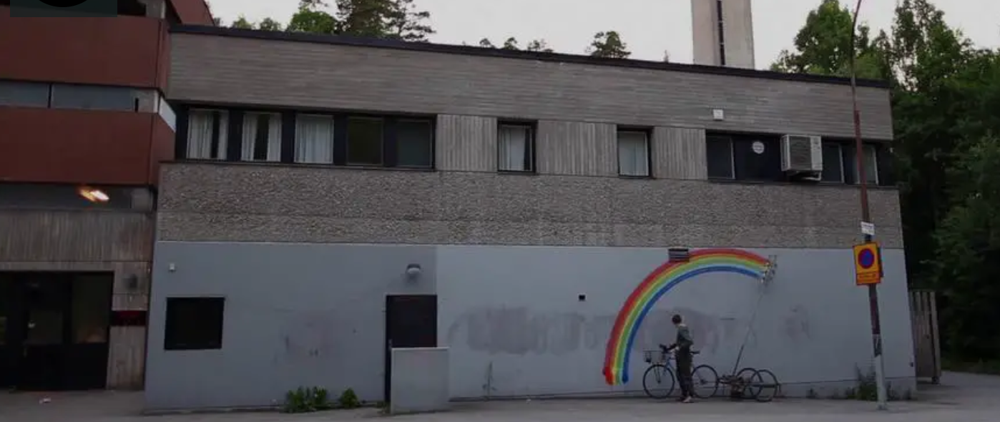](https://vimeo.com/47245840)

---

### Audiovisual Drawing Systems

Creating sound and imagery simultaneously. 

Daphne Oram, *Oramics Machine* (1960s), [“drawn sound” machine](https://www.youtube.com/watch?v=QJQUPRPJ8yM) 
[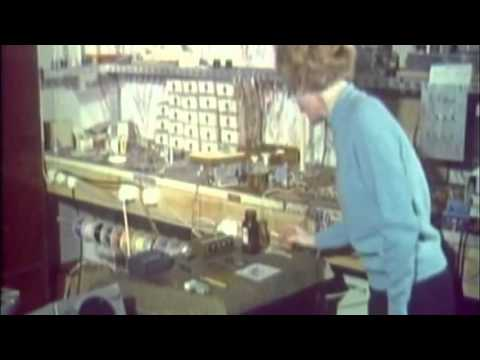](https://www.youtube.com/watch?v=mJ08diPUv6A&t=1m52s)

Laurie Spiegel at Bell Labs created *VAMPIRE* (Video and Music Program for Interactive Realtime Exploration), a performance system for the simultaneous synthesis of video images and electronic sound. Spiegel’s system built on the GROOVE computer music system created by Max Matthews, by combining it with paintprogram-like graphic algorithms by Kenneth Knowlton. The VAMPIRE system offered realtime, gestural control of both sound and video image, through a variety of continuous input
devices. 

Laurie Spiegel, *VAMPIRE* (1974-1979) 
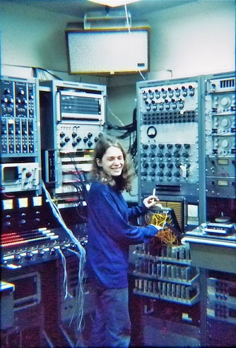 
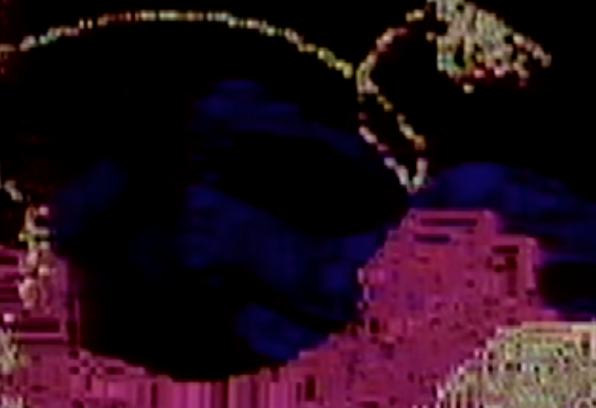 

Toshio Iwai, *SimTunes/Music Insects* (1991-1996) 
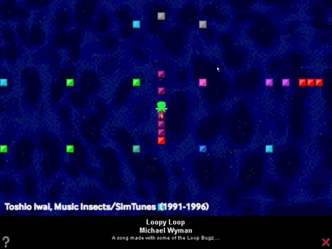

Amit Pitaru, [*Sonic Wire Sculptor*](https://www.youtube.com/watch?v=ji4VHWTk8TQ) (2009) 
[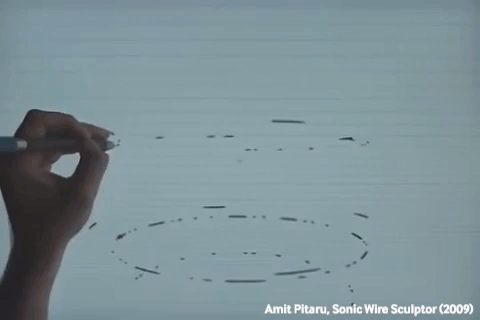](https://www.youtube.com/watch?v=ji4VHWTk8TQ)

Jay Silver, [*Drawdio*](https://www.youtube.com/watch?v=PV_w38ldZaE) (2008) 
[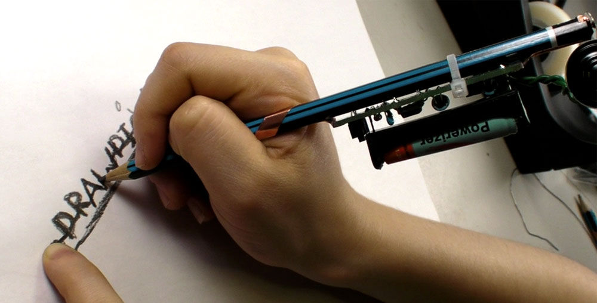](https://www.youtube.com/watch?v=PV_w38ldZaE)

Eric Rosenbaum & Jay Silver, [*SingingFingers*](http://singingfingers.com/) (2010) 
[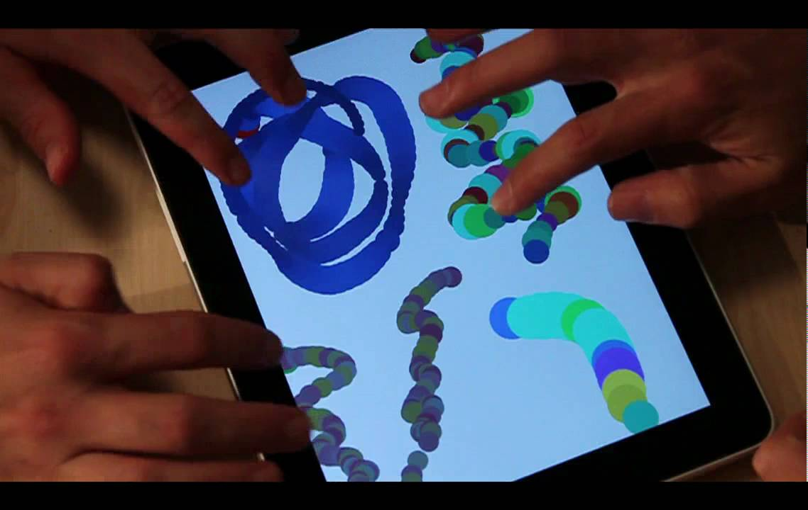](https://www.youtube.com/watch?v=iCYA7N-vdZA) 
(Finger Paint with Your Voice!)

--- 

### Expanded Drawing as Visualization

Helen Evans and Heiko Hansen (HeHe), [*Nuage Vert*](https://vimeo.com/17350218) 

Iepe Rubingh, [Painting Reality](https://www.youtube.com/watch?v=N1AHBZybjW4) (2011) 
[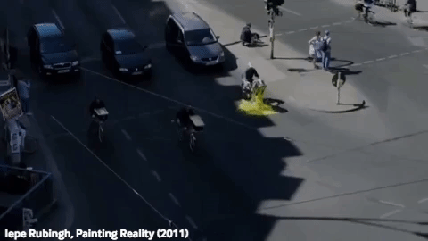](https://www.youtube.com/watch?v=N1AHBZybjW4)

---

### Drawing, Assisted by Machine Learning

Harold Cohen, *AARON* (1973-1985)
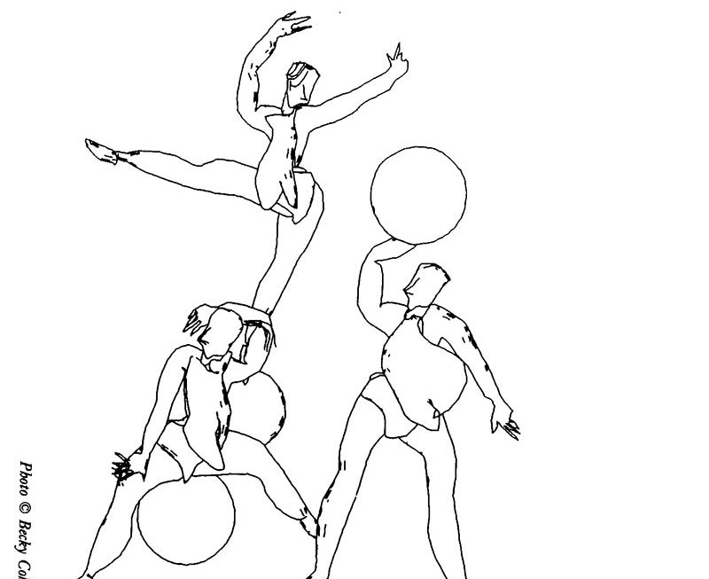 
[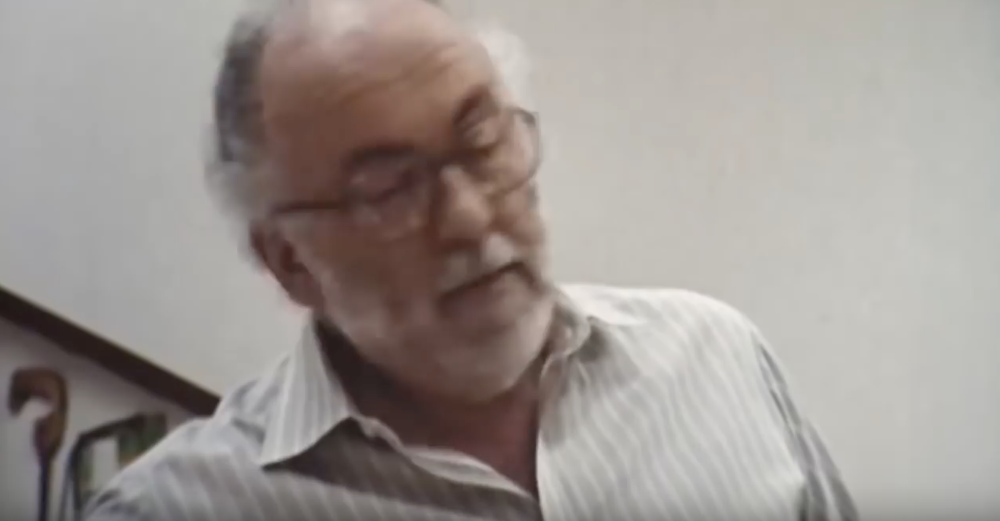](https://www.youtube.com/watch?v=IPczQgCuOOc)

#### Interactive Completion etc.

[Four Experiments in Handwriting with a Neural Network](https://distill.pub/2016/handwriting/)

Microsoft, [*ShadowDraw*](https://www.youtube.com/watch?v=zh_-HUdQwow) (2011) 
[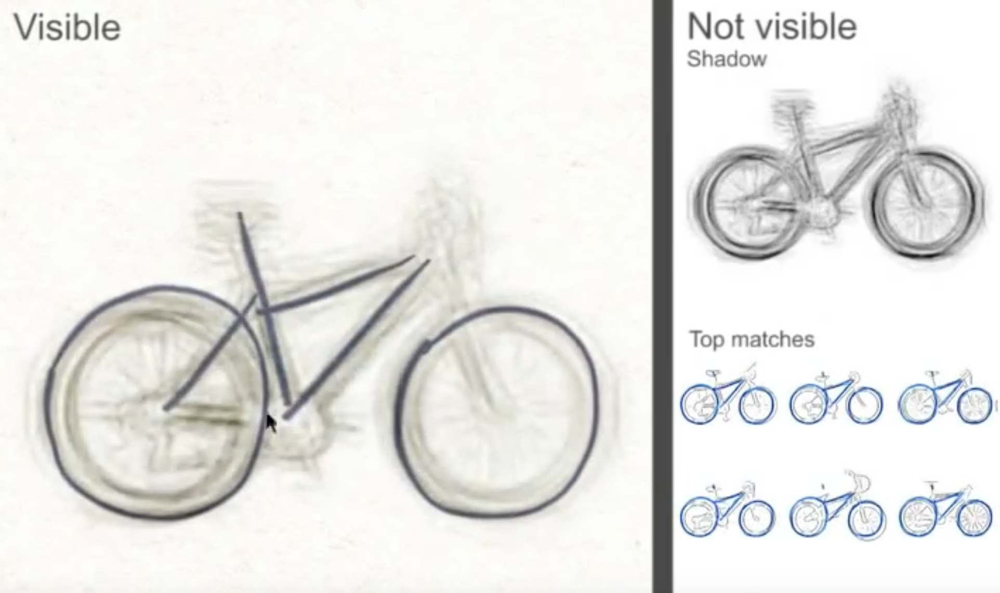](https://www.youtube.com/watch?v=zh_-HUdQwow)
https://www.youtube.com/watch?v=zh_-HUdQwow

Magenta Sketch-RNN multi-predict [drawing completion demo](https://magenta.tensorflow.org/assets/sketch_rnn_demo/multi_predict.html) 
[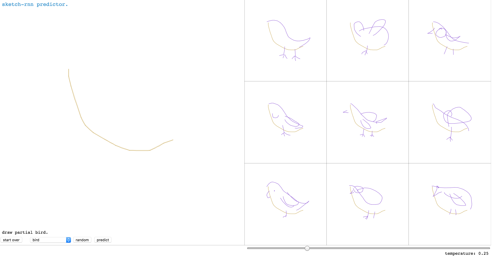](https://magenta.tensorflow.org/assets/sketch_rnn_demo/multi_predict.html)

Magenta Sketch-RNN [interpolation demo](https://magenta.tensorflow.org/assets/sketch_rnn_demo/interp.html) 
[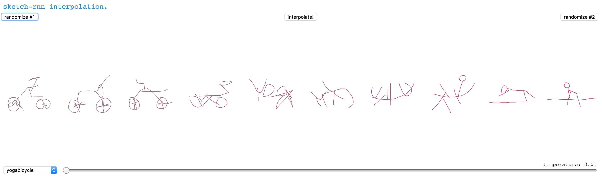](https://magenta.tensorflow.org/assets/sketch_rnn_demo/interp.html)

Magenta Sketch-RNN [Demo](https://magenta.tensorflow.org/assets/sketch_rnn_demo/index.html) • [Other demos](https://magenta.tensorflow.org/sketch-rnn-demo)

<!--

#### Synthesis

ml5.js Sketch-RNN [cat synthesizer](https://ml5js.org/docs/sketchrnn-example) 
[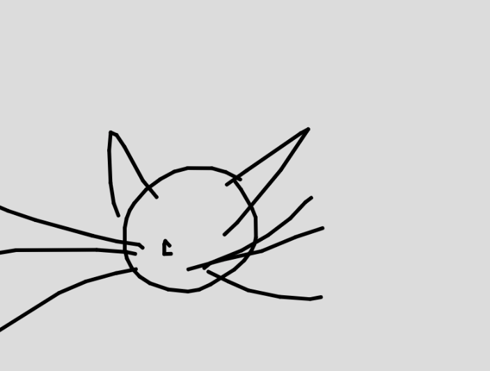](https://ml5js.org/docs/sketchrnn-example)

Coding Train #128 (21'): [Sketch-RNN Snowflakes with ml5.js](https://www.youtube.com/watch?v=pdaNttb7Mr8) 

-->

---

An animation tool I made yesterday:

* [plottimation GIF generator](https://editor.p5js.org/golan/sketches/KpB0k7Pu7)
* [grid-animation-svg-generator](https://editor.p5js.org/golan/sketches/Lv53d3TZw)

<!--
http://blog.otoro.net/2017/05/19/teaching-machines-to-draw/
https://medium.com/@samim/assisted-drawing-7b26c81daf2d

https://github.com/tensorflow/magenta-demos/tree/master/sketch-rnn-js
-->

<!--

---

### Student Project: *Human Lines* by Akiva Krauthamer

[Akiva Krauthamer](http://www.akivadesign.com/default.html) was an undergraduate in the CMU School of Drama who took our *Interactive Art* advanced studio course in 2016. For his final project, he created [*Human Lines*](http://golancourses.net/2016/akiva/04/28/human-lines/), a system which used a performer's speech and body to create drawings in space. His three key inspirations were:
 
1. 20th century Bauhaus choreographer, Oskar Schlemmer 
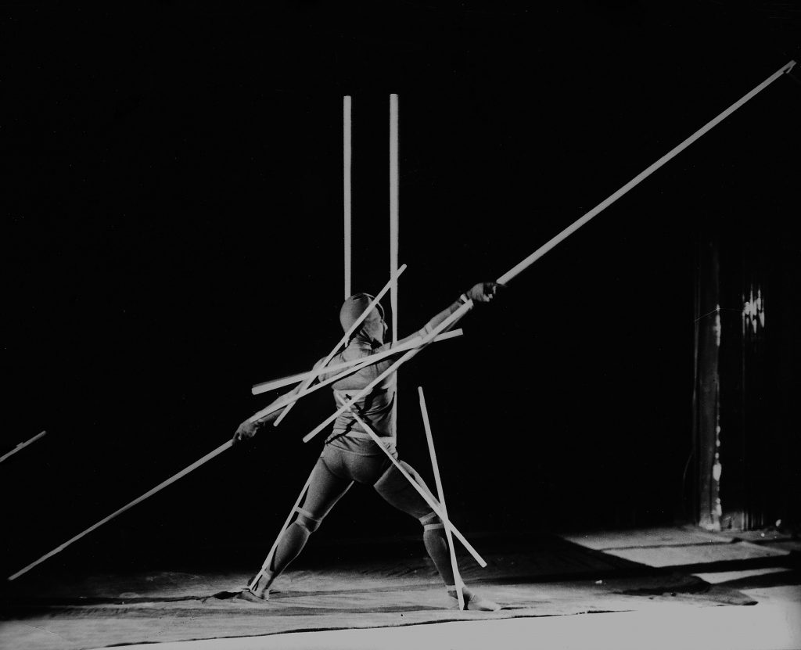
2. William Forsythe, [*Improvisation Technologies*](https://www.youtube.com/watch?time_continue=4&v=6X29OjcBHG8) (1995) 

 * [William Forsythe, example 1](https://www.youtube.com/watch?time_continue=4&v=6X29OjcBHG8)
 * [William Forsythe, example 2](https://www.youtube.com/watch?time_continue=5&v=cqGyFiEXXIQ)
3. Chris Schmandt, [*Put that There*](https://www.youtube.com/watch?v=RyBEUyEtxQo) (1979) 
[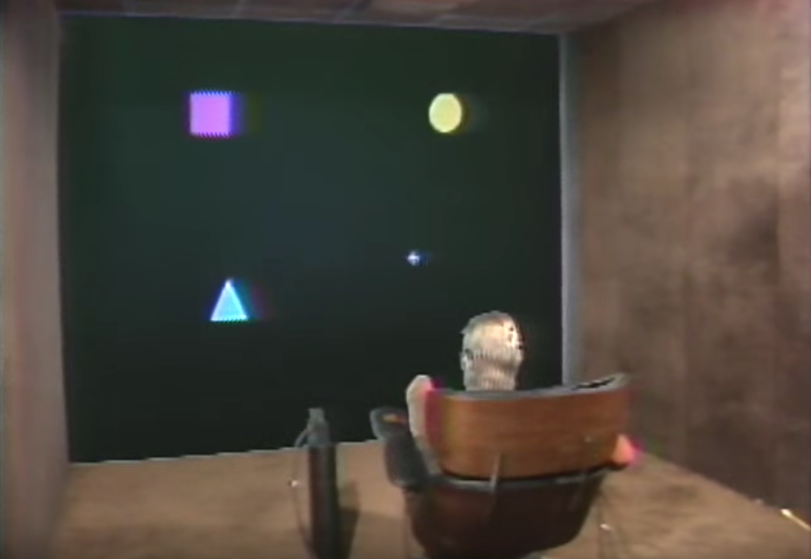](https://www.youtube.com/watch?v=RyBEUyEtxQo)

Akiva's [*Human Lines*](http://golancourses.net/2016/akiva/04/28/human-lines/) project uses the Kinect skeleton tracking and real-time speech-to-text to enable voice-created lines on the body: 
 
 

-->

---
