# Drawing Machines, Visual Instruments

---

### Mark-Making is Intuitive

[Suda, the Painting Elephant](https://www.youtube.com/watch?v=foahTqz7On4) 

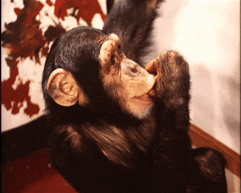

---

### The Mark, Expanded by the Machine

Pablo Garcia, [Drawing Machines](https://drawingmachines.org/) 

Ivan Sutherland, [*Sketchpad*](https://www.youtube.com/watch?v=6orsmFndx_o&t=5m) (1963) 

Myron Krueger, [*Videoplace*](https://www.youtube.com/watch?time_continue=134&v=dmmxVA5xhuo) (1974-1990) 
 
 

Zach Lieberman's [2015 Eyeo lecture](https://vimeo.com/135073747), 7:20 - 18:40  
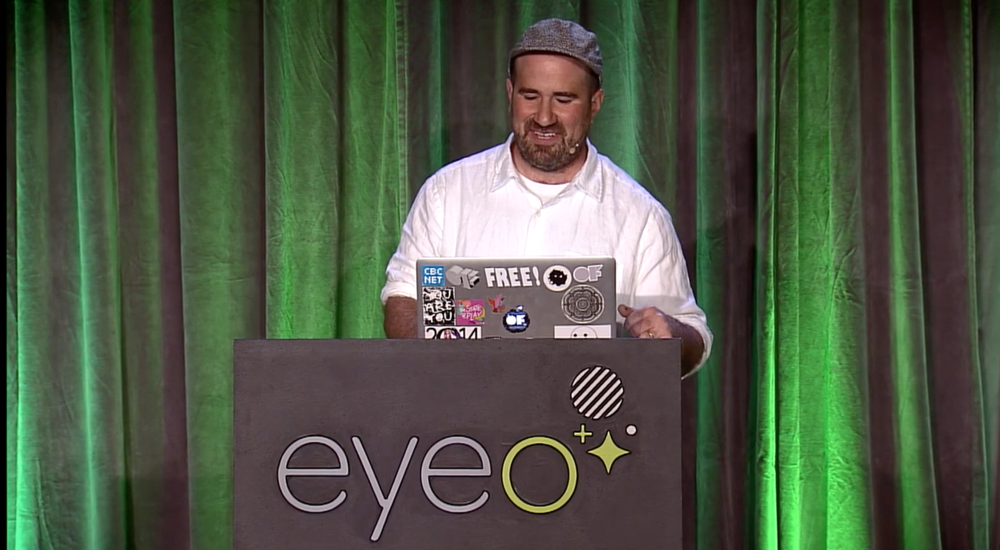

Zach Lieberman, [*Inkspace*](https://www.youtube.com/watch?v=cufd7XnG4A8) (2015)
[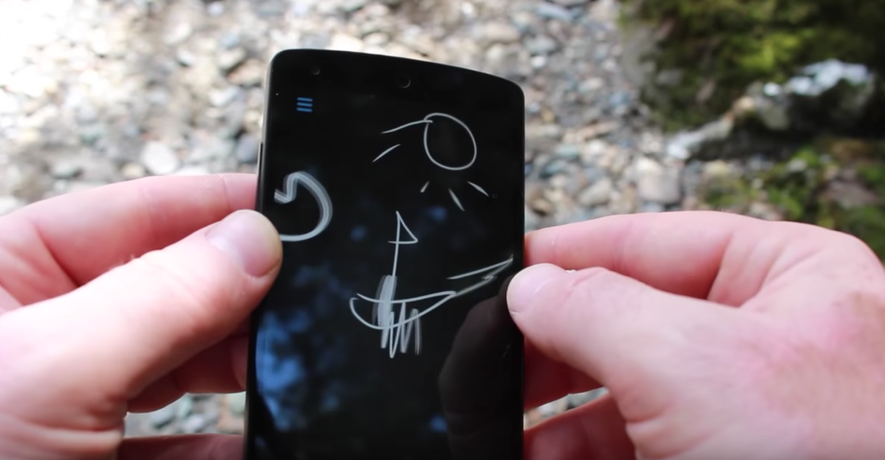](https://www.youtube.com/watch?v=cufd7XnG4A8)

Josh Nimoy's [*Scribble Variations*](https://github.com/jtnimoy/scribble-variations) (2001) 

Scott Snibbe, [*Motion Phone*](https://www.youtube.com/watch?v=m2OVn4fUHPs) (1995-2012) 
 

Golan Levin, [*Yellowtail*]() (1998-)

#### Augmentation with Physics: 

Paul Haeberli: [*Dynadraw*](http://www.graficaobscura.com/dyna/) (1989) 

[*LineRider*](http://www.linerider1.net/) poetic amusement: 

[*Crayon Physics*](https://www.youtube.com/watch?v=QsTqspnvAaI) 

[*Uzu*](https://www.youtube.com/watch?v=etEqfBrVp1w), 2009
[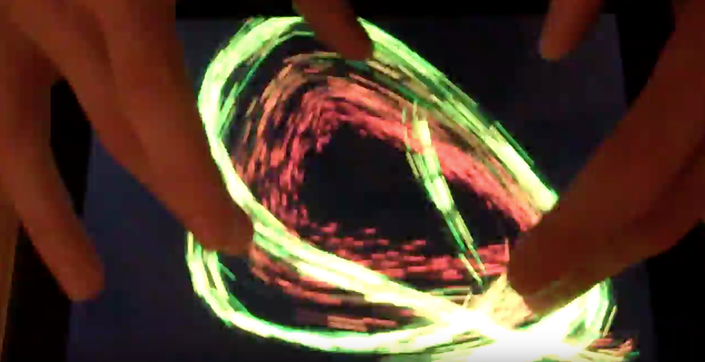](https://www.youtube.com/watch?v=etEqfBrVp1w)

#### Augmentation with Other Algorithms

[*Recursive Drawing*](http://recursivedrawing.com/) (2011) by Toby Schachman. 

Scott Snibbe, [*Bubble Harp*](https://www.youtube.com/watch?v=wkLB9ODb3Gc) (1998-2012)

---

### Performed Imagery

The performance of live imagery has a long history.

[Mary Hallock-Greenwalt](http://amy-alexander.com/projects/online-communities/the-mary-hallock-greenewalt-visibility-project.html) (1871 – 1950) *"was an artist/inventor who was active during the first half of the 20th century. After beginning her career as a concert pianist, she became interested in the performance of light and color in addition to music. She went on to design and perform custom electric visual instruments that displayed colored light."* She called her instrument the *Sarabet*, and she called the medium of temporal light, "Nourathar". In the course of making her instruments she invented and patented the rheostat (dimmer) and the mercury tilt-switch. 
 

A clavilux recital by Thomas Wilfred in Seattle, 1924.

 
*Yale University Art Gallery’s video documentation of Wilfred’s Lumia Suite, Opus 158. Museum of Modern Art, New York, Department of Painting and Sculpture, Museum Collection Files.*

Julien Maire, [*Digit*](https://www.youtube.com/watch?v=IzDtVR0-0Es) (2008, 2015) 
 
*"Digit" is a live performance that is also conceived to be presented as a piece of living art. A writer sits at a table writing a text. Simply by sliding his finger over a blank piece of paper, printed text appears under his finger. The spectators can come very close to the 'writer' and read the text following the movement of the finger.*

Christine Sugrue & Damian Stewart, [*A Cable Plays*](http://csugrue.com/acableplays/) (2008) 

Sougwen Chung, [*Drawing Operations*](http://sougwen.com/project/drawing-operations) (2015) 
 
*In this project, the robotic arm mimics the artist’s gesture by seeing through an overhead camera, and analyzing the movement through computer vision software. The result is a synchronicity of movement between artist and machine, captured as a drawing artifact.*

---

Chutes

Aaron Koblin, [*The Sheep Market*](http://www.aaronkoblin.com/project/the-sheep-market/) (2008) 
[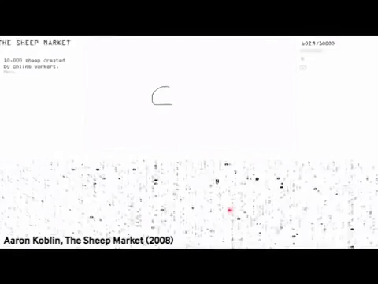](https://www.youtube.com/watch?v=3Mmb5aSscck)

Chris Milk & Aaron Koblin, [*Johnny Cash Project*](https://vimeo.com/15416762), 2011

TEDDY: A Sketching Interface for 3D Freeform Design (1999), by Takeo Igarashi infers 3D information from a 2D silhouette:
http://www-ui.is.s.u-tokyo.ac.jp/~takeo/teddy/teddy.htm
https://www.youtube.com/watch?v=e2H35SlLmUA

---

### Drawings Are Traces in Space

Pierre & Damien, Zachary Lieberman et al., [*IQ Font*](https://vimeo.com/5233789) (2009) 
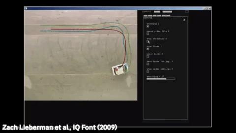 
*Two typographers (Pierre & Damien / plmd.me) and a professional race car driver (Stef van Campenhoudt) collaborated to design a font with a car. The car movements were tracked using a custom software, designed by interactive artist Zachary Lieberman.*

Front Design, [*Sketch Furniture*](https://www.youtube.com/watch?v=8zP1em1dg5k0) (2007) 

Google [*TiltBrush*](https://www.youtube.com/watch?v=TckqNdrdbgk) 

Scott Snibbe, [*You Are Here*](https://www.snibbe.com/projects/interactive/youarehere/) (2004) 

---

### Graffiti Technologies

Technologies which enable artists to deploy imagery at new scales, in difficult-to-access locations, beyond the limits of their bodies.

Graffiti Research Lab / Theo Watson, [*Laser Tag*](https://www.youtube.com/watch?v=DKbtTPYZEig) (2007) 

GRL, OF, TEG, FAT Lab & TEMPT One, [*Eyewriter*](https://www.youtube.com/watch?v=84H-xLrLvvk) (2009-2011) 
 
*"The EyeWriter is a low-cost, open-source eye-tracking apparatus & custom software that allows graffiti writers and artists with paralysis resulting from Amyotrophic lateral sclerosis to draw using only their eyes."*

Katsu, [*Graffiti Drone*](https://www.youtube.com/watch?v=We12p6yvNW0) (2015) 

So Kanno & Takahiro Yamaguchi, [*Senseless Drawing Bot*](https://vimeo.com/30780208) (2012)  

CROMATICS, [*Graffiti Rainbow Bike*](https://vimeo.com/47245840) (2012)

Various, [*GPS drawings*](http://www.gpsdrawing.com/gallery.html) 

---

### Audiovisual Drawing Systems

Daphne Oram, *Oramics Machine* (1960s), “drawn sound” machine by  [play from 1:52](https://www.youtube.com/watch?v=mJ08diPUv6A&t=1m52s) 

Laurie Spiegel, *VAMPIRE* (1974-1979) 
 
 
Laurie Spiegel at Bell Labs created *VAMPIRE* (Video and Music Program for Interactive Realtime Exploration), a performance system for the simultaneous synthesis of video images and electronic sound. Spiegel’s system built on the GROOVE computer music system created by Max Matthews, by combining it with paintprogram-like graphic algorithms by Kenneth Knowlton. The VAMPIRE system offered realtime, gestural control of both sound and video image, through a variety of continuous input
devices. 

Toshio Iwai, [*SimTunes/Music Insects*](https://www.youtube.com/watch?v=Rn8Tfh2APbQ) (1991-1996) 

Amit Pitaru, [*Sonic Wire Sculptor*](https://www.youtube.com/watch?v=ji4VHWTk8TQ) (2009) 

Andreas Refsgaard and Gene Kogan, [*Doodle Tunes*](https://vimeo.com/197026662) (2016) 
[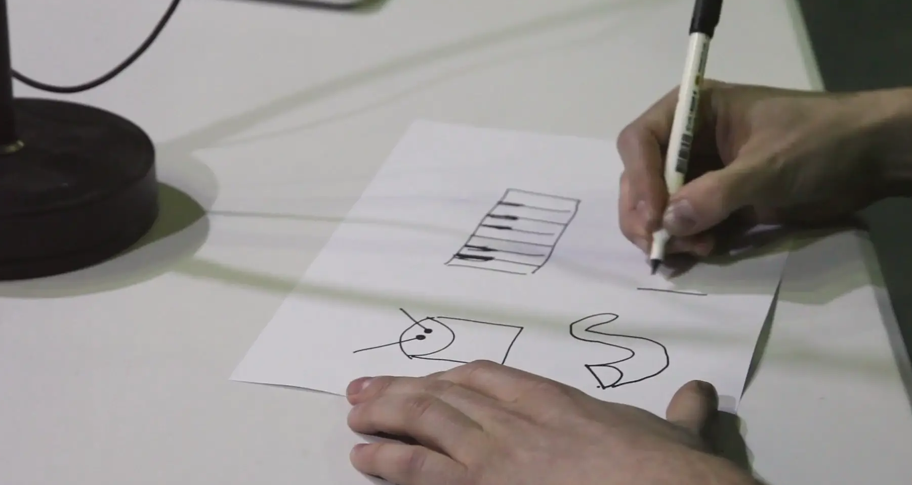](https://vimeo.com/197026662)

Jay Silver, [*Drawdio*](https://www.youtube.com/watch?v=PV_w38ldZaE) (2008) 

Eric Rosenbaum & Jay Silver, [*SingingFingers*](http://singingfingers.com/) (2010) 
 
(Finger Paint with Your Voice!)

--- 

### Expanded Drawing as Visualization

Helen Evans and Heiko Hansen (HeHe), [*Nuage Vert*](https://vimeo.com/17350218) 

Iepe Rubingh, [Painting Reality](https://www.youtube.com/watch?v=N1AHBZybjW4) (2011) 

James Clar, [*A Moment Defined By A Point And A Line*](http://www.jamesclar.com/portfolio_page/a-moment-defined-by-a-point-and-a-line-2010/) (2010) 
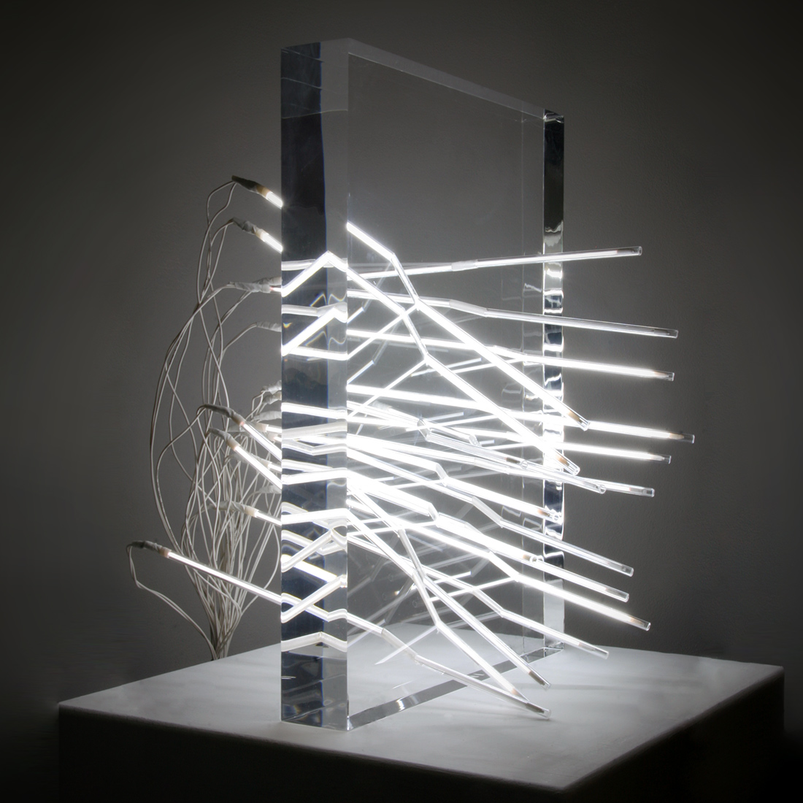 
*"The works in this series visualize the historical assassination of Malcolm X, King Faisal, and Amadou Diallo. They reduce a pivotal moment in history to basic math – the point of impact for each bullet and the angle of trajectory – displayed as lines of light intersecting a clear acrylic block."*

---

### Drawing, Assisted by Machine Learning

Harold Cohen, *AARON* (1973-1985)
 

http://blog.otoro.net/2017/05/19/teaching-machines-to-draw/
https://medium.com/@samim/assisted-drawing-7b26c81daf2d

https://distill.pub/2016/handwriting/

https://github.com/tensorflow/magenta-demos/tree/master/sketch-rnn-js

#### Classification

[$1 Unistroke Recognizer (with interactive demo)](http://depts.washington.edu/madlab/proj/dollar/index.html), Jacob Wobbrock et al., University of Washington (2007-); also see [ofxOneDollar](https://github.com/roxlu/ofxOneDollar) 
[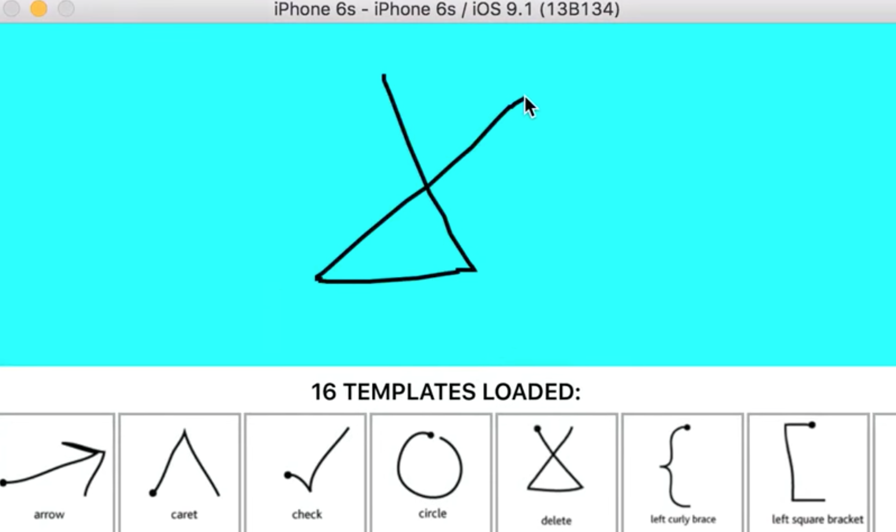](https://www.youtube.com/watch?v=P7wQVkmTkPY)

Mathias Eitz, James Hays & Marc Alexa, [*How Do Humans Sketch Objects?*](https://vimeo.com/149471168) (2015)
[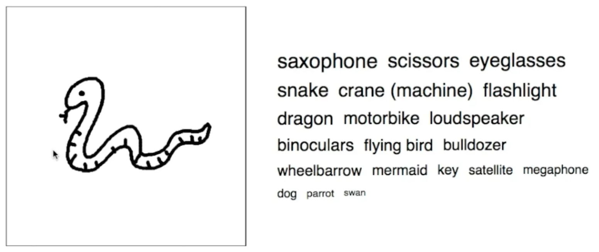](https://vimeo.com/149471168)

Coding Train: [Doodle Classifier](https://www.youtube.com/watch?v=pqY_Tn2SIVA&list=PLRqwX-V7Uu6Zs14zKVuTuit6jApJgoYZQ) 
[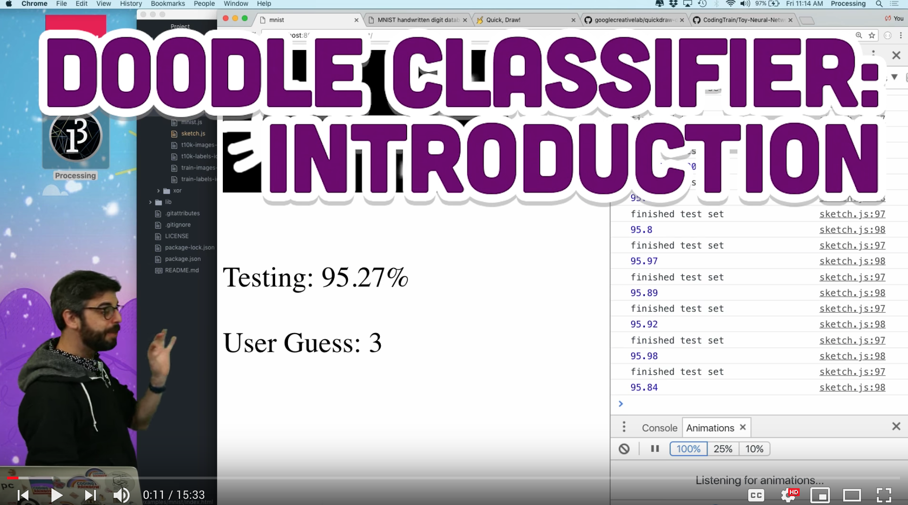](https://www.youtube.com/watch?v=pqY_Tn2SIVA&list=PLRqwX-V7Uu6Zs14zKVuTuit6jApJgoYZQ)

Google *Quick, Draw*
* [https://quickdraw.withgoogle.com/](https://quickdraw.withgoogle.com/)
* [https://quickdraw.withgoogle.com/data](https://quickdraw.withgoogle.com/data)

#### Synthesis

ml5.js Sketch-RNN [cat synthesizer](https://ml5js.org/docs/sketchrnn-example) 

Coding Train #128 (21'): [Sketch-RNN Snowflakes with ml5.js](https://www.youtube.com/watch?v=pdaNttb7Mr8) 

#### Interactive Completion etc.

Microsoft, [*ShadowDraw*](https://www.youtube.com/watch?v=zh_-HUdQwow) (2011) 

https://www.youtube.com/watch?v=zh_-HUdQwow

Magenta [*Magic Sketchpad*](https://magic-sketchpad.glitch.me/)

Magenta Sketch-RNN multi-predict [drawing completion demo](https://magenta.tensorflow.org/assets/sketch_rnn_demo/multi_predict.html) 

Magenta Sketch-RNN [interpolation demo](https://magenta.tensorflow.org/assets/sketch_rnn_demo/interp.html) 

Magenta Sketch-RNN Demo
https://magenta.tensorflow.org/assets/sketch_rnn_demo/index.html

https://magenta.tensorflow.org/sketch-rnn-demo

---

### Student Project: *Human Lines* by Akiva Krauthamer

[Akiva Krauthamer](http://www.akivadesign.com/default.html) was an undergraduate in the CMU School of Drama who took our *Interactive Art* advanced studio course in 2016. For his final project, he created [*Human Lines*](http://golancourses.net/2016/akiva/04/28/human-lines/), a system which used a performer's speech and body to create drawings in space. Two of his key inspirations were: 

1. William Forsythe, [*Improvisation Technologies*](https://www.youtube.com/watch?time_continue=4&v=6X29OjcBHG8) (1995) 

 * [William Forsythe, example 1](https://www.youtube.com/watch?time_continue=4&v=6X29OjcBHG8)
 * [William Forsythe, example 2](https://www.youtube.com/watch?time_continue=5&v=cqGyFiEXXIQ)
2. Chris Schmandt, [*Put that There*](https://www.youtube.com/watch?v=RyBEUyEtxQo) (1979) 

Akiva's [*Human Lines*](http://golancourses.net/2016/akiva/04/28/human-lines/) project uses the Kinect skeleton tracking and real-time speech-to-text to enable voice-created lines on the body: 
 
 

