## Extrapolating the Human Form<br />

*Over the past 150 years, a variety of scientific and artistic work has sought creative new ways of understanding, visualizing, and expanding our concept of the dynamic human form. This work has operated both analytically and expressively — often with the aid of new technologies (such as cinema and computers) and new languages (such as visual abstraction).* 

### Precursors: Chronophotography

In the 1880s, roughly fifty years after the invention of chemical photography, improvements to camera technologies (such as shorter exposure times, and electrical timers) enabled the first *chronophotographic* studies of human and animal motion. investigations by hybrid photographer-inventors like Étienne-Jules Marey and Eadweard Muybridge set the stage for the development of cinema in the early 1890s by Thomas Edison and others. 

[**Étienne-Jules Marey**](https://en.wikipedia.org/wiki/%C3%89tienne-Jules_Marey) (1830-1904) was a French scientist, physiologist and chronophotographer. In 1883, he developed this [*Motion capture suit*](), whose skeletal markers show a striking resemblance to today's motion capture systems:<br />
[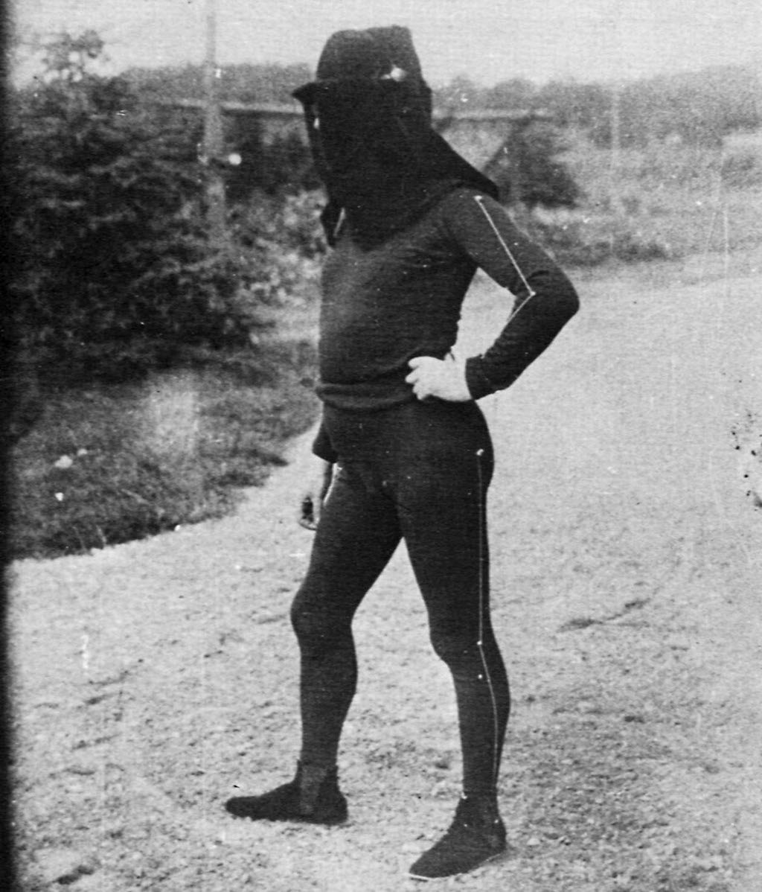]()

*Chronophotography of a walking man* by Marey (c.1883), produced with the above suit:<br/>
[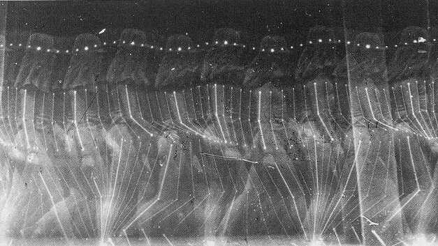]()

Some chronophotographers favored the use of multiple exposures superimposed on a single photographic negative, while others used multiple cameras to produce separate images. Marey recorded his subjects with a *chronophotographic gun*, which he developed in 1882:<br />
[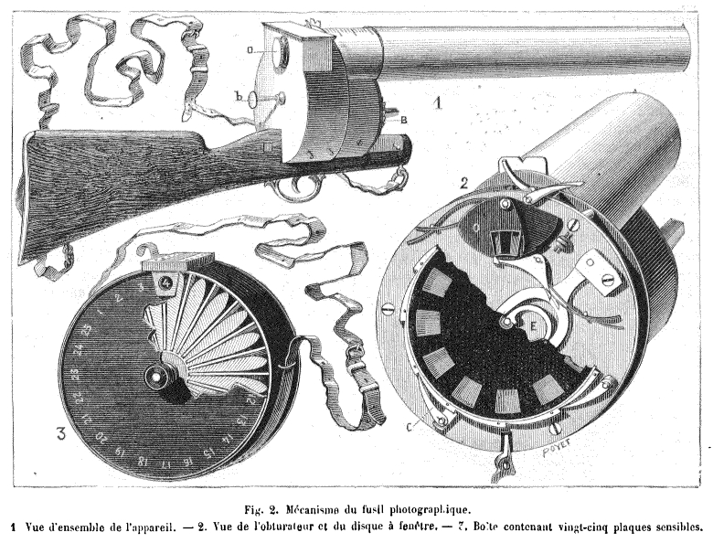](https://hyperallergic.com/197464/the-scientist-who-shot-his-photos-with-a-gun-and-inspired-futurism/)

[**Eadweard Muybridge**](https://en.wikipedia.org/wiki/Eadweard_Muybridge) (1830-1904) was an English chronophotographer and inventor. Whereas Marey used one camera, Muybridge used banks of multiple cameras, electrically triggered in quick succession, to capture and analyze the motion of people and animals. [In 1872](https://en.wikipedia.org/wiki/Eadweard_Muybridge#Stanford_and_horse_gaits), he settled a significant question of the day, proving that horses do have all four hooves off the ground during their running stride.

[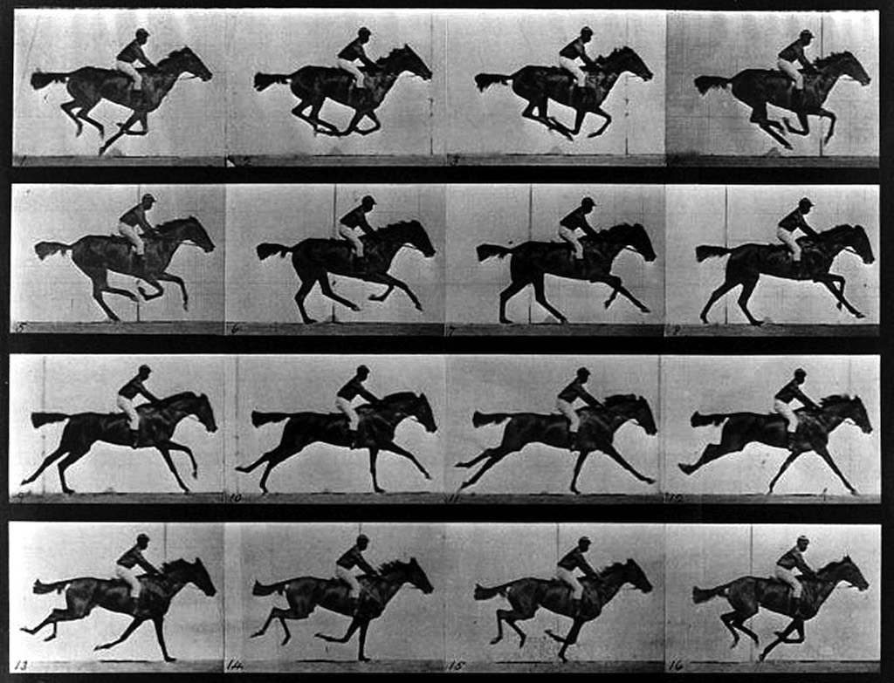](https://en.wikipedia.org/wiki/Eadweard_Muybridge#Stanford_and_horse_gaits)

Between 1883 and 1886, with the support of the University of Pennsylvania, Muybridge recorded more than 100,000 images to study the movement of people in his studio, and animals from the Philadelphia Zoo. In addition to triggering multiple cameras in sequence, he also conducted early experiments in what is now called 'bullet time', i.e. multiple cameras triggered simultaneously. An example is this self-portrait:<br />
[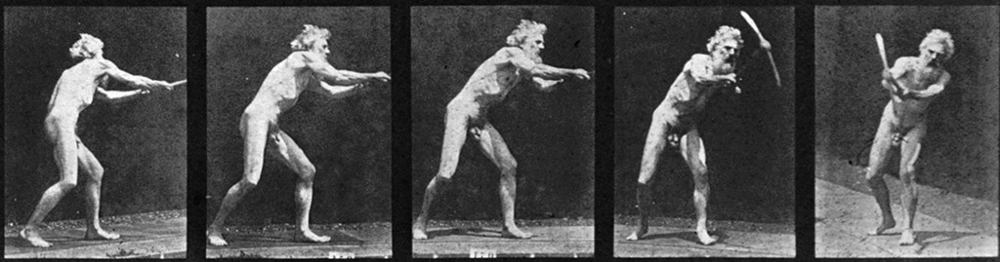](https://www.google.com/culturalinstitute/beta/asset/a-walking-b-ascending-a-step-c-throwing-the-disk-d-using-a-shovel-e-f-using-a-pick/6wFR0GZsFQkuFg) 

[](http://www.stephenherbert.co.uk/MuybridgePatents.htm)

Muybridge's efforts were published as 781 multi-image plates in a landmark book, [Human and Animal Locomotion](http://www.jessethompsonart.com/artpage/risd_figure_files/Muybridge%20-%20The%20Human%20Figure%20In%20Motion.pdf) (1887), which included this *Woman walking down steps*:
[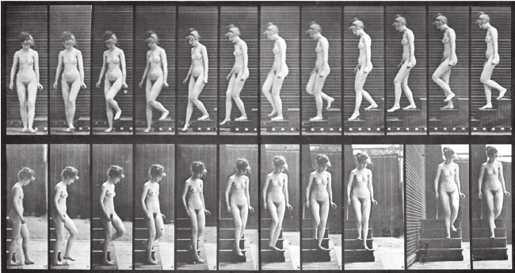]()

Around 1915, [**Frank** (1868-1924) and **Lillian Gilbreth** (1878-1972)](https://www.youtube.com/watch?v=g3sj7G7KSSU) developed a different technique for conducting chronophotographic time-motion studies, with the goal of reducing repetitive work cycles to their shortest and most efficient sequence of gestures. Their [*chronocyclegraph*](http://we-make-money-not-art.com/the_chronocyclegraph/) was essentially a long-exposure or time-lapse phorograph of lights attached to moving human bodies.

[Motion Efficiency Study](http://we-make-money-not-art.com/the_chronocyclegraph/) (1914) by Frank and Lillian Gilbreth:<br />
[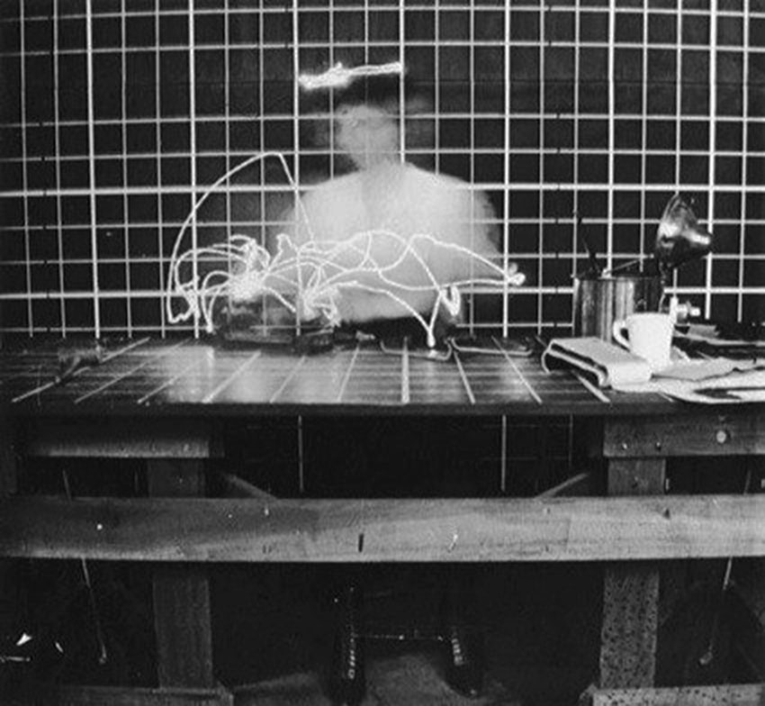](http://we-make-money-not-art.com/the_chronocyclegraph/)

``` 
	To look for this optimal “relationship of human effort to the volume 
	of work that the effort accomplishes”, they attached a camera to a
	timing device and photographed workers performing various tasks. The 
	motion paths were traced by small lamps fastened to the worker’s 
	hands or fingers. [...] The objective of the research was to 
	minimize arm movement and hence speed and ease manual work. 
	The Gilbreths' findings were used in assembly lines but they also 
	found their way into other contexts: they were the first to 
	propose that a nurse would assist the surgeon, by handing them 
	surgical instruments as called for.
```

[**Harold Edgerton**](https://www.youtube.com/watch?v=2rqad0feX6M) (1903-1990) invented the strobe light in 1931. The invention allowed for photographic exposures as brief as a microsecond or less, enabling significant progress in what Edgerton termed *stroboscopy*. Using these techniques, Edgerton recorded, for example, a person jumping rope in 1952:<br />


American choreographer [**William Forsythe**](https://en.wikipedia.org/wiki/William_Forsythe_(choreographer)) (born 1949) served as artistic director of the Frankfurt Ballet from 1984 until 2004. Recognized for the integration of ballet and visual arts, he brought about a "shift of paradigms in contemporary dance", through a combination of abstraction and forceful theatricality. In 1999, Forsythe released "[Improvisation Technologies](https://www.youtube.com/user/GrandpaSafari/videos)", a CD-ROM that detailed his vision of choreography as an organizational practice. The disc consists of short videos that explain fundamental primitives, as Forsythe sees them, of human movement and the language of dance. These are illustrated through (2D) white lines that have been hand-rotoscoped onto the video. Despite their formal and  techical simplicity, the results are extremely compelling. 

[*"Point Point Line"*](https://www.youtube.com/watch?v=6X29OjcBHG8) by William Forsythe<br />
[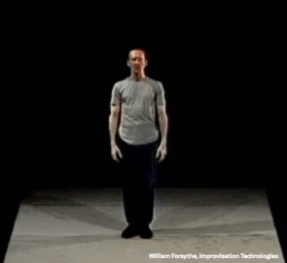](https://www.youtube.com/watch?v=6X29OjcBHG8)

[*"Dropping Curves"*](https://www.youtube.com/watch?v=_zt95yXWLX4) by William Forsythe<br />
[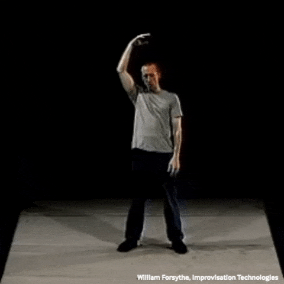](https://www.youtube.com/watch?v=_zt95yXWLX4)

<hr />

### Augmentation of the Human Form in Visual Modernism: <br />Cubism, Futurism, Bauhaus, and Beyond

Chronophotography influenced the ideas and visual languages of early modernist art movements. *Cubists* were interested in how painting could deconstruct and represent dynamic subjects. *Futurists* were interested in how artworks could valorize the speed and kinetics of the 20th century. Artists and designers in the German *Bauhaus* were interested in understanding the foundational principles underlying the structural elements of form, color, and movement. 

[*Nu descendant un escalier n°2*](https://en.wikipedia.org/wiki/Nude_Descending_a_Staircase,_No._2) (1912) by Marcel Duchamp 
[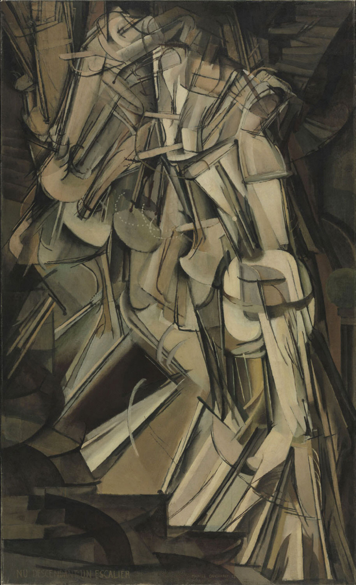](https://en.wikipedia.org/wiki/Nude_Descending_a_Staircase,_No._2)

[*Unique Forms of Continuity in Space*](https://en.wikipedia.org/wiki/Unique_Forms_of_Continuity_in_Space) (1913) by Umberto Boccioni (1882-1916)
[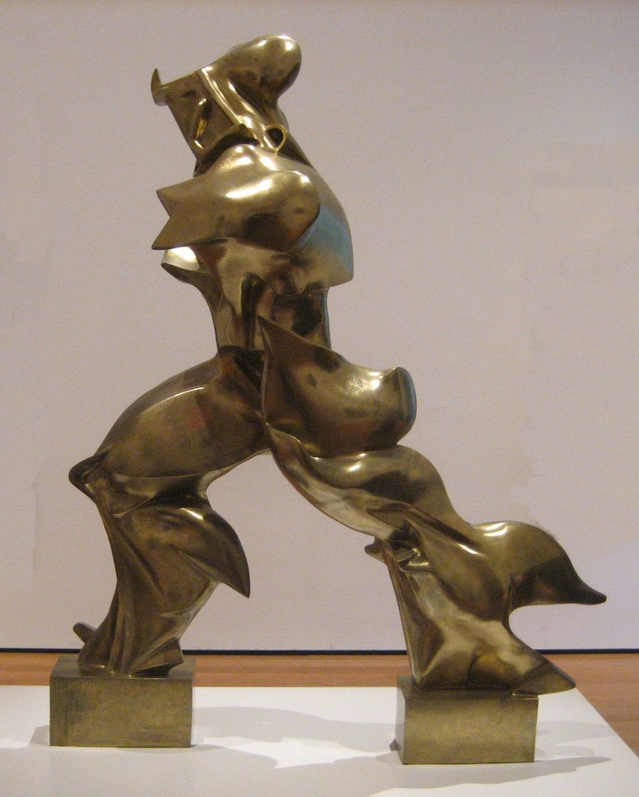](https://en.wikipedia.org/wiki/Unique_Forms_of_Continuity_in_Space)

[Oskar Schlemmer](https://alchetron.com/Oskar-Schlemmer) (1888-1943) was a German sculptor, designer and choreographer. In 1923 he joined the Bauhaus theater department as Master of Form, after working at the school's sculpture workshop. In his performances, actors are transfigured into geometrical shapes, or equivalently, living sculptures. He developed the analytic [*Stelzenläufer*](https://www.youtube.com/watch?v=0j0x325uR8s) (Slat Dance) in 1927:<br />
[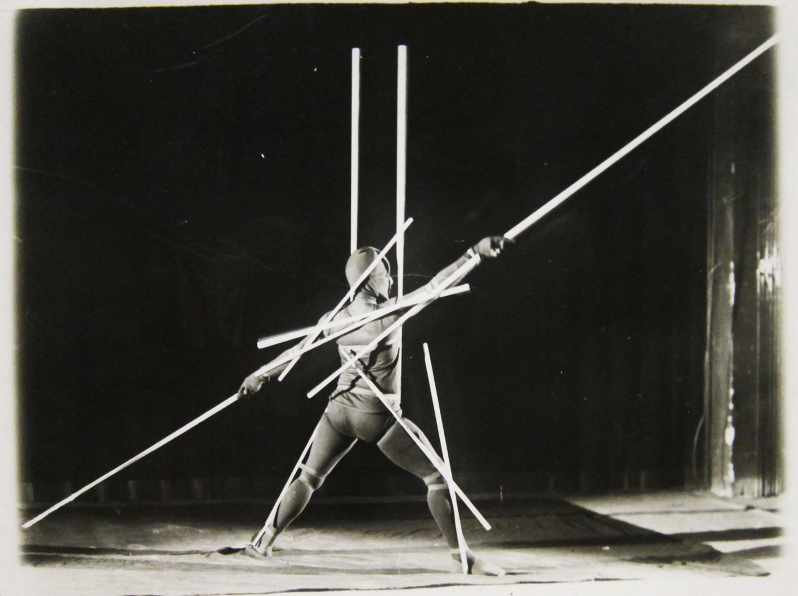](https://www.youtube.com/watch?v=0j0x325uR8s)

[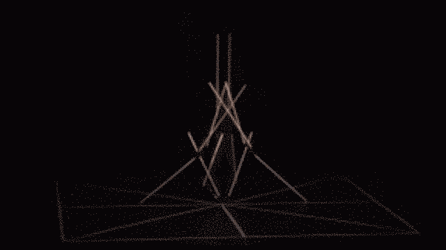](https://www.youtube.com/watch?v=0j0x325uR8s)

Some more expressive and marvelously weird interpretations of the human form can be seen in Schlemmer's 1922 masterwork, [*Triadic Ballet*](https://www.youtube.com/watch?v=mHQmnumnNgo) (recreated 1970). There are tight relationships betweeen the characters' appearance, and their styles of movement:<br />
[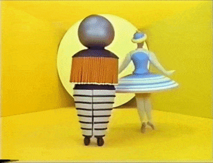](https://www.youtube.com/watch?v=mHQmnumnNgo)

*Since World War II, many artists have explored more psychological extrapolations of the human form.*

**Niki de Saint Phalle** (1930–2002) was born in France and grew up in New York. She is known for creating numerous giant, voluptuous 'Nana' sculptures. Although easily interpreted as joyful, happy sculptures, the Nanas "have a powerful intention as an amplification of femininity. ‘They are an army of women sent to take over the world’, as Saint Phalle’s granddaughter, Bloum Cardenas, [put it](https://www.apollo-magazine.com/feminine-critique-niki-de-saint-phalle-guggenheim-bilbao/)." Niki de Saint Phalle's insistence on exuberance, sensuality, figuration, and bold use of color often ran counter to the prevailing mid-century trends in minimalist abstraction.
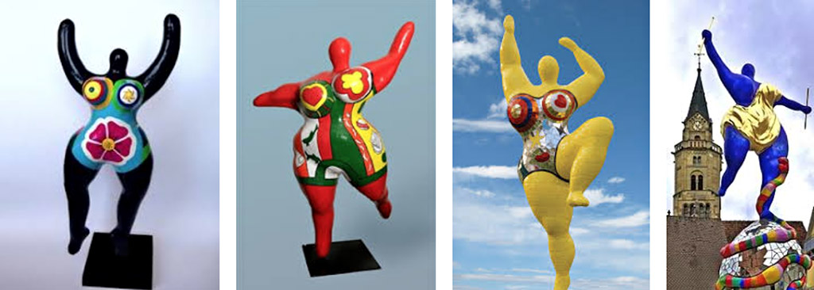<br />
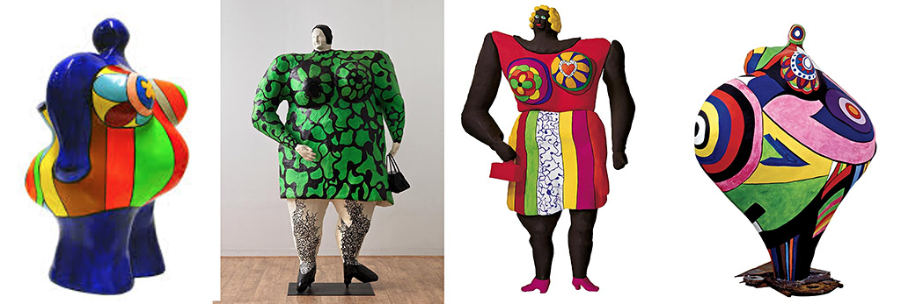

Niki de Saint-Phalle in 1955:<br />
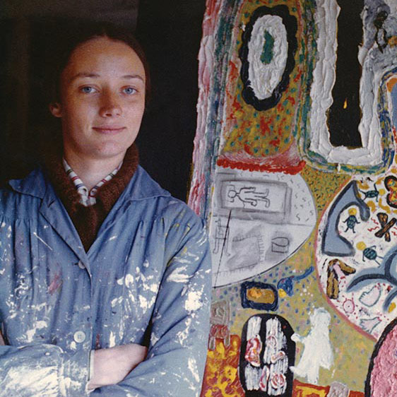

More recently, we can see formally inventive, evocative, yet subdued abstractions of the human form in the work of British sculptor, **Antony Gormley** (born 1950): <br />
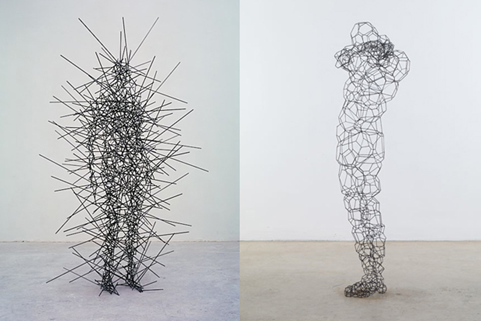

*Feeling Material* (2005) by Antony Gormley:<br />
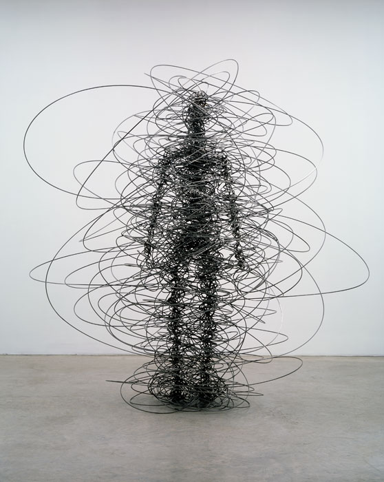

*Domain Field* (2004) by Antony Gormley:<br />
[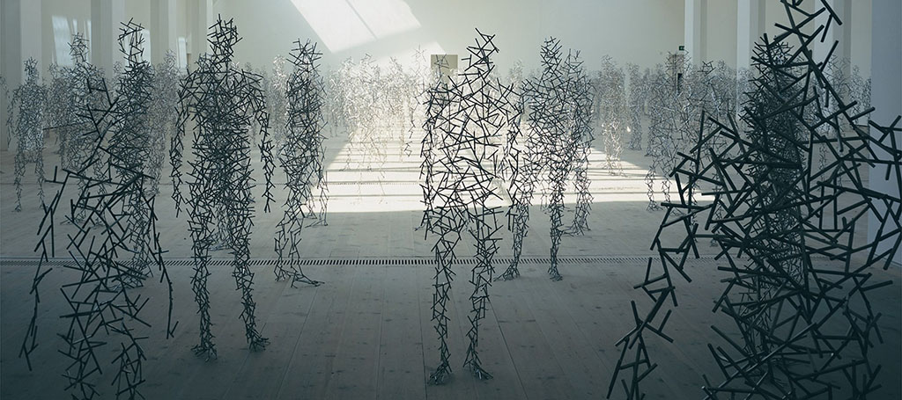](http://balticplus.uk/antony-gormley-domain-field-allotment-body,-fruit,-earth-e31/)

<hr />

### The (Digital) Human Form

William Fetter (1928-2002), a Boeing art director, *coined the term "computer graphics"* in a 1960 description of his work on cockpit design. In 1964 Fetter became the first person to draw a human figure using a computer. This figure is known as the "[Boeing Man](http://www.boeingimages.com/archive/William%20Fetter's%20Boeing%20Man-2F3XC5YCZNC.html)":<br />
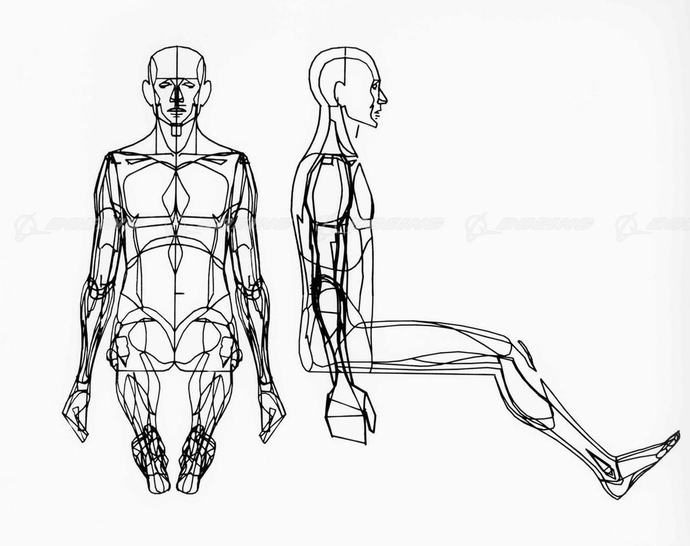

Although the Boeing Man was plotted in different positions, no film animation is known to exist.<br />
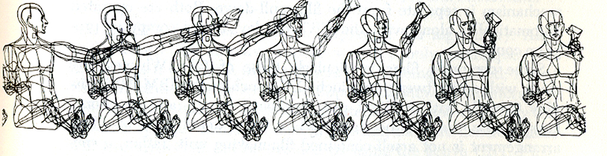

The [first computer-generated 3D animation](https://www.youtube.com/watch?v=wdedV81UQ5k) is believed to have been created in 1972 at the University of Utah by Frank Parke and Ed Catmull, one of the founders of Pixar. It is a study of a human hand, whose dimensions were captured from a plaster model with a position measuring device.<br />
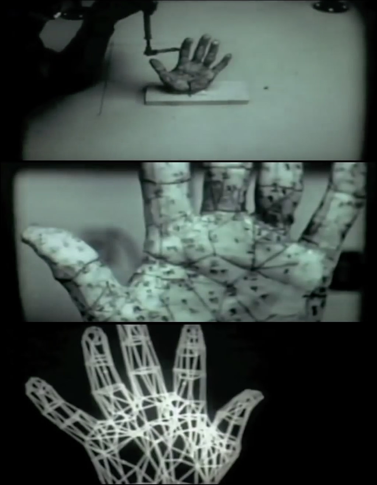

[**Rebecca Allen**](http://www.rebeccaallen.com) (born 1954) is a pioneering computer artist, known for creating 3D computer graphics, animation, music videos, video games, performance works, artificial life systems, multisensory interfaces, interactive installations, VR and mixed realities. In the early 1980s, Allen became known for developing new techniques for modeling and animating virtual human forms. 

In 1982, Allen [created a dancing computer generated character](http://www.rebeccaallen.com/projects/catherine-wheel) who plays the role of St. Catherine in Twyla Tharp's 90 minute video dance piece, "[The Catherine Wheel](https://player.vimeo.com/video/122219667)", with music by David Byrne. This was one of the first examples of 3D computer generated human motion, and the first to be aired on television.<br />
[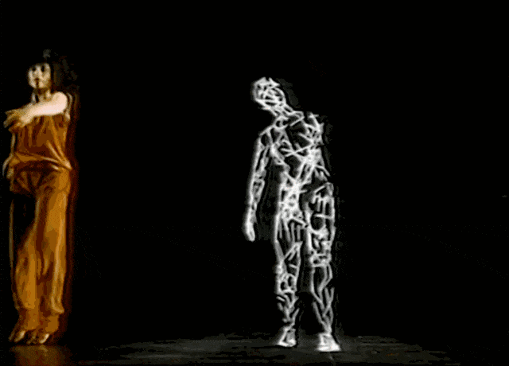](https://player.vimeo.com/video/122219667)

Rebecca Allen made significant leaps in the representation and animation of the human form in a [1986 music-video collaboration with Kraftwerk](https://vimeo.com/49165789), pioneers of the techno music idiom. As 3D scanners did not yet exist, Allen developed her own techniques for digitizing the heads of the four band members.<br />
[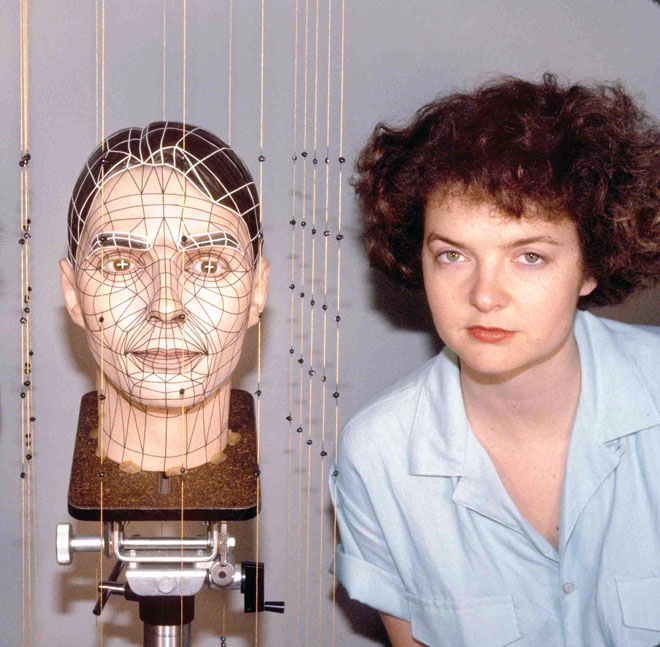](https://www.wired.com/2012/04/kraftwerk-rebecca-allen/)

[](https://vimeo.com/49165789)

*A good deal of recent work walks a line between analytic and imaginative, expressive interpretations of the human form.*

[*Forms*](https://vimeo.com/38017188) (2012) by Memo Akten and Davide Quayola (2012) investigates the movements of athletes, using footage from the Commonwealth Games. "Rather than focusing on observable trajectories, it explores techniques of extrapolation to sculpt abstract forms, visualizing unseen relationships – power, balance, grace and conflict – between the body and its surroundings."<br />
[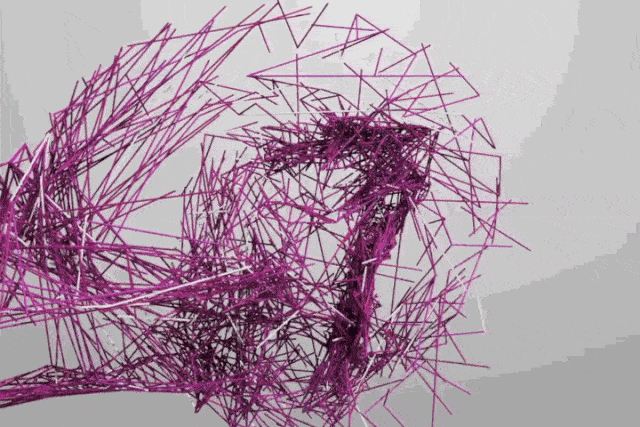](https://vimeo.com/38017188)

[*Kung Fu Motion Visualization*](https://vimeo.com/163153865) by Tobias Gremmler (2016) consists of a series of studies, the most interesting of which, in my opinion, is Variation #2, *"Velocity transforms into matter"*. In this sequence (0:36-1:03), particles are displayed whose opacity is proportional to the speed of the performer's body in that location. Only moving parts of the body are shown, while stationary parts remain invisible.<br />
[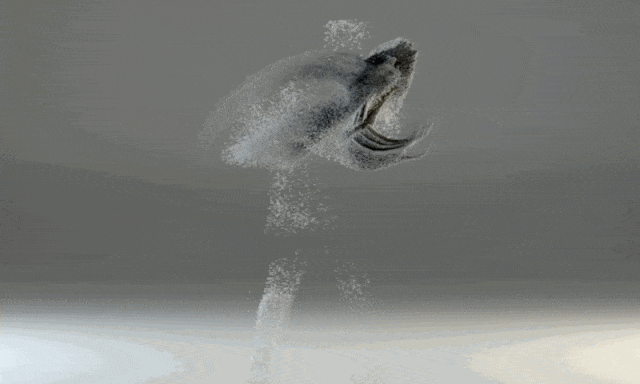](https://vimeo.com/163153865)

[*unnamed soundsculpture*](https://vimeo.com/38840688) by Daniel Franke and Cedric Kiefer (2012)<br />
[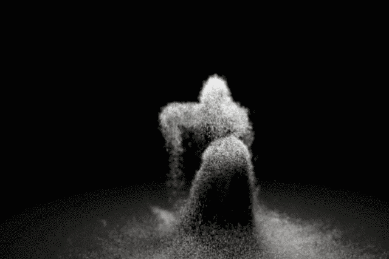](https://vimeo.com/38840688)

[*MTV / Joy x 1000% / Mister Furry*](https://vimeo.com/5395669) by Universal Everything (2009):<br />
[](https://vimeo.com/5395669)

[*Furry's Posse*](https://vimeo.com/7467703) by Universal Everything (2009):<br />
[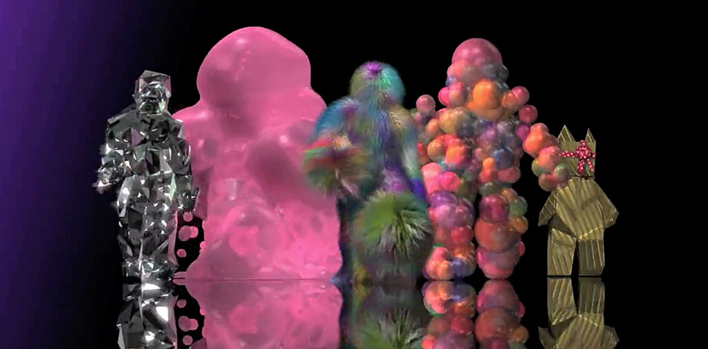](https://vimeo.com/7467703)

[*Walking City*](https://vimeo.com/85596568) by Universal Everything (2014) demonstrates terrific restraint:<br />
[](https://vimeo.com/85596568)

[*2016 AICP Sponsor Reel*](https://vimeo.com/169599296) by Method Design (2016) reel shows off a series of highly stylized transformations of the human body, augmented in many instances by simulated physics:<br />
[](https://vimeo.com/169599296)

[*Moodles*](https://vimeo.com/240466644) by [Ari Weinkle](http://ariweinkle.com/) (2017) is a series of short animations, in which a human form is undone through expressive transformations that metaphorically represent various emotions.<br />
[](https://vimeo.com/240466644)<br />

[*GVoxelizer*](https://twitter.com/_kzr/status/925379137203617792) by Keijiro Takahashi (2017)<br />
[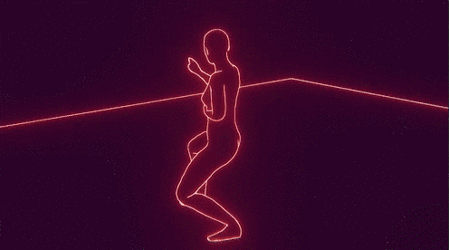](https://twitter.com/_kzr/status/925379137203617792)<br />
[More](https://twitter.com/_kzr/status/929634393424986113) & [more](https://twitter.com/_kzr/status/927544770968162304) works by Takahashi.

Zachary Lieberman is a Brooklyn-based media artist, co-founder of openFrameworks, and co-founder of the School for Poetic Computation. For the past couple of years, he has [posted daily computational sketches on Instagram](https://www.instagram.com/zach.lieberman/). Many of these interpret the human body, often using extremely simple, yet elegant, means. In this 2016 sketch, Lieberman connects 3D motion-capture points with simulated (springy) ropes: <br />
[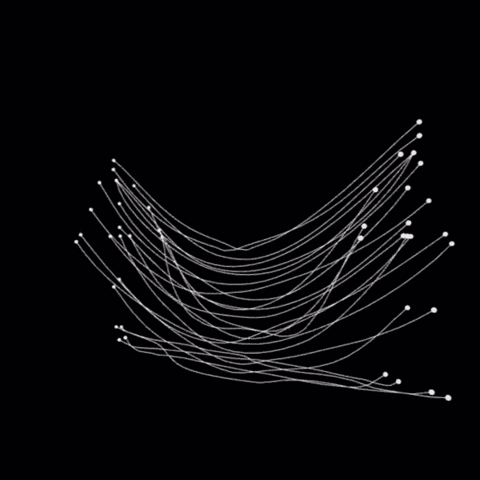](https://www.instagram.com/p/BHH3rwhANKg/)

*Plenty of interesting augmentations of the body can be performed in 2D.* In this 2016 sketch, Lieberman selects various triads of joint coordinates, and connects them with a (2D) circle: [*Walk Cycle / Circle Study*](https://www.instagram.com/p/BEP-OYCpNqg/):<br /> 
[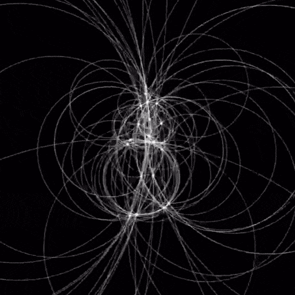](https://www.instagram.com/p/BEP-OYCpNqg/)

In this 2016 [sketch](https://www.instagram.com/p/BIiBomrgvQn/), Lieberman performs 2D transformations of a 2D silhouette, obtained with a regular video camera: <br />
[](https://www.instagram.com/p/BIiBomrgvQn/)

Some other pertinent sketches by Zachary Lieberman include:<br />
- [https://www.instagram.com/p/BOwc--TBL7Z/](https://www.instagram.com/p/BOwc--TBL7Z/)
- [https://www.instagram.com/p/BNfM17tBi3P/](https://www.instagram.com/p/BNfM17tBi3P/)
- [https://www.instagram.com/p/BJt3c4QglsZ/](https://www.instagram.com/p/BJt3c4QglsZ/)
- [https://www.instagram.com/p/BI6WWERA1kg/](https://www.instagram.com/p/BI6WWERA1kg/)
- [https://www.instagram.com/p/BHS98yIg17h/](https://www.instagram.com/p/BHS98yIg17h/)
- [https://www.instagram.com/p/BHBKPsgAOA0/](https://www.instagram.com/p/BHBKPsgAOA0/)

[Kristyn Janae Solie](http://kyttenjanae.tumblr.com/) (kyttenjanae) is a Los Angeles-based artist in her early 20s. She creates diverse and imaginative figurative work, including many AR sketches, [released primarily through Instagram](https://www.instagram.com/kyttenjanae/?hl=en). <br />

[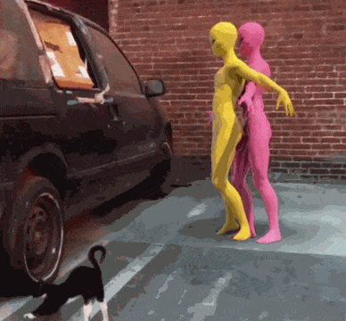](https://www.instagram.com/p/BZC4pe3nSw2)

Some other recommended works by Kyttenjanae include: <br />
- [https://www.instagram.com/p/BNx8T5mjjr5/](https://www.instagram.com/p/BNx8T5mjjr5/)
- [https://www.instagram.com/p/BDmmm98xQcF/](https://www.instagram.com/p/BDmmm98xQcF/)
- [https://www.instagram.com/p/BOVszAijlU3/](https://www.instagram.com/p/BOVszAijlU3/)
- [https://www.instagram.com/p/BJJq8zTj2nN/](https://www.instagram.com/p/BJJq8zTj2nN/)
- [https://www.instagram.com/p/BGSbEB6xQQu/](https://www.instagram.com/p/BGSbEB6xQQu/)
- [https://www.instagram.com/p/BFcuOWDRQd8/](https://www.instagram.com/p/BFcuOWDRQd8/)
- [https://www.instagram.com/p/BEpZAgARQZK/](https://www.instagram.com/p/BEpZAgARQZK/)
- [https://www.instagram.com/p/BEmWsF2xQZb/](https://www.instagram.com/p/BEmWsF2xQZb/)

Animator **David Lewandowski** brought a 'rubber man' to life, after experiencing CGI malfunctions while doing digital effects in Hollywood. Lewandowski [explains](https://www.fastcompany.com/3021356/the-vfx-wiz-behind-youtubes-viral-rubber-man-on-the-beauty-of-horrible-mistakes), “If rigs get bound to the facial geometry just a few units off center, the character’s face explodes. His eyeballs go one mile in one direction, the back of his head goes one mile in the other direction, and the photo-realistic teeth stay in place talking to the camera, married to the audio. The other animators would go ‘delete delete delete’ but I thought that stuff was hysterical.” During the year he spent animating Tron: Legacy, Lewandowski became increasingly captivated with VFX screw-ups. “As I explored how things go wrong in character animation, I realized there might be an appetite for things that break in these beautiful and grotesque ways.”

*Going to the Store* (2011) by David Lewandowski<br />
[](https://www.youtube.com/watch?v=iRZ2Sh5-XuM)

*Late for Meeting* (2013) by David Lewandowski<br />
[](https://www.youtube.com/watch?v= wBqM2ytqHY4)

*Time for Sushi* (2017) by David Lewandowski<br />
[](https://www.youtube.com/watch?v=bcXiwNjkhxU)

"*Goodbye Uncanny Valley*" by Alan Warburton (2017) is an excellent insider's view on where we stand now, in relation to the computer's capacity for photorealism. <br />
[](https://vimeo.com/237568588)

<hr />

### Example Studies by CMU Undergraduate Students

*Students in 60-212 were asked to "write software which
creatively interprets, or responds to, the actions of the body: You will develop a computational treatment for motion-capture data. Ideally, both your treatment, and your motion-capture data, will be ‘tightly coupled’ to each other: The treatment will be designed for specific motion-capture data, and the motion-capture data will be intentionally selected or performed for your specific treatment.* Below are some responses. 

[*Motion capture study*](http://cmuems.com/2016/60212/ngdon/11/08/ngdon-mocap/) by Lingdong Huang (2016). In this study by an Art sophomore, ribbons circulate around motion-capture data made available by the members of Perfume, a Japanese pop trio.<br />
[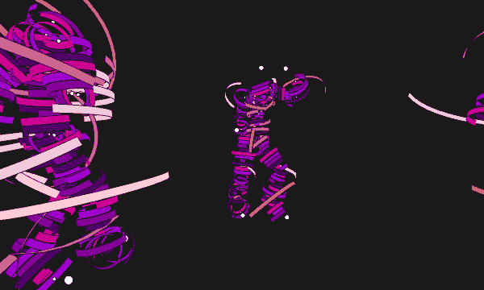](http://cmuems.com/2016/60212/ngdon/11/08/ngdon-mocap/)

[*Motion capture study*](http://cmuems.com/2016/60212/krawleb/11/15/krawleb-mocap/) by Katrina Chaudoin & Kaleb Crawford (2016). This study, a collaboration between an Art sophomore and a Design junior, explores how a digital body enables operations like copy-paste. Here, the dynamic form of the performer's arm is duplicated and translocated.<br />
[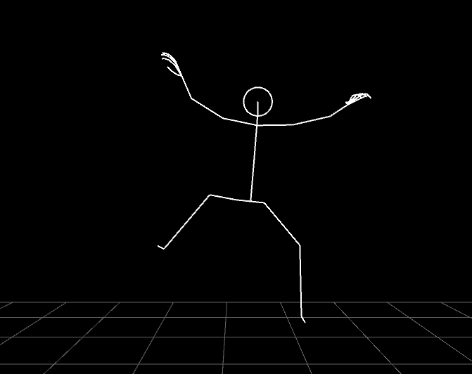](http://cmuems.com/2016/60212/krawleb/11/15/krawleb-mocap/)

