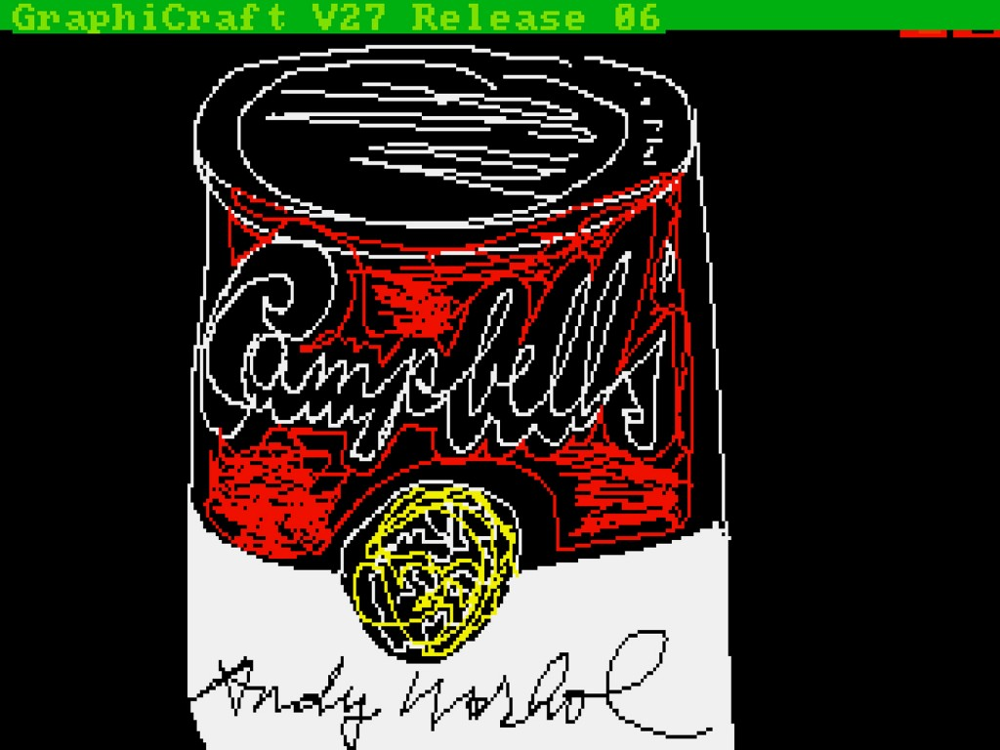
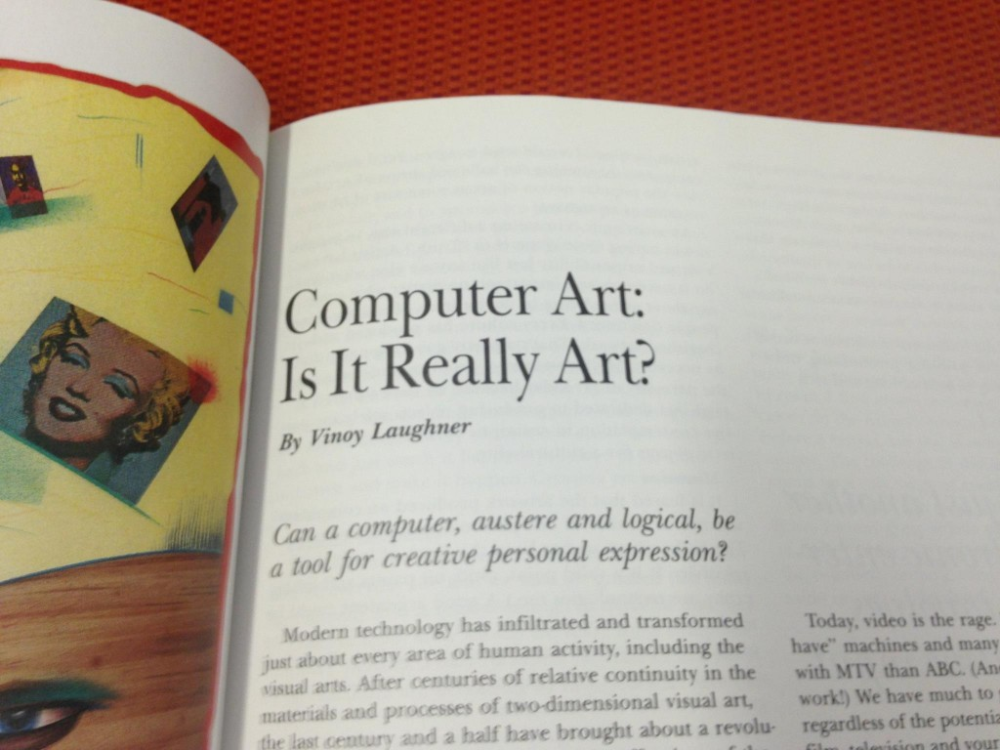
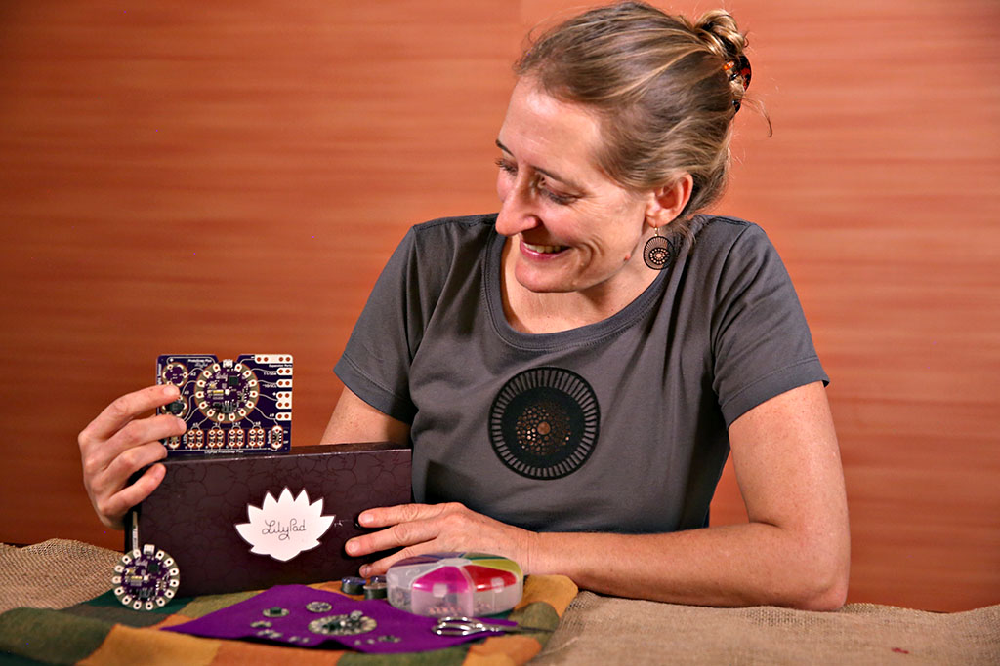
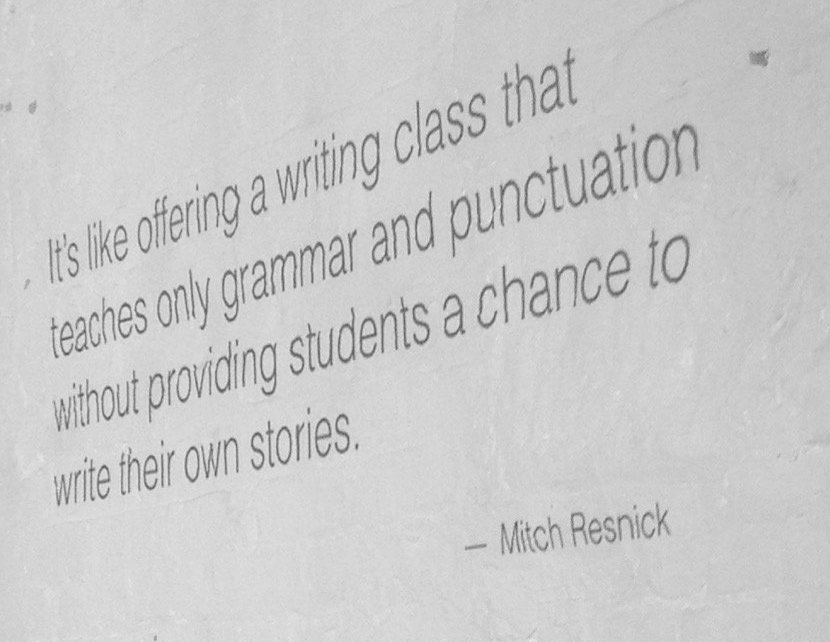
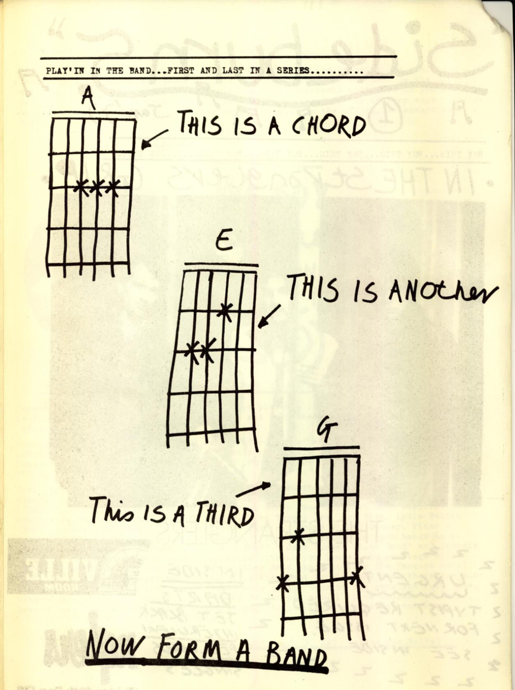
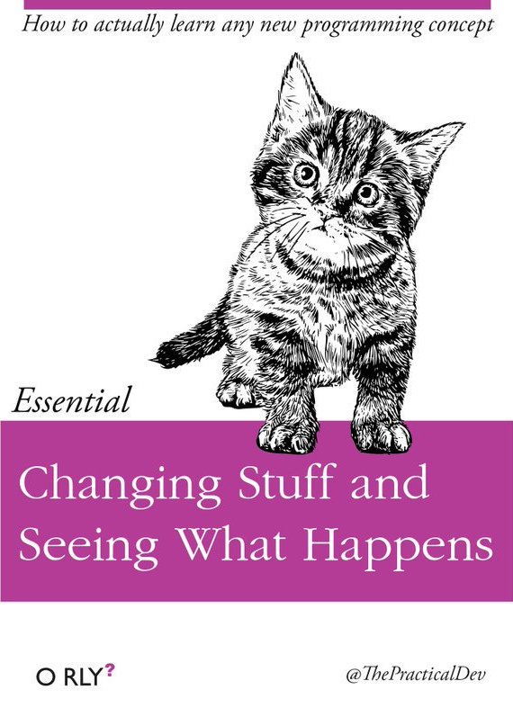
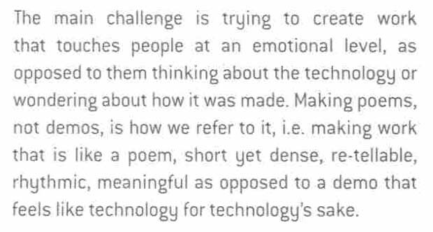
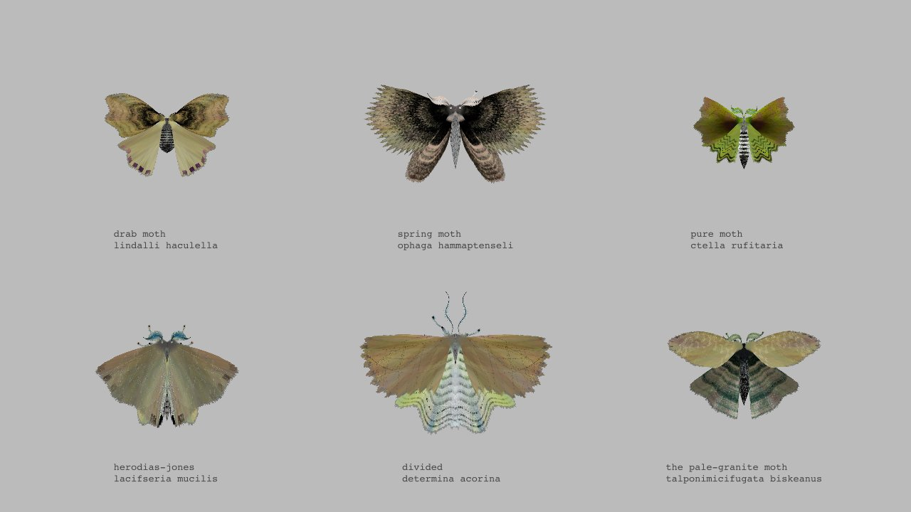
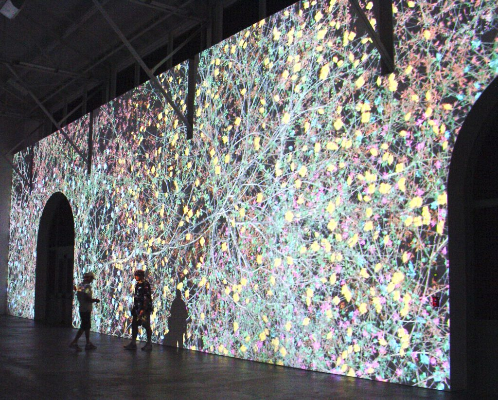
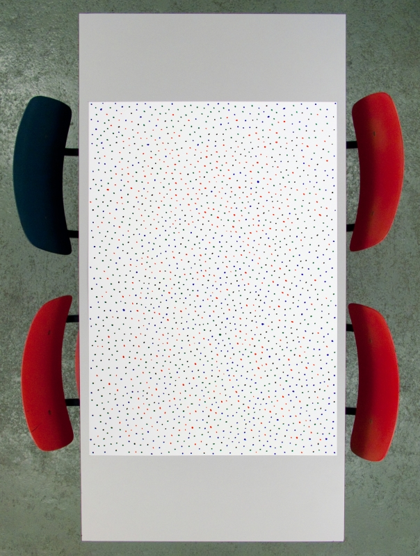

# An Introduction

*A first-day lesson plan for "Introduction to Interactivy and Computation" (60-210), a required course for sophomores at the Carnegie Mellon School of Art.*

#### Preliminaries

* Roll call
* What do you think this class is about? 
* What are some things you have seen?
* What are some skills you may have? 

---

## Orienting Ourselves

### Arting, with a Computer

In 1985, Andy Warhol, at the height of his career, and widely held to be the pre-eminent American artist, [made some drawings with a computer](http://studioforcreativeinquiry.org/projects/warhol-data-recovery). It was scandalous and provocative; most painters wouldn’t have been caught dead anywhere near a computer. Magazines wrote articles like the one below ("*Can a computer, austere and logical, be a tool for creative personal expression?*"). Does this attitude still exist today?

Nowadays, people use computers for *everything*. Photoshop and such tools have been around more than a quarter century. In this course, we will distinguish between art that happens to have been made on a compute, and art which necessarily requires the development of new technology (software, circuits). 

* *"When you use someone else's software, you are living in their dream."* — John Maeda

--

### Computing, Outside a School of Computer Science

* How many of you have taken a computer science course? More than one?
* As curious and creative people (inventors, artists, designers, musicians, etc.), in what ways have such courses disappointed you?
* How many of you came to Art School in order to avoid computers? 

Designer/educator/engineer, [Leah Buechley](http://leahbuechley.com/), has observed that STEM subjects generally fail to educate students who:

* learn *concretely* (from examples) rather than *abstractly* (from equations)
* work *improvisationally* rather than by *planning* everything in advance
* are interested in creating *expressive* objects, rather than *utilitarian* solutions.

Of traditional computer science introductions, educator-innovator Mitch Resnick has remarked, "It's like offering a writing class that teaches only grammar and punctuation without provideing students a chance to write their own stories."

**This class is intended to address that.**

It's possible that STEM education might benefit from the inclusion of arts-oriented pedagogic approaches. But that’s not the problem that concerns us in *this* room. Instead, in a world in which computing now touches every discipline, it should no longer be taken for granted that *computing must be taught by computer scientists*. Computer Science is a *discipline*, but programming is a *skill* (or a tool, or a medium, or better yet, a *craft*) which has different communities of use with different pedagogic needs. 

**“Creative coding”** describes the growing set of cultural practices by which artists, designers, architects, and poets employ computer programming and custom software as their chosen medium. This burgeoning field has been accelerated by the widespread adoption of open-source arts-engineering toolkits, such as Processing, p5.js, and openFrameworks, into the curricula of hundreds of art and design schools around the world. Created *by artists, for artists*, these toolkits are specifically oriented to the needs and working styles of cultural practitioners, and have radically democratized software development as a potent mode of creative inquiry. 

* Our objective is to make stirring and provocative new forms of culture.
* Our medium is software and electronics.
* We learn codecraft as necessary to execute our ideas.

We don't need much in order to make something powerful: 

We can learn by hands-on tinkering and experimentation: 

Also, *it takes a while:*

](https://www.youtube.com/watch?v= PbC4gqZGPSY)

The tools we are using were made by artist-educators who care a great deal to improve the experiences of new learners. They have made lots of great resources to help you, including written documentation and video tutorials. 

**Here are some of those people: **

* Here is Casey Reas and Ben Fry explaining the Processing [mission statement](https://vimeo.com/28117873).
* And here is [Lauren McCarthy introducing p5.js](http://hello.p5js.org/), a sibling project that is also part of the Processing family of tools.
* There are countless pitfalls waiting to bite you in the ass. Here's Zach Lieberman discussing [what can go wrong](https://vimeo.com/47203759?t=38m22s) (Jump to 38:22).

---

## Viewings 

### The Challenge

Zachary Lieberman, in IdN *Interaction Issue* (December 2012), describes the challenge of making art by writing software as follows: 

### Computer Art is more than 50 Years Old

[Lecture on Machine Art](http://cmuems.com/2014a/lectures/lecture-01-machine-art/)

### Some exemplary recent works of poetic computing

Unlike large Pixar productions with hundreds or sometimes thousands of credits, nearly all of these projects were created by just one or two individuals. This is often made possible (in part) by leveraging the strengths of open-source software toolkits for the arts. 

One defining characteristic of work that we can make with code is that it can be **interactive**: it can respond in a *unique* and *open-ended way* to its visitor/participant/observer. 

* Scott Snibbe, [*Boundary Functions*](https://www.snibbe.com/digital-art#/projects/interactive/boundaryfunctions/), 1998
* Camille Utterback & Romy Achituv, [Text Rain](https://www.youtube.com/watch?v=f_u3sSffS78), 1999
* Christine Sugrue, [*Delicate Boundaries*](http://csugrue.com/delicateboundaries/), 2007
* Camille Scherrer, [*Le Monde Des Montagnes*](https://vimeo.com/49153795), 2008
* Chris O'Shea, [*Hand from Above*](http://www.chrisoshea.org/hand-from-above), 2008
* Karolina Sobecka & James George, [*Sniff*](http://www.karolinasobecka.com/artwork/sniff), 2011
* Theo Watson & Emily Gobeille, [*Weather Worlds*](http://design-io.com/projects/WeatherWorlds/) (2013); [*Connected Worlds*](https://vimeo.com/13158551) (2015)
* Zachary Lieberman, [*Más Que la Cara*](https://vimeo.com/211271693), 2016
* Madeline Gannon, [*Mimus*](https://atonaton.com/mimus/), 2016

[*Moth Generator*](https://twitter.com/mothgenerator) by Everest Pipkin

Another defining characteristic of code as an artistic medium, is that it can be **generative**. We "*make a thing that makes a thing*": 

* Kate Compton, [*Puppets*](http://www.galaxykate.com/apps/unpublic/puppet/index.html), 2017
* Michael Chang, [*Generative Machines* Chrome Experiment](http://machines.chromeexperiments.com/)
* FIELD.io (Vera-Maria Glahn and Marcus Wendt), [Communion](https://vimeo.com/28227109), 2011
* Matthias Dörfelt, [*Munching*](https://www.mokafolio.de/works/Munching), 2014
* Nervous System (Jessica Rosenkrantz and Jesse Louis-Rosenburg): [generative jigsaw puzzles](https://n-e-r-v-o-u-s.com/projects/albums/generative-jigsaw-puzzles/); [*Cell Cycle* custom ring](https://n-e-r-v-o-u-s.com/cellCycle/?t=0); [*Kinematics Dress*](https://www.youtube.com/watch?v=6EK9MBJiFXU) 
* Lia, [*Filament Sculptures*](https://vimeo.com/85913081), 2013 
* Christopher Hesse (via Isola et al.), [Edges2Cats](https://affinelayer.com/pixsrv/index.html)

*Madame Curie* by Jennifer Steinkamp

New media works can also function as self-standing artworks, public installations, provocations, apps. and much more:

* Jacob Tonksi, [*Balance from Within*](https://vimeo.com/72826106), 2014
* Mouna Andraos & Melissa Mongiat, [*21 Balançoires*](https://vimeo.com/40980676), 2012
* Helen Evans & Heiko Hansen (HeHe), [*Nuage Vert*](http://hehe.org2.free.fr/?language=en), 2012
* Markus Kayser, [*Solar Sinter*](https://kayserworks.com/#/798817030644/), 2011
* Lauren McCarthy, [*Social Turkers*](http://lauren-mccarthy.com/Social-Turkers) and [*LAUREN*](http://lauren-mccarthy.com/LAUREN)
* Miranda July, [*Somebody* app](https://vimeo.com/105256055)

If time permits, we'll watch a bit of:

* Jonathan Minard & James George, [CLOUDS Documentary](https://cloudsdocumentary.com/)

---

## Activities

### Exercise 1: *Blind Drawing*

There are two drawings made by the Professor, Drawing-1 and Drawing-2.

* Divide students into pairs. Call one person of each pair X, the other Y.
* X students get Drawing-1.
* Y students get Drawing-2.
* Distribute blank paper and pens if necessary.
* Pairs sit back to back without looking at the other’s drawing
* X student describes their drawing to Y; Y tries to draw it from X's instructions.
Switch at a reasonable time.
* Y student describes their drawing to X; X tries to draw it from Y's instructions.
* Pin up the drawings at the end, so people can see. 
* Group by X/Y.
* Discuss the results.

### Exercise 2: *Conditional Design*

These exercises are by the [Conditional Design](https://conditionaldesign.org/) group. 

#### [*Knots*](https://vimeo.com/5559525)

**First Step:** 
The first player draws a line.
The other players draw a line that goes over and under the last drawn line.

**In Turns:** 
The player elongates his/her line on both ends. The elongations have to go over and under a line of another player and may not go over the line of the same color twice in a row.
When a line can no longer be elongated, it is considered dead for the rest of the game. When both ends of a line have died, the player may place a new line.

-- 

#### [*Kaleidoscope*](https://vimeo.com/4186304)

**Setup** 
Each player has one color pen.
The paper is divided into 4 imaginary segments, in which a player operates.
Each turn a player is either leader or follower.
The players decide which person may be the leader first.

**Play** 
Clockwise in turns a player is the leader, for approx. 30 sec. The other 3 people are the followers.
The leader draws freely in his segment using only straight lines.
The followers must mirror the drawing of the leader, synchronously while he/she is drawing.

**End** 
The ending of the game is decided by the player who proposed to play it.

--

#### [*The Beach*](https://vimeo.com/5311402)

**Instructions** 
Each turn, find the most empty space on the paper and place a dot in the middle of it.

---

## Individual Work (Before Next Session)

1. Create a (free) account on [OpenProcessing.org](https://www.openprocessing.org/).
1. Create a (free) account on the [p5.js Alpha Editor](https://alpha.editor.p5js.org/)
1. Spend some time browsing the [p5.js Examples](https://p5js.org/examples/). Examine at least six Examples, including their code. 
1. Spend some time browsing the [p5.js Reference](https://p5js.org/reference/). Examine at least 6 Reference pages, starting with the Shape commands. 
1. Browse [CreativeApplications.net](http://www.creativeapplications.net/) (using the login provided in class) and the [MediaArtTube](https://www.youtube.com/user/MediaArtTube/videos) YouTube channel. Identify a project you find interesting. Later this week, you will be asked to write a paragraph about this project. 

--- 

## What Questions do You Have? 

