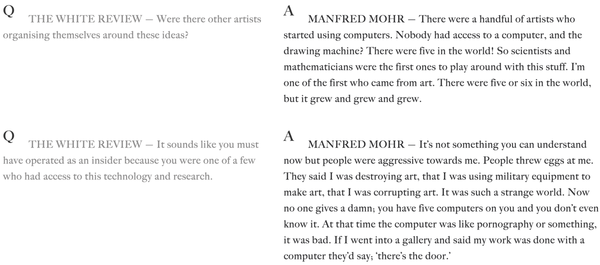
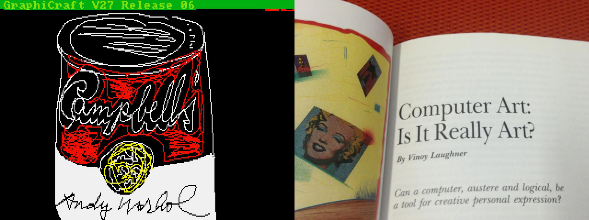
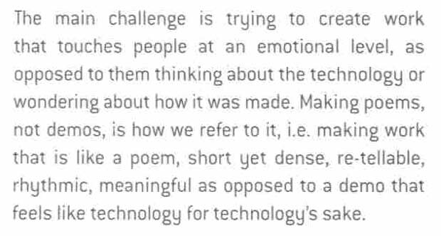
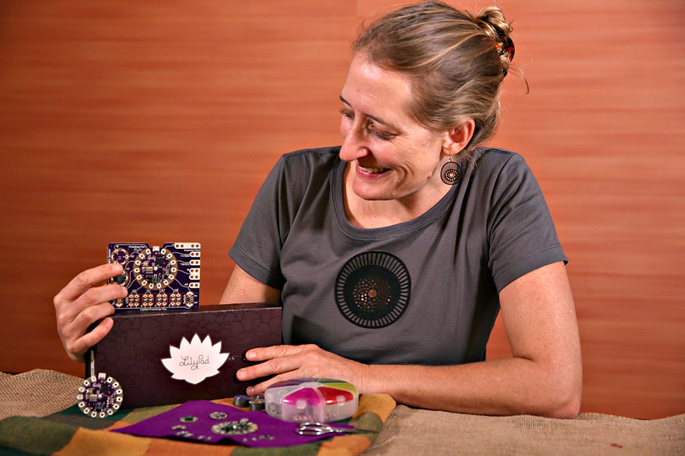
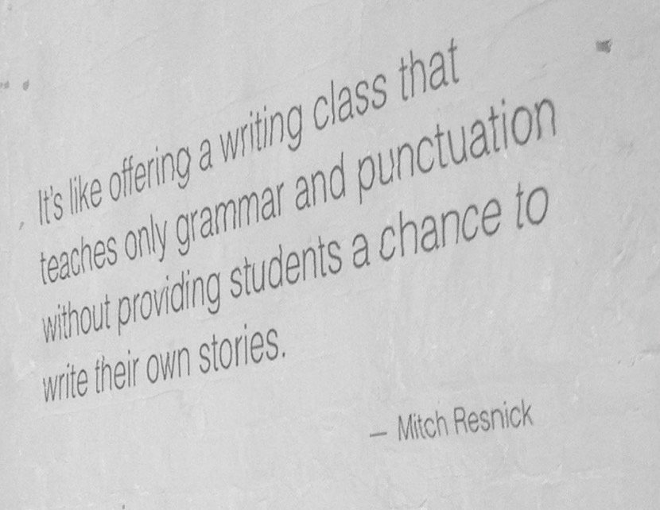
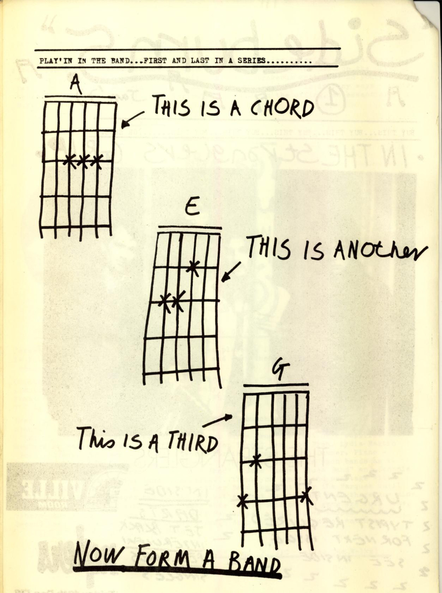
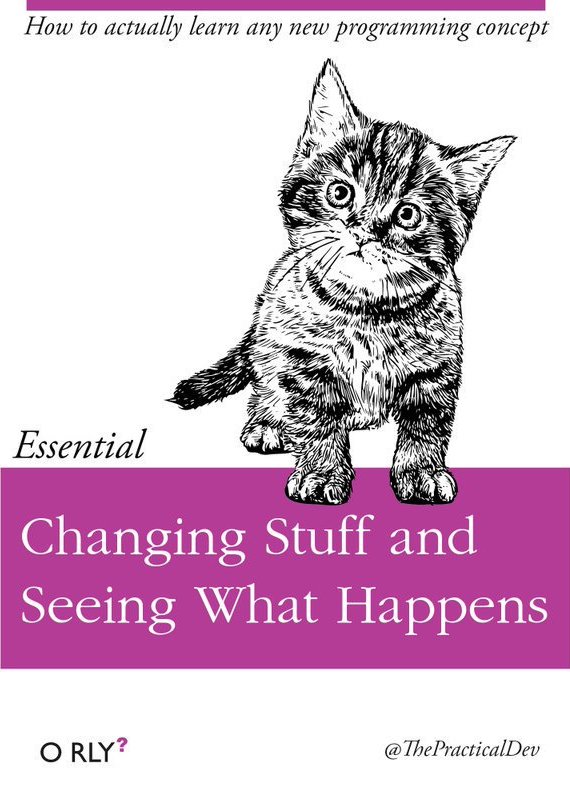
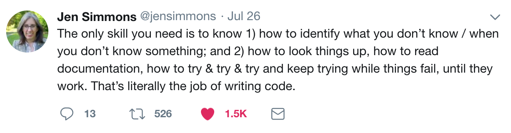
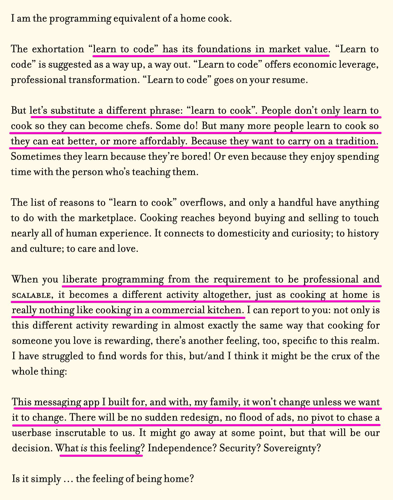

# An Introduction (2026)

*A first-day lesson plan for Creative Coding.*

---

## Orienting Ourselves

### Arting, with a Computer

Computer Art is the "bastard child of CS and fine art"—rejected by both parents. Manfred Mohr (born 1938) is one of the first dozen or so people to ever make art with a computer, having started in 1969; Here’s a brief excerpt from an [interview with him](https://www.thewhitereview.org/feature/interview-with-manfred-mohr/).

In 1985, Andy Warhol, at the height of his career, and widely held to be the pre-eminent American artist, [made some drawings with a computer](http://studioforcreativeinquiry.org/projects/warhol-data-recovery). His process was similar to what you might do today with Procreate on a tablet. It was scandalous and provocative; most painters wouldn’t have been caught dead anywhere near a computer. Magazines wrote articles like this one ("*Can a computer, austere and logical, be a tool for creative personal expression?*"). 

Do these attitudes still exist today?

Nowadays, people use computers for *everything*. Photoshop and such tools have been around more than 30 years. In this course, we will distinguish between art that happens to have been made on a computer, and *art which necessarily requires the development of new technology* (software, circuits). 

### Consider

> *"When you use someone else's software, you are living in their dream."* — John Maeda

### Poetic Computation: Finding a Voice

Zachary Lieberman, in IdN *Interaction Issue* (December 2012), describes the challenge of making art by writing software as follows: 

#### Challenges:

* To be able to make work that is actually ours. It's hard enough when we're all using the same commercial hardware, the same software toolkits, and (now) agentic coding tools that are designed to push towards *beige*.
* "To recognize the lion by the mark of their claw." (Bernoulli on Newton)

### Computing, Outside a School of Computer Science

* How many of you have taken a computer science course? More than one course?
* As curious and creative people (inventors, artists, designers, musicians, etc.), in what ways have such courses disappointed you?

Designer/educator/engineer, [Leah Buechley](http://leahbuechley.com/), has observed that STEM subjects generally fail to educate students who:

* learn *concretely* (from examples) rather than *abstractly* (from equations)
* work *improvisationally* rather than by *planning* everything in advance
* are interested in creating *expressive* objects, rather than *utilitarian* solutions.

Of traditional computer science introductions, educator-innovator Mitch Resnick has remarked, "It's like offering a writing class that teaches only grammar and punctuation without provideing students a chance to write their own stories."

**This class is intended to address that.**

It's possible that STEM education might benefit from the inclusion of arts-oriented pedagogic approaches. But that’s not the problem that concerns us in *this* room. Instead, in a world in which computing now touches every discipline, it should no longer be taken for granted that *computing must be taught by computer scientists*. Computer Science is a *discipline*, but programming is a *skill* (or a tool, or a medium, or better yet, a *craft*) which has different communities of use with different pedagogic needs. 

**“Creative coding”** describes the growing set of cultural practices by which artists, designers, architects, and poets employ computer programming and custom software as their chosen medium. This burgeoning field has been accelerated by the widespread adoption of open-source arts-engineering toolkits, such as p5.js, into the curricula of hundreds of art and design schools around the world. Created *by artists, for artists*, these toolkits are specifically oriented to the needs and working styles of cultural practitioners, and have radically democratized software development as a potent mode of creative inquiry. 

* Our objective is to make stirring and provocative new forms of culture.
* Our medium is software.
* We learn codecraft as necessary to execute our ideas.

We don't need much in order to make something powerful: 

We can learn by hands-on tinkering and experimentation: 

Also, *it takes a while:*

From [*An App Can Be A Homecooked Meal*](https://www.robinsloan.com/notes/home-cooked-app/) by Robin Sloan:

---

## Our Tools: For us, by us

The tools we are using were made by artist-educators who care a great deal to improve the experiences of new learners. They have made lots of great resources to help you, including written documentation and video tutorials. 

**Here are some of those people:**

* Here is Casey Reas and Ben Fry explaining the Processing [mission statement](https://vimeo.com/28117873) in 2011.
* Lauren Lee McCarthy [speaking at the 2017 Gray Area Festival about the origin of p5.js](https://www.youtube.com/watch?v=l1qeNMXccvA&amp;t=1831s), a sibling project that is also part of the Processing family of tools. (View from 30:30–37:30)
* Zach Lieberman [interviewed by Verse](https://twitter.com/verse_works/status/1688889255995609088), 2023. (5 minutes)

**Also:** 

* Here is [a video introduction to p5.js](http://hello.p5js.org/)

