# LOOPS

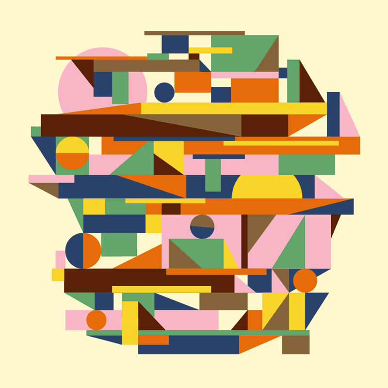
*Loop by [Skip Dolphin Hursh](http://www.skiphursh.com/Animated-GIFs-2014), 2014.* 

---

# Early Cinema Devices

Basically all early cinema was looping, from ~1824 until 1890. 
Let’s learn a little history about early cinema devices.

## Thaumatrope

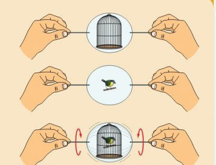

The invention of the [Thaumatrope](https://en.wikipedia.org/wiki/Thaumatrope), considered to be the first animation device, is usually credited to British physician John Ayrton Paris. Paris was said to have used one to demonstrate persistence of vision to the Royal College of Physicians in London in 1824. It consists of a disk with different images on each side; when spun quickly, persistence of vision fuses the images into a simple animated scene. 

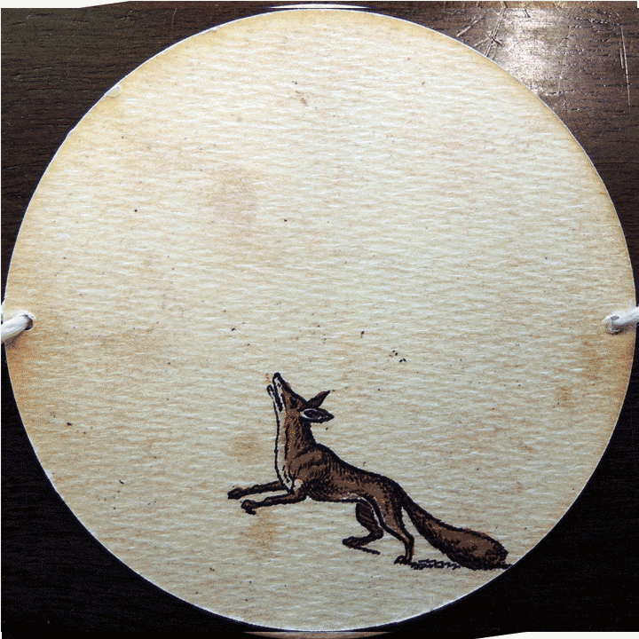

Below are some thaumatropes from the Richard Balzer collection:

Interestingly, [there is evidence](https://jenmacnab.wordpress.com/tag/paleolithic-art/) that thaumatropes may have been a paleolithic invention. A number of bone discs have been found in the Dordogne region in France, dating to approximately 30,000 BCE. Long supposed to be buttons or decorative beads, archaeologists have proposed that these bone discs, all of which have a small hole bored through the centre, are in fact the earliest examples of thaumatropes. They reported: 

*"Given that some are decorated on both sides with animals shown in different positions, we realized that another type of use, relating to sequential animation, was possible. When a string is threaded through the central hole and the disc made to spin, “the animal goes down then gets back up in a fraction of a second and vice versa”. (Lorenzi, 2012)*

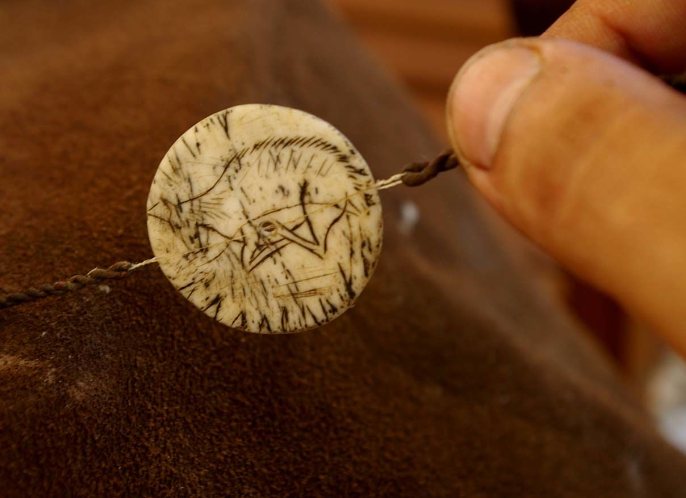

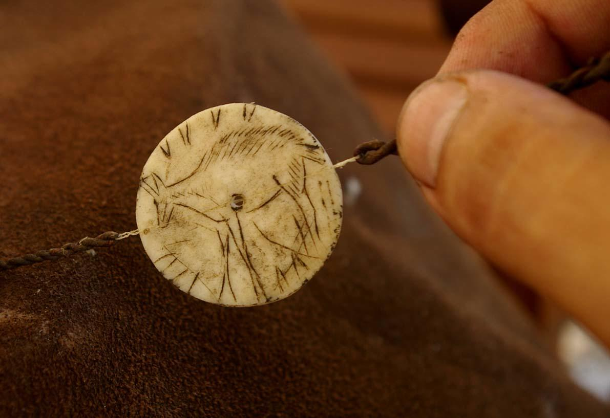

--

## Phenakistoscope

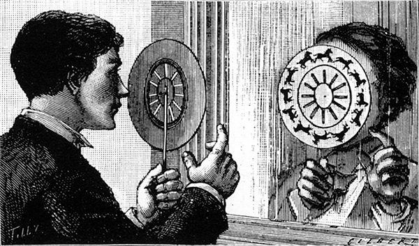

Invented by Belgian physicist Joseph Plateau in 1833, the **Phenakistoscope** is largely considered to be the first mechanism for true animation. [This article at Colossal](http://www.thisiscolossal.com/2013/10/the-first-animated-gifs/) shows a terrific collection of Phenakistoscopes.

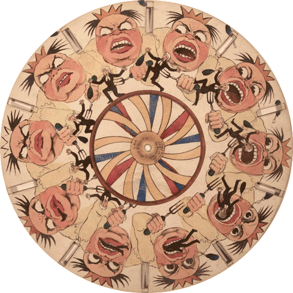

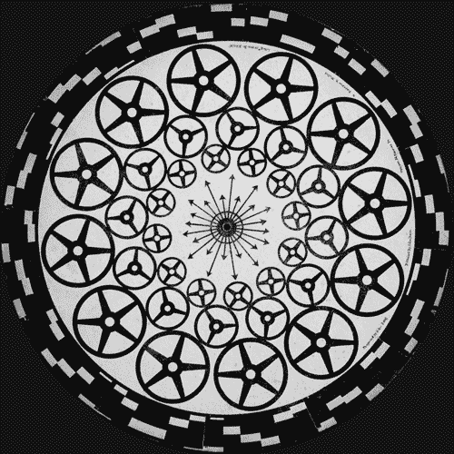

-- 

## Zoetrope & Praxinoscope

The **Zoetrope** was invented in 1834 by William George Horner. The Zoetrope is the third major optical toy, after the Thaumatrope and Phenakistoscope, that uses the persistence of motion principle to create an illusion of motion.

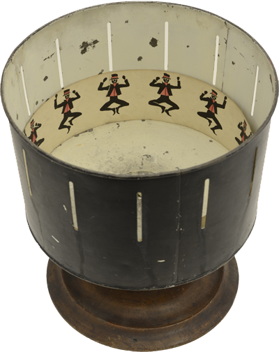

When the **Praxinoscope** was invented by Emile Reynaud in 1877, its mirrors offered a brighter image than the image seen through the Zoetrope’s slits, and interest in the Zoetrope soon declined.

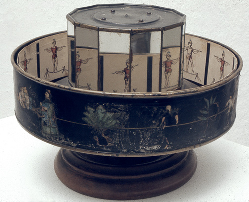

Here’s the difference:

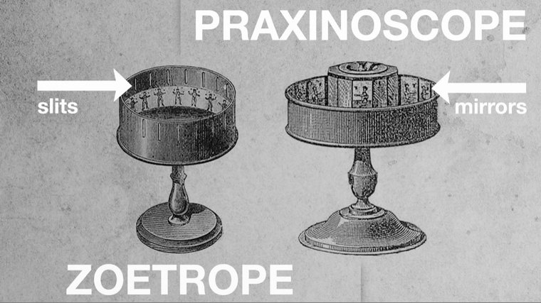

-- 

## Enter Chemical Film

Things got exciting with the invention of the gelatin emulsion by Richard Maddox (fast chemical photography) in 1871 – and soon thereafter, chronophotography, in the mid-1870s. Suddenly these devices could depict movement with *photographic* media, and not just hand-drawn animations.

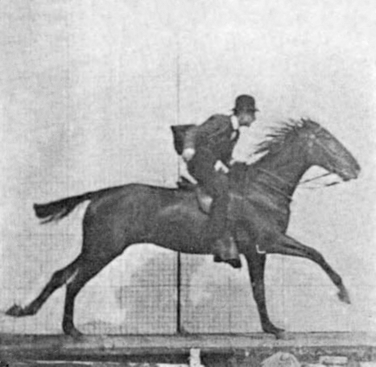 
*[Eadweard Muybridge](https://en.wikipedia.org/wiki/Eadweard_Muybridge#Stanford_and_horse_gaits), Horse Gallop, 1878*

Even after the invention of celluloid film in the 1890s (which allowed for narrative films with durations of multiple minutes), loops such as walk cycles remained a popular strategy for conserving effort and (stretching the duration) in animation. 

 
*Gertie the Dinosaur* (Winsor McCay, 1914) — the first film to use animation techniques such as keyframes, registration marks, tracing paper, the Mutoscope action viewer, and animation loops. 

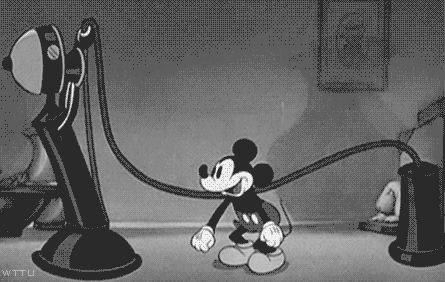

Loops evolved from simple action sequences (like walk cycles) to entire passages: 
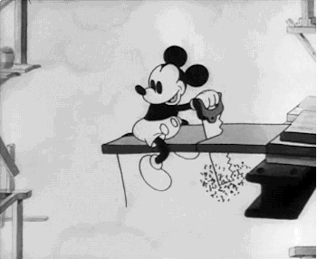

-- 

##Some Looping Art

Physical Cinema: Loops on Physical Things

[Stroboscopic loops on Easter eggs](http://www.thisiscolossal.com/2016/03/eggstatic-stroboscopic-patterns-animated-on-easter-eggs/) by Jiri Zemanek:
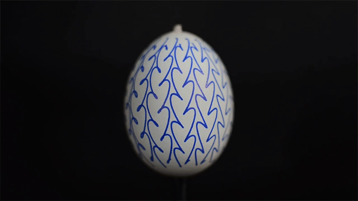

[Embroidered turntable animations](http://www.thisiscolossal.com/2015/07/fantastic-embroidered-zoetrope-animations-on-turntables-by-elliot-schultz/) by Elliot Schultz:
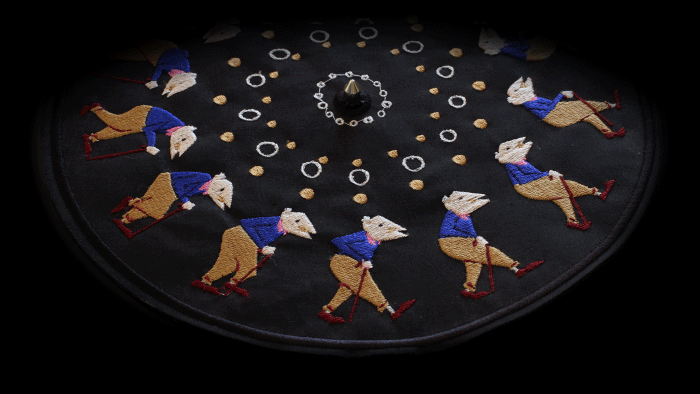

[3D printed zoetrope](http://www.thisiscolossal.com/2016/06/a-fascinating-3d-printed-light-based-zoetrope-by-akinori-goto/) by Akinori Goto: 
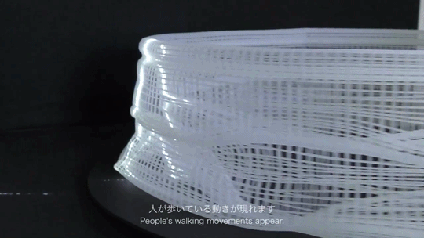

John Edmark creates "[Blooms](https://vimeo.com/198150547)", 3D printed sculptures that demonstrate phyllotaxis, similar to the arrangements of many plant parts; these are sculptures designed to be observed with a stroboscope or through a well-timed video shutter.
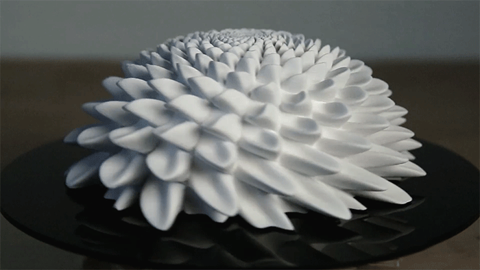

**Additional works of note:**

* Pablo Garcia, [*Profilograph (After Durer)*](https://vimeo.com/56735804)
* [All Things Fall](https://vimeo.com/125791075) by Mat Collishaw & Sebastian Burdon (*note: violence*)
* NYC subway zoetrope, [MASSTRANSISCOPE](https://www.youtube.com/watch?v=LKpfnYzsDCU)

--

## Loops in Cinema

Loops are now here to stay, and inform (and are informed by) other cinematic practices. 

* Norman Mclaren, [*Canon*](https://www.youtube.com/watch?v=lxNhUswEO7c) (1964)
* Zbigniew Rybczyński, [*Tango*](https://vimeo.com/90339479) (1980)
* Marco Brambilla, [*Civilization*](https://vimeo.com/14837116) (2009)
* Jeff Desom, [*Rear Window Timelapse*](https://vimeo.com/37120554) (2012)

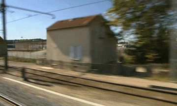 
Michel Gondry + Chemical Brothers, [*Star Guitar*](https://www.youtube.com/watch?v=0S43IwBF0uM)

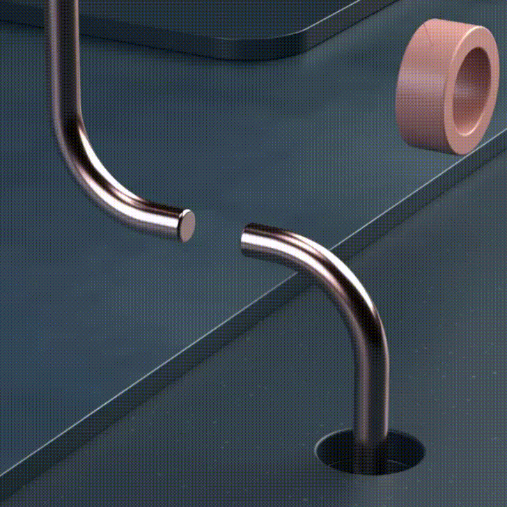 
*Loop by [Andreas Wannerstedt](https://andreaswannerstedt.se/pendulums)*

*Cinemagraphs* are an interesting hybrid of video and static photography.

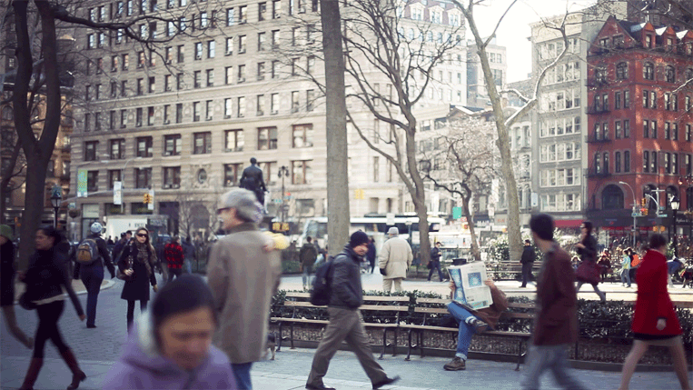

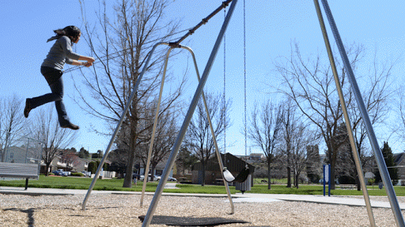

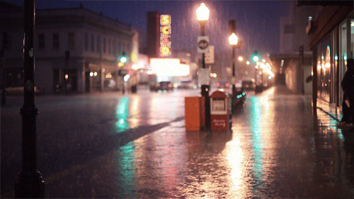

---

##Computational Art and GIF Loops

*Loop by David Whyte ([Bees & Bombs](https://beesandbombs.tumblr.com/))*

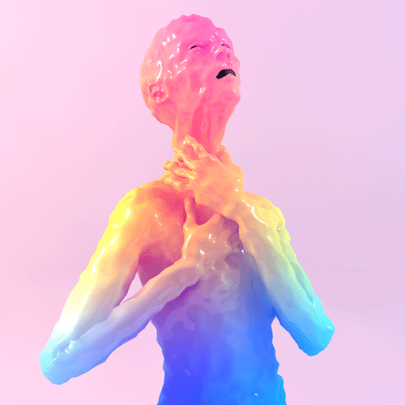 
*Loop by [Kytten Janae](https://www.instagram.com/kyttenjanae/)*

There are a burgeoning number of computational artists and designers who are discovering vast and expressive new worlds in the constraints of this durable format for dynamic imaging. Here’s a list of some leading practitioners; please spend some time with their work:

* [Bees & Bombs](https://beesandbombs.tumblr.com/)
* [DVDP (Davidope)](http://dvdp.tumblr.com/)
* [Cindy Suen](http://cindysuen.tumblr.com/)
* [Étienne Jacob](https://twitter.com/n_disorder)
* [Paolo Čerić](http://patakk.tumblr.com/)
* [Saskia Freeke](https://www.instagram.com/sasj_nl/)
* [Kytten Janae](https://www.instagram.com/kyttenjanae/)
* [89A](http://www.89a.co.uk/)
* [Echophon](http://echophon.tumblr.com/)
* [Aaron Meyers](http://teleaaron.tumblr.com/tagged/loop)
* [GIFPop! Artists](https://gifpop.io/collections/artists)

*Loop by David Whyte ([Bees & Bombs](https://beesandbombs.tumblr.com/))*