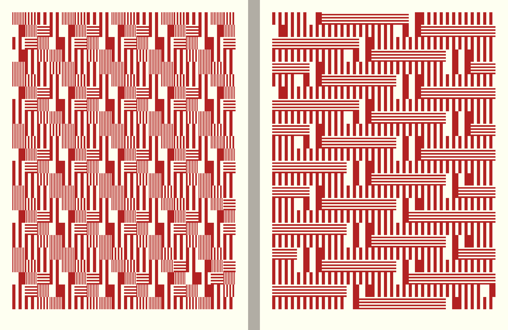

# Pattern

> *Making procedural patterns is a mental exercise in finding minimal reusable elements. This practice is old; we as a species have been using grids and patterns to decorate textiles, floors and borders of objects for a long time: from meander patterns in ancient Greece, to Chinese lattice design, the pleasure of repetition and variation catches our imagination. Take some time to look at decorative patterns and see how artists and designers have a long history of navigating the fine edge between the predictability of order and the surprise of variation and chaos. From Arabic geometrical patterns, to gorgeous African fabric designs, there is an entire universe of patterns to learn from.* — From "The Book of Shaders" by Patricio Gonzalez-Vivo.

Pattern is the starting point from which we perceive and impose order in the world. Examples of functional, decorative, and expressive pattern-making date from ancient times and take many forms, including calendars, mosaics, tapestry, quilting, jewelry, calligraphy, furniture, and architecture. There is an intimate connection between pattern design, visual rhythm, geometry, mathematics, and iterative algorithms. This week, you are invited to expand your understanding of these relationships in formal terms.

Blombos Cave carved ochre (70,000 BC):

 

Chalcolithic (Copper-Age) owl plaques (3500-2500 BC):

Medieval tiles from Marrakech:

In the mid-19th century, colonialist Europeans scholars "discovered" the design languages of the rest of the world. Two highly influential and lavishly printed books published in France and England compiled and popularized collections of designs from Asia and the Middle East: Albert Racinet’s *L’Ornement Polychrome* (1869–73), and *The Grammar of Ornament* (1856) by Owen Jones:

Repetitive visual patterns play a huge role in vernacular decorative arts. For a fun example, check out the fantastic *Historic New England Wallpaper Archive*, which has more than 6000 high-resolution scans of antique wallpapers: 

### Pattern and Mathematics

Mathematicians have studied the logic of patterns for decades. Did you know that there are only and exactly 17 types of 2D crystallographic (wallpaper) symmetries. (There are no others!)

Below are the 51 types of discrete periodic patterns. This image is from the amazing book, *Tilings and Patterns* by Grünbaum and Shephard. If you're interested, you can find a PDF copy online here.

Recently, scholarly reconsiderations of indigenous patterns have made plain their rigorous use of mathematics. The book African Fractals: modern computing and indigenous design by Ron Eglash is an example, presenting works such as this self-similar (fractal) design in a Fulani wedding blanket:

---

### Pattern in Modernism: Anni Albers and Victor Vasarely

Anni Albers was one of the most influential textile designers of the 20th century. In the early 1930s, she was the director of the textiles studio in the German Bauhaus school; in 1949, she became the first textile designer to have a solo exhibition at the Museum of Modern Art. Her work reveals a stunning sensibility for rhythm, color, and punctuation and helped define visual Modernism in textile art. 

Anni Albers in her studio.

Anni Albers, *Pasture* (1958). 

Textile arts such as weaving, knitting, and needlepoint are ancient cultural practices of pixel logic. In works like *South of The Border* (1958, shown here in detail), Anni Albers used ingenious combinations of threads to produce custom pixels:

Anni Albers, *Fox II* (1972), silkscreen. Later in life, Albers developed a strong interest in lithography.

The psychedelic "Op Art" movement of the late-1960s made heavy use of (analog) procedural design and mathematical design, producing optical illusions to activate the viewer. Here's Victor Vasarely's [*Alom (Rêve)*](https://www.artsy.net/artwork/victor-vasarely-alom-reve) 1966 collage:

---

### Pattern on the Computer

The computer's abilities to (1) compute mathematics, (2) iterate tirelessly, and (3) generate randomness make it an ideal tool for the exploration of patterning. Here's Vera Molnár's *Square Structures* (1974). Starting in 1968, Molnár was among the first artists to use a computer. Her 1974 plotter drawing demonstrates patterns arising from the interaction between procedural iteration and randomized omission.

Another pioneer of early computer art, Manfred Mohr, wrote plotter programs in the late 1960s to generate patterns (comprised of repeated elements) that resembled writing. For this project, P-021/A+B (1969), the generative rule is: 

> "*The elements are horizontal, vertical, 45 degree lines, square waves, zig-zags, and have probabilities for line widths and lengths. The algorithm places elements in a horizontal direction and has a high probability to move from left to right and a limited probability to backtrack. The original idea of this algorithm was to create a visual musical score which defies the progression in time by occasionally turning back on itself. Thus at the same time an abstract text is created.*"

Here's a grab bag of other works that use computation to make patterns.

Jennifer Steinkamp's [*Daisy Bell*](http://jsteinkamp.com/html/daisy_bell_08.htm) (2008) is a generative video projection of a flower pattern: 

Mark Webster, generative patterns, 2023:

Dave Bollinger. [*Density Series*](https://www.flickr.com/photos/davebollinger/sets/72157603205771398). 2007. Generative image series. 

Saskia Freeke. [*Daily generative art*](https://www.instagram.com/sasj_nl). 2010–2020. Generative image series.

 

Holger Lippmann, [*The Abracadabra Series*](https://e-art.co/project/abracadabra). 2018. Generative image series. 

 

Casey Reas has created patterns by rearranging the pixels of video streams. The results have a very organic color scheme.

 

Other computational works (on paper) by Reas make minute positional changes in small monochromatic elements to produce complex patterns:

 

Kim Asendorf's [*Monogrid.xyz*](https://monogrid.xyz/) (2021) is a masterpiece of dynamic monochromatic computational pattern design:

 

Andreas Gysin has made a variety of works that present grids of computed ASCII characters: 

 

Take Gysin's [*ASCII PLAY*](https://play.ertdfgcvb.xyz) project for a spin.

Computationally designed patterns can be output to media other than screen and paper. Leah Buechley explores the intersection of computation and craft. The pattern in her *lasercut curtain* (2017), computationally generated in Processing, features multiple forms of iteration and controlled randomness: 

 

Jessica Rosenkrantz and Jesse Louis-Rosenberg's [*Patchwork Amoeba Puzzle* (2012)](https://n-e-r-v-o-u-s.com/shop/product.php?code=363), plywood, is a computer-generated and digitally-fabricated wooden design derived from a computer simulation of differential growth, similar to how the sutures of skull bones are formed.

Spanish artist Galo Canizares has been creating his own Arduino-powered e-ink computers (2023) to display generative patterns at an intimate scale and form factor. The use of e-Ink (like a Kindle screen) makes for very low-power devices:

Swiss software artist Leander Herzog has made a terminal program, *Agglo* (2023) that uses colored text blocks to create an endless stream of generative pattern:

* ssh agglo@agglo.leanderherzog.ch
* (password: agglo)

