## Telematic Art 

### Art Across Distances * New Modes of Communication

*This lecture includes many contributions from NYU Prof. Tega Brain, friend and collaborator.*

**When we made [drawing programs](https://github.com/golanlevin/lectures/tree/master/lecture_drawing), we explored the interactivity of a single person (typically), who provides inputs to and receives impressions from a responsive algorithmic system. This is the solypsistic "interactivity of the only child", god of their sandbox. We now consider interactive systems that place the participant/guest/user/subject into conversation *with another mind*. In creating a communication system between multiple interlocutors, we establish a new interactivity: that between siblings, lovers, neighbors, strangers.**

---

As soon as there was an Internet, there was art on the Internet. Immediately there arose two approaches: creators who used the Internet as a new way of disseminating traditional media (photography, music, etc.) in online galleries; and creators of "Net.Art", who made Internet-native artworks that created new forms of artwork that intrinsically depended on the networked condition.

Today, we participate in synchronous video calls with Skype and FaceTime, collaboratively edit documents (and [sext](https://www.theatlantic.com/technology/archive/2019/03/hottest-chat-app-teens-google-docs/584857/)) in Google Docs, and build multiperson virtual environments in MineCraft. These systems and processes are part of the fabric of everyday life, but it hasn't always been so, and it's worth stepping back and thinking about the use of networked telecommunications in media arts. As is often the case, some media artworks from the past presaged common tools today... and others represent intriguing dead-ends in the history of attempts to devise new modes of communication.

In the projects below, questions how each project resolves issues of:

* Critical consideration of the nature of networked communication
* One to many / many to one / many to many / one to one
* Operationalization of the participant (user-generated media)
* Asynchronous vs. synchronous communication
* Equal roles vs. complementary roles
* Inhabiting a shared virtual space
* Which senses are engaged
* Anonymity and intimacy

---

#### Some Brief Summaries of Communication Models

Questions: 
* what are some ways in which we can categorize communication systems? 
* what are some models we can use to understand communication?

*Groundlaying*: [Communication Models](communication_models.md)

---

#### Across deep time: the Chauvet Cave paintings (40KY BCE)

We will watch a portion of [*The Cave of Forgotten Dreams by Werner Herzog*](https://www.youtube.com/watch?v=l7XTERdQZf8&t=29m58s), from 29:58 - 32:45. Regarding two artists, 5000 years apart, who 'collaborated' on the same drawing, Herzog remarks: "We are locked in history, and they were not."

[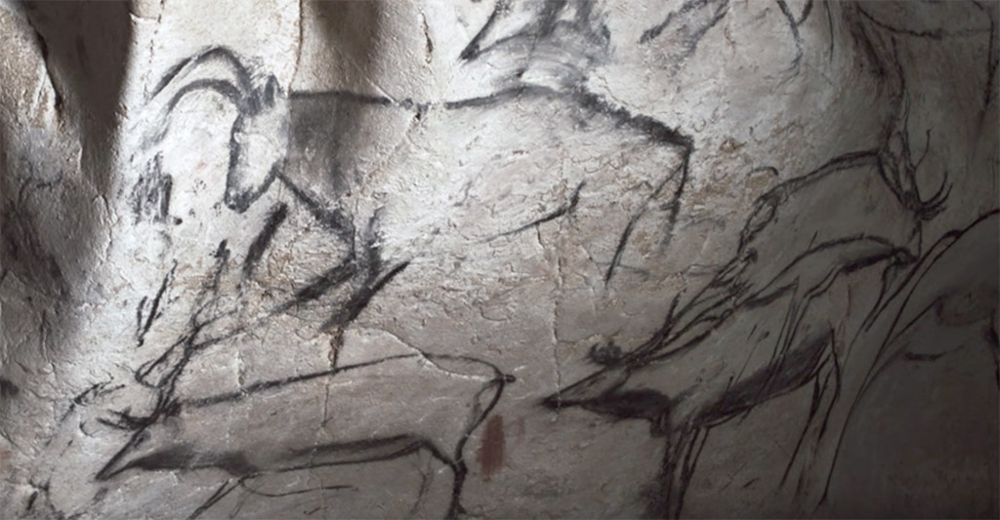](https://www.youtube.com/watch?v=l7XTERdQZf8&t=29m58s)

#### Cairns

[Cairns](https://en.wikipedia.org/wiki/Cairn) are human-made piles of stones. Cairns have been and are used for a broad variety of purposes, from prehistoric times to the present, often as landmarks, memorials and trail markers. It is a collaboratively created structure, built one stone at a time, often over the course of centuries.

So how did we get from there, to ...here?:

### Your World of Text

Andrew Badr's [Your World of Text](https://www.yourworldoftext.com/golan) is an infinite grid of text editable by any visitor. "The changes made by other people appear on your screen as they happen. Everyone starts in the same place, but you can scroll through the world using your mouse. Put any letters at the end of the URL to go to a new world. For example, http://yourworldoftext.com/forexample. They all start off blank. You can also create a custom world for you and your friends."

...and here?:

### nVidia Holodeck

...and, here?:

#### Agar.io & Slither.io
[Agar.io](https://agar.io/) (Matheus Valadares, 2015) and the related [Slither.io](http://slither.io/) are compelling multiplayer games that are astonishingly well-tuned. Very different strategies are required depending on one's current size/score.

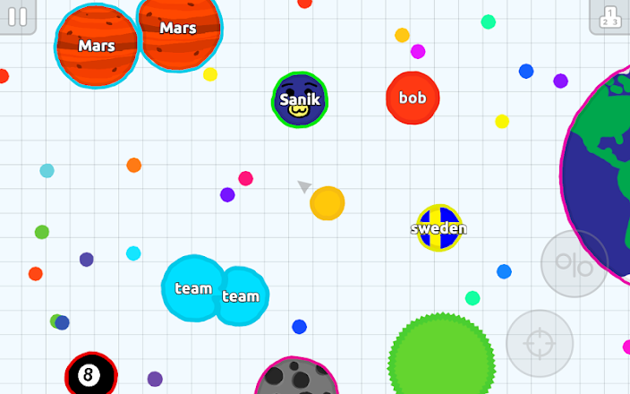

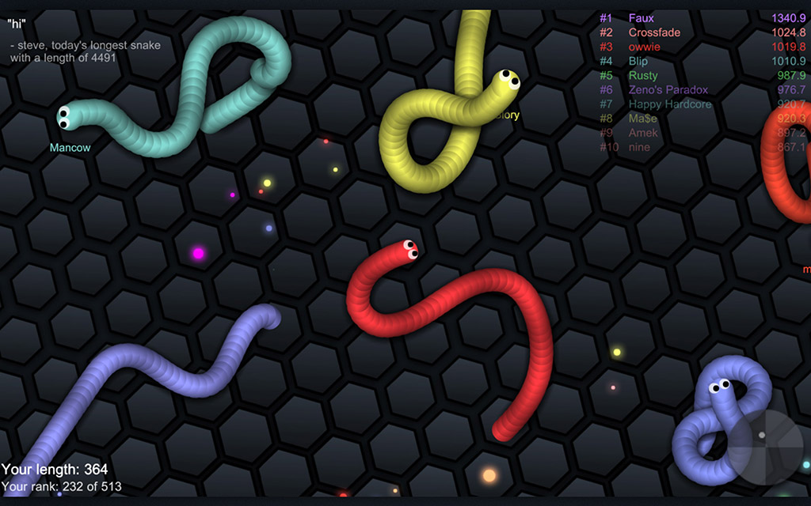

#### Telephone Picture (László Moholy-Nagy, 1923)
The [first use of telecommunications as an artistic medium](https://en.wikipedia.org/wiki/Telematic_art) occurred in 1923 when the Hungarian constructivist artist László Moholy-Nagy made [Telephone Pictures](https://www.moma.org/collection/works/78747). These works questioned the idea of the isolated individual artist and the unique art object.

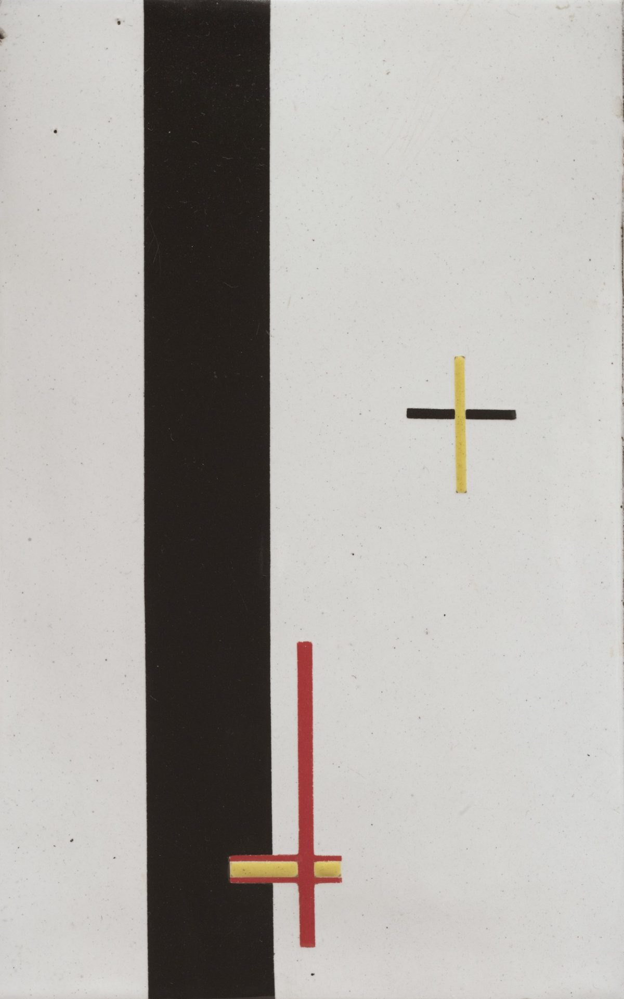

*"In April 1923, Moholy had Construction in Enamel 2 and 3 made at a local enamel factory. He would later claim to have ordered them by describing them over the telephone, exaggerating both his distance from the manufacturing process that produced them and the degree of technological mediation involved. In doing so Moholy presented the artist in the modern age as producer of ideas rather than things. While sharing the same abstract geometric composition, the works use a mathematical progression to change its scale, highlighting the conception of the image as transferable data."* (MoMA)

* Compare with Miranda July, [*Learning to Love you More*](http://www.learningtoloveyoumore.com/index.php). See #23, "[Recreate this Snapshot](http://www.learningtoloveyoumore.com/reports/23/23.php)"

#### VideoPlace (~1972-1989)
Myron Krueger's landmark [VideoPlace](https://youtu.be/dmmxVA5xhuo) (~1972-1989) was a 2D artificial reality that enveloped its users, and responded to their movements and actions, without the use of encumbering goggles or gloves. One of the first interactive computer artworks, it allowed participants in different locations to share a common virtual space -- even, at different scales.

#### Hole in Space (1980)
Hole in Space (1980) was a "communication sculpture" by Kit Galloway and Sherrie Rabinowitz, which used live two-way video to connect street-level audiences in Los Angeles and New York City.

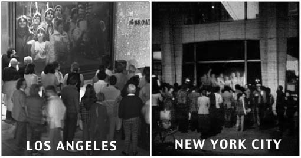

*"On a November evening in 1980 the unsuspecting public walking past the Lincoln Center for the Performing Arts in New York City, and «The Broadway» department store located in the open air Shopping Center in Century City (Los Angeles), had a surprising counter with each other. Suddenly head-to-toe, life-sized, television images of the people on the opposite coast appeared. They could now see, hear, and speak with each other as if encountering each other on the same sidewalk. No signs, sponsor logos, or credits were posted--no explanation at all was offered. No self-view video monitors to distract from the phenomena of this life-size encounter. [...] «Hole-In-Space» suddenly severed the distance between both cities and created an outrageous pedestrian intersection. There was the evening of discovery, followed by the evening of intentional word-of-mouth rendezvous, followed by a mass migration of families and trans-continental loved ones, some of which had not seen each other for over twenty years."*

#### Poietic Generator (1986+) 
[*The Poietic Generator*](https://en.wikipedia.org/wiki/Poietic_Generator) is a social-network game designed by Olivier Auber in 1986. The game takes place within a two-dimensional matrix in the tradition of board games and its principle is similar to both Conway's Game of Life and the surrealists' Exquisite corpse.

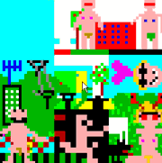

#### Million Dollar Homepage (2005) 
[*Million Dollar Homepage*](http://milliondollarhomepage.com/) is a website "conceived by Alex Tew, a student from Wiltshire, England, to raise money for his university education. The home page consisted of a million pixels arranged in a 1000x1000 pixel grid; the image-based links on it were sold for $1 per pixel in 10x10 blocks. The purchasers of these pixel blocks provided tiny images to be displayed on them, a URL to which the images were linked, and a slogan to be displayed when hovering a cursor over the link. The aim of the website was to sell all of the pixels in the image, thus generating a million dollars of income for the creator." ([Wikipedia](https://en.wikipedia.org/wiki/The_Million_Dollar_Homepage))

#### R/Place (2017)
[*R/Place*](https://en.wikipedia.org/wiki/Place_(Reddit)) "was a collaborative project and social experiment hosted on the social networking site Reddit that began on April Fools' Day 2017. The experiment involved an online canvas of one million (1000x1000) pixel squares, located at a subreddit called /r/place, which registered users could edit by changing the color of a single pixel from a 16-colour palette. After each pixel was placed, a timer prevented the user from placing any pixels for a period of time varying from 5 to 20 minutes." (Wikipedia)

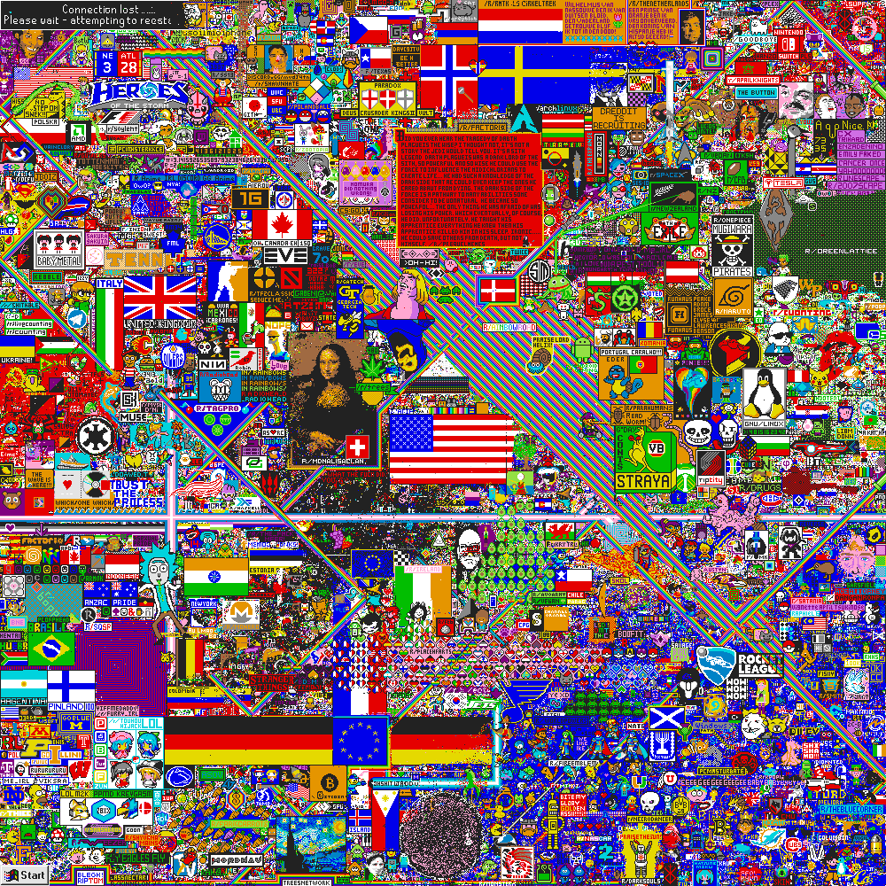

#### ClearBoard (1990)
[*ClearBoard*](http://tangible.media.mit.edu/project/clearboard/), a work of HCI design research by Hiroshi Ishii and Minoru Kobayashi, "is designed to integrate interpersonal space and shared workspace seamlessly. A design goal of ClearBoard is to allow a pair of users to shift easily between interpersonal space and shared workspace using familiar everyday cues such as the partner's gestures, head movements, eye contact, and gaze direction. The key metaphor of ClearBoard design is 'talking through and drawing on a big transparent glass board.' ClearBoard requires less eye and head movement to switch focus between the drawing surface and the partner's face than is needed in either the whiteboard or the desktop environment. We found ClearBoard provides the capability we call "gaze awareness": the ability to monitor the direction of a partner's gaze and thus his or her focus of attention. A ClearBoard user can tell which screen objects the partner is gazing at during a conversation more easily and precisely than is possible in an ordinary meeting environment with a whiteboard." (MIT Tangible Media Group)

#### Telematic Dreaming (1992-1993)
Paul Sermon's [*Telematic Dreaming*](https://www.hgb-leipzig.de/~sermon/dream/) (1992-1993) "is an installation that exists within the ISDN digital telephone network. Two separate interfaces are located in separate locations, these interfaces in themselves are dynamic installations that function as customized video-conferencing systems. A double bed is located within both locations, one in a blacked out space and the other in an illuminated space. The bed in the light location has a camera situated directly above it, sending a live video image of the bed, and a person ("A") lying on it, to a video projector located above the other bed in the blacked out location. The live video image is projected down on to the bed with another person ("B") on it. A second camera, next to the video projector, sends a live video image of the projection of person "A" with person "B" back to a series of monitors that surround the bed and person "A" in the illuminated location. The telepresent image functions like a mirror that reflects one person within another person's reflection." (Paul Sermon)

#### The Trace (1995)
In [*The Trace*](http://www.lozano-hemmer.com/the_trace.php) (1995), an interactive installation by Rafael Lozano-Hemmer, a participant encounters the moving, ghostlike "presence" of another person, who is located in an identical but separate room. Their presence is conveyed by a glowing spot created by a pair of intersecting beams of light.

#### Motion Phone (1995)
[*Motion Phone*](https://www.snibbe.com/motionphone-app/) by Scott Snibbe (1995; iOS version 2012) "is a new form of communication and a creative game. It lets people make abstract animations together over a network in a unique combination of conversation and creation. In MotionPhone's shared infinite canvas, people can create unlimited variations of movement by recording the gestures from their fingertips. When connected to other players, MotionPhone lets you create, comment, play, and communicate visually with others." (Scott Snibbe)

#### Telegarden (1995)
Ken Goldberg & Joseph Santarromana's [*TeleGarden*](http://queue.ieor.berkeley.edu/~goldberg/garden/Ars/) is an art installation that allows web users to view and interact with a remote garden filled with living plants. Members can plant, water, and monitor the progress of seedlings via the tender movements of an industrial robot arm.  The Telegarden was developed at the University of Southern California and went online in June 1995. In its first year, over 9000 members helped cultivate. In September 1996, the Telegarden was moved to the lobby of the Ars Electronica Center in Austria, where it remained online until August 2004.

[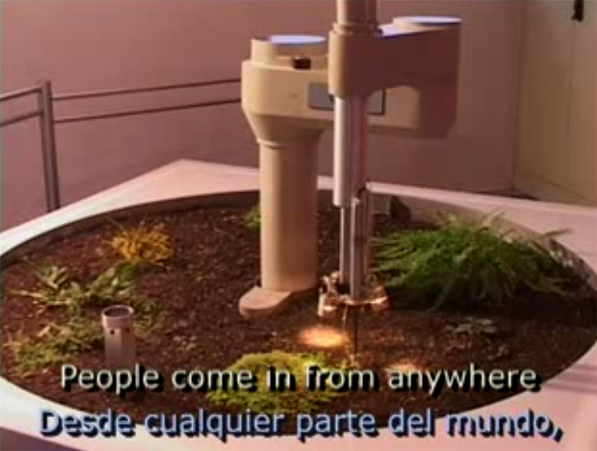](https://youtu.be/BCEC1tfc5Jc)

#### inTouch (1998)
[*inTouch*](https://tangible.media.mit.edu/project/intouch/) (Scott Brave & Andy Dahley, 1998) -- an experiment in telepresent haptics, allowed two people to communicate through shared movements of a set of wooden rollers.

[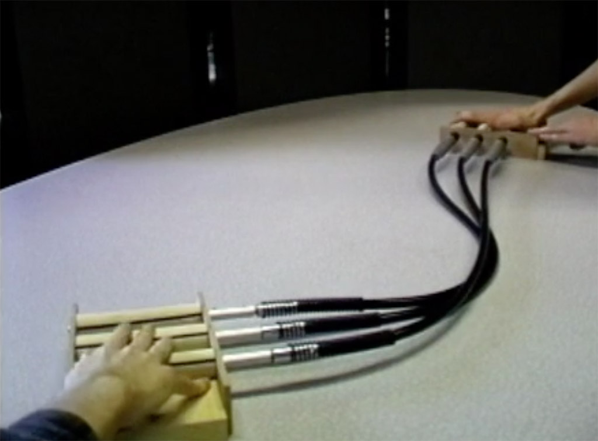](https://vimeo.com/44537894)

#### BumpList (2003)
Jonah Brucker-Cohen's [*BumpList*](http://www.coin-operated.com/2010/05/13/bumplist-an-email-community-for-the-determined-2003/) (2003) is "an email community for the determined". BumpList "functions like a standard, public listserv, but adds the constraints of limited membership (only 6 people could subscribe at once) and the urgency of forcing people to re-subscribe if they get bumped and want to continue the conversations, discussions, arguments in which they are engaged." (Brucker-Cohen)

[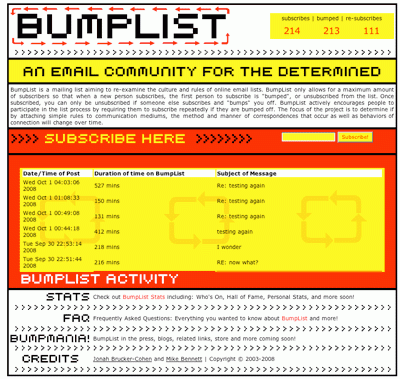](http://www.coin-operated.com/2010/05/13/bumplist-an-email-community-for-the-determined-2003/)

#### Image Labeling Game (2004)
In 2004, [Luis von Ahn and Laura Dabbish](http://ael.gatech.edu/cs6452f13/files/2013/08/labeling-images.pdf) developed the "[ESP Game](https://en.wikipedia.org/wiki/ESP_game)", which was later (2006) developed into the "Google Image Labeler". The foundational concept of gamifying the elicitation of intersubjectively valid labels for images, eventually would underpin a wide range of technologies, like [CAPTCHA](https://en.wikipedia.org/wiki/CAPTCHA), for labeling images and (more importantly) creating terascale datasets for training machine learning algorithms.

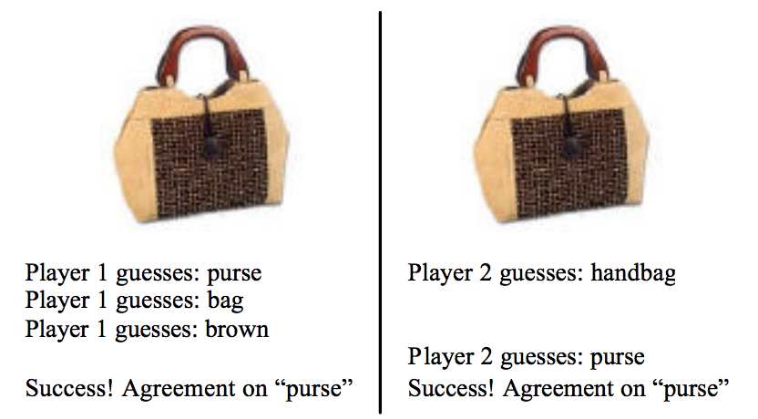

#### Can We Talk? (2011)
Zach Gage's [*Can We Talk?*](https://vimeo.com/27421540)(2011) "is a chat program for having serious conversations. It attempts to disambiguate the reasons for silence in online conversation, while preserving the qualities that make text chatting a unique platform for communication." (Gage)

[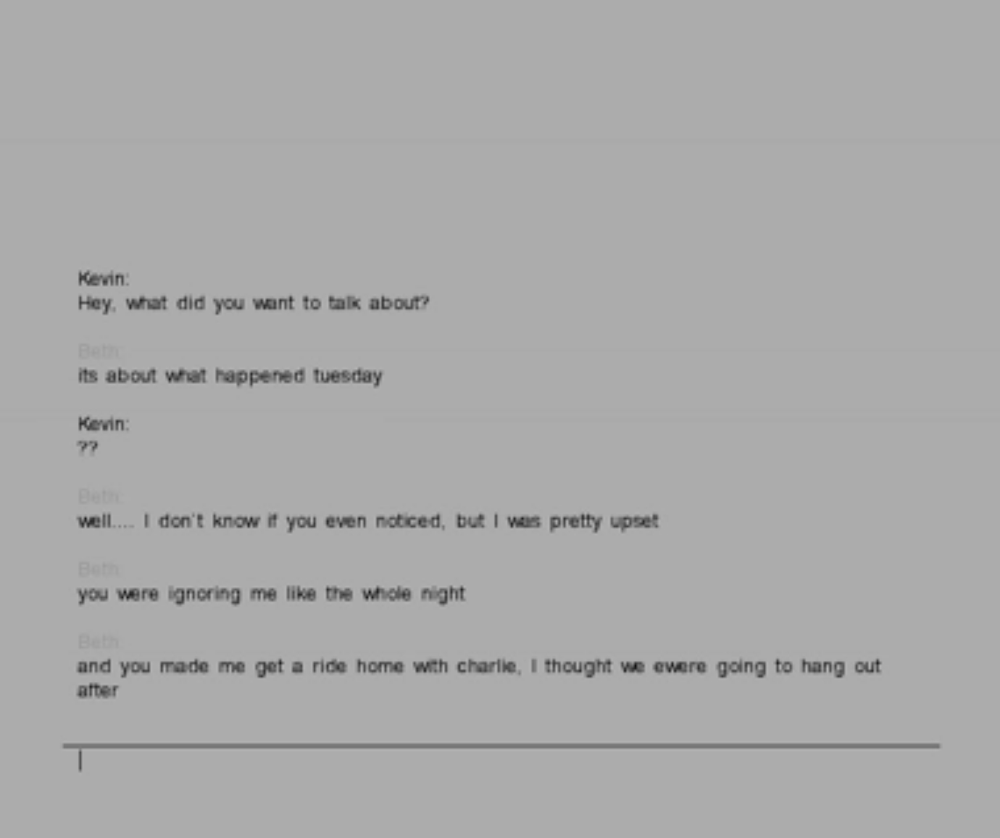](https://vimeo.com/27421540)

#### Do Not Touch (2013)
Studio Moniker's [*Do Not Touch*](http://donottouch.org/) (2013) [[live version here](http://donottouch.org/)] is a music video created from the crowdsourced movements of its viewers' cursors.

[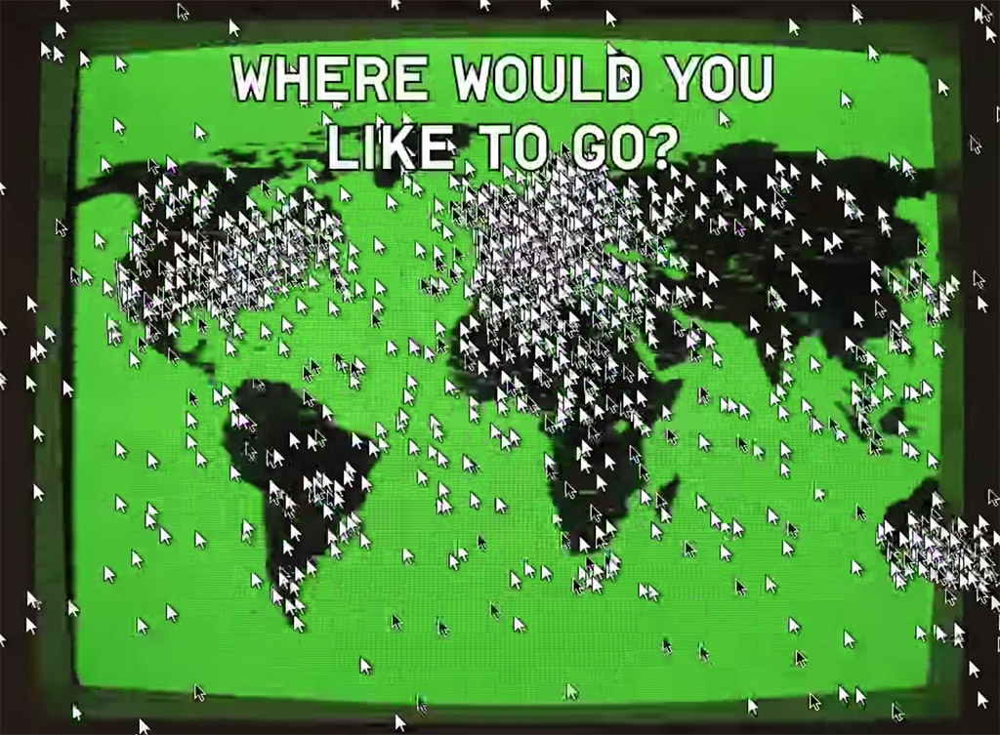](https://youtu.be/W3ZjY8YD_NY)

#### Social Turkers (2013)
Lauren McCarthy's [*Social Turkers*](http://socialturkers.com/) (2013) asks: "What if we could receive real-time feedback on our social interactions? Would unbiased third party monitors be better suited to interpret situations and make decisions for the parties involved? How might augmenting our experience help us become more aware in our relationships, shift us out of normal patterns, and open us to unexpected possibilities? I am developing a system like this for myself using Amazon Mechanical Turk. During a series of dates with new people I meet on the internet, I will stream the interaction to the web using an iPhone app. Turk workers will be paid to watch the stream, interpret what is happening, and offer feedback as to what I should do or say next. This feedback will be communicated to me via text message." (McCarthy)

[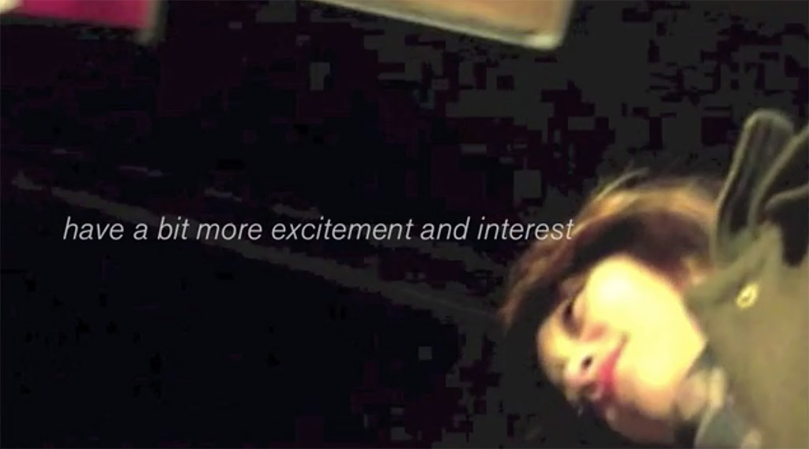](https://vimeo.com/66339316)

#### the space between us (2015)
*the space between us* (2015) by David Horvitz is an iOS app which connects two people's phones. Once connected, the app displays the distance and direction to the other person.

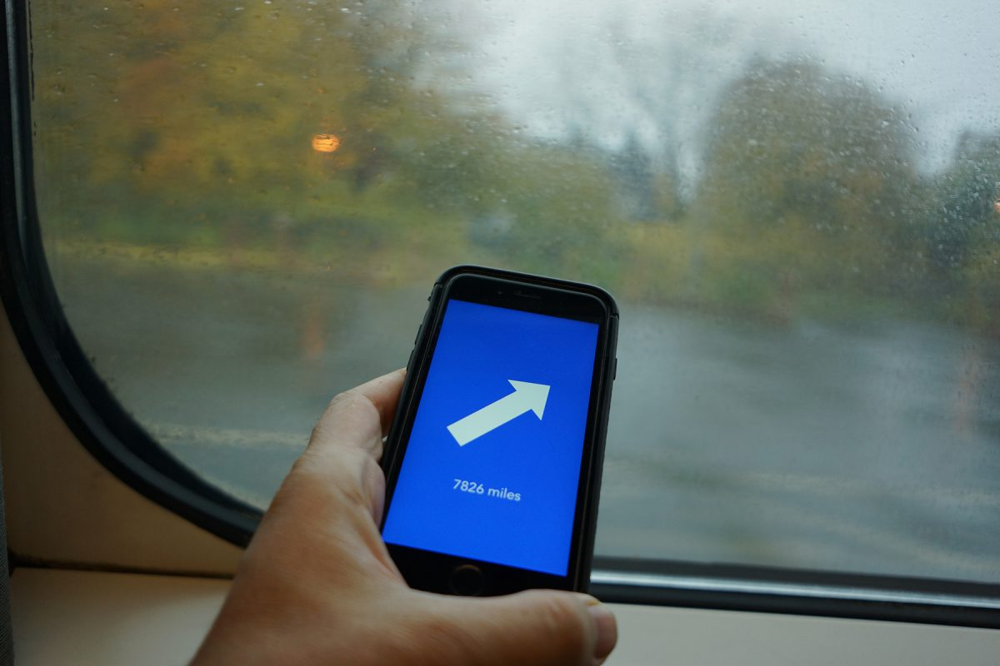

#### Die With Me (2018)
Dries Depoorter and David Surprenant developed [Die With Me](http://diewithme.online/), a chat app you can only use when you have less than 5% battery. "Die together in a chatroom on your way to offline peace."

[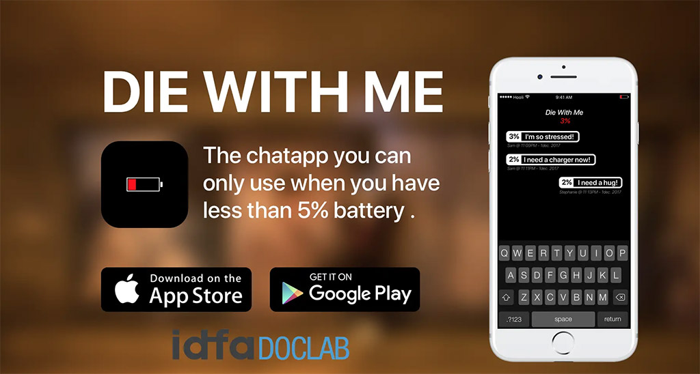](https://vimeo.com/251322259)

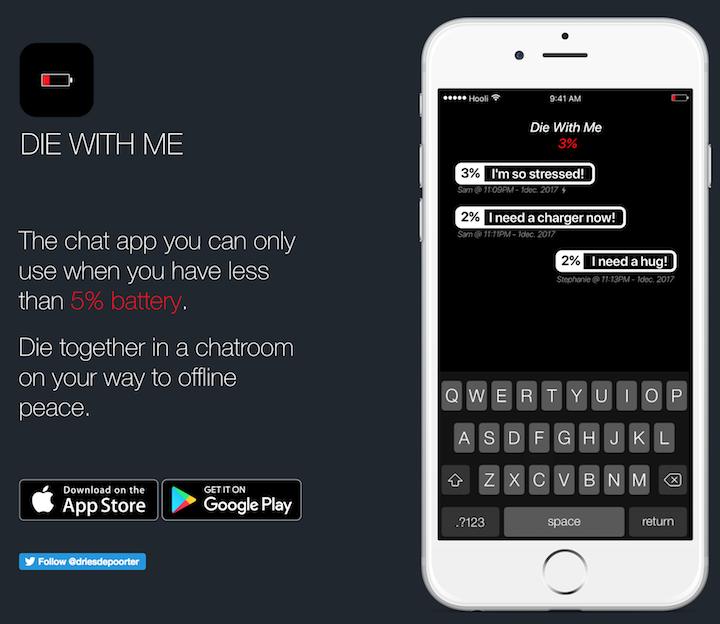

#### Exhausting a Crowd (2015)
Kyle McDonald's [Exhausting a Crowd](http://www.exhaustingacrowd.com/london) (2015) is "a crowdsourced description of 12 hours in Piccadilly Circus, London, inspired by the classic 60-page piece of experimental literature from Georges Perec, 'An Attempt at Exhausting a Place in Paris', written from a bench over three days in 1974." (McDonald)

[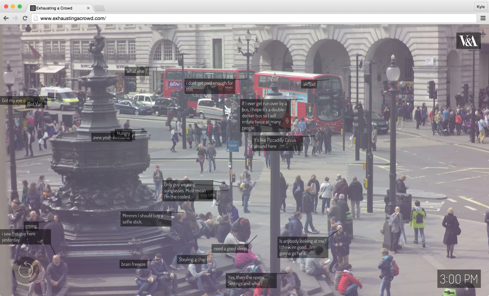](https://vimeo.com/129465015)

#### Real Me
Jingwen Zhu's [*Real Me*](http://www.jingwen-zhu.com/real-me/) (2015) "is a chatting app with BLE connected muscle sensor, pulse sensor and vibration sensor. It tracks the user's emotion while chatting and using system messages to tell the 'real emotion' of the user. Sensor readings also draw out geometric motion graphics as the background of the chatting room. The user's heart rate is mapped to the color of the speech bubble, their smile triggers the particles of the window, and leg shaking triggers the shaking of speech bubbles." (Zhu)

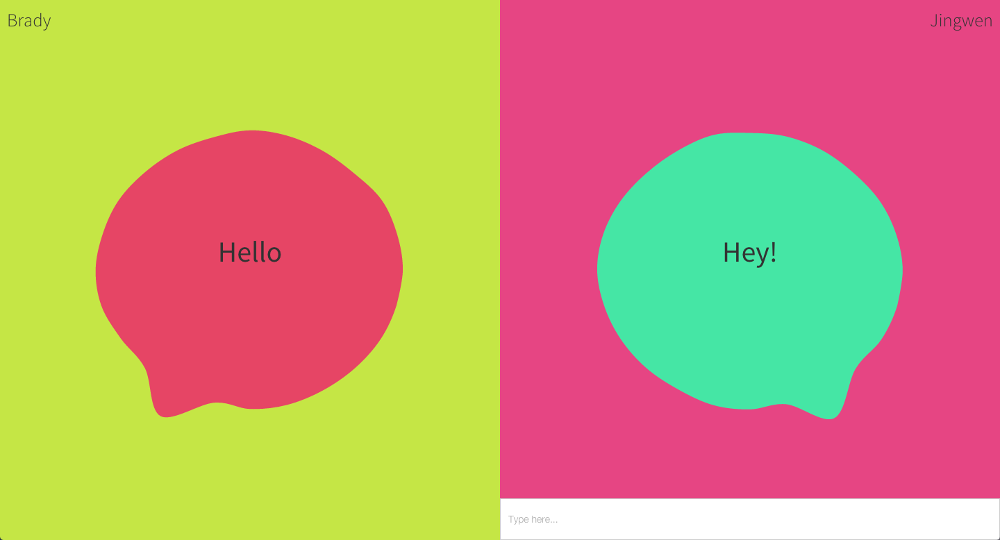

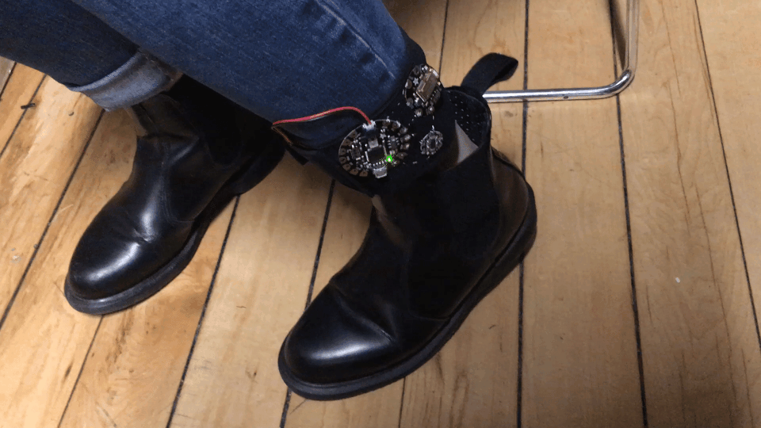

#### Aram Bartholl, Dead Drops (2010)

[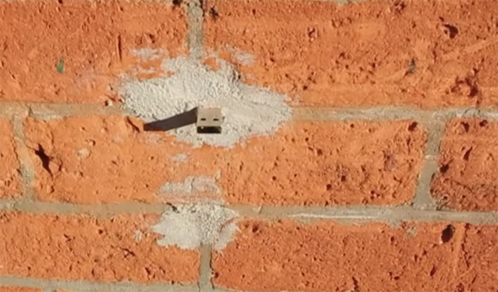](https://youtu.be/hwohadcUv4A)

#### Other collaborative drawing tools

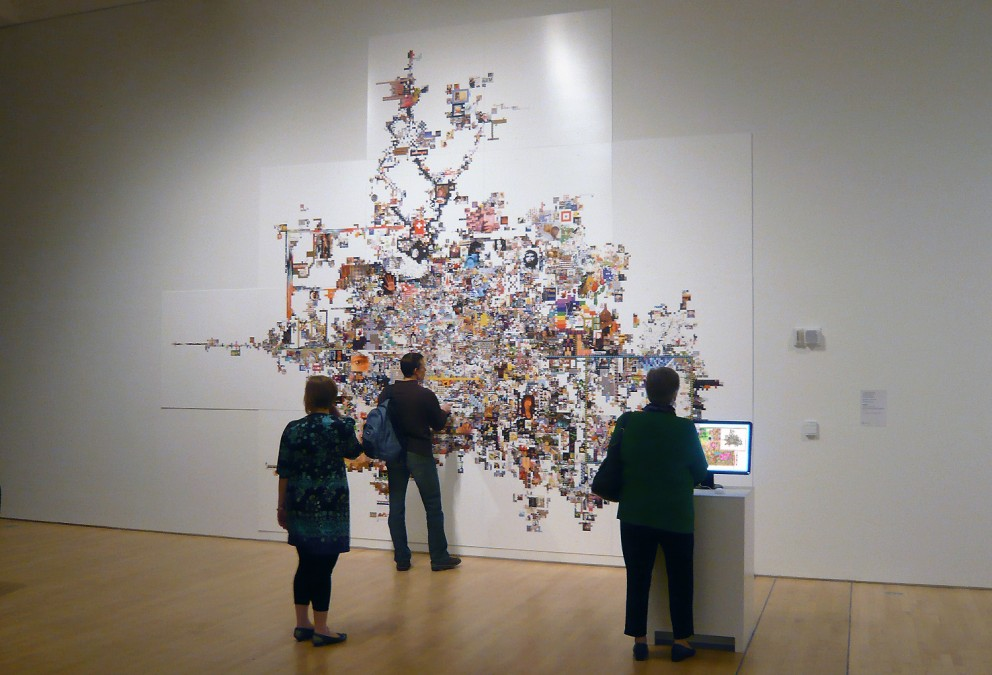

* [Communimage](https://omiotu.com/communimage/) (Johannes Gees, 1999)
* [Net.Flag](https://vimeo.com/44329425) (Mark Napier, 2002)
* [Drawball](http://www.drawball.com/) (2005)

#### Chat spaces by Maddy Varner (CMU BFA '16)

[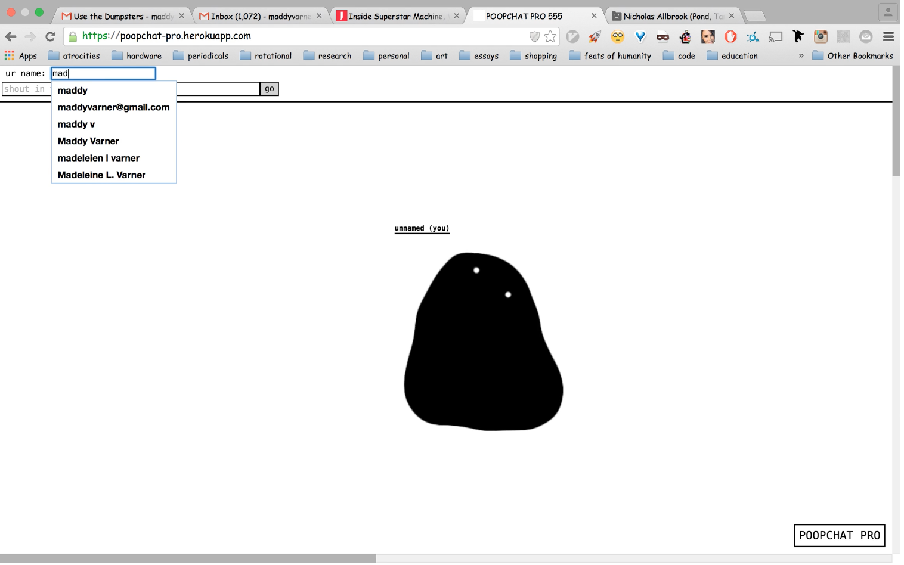](https://vimeo.com/166142275)

* [Poopchat Pro](http://poopchat-pro.herokuapp.com/) - A chatroom in which participants communicate with small poops
* [Pasties](http://pasties.maddy.zone/) - A chatroom in which participants communicate exclusively by copy-pasting.

#### Time Permitting

If time permits, we'll also look at...
* Bilal, Wafaa. [*Domestic Tension*](http://wafaabilal.com/domestic-tension/) (2007). Viewers log onto the internet to contact the artist, or to shoot him with a paintball gun.
* Max Hawkins, [*Call in the Night*](http://callinthenight.com/) (2013), "An experimental radio show and telephone network documenting the nighttime experience. Anyone with a phone can participate for free."
* Soledad Penadés, [*Chat.meatspac.es*](https://chat.meatspac.es/). (2014), allows 'chatting' with small webcam GIFs.
* Exonemo. [*The Internet Bedroom*](http://idpw.org/bedroom/) (2015). A sleepover in Google Hangouts.

