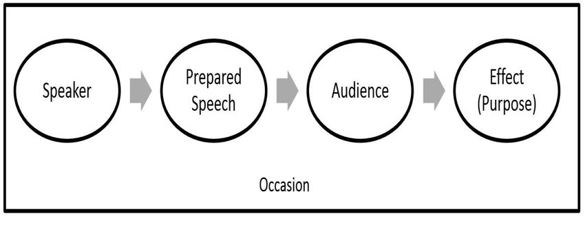
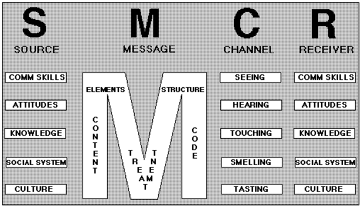
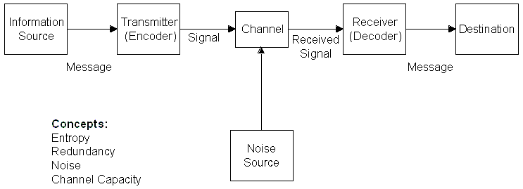
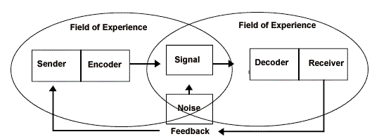
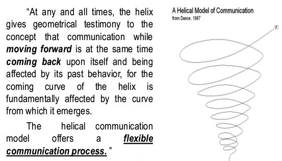
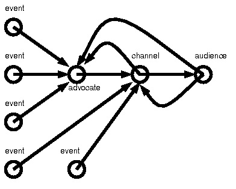

#### Some Brief Summaries of Communication Models

Question: what are some ways that we communicate with others? What are some ways in which we can categorize communication systems? 

* Synchronous vs. asynchronous
* Full duplex vs. half-duplex
* Denotative vs. connotative
* Verbal vs. nonverbal
* One-to-one, One-to-many, many-to-many, many-to-one

Some models of communication: 

* [Aristotle's Model of Communication](https://www.managementstudyguide.com/aristotle-model-of-communication.htm) — the speaker communicates in such a way that the listeners get influenced and respond accordingly.  

* [Berlo’s Model of Communication](https://www.managementstudyguide.com/berlo-model-of-communication.htm) — Communication takes into account the emotional aspect of the message, and has a Source, Message, Channel, and Receiver (SMCR).  

* [Shannon and Weaver's Model (1949)](https://www.managementstudyguide.com/shannon-and-weaver-model-of-communication.htm) — Information is corrupted by noise on its way from the sender to the receiver.  

* [Schramm’s Model of Communication (1954)](https://www.managementstudyguide.com/schramm-model-of-communication.htm) —  Encoding and decoding are two most important factors of an effective communication without which information can never flow between two individuals. When a sender passes on information to the receiver, the receiver must interpret (decode) it in the desired form the sender wants, and furthermore give them feedback or respond accordingly. In any communication where the sender does not get feedback, the communication is not complete and thus ineffective.  

* [Dance's Helical Model of Communication (1967)](https://www.managementstudyguide.com/helical-model-of-communication.htm) — communication evolves; 
communication continues; communication depends on past activities; communication continues with modifications. Communication is continuous, unrepeatable, additive, and accumulative; that is, each phase of activity depends upon present forces at work as they are defined by all that has occurred before. All experience contributes to the shape of the unfolding moment.  

* [Westley & MacLean’s Model (1957)](https://www.managementstudyguide.com/westley-maclean-model-of-communication.htm) — communication actually begins when the speaker receives signals or messages from their external surroundings. 

