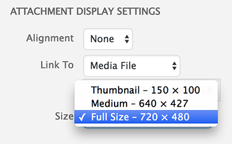

# Documentation with Animated GIFs 

Animated GIFs are a durable and easy-to-view format. In this course we will use animated GIFs as a quasi-archival format for animated visual material. (We will not use them *exclusively* to document things, but we will always make them when possible.)

--- 

### Resources for Creating Animated GIFs

[**EzGif.com**](https://ezgif.com/) is an online GIF maker, editor, and compressor. It provides tools for resizing, cropping, watermarking, and optimizing animated GIFs. It can also allow you to trim GIFs temporally (deleting frames), and change their frame rate. It's my preferred tool for reducing the file size of GIFs.

[**Giphy.com**](https://giphy.com/create/gifmaker) provides an [easy tool](https://giphy.com/create/gifmaker) for converting an online video (from a YouTube or Vimeo URL) directly to an animated GIF. Unfortunately, the GIFs it makes have fairly small dimensions; to make a larger GIF, you'd have to download the video file, extract the fragment you wanted, and use other methods to convert the fragment to a GIF.

[**LICEcap**](https://www.cockos.com/licecap/) is a free, extremely useful, badly-named free OSX app which can capture a rectangular area of your screen, and save this recording directly to an animated GIF.

[**Gifmaker.me**](http://gifmaker.me/) is a free online tool which allows you to create animated GIFs from image sequences. This can be handy if you've written a computer program which generates (and saves out) a sequence of frames.

[**Online-convert.com**](https://image.online-convert.com/convert-to-gif) offers a browser tool for converting videos into GIFs. There's a similar service available at https://www.onlineconverter.com/video-to-gif, too.

Of course, there are plenty of online tutorials for making animated GIFs with common commercial tools, such as: 
* [Adobe Photoshop (Tutorial)](https://blog.hubspot.com/marketing/how-to-create-animated-gif-quick-tip-ht)
* [Adobe Premiere (Tutorial)](https://www.rocketstock.com/blog/how-to-export-gif-from-premiere-pro/)
* [Adobe After Effects (Tutorial)](https://www.rocketstock.com/blog/making-animated-gifs-from-after-effects-comps/)

--- 

### A Typical Workflow

This is a brief example of my workflow for quickly documenting screen-based work with an animated GIF: 

1. I screengrab directly to GIF using [LICEcap](https://www.cockos.com/licecap/). 
2. I then resize, crop, trim, and optimize the GIF using [EzGif.com](https://ezgif.com/).
3. **NOTE**: When uploading and embedding animated GIFs in your WordPress posts, it's essential to select "Full Size" in the Attachment Display Settings of the media manager. *The reduced size versions created by Wordpress are not animated!*

