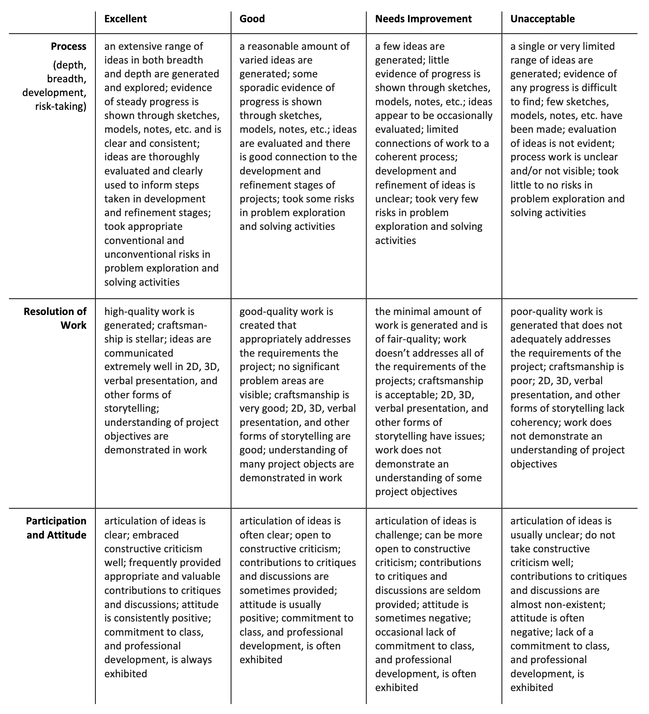

# Syllabus for 60-210 — Fall 2022

*Electronic Media Studio: Introduction to Digital Media* (60-210, Sections A&C) Professor Golan Levin, Carnegie Mellon University School of Art

### Contents

* [**Overview**](#overview)
* [**Course Profile**](#course-profile)
* [**Administrative Information**](#administrative-information)
* [**Attendance Policies**](#attendance-policies)
* [**Rubrics and Grading**](#rubrics-and-grading)
* [**Academic Integrity**](#academic-integrity)
* [**Code of Conduct**](#code-of-conduct)
* [**Content Considerations**](#content-considerations)
* [**Dealing with Stress**](#dealing-with-stress)
* [**COVID-19 Guidelines**](#covid-19-guidelines)
* [**Remote Education**](#remote-education)
* [**Land Notice**](#land-notice)

---

# Overview

### Course Description
*Electronic Media Studio: Introduction to Digital Media Art* (60-210) is an introduction to a variety of practices, artists, and tools from contemporary fields where computational media meet cultural production. In this course students develop the skills and confidence to produce digital artworks, discuss their work in relation to current and historic praxes of new media art, and critically engage with emerging technologies. Intended as a first course for arts students, this class introduces computational craft skills through creative explorations of generativity, interactivity, and immersivity.

### Learning Objectives

In this course you will:

* Develop familiarity with a wide range of contemporary artists that use digital media and the Internet as core components of their practice.
* Learn the foundations of coding for visual applications.
* Be introduced to working with 3D assets and real-time 3D pipelines.
* Acquire practical and conceptual tools that can enrich and extend non-digital art practices.
* Learn concepts and strategies that will allow you to take advanced classes in Electronic and Time-Based art at CMU.

### Projects

This semester, our course will have projects linked to 5 main units: 

* **Machine Learning:** experimentation new tools for image synthesis and recognition (using e.g. *Stable Diffusion*) 
* **Creative Coding:** very elementary introduction to programming, to create generative and interactive drawing tools (using p5.js)
* **Collection and Curation:** exploration of data self-portraiture and/or internet-based readymaking
* **Narrative:** hypertextual interactive storytelling (using Bitsy)
* **Immersive Worldmaking:** development of an expressive, immersive 3D space (using Unity)

Additionally, on approximately five occasions this semester, you will be asked to write brief *Looking Outwards* reports on projects (by others) that you have researched. More information on the structure of *Looking Outwards* reports [can be found here](looking-outwards.md). 

---
# Course Profile

### Key Topics
*What are the key subject topics that this course will cover?*

This course introduces the tools and idioms for creating expressive software artworks and computational form. Topics include generative art, interactive narrative, artificial intelligence, and immersive world-making.

### Prerequisite Knowledge
*What prior knowledge must students have in order to be successful in this course?*

* General computing skills (such as browser use, word processing, image editing) are essential for this course. 
* This course is intended for *arts* students and other with creative practices and visual communication skills.

### Course Relevance
*How is this course relevant to the targeted student populations?*

This course is relevant to students who are interested in:

* Exploring the use of computational, interactive, and networked media in expanding our expressive vocabulary
* Designing games, virtual environments, and other modes of creative expression
* Developing literacy in the aesthetics and idioms of interactive media arts
* Understanding the practical and social consequences of computing in culture

### Course Goals
*What are the overall goals of this course that students will achieve after completing it?*

At the conclusion of this course, students will be able to:

* Create computer programs capable of responding to user interaction.
* Demonstrate familiarity with the artists, designers, works and workflows centered around interactive art, generative form, and computational design.
* Understand the role of computation in artworks that explore concepts of transmediality, connectivity, generativity, and immersivity, and how these may be applied to the production of expressive and provocative new culture.
* Understand how to document and present creative work online, and in person.

### Assessment Structure
*How will students be assessed in this course: assignments, exams, final, presentation, project, etc.?*

There are approximately 5 main assignments. Participation also plays an important role in the final grade. 

### Learning Resources
*What resources will be available for students: web pages, learning applications, texts, case studies, etc.?*

Available resources include a Discord server, dedicated computer hardware and software, and online media including GitHub repositories, YouTube lectures, and a course web site.

### Extra Time Commitments
*Are there extra time commitments required outside of the regularly scheduled course meeting times?*

Students are expected to spend approximately 6 hours per week outside of class working on their projects. 

### Course Tags
*Keywords referencing general topics and/or course structure.* 

* Creative Coding
* New Media Art
* Immersive Media
* Interdisciplinary
* Lab Component
* Research
* Maker

---
# Administrative Information

### Prerequisites
There are no specific course prerequisites for this course, but general computing skills (such as browser use, word processing, image editing) are essential.  

### Credits Allocated
60-210 provides 10 units of academic credit.

### Required Course Materials

* **Sketchbook**. It is extremely wise to plan your projects on paper before writing any code. In support of this, you are required to maintain a paper sketchbook for this course.
* **Laptop**. Although it is possible to develop all projects using campus computing resources, students are advised to have a personal laptop with a webcam. A reliable internet connection will also be extremely important.
* **Software**. Recent, well-updated installations of Mac OSX or Microsoft Windows are acceptable operating systems.
* **Camera**. Some sort of camera may be required to document sketches. A smartphone with a camera is acceptable.

### Communication Tools
This course uses the following software systems to share information:

* **A Discord server**, from which you will present your work to the class. A link and password will be sent to you.
* **Email**. The Professor will send emails once or twice a week. Please read them.
* **WordPress website**, containing important information.
* **A Google Calendar**, [http://bit.ly/golancoursecalendar](http://bit.ly/golancoursecalendar)

---
# Attendance Policies

### Summary of Attendance Policies

* Three *unexcused* absences will lower your final grade by one letter (**A→B**). If you know you're going to miss class, just communicate with the professor so that your absence is *excused*.
* Over 20 minutes tardy = one absence. (*The first incident will be noted but excused.*)
* Asleep in class = one absence. (*The first incident will be noted but excused.*)

### Attendance and Presence

It has been said: *80% of success is just showing up*. Your presence and civic participation in our class are of paramount importance. You are responsible for what happens in class whether you’re here or not. Organize with your classmates to get class information and material that you have missed.

I can be very understanding and accommodating about planned and necessary absences, family circumstances, and/or medical issues when you inform me in a timely and professional manner. **If you’re going to be absent or tardy, please contact the professor in a timely way regarding your situation.** The best way to communicate about this is to send a message to the Professor by email or Discord, prior to the beginning of that class session.

### Mental presence and multitasking / social media

Focus is precious. Physical presence means nothing if you’re “checked out”; your mental presence is extremely important. During the professor’s lectures or guest presentations, distracted participation is prohibited. You can exist for few hours without tweeting, facebooking, chatting, texting, emailing, or doing work for other courses. 

### A Word About Unexcused Absences on Critique Days

Sometimes, students who haven’t completed their projects skip class during critiques, because they are too embarrassed to come to class empty-handed. However: your participation on critique days is essential — even if your project is incomplete or nonexistent — because these sessions and conversations are essential in helping you understand and develop criteria for good work. Even if your own project is unfinished, you are still expected to contribute productively to the class discussion. I take your attendance very seriously, and I take your attendance during critiques most seriously of all.

---
# Rubrics and Grading

### General Expectations
There are a few essential things you can do to ensure that you receive a totally respectable grade in this course:

* **Be respectful of our social space**. Make space for others.
* **Be good**. Have a positive attitude.
* **Be present**. Show up to all of the course sessions, on time.
* **Be responsible**. Communicate with your professor beforehand if you must miss a session, and clean up after yourself.
* **Be diligent**. Submit all of the Deliverables, on time. Document your work clearly and thoroughly.
* **Follow instructions**. Do all parts of the Deliverables, paying careful attention to seemingly trivial requirements.
* **Ask for help**. If you don’t know how/where/what, ask for help.
* **Be curious**. If you don’t understand something, start with curiosity rather than judgment. Curiosity and criticality go hand in hand.

There are also some things you can do to earn a really ***great*** grade in this course:

* Make interesting, novel, provocative work that’s well-crafted, and document it well.
* Be fearless and resourceful about getting the assistance you need.
* Help your classmates when they’re stuck.
* Make helpful contributions to discussions.

### Follow Your Passion
*This is art sqool.* With very rare exceptions (I’ll be clear), I will always prefer that you make the assignment interesting to you — if necessary, by creatively bending the rules or re-interpreting the assignment. My assignments are starting-points, prompts and propositions. Think beyond them.

Notwithstanding the above, you will always be expected to fulfill basic expectations in regards to deliverables and documentation. Did you include an image of your project? Did you write the requested narrative? These expectations will be clearly listed.

### Policies for Late Work
When you submit a project late, you miss the chance to share, discuss and get feedback on your work. These are some of the essential affordances of this class.

At times this semester, your creative projects will be reviewed  by your peers or even by outside guests. If your assignment is not uploaded and documented online in time for these reviews, then your work will officially be considered “too late” and will not be able to earn full credit.

* Generally I grade work a few days after the due date. *I offer no precise details about this*.
* Projects submitted after critiques may get a one-letter grade deduction, depending on the circumstances, and may not receive written feedback, or may only receive significantly attenuated written feedback.

For minor projects (such as *Looking Outwards* blog posts): These should be uploaded and completed by the time that I get around to grading them, which is usually a day or two after their stated due date. If not, I reserve the right to assign partial or zero credit to them.

### Rubrics for Creative Projects 
The purpose of the open-ended Projects is to provide well-circumscribed opportunities for you to make creative work. Generally the Project prompts will invite you to explore a specific conceptual theme or set of technological workflows, but, unless stated otherwise, there is no correct solution, and no specific requirement for how to implement your idea. A Project also asks not just for a creative solution, but also for some creativity in defining and approaching the problem. It is expected that your Projects will be presented and documented in the appropriate channels of our class Discord server.

The open-ended Projects will be evaluated according to the following considerations:

* **Curiosity**: Are you asking questions as you work?
* **Tenacity**: Are you forging through difficult problems without giving up?
* **Execution**: Are you crafting with purpose, precision, and attention?
* **Inventiveness**: Are you discovering/exploring methods outside the obvious and predictable?
* **Fulfillment**: Did you meet all of the requested supporting criteria (such as providing scans of sketches, writing an evaluation of your project, documenting your process, etc.)?

With Projects, it may not matter how much time a student spent making it. You may sometimes see a hastily-executed solution succeed because of its strong concept. Usually, however, the quality of a project is improved by extra attention to its craft.

Projects always have a list of *supporting requirements*. These are straightforward to fulfill, but if you fail to meet these, you will have points deducted. Nearly every Project assignment will ask you to:

* Create a unique post for your project
* Include a documentation image of your project, such as a screenshot or photograph
* Include scans or photos of any notebook sketches, if you have them. 
* In the case of dynamic work, include dynamic documentation: such as by linking to a YouTube video, or embedding an animated GIF
* Write 100-200 words about your project, describing its development process. In your writing, include some critical reflection and analysis of your project: In what ways did you succeed, and in what ways could it be better?

Related to our course policies on Academic Integrity (see below), you must also:

* Name any other persons from whom you received advice or help. If you had collaborators, explain how the work was distributed among the collaborators.
* Cite and link to the sources for any media (e.g. code, photographs, soundtracks, source images, custom tools), created by other people, which you used in your Project. Citing your sources is super important, folks; err on the side of generosity.

### Grading Summary

Your final grade is derived from your assignments, less any demerits due to unexcused absences or lateness. 

* **Participation:** 10%
* **Research Reports:** 15%
* **Projects:** 
  * Machine Learning Unit: 15%
  * Creative Coding Unit: 15%
  * Collection/Curation Unit: 15%
  * Narrative Unit: 15%
  * Immersive Unit: 15%

"Participation" is not meant to be a gauntlet or cudgel, but rather a vehicle for recognizing and rewarding students whose civic effort (such as helping others, providing thoughtful feedback, etc.) improves the classroom experience for everyone.

Projects will be graded with scores of A,B,C,D, or F, as follows, and will be evaluated using the rubric shown below:

* **A** (90% – 100%): You made something very good [i.e. creative excellence]
* **B** (80% – 89%): You made something that fulfills all requirements [i.e. satisfactory]
* **C** (70% – 79%): You tried to make something [i.e. needs improvement, incomplete]
* **D** (60% – 69%): You did not try [i.e. unacceptable work, does not fulfill any requirements completely]
* **F** (59% or less): You did not show up [i.e. no credit]

---
# Academic Integrity
Your behavior as a responsible member of the new-media arts community is very important — as demonstrated, for example, by properly citing your sources, and crediting those who have helped you. These expectations and obligations are addressed here, in our course Academic Integrity Policy.

### Summary of CMU Academic Integrity Policies
Carnegie Mellon University prohibits academic dishonesty. This includes plagiarism, and may consist of: submitting the work of someone else as one’s own; failing to cite assistance you received; or the failure to properly cite materials or ideas from other sources. Nearly all of these problems can be circumvented if you’re clear and generous in giving credit where credit is due. Please read the University Policy on Cheating and Plagiarism to understand the penalties associated with academic dishonesty at Carnegie Mellon University. I reserve the right to determine an appropriate penalty based on the violation of academic dishonesty that occurs. The penalty for plagiarizing may range from failure on the specific plagiarized assignment to failure in the class. If you have any questions about this policy as it relates to work you are doing in the course, please feel free to contact the professor.

### Policies for Open-Ended Creative Projects
For your open-ended, public-facing projects, there are no “correct answers”. Your curiosity, creativity, ingenuity and originality are prized.

You may borrow from other sources, within the limits of “reasonable person” principles described below, provided you attribute your sources. 

As studio art students, you are expected or invited to make extensive use of open-source libraries, tutorials, and freely-distributed code. When working in this way, much like a knitting circle, our classroom is structured around peer instruction, in which students are expected to help each other learn. 

### Use of Free and Open-Source Code in Projects
**Credit is perhaps the most important form of currency** in the economies of commons-based peer production and open-source media arts. You are expected to cite the source of any code you use. Please note the following expectations and guidelines:

**Use Libraries**. In your Projects, the use of general, reusable libraries is strongly encouraged. The people who developed and contributed these components to the community worked hard, often for no pay; acknowledge them by citing their name and linking to their repository.

**Be Careful**. It sometimes happens that an artist places the entire source code for their sketch or artwork online, as a resource from which others can learn. The assignments professors give in new-media arts courses are often similar; you may discover the work of a student in some other class or school, who has posted code for a project which responds to a similar assignment. *You should probably avoid this code*. At the very least, you should be very, very careful about approaching such code for possible re-use. If it is necessary to do so, it is best to extract components that solve a specific technical problem, rather than those parts which operate to create a unique experience. Your challenge, if and/or when you work with others’ code, is to *make it your own*. It should be clear that forking an artwork from someone’s page on GitHub or OpenProcessing, and simply changing the colors would be disgracefully lazy. Doing so without proper citation would be plagiarism.

### Policies Regarding Informal Collaboration
Our course places a very high value on civic responsibility that includes, but is not limited to, helping others learn. In this course, I strongly encourage you to give help (or ask others for help) in using various tools, algorithms, libraries, or other facilities. Please note the following expectations:

* In this class, *it’s OK to give and receive help*. In fact, it’s better than OK! Students who receive help from someone else are obliged to acknowledge that person in their project report, clarifying the nature of the help that was received.
* *We are all teachers*. Students with advanced skills are expected to help others, yet refrain from doing another’s work for them. You can usually tell when you’re about to cross the line: Ask yourself whether you are teaching someone to fish, or merely giving them the fish.
* When in doubt: *give credit* to the people who have helped you.

### Policies Regarding Formal Collaboration
The assignments in this course are primarily intended to be executed by individuals. That said, I am in favor of students collaborating if such collaborations arise organically and can be conducted safely. Please note the following expectations:

* *Notify the Professor*. It’s helpful for me to know who is working with whom. Students who wish to collaborate should jointly inform the professor as early as possible.
* *Only pairs*. Unless permission is explicitly granted by the Professor, collaborations in this course are restricted to pairs of students.
* *Describe who did what*. Written reports for collaborative projects should describe how your effort was distributed.
* *Only collaborators from this class*. Your project collaborator, if you have one, must be in current sections of 60-210 taught by Prof. Golan Levin. You may not collaborate with people from outside the course (e.g. your housemate).
* *Avoid co-dependency*. You may not collaborate with the same person (i.e. submit an assignment jointly) on more than two projects.

---
# Code of Conduct

### Code of Conduct
I am committed to providing an educational experience that is free of harassment and intimidation for everyone in this course—regardless of gender identity and expression, age, sexual orientation, disability, physical appearance, body size, race, ethnicity, nationality, religion (or lack thereof), or technology choices. I will not tolerate any form of harassment and/or discriminatory, oppressive, suppressive, or violent behavior.

*Harassment* may include, but is not limited to, offensive verbal comments, deliberate intimidation, stalking, following, harassing photography or recording, sustained disruption, inappropriate or non-consensual physical contact, unwelcome sexual attention, and/or refusing to accept the limits or boundaries set by another participant in our classroom. I further define *suppressive* behavior as any sort of communication that stifles or belittles another. Participants who have been asked to stop any behavior are expected to comply immediately. I expect all of the participants in our course community to adhere to this code of conduct–including me, the Professor.

Debate and free exchange of ideas is encouraged, but I will not tolerate harassment. If someone engages in harassing behavior, I may take any action deemed appropriate in the Carnegie Mellon University Policy against [Sexual Harassment and Sexual Assault](https://www.cmu.edu/policies/administrative-and-governance/sexual-harassment-and-sexual-assault.html), [Discriminatory Harassment](https://www.cmu.edu/student-affairs/theword/community-policies/discriminatory-harassment.html), or other [community policies](https://www.cmu.edu/student-affairs/theword/community-policies/index.html). If you experience or witness harassment, threatening behavior, suppressive behavior, or have any other concerns, I encourage you to speak up, say something, and/or let us know immediately.

*Carnegie Mellon University is firmly committed to intellectual honesty, freedom of inquiry and expression, and respect for the dignity of each individual. Acts of discriminatory harassment or intimidation by a student directed toward any member of the community are inconsistent with this commitment and will not be tolerated. Consistent with the University’s Statement of Assurance, prohibited acts include harassment and intimidation motivated by discriminatory intent based on race, color, national origin, sex, handicap or disability, age, sexual orientation, gender identity, religion, creed, ancestry, belief, veteran status, or genetic information. Any such harassment or intimidation of or by a student should be referred to the Dean of Student Affairs for resolution.*

### Inclusivity Statement
It is our intent that students from all diverse backgrounds and perspectives be well served by this course, and that the diversity that students bring to this class be viewed as a resource, strength and benefit. It is our intent to present activities that accommodate and value a diversity of gender, sexuality, disability, age, socioeconomic status, ethnicity, race, and culture. I will gladly honor your request to address you by the pronouns and name you specify.

### Religious and/or Disability Accommodations
I commit to make individual arrangements to address disabilities and/or religious needs (e.g. religious events in conflict with class meetings). 

If you have a disability and have an accommodation letter from the Disability Resources office, you are encouraged to discuss your accommodations and needs with me as early in the semester as possible; I will work with you to ensure that accommodations are provided as best I can. If you suspect that you may have a disability and would benefit from accommodations but are not yet registered with the Office of Disability Resources, you are encouraged to contact them at access@andrew.cmu.edu.

---
# Content Considerations

This course may present content that includes nudity and imagery, language, or dialogue that could offend and/or challenge some students. When possible, the instructor and/or students should make the cohort aware of violent or sexual imagery before it is displayed. Of course, what is challenging to one person may not be challenging to another, and content warnings are culturally and personally subjective in practice. That being said, we may all find moments when we are uncomfortable due to the content of work presented in class. Please do your best to take care of yourself as needed and respect the needs of others when they need to care for themselves. If you have a history of PTSD and require accommodations please let me know and I will do my best to accommodate your specific needs. 

Please note that content considerations will not engage in blanket censorship. In order to best engage in our moment as critical makers and thinkers we will approach a diverse array of work with care and curiosity.

---
# Dealing with Stress

**Take care of yourself**. Please do your best to maintain a healthy lifestyle this semester by eating well, exercising, avoiding drugs and alcohol, getting enough sleep and taking some time to relax. This will help you achieve your goals and cope with stress.

All of us benefit from support during times of struggle. You are not alone. There are many helpful resources available on campus and an important part of the college experience is learning how to ask for help. Asking for support sooner rather than later is often helpful.

If you or anyone you know experiences any academic stress, difficult life events, or feelings like anxiety or depression, I strongly encourage you to seek support. Counseling and Psychological Services (CaPS) is here to help: call 412-268-2922 and visit their website at http://www.cmu.edu/counseling/. Consider reaching out to a friend, faculty or family member you trust for help getting connected to the support that can help. If you or someone you know is feeling suicidal or in danger of harm to self or others, call someone immediately, day or night:

* **CaPS Counseling: +1-412-268-2922**
* **Re:solve Crisis Network: +1-888-796-8226**
* **On campus CMU Police: +1-412-268-2323**

---
# COVID-19 Guidelines

### Mask-Wearing
COVID is still circulating widely, evolving quickly, increasingly contagious, and remains a danger to health. For this reason I encourage, recommend, and respectfully request (but cannot legally require) that persons in our classroom wear facial coverings whenever possible. However, in the interest of supporting clear communication, I feel it is an acceptable risk for a student or professor to temporarily unmask if they are actively giving a presentation or speaking to the entire room.

This course adheres to [Carnegie Mellon University’s current guidance on COVID-19](https://www.cmu.edu/coronavirus/index.html), which will continue to be updated as the semester approaches, including information about masking, testing and vaccination requirements. Broadly, we plan to operate "in-person" as the semester begins. Students are expected to attend class in-person unless they have been instructed to isolate due to their own positive COVID-19 status.

### Health-Related Absences
Please evaluate your own health status regularly and refrain from attending class and other on-campus events if you feel even slightly unwell. You are emphatically encouraged to seek appropriate medical attention for treatment of illness. In the event of any contagious illness, please do not come to class or to campus. Instead, notify me by email/Discord about your absence as soon as practical, so that accommodations can be made. Please note that documentation (a Doctor’s note) for medical excuses is *not* required.

### Classroom Streams/Recordings
Students who are unable to attend class in person may request that a session be recorded or streamed over Zoom. I will make a good-faith effort to accommodate such requests, particularly for lectures. For non-lecture class sessions (demonstrations, discussions, critiques, workshops, work days), it may be impractical to document the session satisfactorily.

Recordings of class sessions, if they are made, are covered under the *Family Educational Rights and Privacy Act* (FERPA) and must not be shared with anyone outside the course. The purpose of any such recordings, if they are made, is so that students in this course (and only students in this course) can watch or re-watch past class sessions.

---
# Remote Education

This course is expected to take place *in-person*. However, if it unexpectedly becomes necessary to shift to a remote format, policies in this section will apply. 

### Tools
If it becomes necessary to meet remotely, We will use Zoom for synchronous videoconferencing sessions. Please make sure that your Internet connection, webcam and microphone equipment are set up to use Zoom.

### Videoconferencing Fatigue
Zoom Fatigue is a real and serious problem. To avoid it, in the event of a remote format, we will generally not videoconference for the full 3-hour duration of our class. Instead, we will likely meet for 20-45 minutes. During the rest of class, we may (a) work individually on projects, with videoconferencing available (“quiet co-working”), (b) have one-on-one meetings with the professor, or (c) occasionally convene in small groups.

### Videoconferencing Policies

* Regarding **sharing camera video**: In this course, being able to see one another helps to facilitate a better learning environment, create a community, reduce isolation, and promote more engaging discussions. Additionally, seeing your faces REALLY helps me lecture more effectively and responsively. Therefore, our default will be to expect students to have their cameras on during lectures and discussions. However: I completely understand there may be technical, privacy, or personal reasons students would not want to have their cameras on. If you have any concerns about sharing your video, please email me as soon as possible and we can discuss possible adjustments. If you would like to hide your camera in general, I ask that you consider a compromise, such as placing scotch tape or a folded ziploc bag over the camera; this helps me know that you're present, while obscuring your details.  
* You are welcome to **use a background image** in your video if you wish. Please keep these images family-friendly and non-distracting.
* In general, please **keep your mic muted** (unless you unless you are actively sharing with the class), in order to reduce stray noise. If you want/need to briefly speak up, you can press the space bar to momentarily unmute.
* You may use the “raise hand feature” to get attention, but for best results, I recommend **actually raising your hand** in the video if possible.
* You are also very welcome to **ask or respond to questions in the Zoom chat panel**; I will do my best to notice and respond to your remarks.
* You are welcome to **use reactions** (clapping and thumbs up), if it feels like the right thing to do.

---

# Land Notice
Carnegie Mellon University and the city of Pittsburgh are situated on land that has been continuously inhabited for over 16,000 years, serving as a home to members of the Adena, Hopewell, Monongahela, Lenape, Shawnee, Wyandot, Tisagechroami, Delaware, and Mohican communities before becoming a territory of the Iroquois Confederacy. The Iroquois Confederacy included the Mohawk, Onondaga, Oneida, Cayuga, Seneca, and Tuscarora people, whose relationships with the land continue to this day. The Seneca name for Pittsburgh is [Dionde:gâ](https://en.wikipedia.org/wiki/History_of_Pittsburgh).
